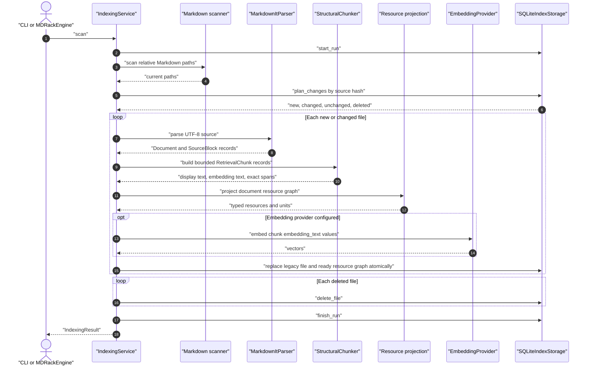

# Indexing and structural chunking

The default indexing path is structural and source-preserving. Markdown remains
external and read-only; the application projects prepared document resources,
units and ready vectors into the provider-free core contract.

## Indexing sequence

## Scan and change planning

`IndexingService.scan` starts an `index_runs` row, scans root-relative Markdown
paths, and delegates hash comparison to storage. The scanner always prunes
`.git`, `.venv`, `node_modules`, `.mdrack`, and `__pycache__`; configuration adds
patterns such as the default `tests/**` exclusion.

Unless a force reindex is requested, only new and changed files are processed.
Deleted paths are removed. A new path may reuse the document and record identity
of exactly one deleted file with the same source hash; ambiguous matches do not
trigger rename reuse. Files are independent: failures can produce
`partial_success`, while each successfully replaced file remains atomic.

The CLI accepts `scan --changed`, but that flag is currently ignored because
normal scans already perform change detection.

## Parser output

`MarkdownItParser` reads UTF-8, computes a SHA-256 source hash, parses YAML
frontmatter, and emits parser-independent `Document` and `SourceBlock` values.
The parser recognizes H1–H6 headings, paragraphs, lists, blockquotes and
callouts, fenced and indented code, Mermaid, tables, thematic breaks, Markdown
images, Obsidian embeds, and HTML `img`. Image syntax is projected to ordinary
prose only when it has a non-empty textual alt/alias; paths, targets, titles,
dimensions, bare/numeric aliases, and referenced files are ignored.

Every block has a one-based line span. The structural path also carries half-open
character offsets `[start_offset, end_offset)`. Heading paths are ordered tuples
and become JSON arrays at public boundaries.

## Stable identities

- A document logical ID is based on the root identity and relative path, except
  when an unambiguous exact-content move reuses the prior identity.
- A block logical ID combines document identity, block kind, normalized heading
  path, content fingerprint, duplicate ordinal, and parser version.
- A chunk logical ID combines document identity, parent block IDs, chunk kind,
  display-content fingerprint, duplicate ordinal, and chunker version.
- SQLite record UUIDs remain replaceable storage details.

## Structural chunker v2

Headings, frontmatter, and thematic breaks shape context but do not become
retrieval chunks. Other blocks use type-specific policies:

| Block | Current policy |
|---|---|
| Paragraph | Split by paragraph, sentence, word, then character while retaining every separator in an owned source slice. |
| List / blockquote | Use exact source slices; small compatible drafts may merge under the same heading and kind. |
| Callout / unknown | Split as bounded source slices but do not merge. |
| Python code | Prefer top-level class, function, and async-function AST boundaries; invalid Python falls back to line windows. |
| Other code / Mermaid | Use bounded line windows; an oversized individual line is fragmented into exact bounded slices. |
| Table | Repeat header rows for retrieval; a single unrepresentable row/header uses a bounded hash marker. |
| Image syntax | Eligible alt/textual alias participates once as ordinary prose; no image-reference block, asset graph, file access, or image resource is created. |

Normal prose uses `target_chunk_chars`; every output also obeys
`hard_limit_chars` and the estimated-token limit. `min_chunk_chars` only enables
safe merging when one compatible side is short. The configured
`overlap_chars` value is validated and passed into structural configuration but
is not consumed by `StructuralChunker`; current structural chunks do not overlap.

`display_content` is the persisted retrieval text. `embedding_text` adds a
heading and content-kind prefix when applicable; it is not assembled from
neighboring chunks.

## Persistence handoff

The compatibility path still prepares file metadata, sections, chunks, and
optional vectors. The v0.3 projection also prepares a complete core resource graph.
The core validates ownership, UTF-8/JSON/vector invariants before the resource
adapter opens its serialized transaction. Any write/FTS/vector/facet failure leaves
the prior complete graph visible.

## Primary source anchors

- Scan orchestration and identities: `src/mdrack/application/indexing.py`
- Parser: `src/mdrack/adapters/markdown_it/parser.py`
- Structural policies and exact spans: `src/mdrack/application/chunking.py`
- Scanner: `src/mdrack/indexing/scanner.py`
- Atomic handoff: `src/mdrack/adapters/sqlite/index_storage.py`
- Core projection: `src/mdrack/application/compatibility.py`
- Provider-free validation: `src/mdrack_core/application/indexing.py`
- Domain records: `src/mdrack/domain/blocks.py`,
  `src/mdrack/domain/documents.py`, `src/mdrack/domain/chunks.py`
