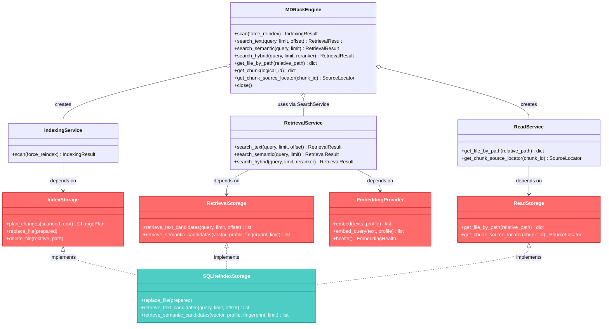

# Public interfaces

MDRack has two public entry points: the Click CLI and the embedded
`MDRackEngine`. Both compose the same canonical indexing and retrieval services,
but their total capability sets are not identical.

## Service and port relationships

`MDRackEngine` currently holds a compatibility `SearchService`, which delegates
directly to `RetrievalService`; the diagram names the canonical runtime service.

## CLI capability matrix

Live command registration exposes:

| Command | Current role |
|---|---|
| `init` | Create the store and apply migrations. |
| `scan` | Change-detect and index Markdown with LM Studio or test-only fake composition where exposed. |
| `search` | Text, semantic, or hybrid retrieval. |
| `read chunk` | Read a public logical chunk, optionally with neighbors. |
| `read section` | Read a section and its chunks by public logical section ID. |
| `read file` | Read file metadata and sections by public logical file ID. |
| `files list`, `files info` | Legacy repository inspection with raw SQLite record identities. |
| `sections list` | Legacy section inspection keyed by raw file record identity. |
| `status` | Counts, active profile details, and schema version. |
| `doctor` | Store, FTS, embedding, migration, and configuration diagnostics. |
| `rebuild fts` | Rebuild the manually maintained FTS projection. |
| `rebuild embeddings` | Recreate vectors for the active profile. |
| `eval retrieval` | Run retrieval evaluation against the indexed store. |
| `model list`, `loaded`, `download`, `download-status`, `load`, `unload`, `switch` | LM Studio model discovery and lifecycle operations. |

CLI responses use the JSON envelope documented in
[CLI contracts](../cli-contracts.md). The CLI presentation layer also maps some
application degradation states to command errors; see [retrieval](retrieval.md).

## Embedded engine

`MDRackEngine` supports:

- scan with optional force reindex;
- text, semantic, and hybrid search;
- file lookup by relative path;
- chunk lookup by logical ID;
- source-locator lookup;
- explicit or context-managed close.

It does not expose CLI diagnostics, status, model lifecycle, rebuild, evaluation,
section listing, or asset listing methods.

The engine imports no Click modules. By default it composes
`SQLiteIndexStorage`, while callers may inject compatible storage/read/search
ports and an embedding provider.

## Identity and DTO boundary

Public retrieval and read-chunk results prefer logical IDs. `chunk_id` and read
`id` remain compatibility aliases equal to the logical ID. `SourceLocator`
contains no absolute path. `heading_path` is serialized as a JSON array.

The `files` and `sections` inspection groups are a documented legacy asymmetry:
they still expose/use raw database record IDs. Do not generalize that behavior
into a new public contract.

## Primary source anchors

- CLI registration: `src/mdrack/cli/__init__.py`
- CLI command implementations: `src/mdrack/cli/commands/`
- Engine: `src/mdrack/public_api/engine.py`
- Services: `src/mdrack/application/indexing.py`,
  `src/mdrack/application/retrieval.py`, `src/mdrack/application/query.py`
- Ports: `src/mdrack/ports/storage.py`, `src/mdrack/ports/embeddings.py`
- Shared DTO: `src/mdrack/domain/retrieval.py`
