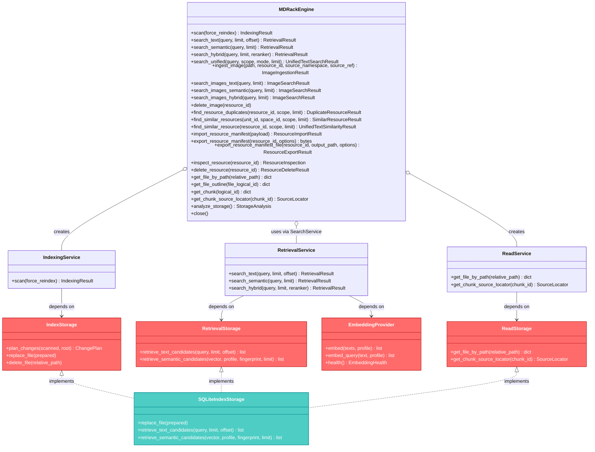

# Public interfaces

MDRack has two public entry points: the Click CLI and the embedded
`MDRackEngine`. Both compose the same canonical indexing and retrieval services,
but their total capability sets are not identical.

## Service and port relationships

```mermaid
classDiagram
    class MDRackEngine {
        +scan(force_reindex) IndexingResult
        +search_text(query, limit, offset) RetrievalResult
        +search_semantic(query, limit) RetrievalResult
        +search_hybrid(query, limit, reranker) RetrievalResult
        +search_unified(query, scope, mode, limit) UnifiedTextSearchResult
        +ingest_image(path, resource_id, source_namespace, source_ref) ImageIngestionResult
        +search_images_text(query, limit) ImageSearchResult
        +search_images_semantic(query, limit) ImageSearchResult
        +search_images_hybrid(query, limit) ImageSearchResult
        +delete_image(resource_id)
        +find_resource_duplicates(resource_id, scope, limit) DuplicateResourceResult
        +find_similar_resources(unit_id, space_id, scope, limit) SimilarResourceResult
        +find_similar_resource(resource_id, scope, limit) UnifiedTextSimilarityResult
        +import_resource_manifest(payload) ResourceImportResult
        +export_resource_manifest(resource_id, options) bytes
        +export_resource_manifest_file(resource_id, output_path, options) ResourceExportResult
        +inspect_resource(resource_id) ResourceInspection
        +delete_resource(resource_id) ResourceDeleteResult
        +get_file_by_path(relative_path) dict
        +get_file_outline(file_logical_id) dict
        +get_chunk(logical_id) dict
        +get_chunk_source_locator(chunk_id) SourceLocator
        +analyze_storage() StorageAnalysis
        +close()
    }

    class IndexingService {
        +scan(force_reindex) IndexingResult
    }

    class RetrievalService {
        +search_text(query, limit, offset) RetrievalResult
        +search_semantic(query, limit) RetrievalResult
        +search_hybrid(query, limit, reranker) RetrievalResult
    }

    class ReadService {
        +get_file_by_path(relative_path) dict
        +get_chunk_source_locator(chunk_id) SourceLocator
    }

    class IndexStorage {
        +plan_changes(scanned, root) ChangePlan
        +replace_file(prepared)
        +delete_file(relative_path)
    }

    class RetrievalStorage {
        +retrieve_text_candidates(query, limit, offset) list
        +retrieve_semantic_candidates(vector, profile, fingerprint, limit) list
    }

    class ReadStorage {
        +get_file_by_path(relative_path) dict
        +get_chunk_source_locator(chunk_id) SourceLocator
    }

    class EmbeddingProvider {
        +embed(texts, profile) list
        +embed_query(text, profile) list
        +health() EmbeddingHealth
    }

    class SQLiteIndexStorage {
        +replace_file(prepared)
        +retrieve_text_candidates(query, limit, offset) list
        +retrieve_semantic_candidates(vector, profile, fingerprint, limit) list
    }

    MDRackEngine o-- IndexingService : creates
    MDRackEngine o-- RetrievalService : uses via SearchService
    MDRackEngine o-- ReadService : creates
    IndexingService --> IndexStorage : depends on
    RetrievalService --> RetrievalStorage : depends on
    RetrievalService --> EmbeddingProvider : depends on
    ReadService --> ReadStorage : depends on
    IndexStorage <|.. SQLiteIndexStorage : implements
    RetrievalStorage <|.. SQLiteIndexStorage : implements
    ReadStorage <|.. SQLiteIndexStorage : implements

    style IndexStorage fill:#ff6b6b,stroke:#c92a2a,color:#fff
    style RetrievalStorage fill:#ff6b6b,stroke:#c92a2a,color:#fff
    style ReadStorage fill:#ff6b6b,stroke:#c92a2a,color:#fff
    style EmbeddingProvider fill:#ff6b6b,stroke:#c92a2a,color:#fff
    style SQLiteIndexStorage fill:#4ecdc4,stroke:#0a9396,color:#fff
```

`MDRackEngine` currently holds a compatibility `SearchService`, which delegates
directly to `RetrievalService`; the diagram names the canonical runtime service.

## CLI capability matrix

Live command registration exposes:

| Command | Current role |
|---|---|
| `init` | Create or verify the only application store, `<store>/catalog.sqlite3`, as clean schema `mdrack_sqlite_catalog_v2`. |
| `scan` | Change-detect and index Markdown with LM Studio or test-only fake composition where exposed. |
| `search` | Text, semantic, or hybrid retrieval. |
| `search --scope all\|notes\|audio\|video\|frames\|images` | Unified resource-level text retrieval from the fixed catalog. |
| `find-similar RESOURCE_ID` | Provider-free 1.2 textual whole-resource similarity by logical resource ID. |
| `read chunk` | Read a public logical chunk, optionally with neighbors. |
| `read file` | Read file metadata by public logical file ID. |
| `read outline` | Read deterministic heading records by public file logical ID; no raw section IDs are exposed. |
| `resource import`, `resource export`, `resource inspect`, `resource delete` | Prepared-resource lifecycle through the configured fixed catalog; no alternate `--catalog` path is registered. |
| `eval retrieval` | Privacy-safe ordinal retrieval-quality metrics against the configured fixed catalog. |
| `files list`, `files info` | List and inspect documents by public logical identity. |
| `status` | Counts, active profile details, and schema version. |
| `doctor` | Store, FTS, embedding, migration, and configuration diagnostics. |
| `rebuild fts` | Rebuild the manually maintained FTS projection. |
| `rebuild embeddings` | Recreate vectors for the active profile. |
| `image ingest`, `search`, `delete` | Explicit direct-image lifecycle against the fixed catalog; never triggered by Markdown scan. |
| `ingest raw-video SOURCE_PATH` | CLI-only ISO-BMFF raw-video adapter using an authorized stdin extractor; prepared `ingest video` and `MDRackEngine` remain unchanged. |
| `resources duplicates`, `similar` | Provider-free exact hash and existing-vector discovery with typed/facet scope filters. |
| `resources search` | Provider-free lexical search against the fixed catalog; target and scope filters are applied before limiting. |
| `resources facets`, `facets` | Deterministic facet listing, optionally narrowed by namespace. |
| `benchmark` | Provider-free local catalog verification timing and aggregate counts; this is not retrieval-quality evidence. |
| `storage-analyze` | Read-only allowlisted size/count analysis of the fixed catalog. |
| `model list`, `loaded`, `download`, `download-status`, `load`, `unload`, `switch` | LM Studio model discovery and lifecycle operations. |

CLI responses use the JSON envelope documented in
[CLI contracts](../cli-contracts.md). The CLI presentation layer also maps some
application degradation states to command errors; see [retrieval](retrieval.md).

## Explicit local-file adapters

`scan` is the Markdown-root path. The other local-file commands are explicit,
separate app adapters: `ingest text` prepares one strict UTF-8 text or Markdown
resource outside the scan root; `image ingest` prepares one direct image graph;
`ingest audio` accepts only authorized RIFF/WAVE input; and `ingest raw-video`
accepts only authorized ISO-BMFF `ftyp` input. Raw audio and video remain CLI-only;
the embedded engine exposes direct-image ingestion but no raw text, WAVE, or raw
video entry method.

These commands own local capture and, for WAVE/video, the explicitly supplied
shell-free stdin process. They must finish source validation and graph preparation
before calling `CoreIndexingService` through the logical-ID `ResourceWritePort`.
`mdrack_media` builds and validates prepared timed-media graphs without file,
provider, database, or network access. `mdrack_core` then validates the prepared
resource graph without performing file or subprocess work; `mdrack_sqlite` owns
the resulting generic catalog/search persistence. This boundary does not provide
built-in STT, a general media decoder, FFmpeg, or VLM capability.

## Embedded engine

`MDRackEngine` supports:

- scan with optional force reindex;
- text, semantic, and hybrid search;
- unified text search over notes, audio/video transcripts, frame captions, and image text;
- file lookup by relative path and canonical heading outlines by file logical ID;
- chunk lookup by logical ID;
- source-locator lookup;
- explicit direct-image ingest/search/delete;
- exact duplicate and whole-resource vector similarity discovery;
- provider-free unified textual whole-resource similarity by logical resource ID;
- active-catalog manifest-v1 import, atomic export to a caller-supplied destination, redacted inspection, and logical-resource deletion;
- read-only aggregate analysis of the fixed catalog;
- explicit or context-managed close.

It does not expose CLI `status`/`doctor`, model lifecycle, rebuild, or benchmark
methods. `analyze_storage()` is the separate read-only aggregate diagnostic API.

The separate Click-free `PreparedResourceCatalog` public facade opens one explicit
clean standalone catalog path and provides manifest import/export, redacted inspect/delete,
provider-free lexical/vector search with `unit|resource` targets, and deterministic
facet listing. It does not use `MDRackEngine`, the configured application store, providers,
source files, or the network.

The engine imports no Click modules. By default it composes
`SQLiteIndexStorage`, while callers may inject compatible storage/read/search
ports and an embedding provider.

The additive 1.2 unified search contract is documented in
[v1.2 unified text search](../contracts/v1.2-unified-search.md). It uses typed
resource scopes and portable evidence only; `frames` is query-search-only and is
not a resource-level similarity scope.

## Identity and DTO boundary

Public retrieval and read-chunk results prefer logical IDs. `chunk_id` and read
`id` remain compatibility aliases equal to the logical ID. `SourceLocator`
contains no absolute path. `heading_path` is serialized as a JSON array.

The normal `files` and `read` groups use logical resource/unit identities. Raw
SQLite row IDs are not a public application contract.

New image/resource results contain only logical resource/unit/representation IDs,
stable ranks/scores/degradation categories, and portable source references. They
never expose SQLite row IDs, local paths, caption/OCR text, vectors, facet values,
provider bodies, or raw exception strings. `mdrack.public_api` re-exports the
engine, compatibility retrieval DTOs, image result/config protocols, and resource
discovery scope/results. The explicit prepared-resource catalog facade and its safe
result/error records are published from `mdrack.application.resource_catalog` without
widening the frozen compatibility `mdrack.public_api.__all__`; pure generic core DTOs
remain under `mdrack_core`.

## Primary source anchors

- CLI registration: `src/mdrack/cli/__init__.py`
- CLI command implementations: `src/mdrack/cli/commands/`
- Engine: `src/mdrack/public_api/engine.py`
- Services: `src/mdrack/application/indexing.py`,
  `src/mdrack/application/retrieval.py`, `src/mdrack/application/query.py`
- Ports: `src/mdrack/ports/storage.py`, `src/mdrack/ports/embeddings.py`
- Shared DTO: `src/mdrack/domain/retrieval.py`
- Image API DTOs: `src/mdrack/ingestion/images.py`
- Resource discovery DTOs: `src/mdrack/application/resources.py`
- Pure core exports: `packages/mdrack-core/src/mdrack_core/__init__.py`

The machine-readable owner/version/deprecation/removal/install inventory for the
v0.4 development surface is
[`docs/compatibility/v0.4-public-surface-ledger.json`](../compatibility/v0.4-public-surface-ledger.json).

The CLI additionally exposes `ingest text` for one explicit raw local source.
This is intentionally not an `MDRackEngine` method in R1; retrieval uses the
existing unified text CLI/engine surface and reports `raw_text` resources with
portable raw-source span locators.

The CLI also exposes `ingest audio SOURCE_PATH --source-ref REF
--allow-external-stt --stt-command EXECUTABLE` for bounded RIFF/WAVE input.
This is intentionally not an `MDRackEngine` method. The executable receives
the private source snapshot on stdin and must return strict timed-transcript
JSON; the command persists no raw audio and reports no path, command, source
reference, transcript, or exception details.
