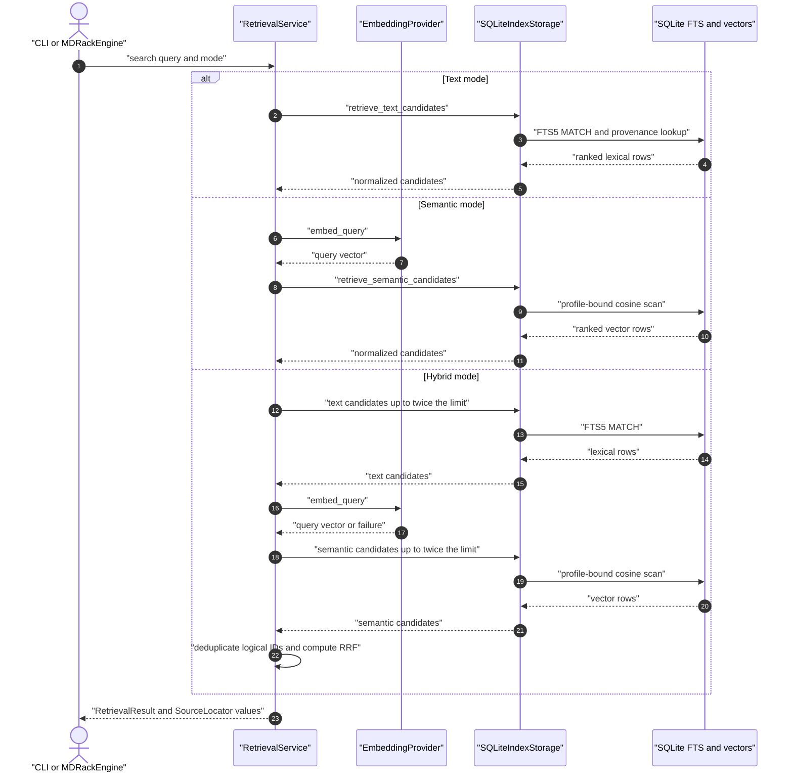

# Retrieval

Legacy document retrieval remains exposed through the compatibility
`RetrievalService`. The v0.3 canonical resource path prepares query vectors in
`mdrack`, executes ready lexical/vector branches through `mdrack_core`, applies
scope in the adapter before candidate limits, groups evidence per resource, and
performs deterministic weighted RRF.

## Retrieval sequence

## Text mode

The adapter queries content-bearing FTS5 and returns a BM25-like `rank` where a
smaller value is better. Results include highlighted snippets and portable
provenance. Text pagination fetches enough candidates for `limit + offset` and
then slices. An empty text query fails. For a plain query that SQLite rejects as
FTS syntax, MDRack retries once as a quoted phrase; explicit FTS operators are
not rewritten.

## Semantic mode

The embedding provider creates a query vector through LM Studio. Storage checks
the active embedding profile fingerprint and dimensions, loads all matching
vectors, computes cosine similarity in Python, sorts descending, and enriches
the selected rows with source locators. This path is O(n) in stored vectors.

New zero-norm vectors are rejected for cosine spaces before catalog mutation.
During a scan, a legacy or corrupt zero-norm cosine candidate is skipped instead
of failing the complete branch. If every scoped candidate is invalid, retrieval
uses the existing privacy-safe incompatible-space degradation. Zero vectors
remain valid for dot and L2 spaces.

A semantic query is sent to the provider even when its text is empty; there is no
current empty-query short circuit at the service boundary.

## Legacy document hybrid mode and weighted RRF

Hybrid mode asks each branch for `2 * limit` candidates. Candidates are
identified by public logical chunk ID. Only the first occurrence in each branch
contributes a rank. Configured standard Markdown paths compute weighted
Reciprocal Rank Fusion:

`score = text_weight / (rrf_k + text_rank) + semantic_weight / (rrf_k + semantic_rank)`

A missing branch contributes zero. Sorting is deterministic: fused score
descending, then first appearance, then logical ID. A configured zero-weight
branch is omitted before provider or storage execution; both weights cannot be
zero. Direct low-level retrieval services that receive no configuration retain
their `1.0`/`1.0` defaults.

## Degradation and CLI mapping

If the embedding provider is unavailable, a profile is incompatible, or semantic
search fails, the service returns `degraded=true` with a reason and any available
results. `MDRackEngine` preserves that result. The CLI maps semantic degradation
to `EMBEDDING_ERROR`; hybrid CLI search can return text results with degradation,
but errors if degradation leaves the result empty.

Core resource retrieval instead carries stable per-branch degradation categories.
An allowed failed vector branch may degrade to lexical results; adapter errors and
space/dimension mismatch never include raw exceptions, query text, vectors, or paths.

## Resource discovery and scope

`SearchScope` can filter resource kind, media type, source namespace,
representation kind, modality, unit kind, and facets (`any`/`all`/`none`). SQLite
applies every filter before branch limits. Resource-target search groups units
within each branch before RRF so a long document does not gain rank merely by
having more chunks. Exact duplicate lookup uses `content_hash`; semantic resource
similarity uses an already persisted whole-resource vector and explicit space.
Core validates returned candidates for exact one-based positional ranks and
unique unit IDs after the existing candidate-limit slice. Malformed adapter
output becomes a privacy-safe adapter degradation; tolerant overproduction
slicing remains part of the current contract.

## Public result contract

Each result includes:

- `logical_id` and compatibility alias `chunk_id`, both public logical IDs;
- canonical `score` plus nullable text, semantic, RRF, and rerank scores/ranks;
- `content_preview` and compatibility alias `snippet`;
- relative file path, section title, and `heading_path` as a JSON array;
- a complete `source_locator` with root ID, normalized relative path, line and
  optional offset spans, structural kinds, and logical block/chunk IDs.

Text scores preserve the FTS candidate value; semantic scores preserve cosine;
hybrid `score` equals `rrf_score`.

Direct-image search uses the same mode distinction without widening its public
key set: text and semantic `score` expose the representative raw adapter score,
while hybrid `score` exposes the fused RRF score.

## Reranking boundary

Production reranking is deliberately unsupported. `search_hybrid` accepts only
`reranker=None`, and compatibility services reject rerank requests. No chat
completion or model lifecycle call substitutes for reranking. `rerank_rank` and
`rerank_score` are therefore `null` in normal results. See
[ADR-0001](../decisions/0001-reranking-deferred.md).

## Primary source anchors

- Orchestration and RRF: `src/mdrack/application/retrieval.py`
- Public DTO: `src/mdrack/domain/retrieval.py`
- Source locator: `src/mdrack/domain/indexing.py`
- SQLite candidates: `src/mdrack/adapters/sqlite/index_storage.py`
- FTS: `src/mdrack/storage/sqlite/fts.py`, `src/mdrack/search/text.py`
- Vector scan: `src/mdrack/storage/sqlite/vector.py`
- CLI mapping: `src/mdrack/cli/commands/search.py`
- Core retrieval/fusion: `src/mdrack_core/application/retrieval.py`,
  `src/mdrack_core/application/fusion.py`
- Resource discovery façade: `src/mdrack/application/resources.py`
- SQLite resource search: `src/mdrack/adapters/sqlite/resource_store.py`
