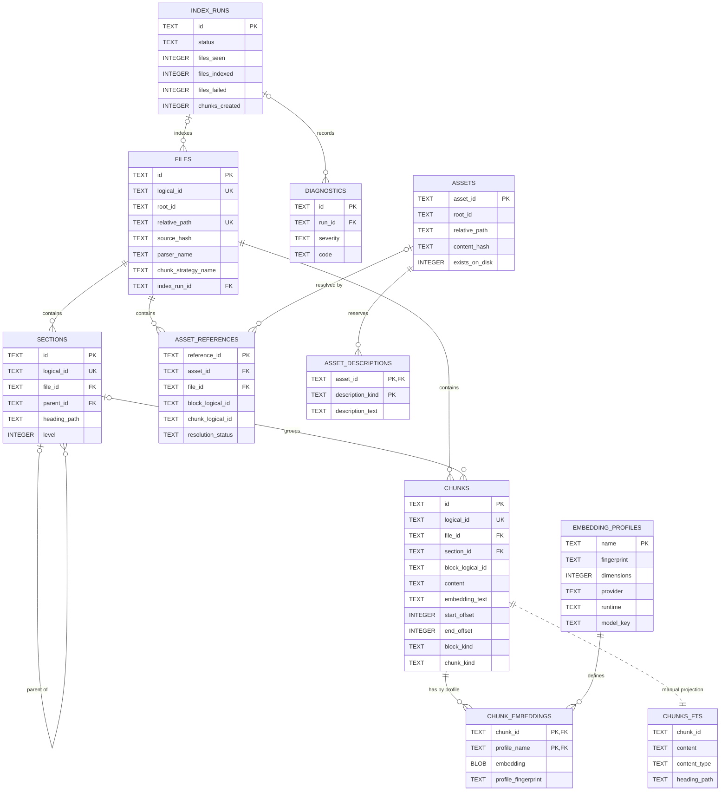

# SQLite persistence

MDRack stores all persistent state in one SQLite database, normally
`.mdrack/knowledge.db`. Source Markdown and asset files remain outside the
database and are never rewritten by indexing.

## Connection and migration rules

Canonical connections enable WAL, foreign keys, and `sqlite3.Row`. Migration
files must have unique contiguous versions beginning at `0000`. The runner
rejects missing/duplicate versions and databases containing migration versions
unknown to the current build. Each SQL migration and its ledger row execute in
one `BEGIN IMMEDIATE` transaction.

## Migration ledger

| Version | Current responsibility |
|---|---|
| `0000` | `schema_migrations` ledger. |
| `0001` | Files, sections, chunks, embedding profiles/vectors, index runs, diagnostics, and supporting indexes. |
| `0002` | Content-bearing `chunks_fts` FTS5 table, maintained manually. |
| `0003` | Logical IDs, parser/chunker provenance, source lines, block IDs, and richer run counters. |
| `0004` | Complete embedding-profile identity/fingerprint fields and vector fingerprint binding. |
| `0005` | Assets, asset references, and reserved asset descriptions. |
| `0006` | Chunk character offsets plus explicit block and chunk kinds. |

## Current ER model

The `assets` table has the composite constraint `UNIQUE(root_id, relative_path)`;
neither column is individually unique.

`chunks_fts` is a manually maintained projection, not a foreign-key table. The
ER link expresses the intended one-row-per-chunk projection. SQLite FTS5 also
creates internal shadow tables; they are not application contracts.

## Foreign-key semantics that matter

- `sections.file_id` and `chunks.file_id` cascade on file deletion.
- `sections.parent_id` and `chunks.section_id` use SQLite's default `NO ACTION`.
- `chunk_embeddings.chunk_id` cascades; `profile_name` uses `NO ACTION`.
- `files.index_run_id` and `diagnostics.run_id` use `NO ACTION`.
- `asset_references.file_id` cascades; its nullable `asset_id` becomes `NULL`
  when an asset is deleted.
- `asset_descriptions.asset_id` cascades.

## Atomic file replacement

One file replacement runs under a savepoint. The adapter removes stale asset
references and orphan assets, FTS rows, chunks, and sections; then writes the
file, sections, chunks, FTS rows, vectors, assets, and references. It validates
stored section and chunk counts before commit. A failure rolls the whole file
replacement back. Run metadata and per-file diagnostics commit separately, so a
multi-file run can be `partial_success` without leaving a half-written file.

## FTS and vectors

`chunks_fts` stores chunk content and heading paths. Writes/deletes are explicit;
there are no triggers. Text search uses FTS5 rank and highlighted snippets, with
a quoted-phrase retry only for plain invalid syntax.

Embedding vectors are JSON-encoded float arrays stored in a BLOB column. Search
loads vectors for the active profile/fingerprint and computes cosine similarity
in Python. Profile name, fingerprint, and dimensions are validated before use.
This is a linear scan; no ANN or SQLite vector extension is present.

## Identity and source persistence

Logical file, section, block, chunk, asset, and reference IDs are distinct from
SQLite record IDs. Public source locators contain only a portable root ID,
normalized relative POSIX path, line range, optional half-open character range,
heading array, structural kinds, and logical block/chunk IDs.

The database stores normalized chunk text and embedding text, but not a complete
snapshot of each original Markdown document. Reconstruct or display the source
from the external file plus persisted locators; do not treat `chunks` as a
lossless whole-document archive.

## Primary source anchors

- Migrations: `src/mdrack/storage/sqlite/migrations/0000_schema_migrations.sql`
  through `0006_complete_provenance.sql`
- Runner: `src/mdrack/storage/sqlite/migrations.py`
- Connection: `src/mdrack/storage/sqlite/connection.py`
- Atomic adapter: `src/mdrack/adapters/sqlite/index_storage.py`
- FTS: `src/mdrack/storage/sqlite/fts.py`
- Vectors: `src/mdrack/storage/sqlite/vector.py`
