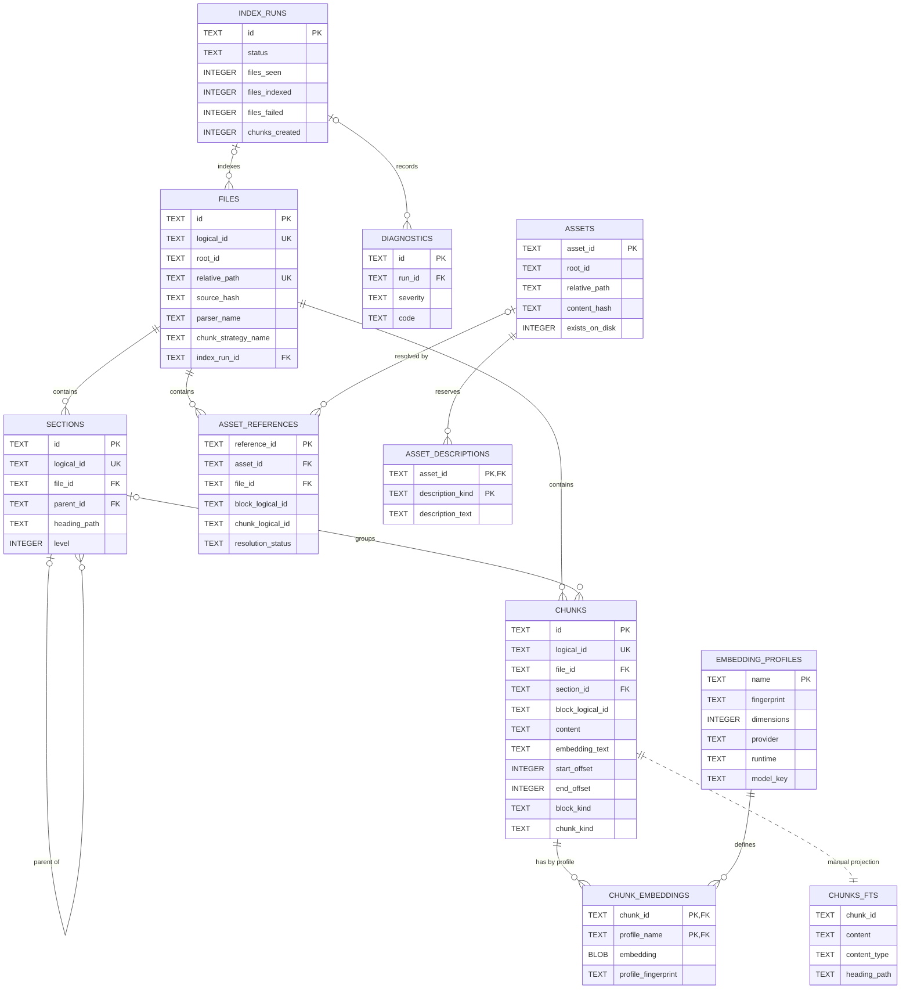

# SQLite persistence

SQLite is MDRack's only persistent backend. The legacy compatibility store is
normally `.mdrack/knowledge.db`; resource-core data is built in a separate store
generation selected through an app-owned pointer. Source Markdown and image bytes
remain outside databases and are never rewritten by indexing.

## Connection and migration rules

Canonical connections enable WAL, foreign keys, and `sqlite3.Row`. Migration
files must have unique contiguous versions beginning at `0000`. The runner
rejects missing/duplicate versions and databases containing migration versions
unknown to the current build. Each SQL migration and its ledger row execute in
one `BEGIN IMMEDIATE` transaction.

## Migration ledger

| Version | Current responsibility |
|---|---|
| `0000` | `schema_migrations` ledger. |
| `0001` | Files, sections, chunks, embedding profiles/vectors, index runs, diagnostics, and supporting indexes. |
| `0002` | Content-bearing `chunks_fts` FTS5 table, maintained manually. |
| `0003` | Logical IDs, parser/chunker provenance, source lines, block IDs, and richer run counters. |
| `0004` | Complete embedding-profile identity/fingerprint fields and vector fingerprint binding. |
| `0005` | Immutable historical asset, asset-reference, and reserved-description tables. Current Markdown indexing does not populate or maintain them. |
| `0006` | Chunk character offsets plus explicit block and chunk kinds; highest migration accepted by the active legacy composition. |
| `0007` | Create-only generic resources, representations, search units, embedding spaces/vectors, facets, and manual resource FTS. No legacy row is changed or backfilled. |

The runner validates a compiled ordered filename/content manifest and digest before
touching a connection. `apply_migrations` is intentionally bounded at `0006` for
the legacy database; only explicit candidate composition may apply `0007`.

## Store generations and recovery

Generation metadata records identity, readiness, migration manifest, contract
version, producer fingerprints, verification time, and a stable failure reason.
States are `legacy_only`, `rebuild_required`, `building`, `ready`, and `failed`;
only `ready` may serve core-backed search/write.

A candidate is created exclusively, migrated, rebuilt, verified (FK/integrity,
canonical records, FTS/vector/facet graph), checkpointed, closed and fsynced before
its ready metadata becomes durable. Under one-writer quiescence, the active pointer
is replaced and its directory fsynced. Readers see the old or new generation only.
Rollback switches the pointer to the untouched retained legacy generation. Cleanup
is a separate destructive action and is not part of rollback or release acceptance.

## Current ER model

The diagram below records the immutable legacy `0000`–`0006` schema, including
the dormant historical `0005` tables. It is a DDL history, not a statement that
current Markdown indexing owns every table shown. Migration `0007` adds a separate
`core_*` graph; it does not replace or backfill these tables.

The `assets` table has the composite constraint `UNIQUE(root_id, relative_path)`;
neither column is individually unique.

`chunks_fts` is a manually maintained projection, not a foreign-key table. The
ER link expresses the intended one-row-per-chunk projection. SQLite FTS5 also
creates internal shadow tables; they are not application contracts.

## Legacy foreign-key semantics that matter

- `sections.file_id` and `chunks.file_id` cascade on file deletion.
- `sections.parent_id` and `chunks.section_id` use SQLite's default `NO ACTION`.
- `chunk_embeddings.chunk_id` cascades; `profile_name` uses `NO ACTION`.
- `files.index_run_id` and `diagnostics.run_id` use `NO ACTION`.
- Historical `asset_references.file_id` cascades; its nullable `asset_id` becomes
  `NULL` when an asset is deleted. Historical `asset_descriptions.asset_id`
  cascades. Current Markdown indexing does not exercise these `0005` relations.

## Atomic file replacement

One file replacement runs under a savepoint. The adapter removes stale FTS rows,
chunks, and sections, then writes the file, sections, chunks, FTS rows, and
optional vectors. It validates stored section and chunk counts before commit. A
failure rolls the whole file replacement back. Run metadata and per-file
diagnostics commit separately, so a multi-file run can be `partial_success`
without leaving a half-written file. Markdown replacement neither writes nor
deletes the dormant historical `0005` asset tables.

Resource replacement is a separate serialized transaction owned by
`SQLiteResourceStore`. Core preflight and all provider/filesystem work finish first.
Resource children, manual FTS, vectors, facets, counts, and integrity commit together;
failure preserves the previous complete graph. Delete is atomic and idempotent.

## FTS and vectors

`chunks_fts` stores chunk content and heading paths. Writes/deletes are explicit;
there are no triggers. Text search uses FTS5 rank and highlighted snippets, with
a quoted-phrase retry only for plain invalid syntax.

Embedding vectors are JSON-encoded float arrays stored in a BLOB column. Search
loads vectors for the active profile/fingerprint and computes cosine similarity
in Python. Profile name, fingerprint, and dimensions are validated before use.
This is a linear scan; no ANN or SQLite vector extension is present.

## Identity and source persistence

Logical file, section, block, and chunk IDs are distinct from SQLite record IDs.
The dormant historical `0005` schema also has asset/reference identifiers, but
current Markdown indexing does not create them and they are not a current public
identity surface. Public source locators contain only a portable root ID,
normalized relative POSIX path, line range, optional half-open character range,
heading array, structural kinds, and logical block/chunk IDs.

The database stores normalized chunk text and embedding text, but not a complete
snapshot of each original Markdown document. Reconstruct or display the source
from the external file plus persisted locators; do not treat `chunks` as a
lossless whole-document archive.

## Primary source anchors

- Migrations: `src/mdrack/storage/sqlite/migrations/0000_schema_migrations.sql`
  through `0007_resource_core.sql`
- Runner: `src/mdrack/storage/sqlite/migrations.py`
- Connection: `src/mdrack/storage/sqlite/connection.py`
- Atomic adapter: `src/mdrack/adapters/sqlite/index_storage.py`
- Resource adapter: `src/mdrack/adapters/sqlite/resource_store.py`
- Generation manager/runtime: `src/mdrack/application/generation_manager.py`,
  `src/mdrack/adapters/sqlite/generation_runtime.py`
- FTS: `src/mdrack/storage/sqlite/fts.py`
- Vectors: `src/mdrack/storage/sqlite/vector.py`
