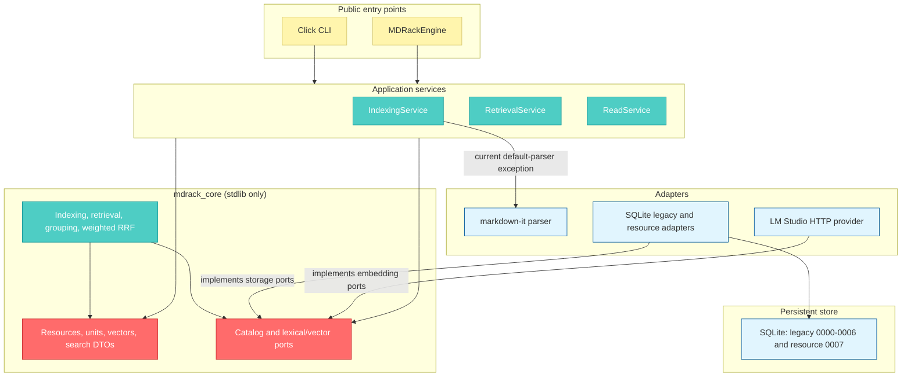

# System overview

MDRack 0.3 is one distribution with two import roots. `mdrack_core` is a
stdlib-only provider- and persistence-neutral kernel for typed resource graphs,
ports, filtered branch retrieval, grouping, weighted RRF, and safe events.
`mdrack` owns Click/engine composition, Markdown and explicit image ingestion,
SQLite generations, and LM Studio HTTP integration.

## Dependency direction

Unlabelled arrows show runtime dependencies, not inheritance; labelled
adapter-to-port arrows show implementation direction. `mdrack_core` never imports
`mdrack`, Click, SQLite, HTTP, Markdown, filesystem, or provider code. The app
prepares caller-owned IDs, text and vectors before invoking core.
The current bounded exception is `IndexingService`: it imports and constructs
`MarkdownItParser` when no parser is injected. Callers can still inject the
`MarkdownParser` port; this concrete default is not an edge-only composition.

## Layers and ownership

| Layer | Current responsibility |
|---|---|
| `domain/` | Parser-independent documents and blocks, chunks, logical identities, source locators, profiles, and retrieval DTOs. |
| `ports/` | Storage, parser, embedding, model-catalog, lifecycle, and reranker contracts. |
| `application/` | Canonical Markdown indexing, chunking, reads, and text/semantic/hybrid orchestration. |
| `adapters/` | markdown-it parsing, SQLite storage, and LM Studio-specific adapters. |
| `storage/sqlite/` | Connections, linear migrations, repositories, FTS5 operations, and JSON-vector search. |
| `cli/` | Click argument handling, service composition, error mapping, and JSON envelopes. |
| `public_api/` | `MDRackEngine` and public DTO access without a Click dependency. |
| `mdrack_core/domain/` | Immutable generic resource, locator, vector, facet, request/result, error, and degradation records. |
| `mdrack_core/ports/` | Logical-ID-only catalog and lexical/vector search protocols. |
| `mdrack_core/application/` | Complete-graph validation, provider-free indexing, grouping, weighted RRF, and discovery. |
| `application/store_generations.py` | Durable generation state and active-pointer records. |
| `adapters/sqlite/resource_store.py` | Atomic `0007` resource graph and pre-limit scoped search implementation. |

The canonical service path is `IndexingService`, `RetrievalService`, and
`ReadService`. `SearchService`, the old `markdown/` parser/chunker, the
`indexing/indexer.py` wrapper, and thin `search/` modules are compatibility
surfaces rather than the preferred home for new behavior.

## Fixed architecture boundaries

- SQLite is the only persistent database; there is no vector database or
  `sqlite-vec` dependency.
- Production embeddings use the LM Studio HTTP boundary. MDRack does not load
  model weights through Python ML libraries.
- The default parser is `markdown_it`; `legacy` remains selectable for baseline
  comparisons.
- Markdown image syntax is projected only into eligible prose; Markdown indexing
  creates no asset graph and never inspects referenced files. Explicit direct-image
  ingestion is a separate caller-selected local-file operation. Neither path fetches
  remote assets or mutates source files.
- Hybrid fusion is implemented in the application layer.
- Production reranking is unsupported and non-null injection fails closed.
- Public retrieval identity is a logical ID plus `SourceLocator`, not a SQLite
  record UUID.
- Only a verified `ready` resource generation can serve core-backed writes/search;
  the active legacy database remains on migration `0006`.

## Primary source anchors

- Entry points: `src/mdrack/cli/__init__.py`, `src/mdrack/public_api/engine.py`
- Pure core distribution/source: `packages/mdrack-core/`,
  `packages/mdrack-core/src/mdrack_core/`
- Store generations: `src/mdrack/application/generation_manager.py`,
  `src/mdrack/application/store_generations.py`
- Resource adapter: `src/mdrack/adapters/sqlite/resource_store.py`
- Services: `src/mdrack/application/indexing.py`,
  `src/mdrack/application/retrieval.py`, `src/mdrack/application/query.py`
- Ports: `src/mdrack/ports/storage.py`, `src/mdrack/ports/embeddings.py`
- Default composition: `src/mdrack/adapters/sqlite/index_storage.py`
- Project invariants: `AGENTS.md`, `instructions/ARCH.system.instructions.md`
