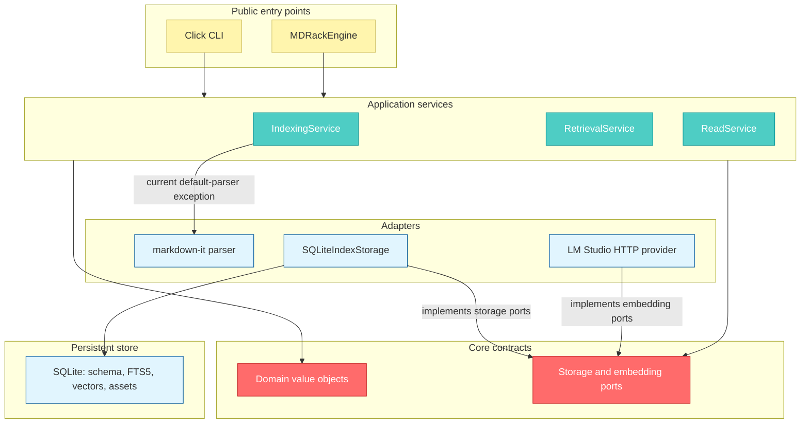

# System overview

MDRack is a local Python 3.11+ CLI and embedded library. It reads Markdown from a
configured root, derives structural blocks and retrieval chunks without changing
the source, persists indexes in SQLite, obtains embeddings from LM Studio over
HTTP, and returns portable JSON retrieval results.

## Dependency direction

Unlabelled arrows show runtime dependencies, not inheritance; the two labelled
adapter-to-port arrows show implementation direction. Domain objects do not
depend on Click, SQLite, or HTTP. Application services primarily consume protocols
from `ports/`, and public-edge composition selects storage and embedding adapters.
The current bounded exception is `IndexingService`: it imports and constructs
`MarkdownItParser` when no parser is injected. Callers can still inject the
`MarkdownParser` port; this concrete default is not an edge-only composition.

## Layers and ownership

| Layer | Current responsibility |
|---|---|
| `domain/` | Parser-independent documents and blocks, chunks, logical identities, source locators, profiles, assets, and retrieval DTOs. |
| `ports/` | Storage, parser, embedding, model-catalog, lifecycle, and reranker contracts. |
| `application/` | Canonical indexing, chunking, asset graph construction, reads, and text/semantic/hybrid orchestration. |
| `adapters/` | markdown-it parsing, SQLite storage, and LM Studio-specific adapters. |
| `storage/sqlite/` | Connections, linear migrations, repositories, FTS5 operations, and JSON-vector search. |
| `cli/` | Click argument handling, service composition, error mapping, and JSON envelopes. |
| `public_api/` | `MDRackEngine` and public DTO access without a Click dependency. |

The canonical service path is `IndexingService`, `RetrievalService`, and
`ReadService`. `SearchService`, the old `markdown/` parser/chunker, the
`indexing/indexer.py` wrapper, and thin `search/` modules are compatibility
surfaces rather than the preferred home for new behavior.

## Fixed architecture boundaries

- SQLite is the only persistent database; there is no vector database or
  `sqlite-vec` dependency.
- Production embeddings use the LM Studio HTTP boundary. MDRack does not load
  model weights through Python ML libraries.
- The default parser is `markdown_it`; `legacy` remains selectable for baseline
  comparisons.
- Asset discovery is local and offline. Indexing never fetches remote assets or
  mutates Markdown.
- Hybrid fusion is implemented in the application layer.
- Production reranking is unsupported and non-null injection fails closed.
- Public retrieval identity is a logical ID plus `SourceLocator`, not a SQLite
  record UUID.

## Primary source anchors

- Entry points: `src/mdrack/cli/__init__.py`, `src/mdrack/public_api/engine.py`
- Services: `src/mdrack/application/indexing.py`,
  `src/mdrack/application/retrieval.py`, `src/mdrack/application/query.py`
- Ports: `src/mdrack/ports/storage.py`, `src/mdrack/ports/embeddings.py`
- Default composition: `src/mdrack/adapters/sqlite/index_storage.py`
- Project invariants: `AGENTS.md`, `instructions/ARCH.system.instructions.md`
