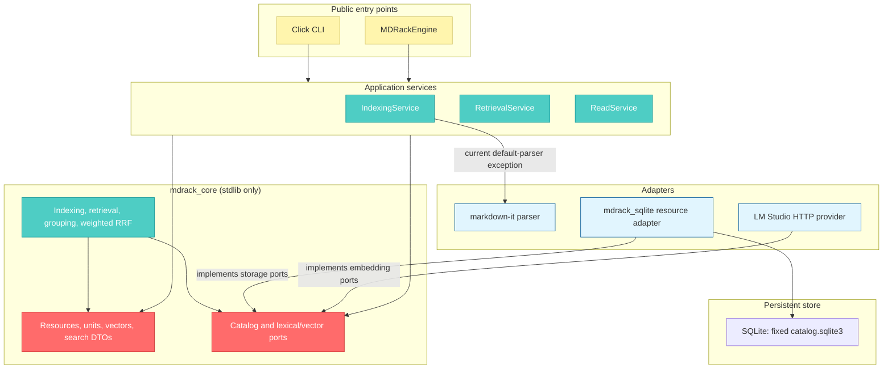

# System overview

MDRack now has standalone `mdrack-core` and `mdrack-sqlite` distributions beside
the `mdrack` app. `mdrack_core` is the stdlib-only provider- and
persistence-neutral kernel. `mdrack_sqlite` depends only on core and stdlib and is
the single generic resource catalog/search adapter owner. `mdrack` owns
Click/engine composition, Markdown scanning, explicit local-file ingestion
adapters, the fixed application catalog lifecycle, and LM Studio HTTP integration.

## Dependency direction

```mermaid
graph TD
    subgraph Entry ["Public entry points"]
        CLI["Click CLI"]
        Engine["MDRackEngine"]
    end

    subgraph App ["Application services"]
        Indexing["IndexingService"]
        Retrieval["RetrievalService"]
        Read["ReadService"]
    end

    subgraph Core ["mdrack_core (stdlib only)"]
        Domain["Resources, units, vectors, search DTOs"]
        Ports["Catalog and lexical/vector ports"]
        CoreServices["Indexing, retrieval, grouping, weighted RRF"]
    end

    subgraph Adapters ["Adapters"]
        Markdown["markdown-it parser"]
        SQLiteAdapter["mdrack_sqlite resource adapter"]
        LMStudio["LM Studio HTTP provider"]
    end

    subgraph Persistence ["Persistent store"]
        SQLite["SQLite: fixed catalog.sqlite3"]
    end

    CLI --> App
    Engine --> App
    App --> Domain
    App --> Ports
    CoreServices --> Domain
    CoreServices --> Ports
    Indexing -->|"current default-parser exception"| Markdown
    SQLiteAdapter -->|"implements storage ports"| Ports
    LMStudio -->|"implements embedding ports"| Ports
    SQLiteAdapter --> SQLite


    classDef entry fill:#fff5ad,stroke:#d4c46a,color:#333
    classDef service fill:#4ecdc4,stroke:#0a9396,color:#fff
    classDef contract fill:#ff6b6b,stroke:#c92a2a,color:#fff
    classDef adapter fill:#e1f5fe,stroke:#01579b,color:#333
    class CLI,Engine entry
    class Indexing,Retrieval,Read,CoreServices service
    class Domain,Ports contract
    class Markdown,SQLiteAdapter,LMStudio adapter
```

Unlabelled arrows show runtime dependencies, not inheritance; labelled
adapter-to-port arrows show implementation direction. `mdrack_core` never imports
`mdrack`, Click, SQLite, HTTP, Markdown, filesystem, or provider code.
`mdrack_sqlite` imports `mdrack_core` but never `mdrack`. The app prepares
caller-owned IDs, text and vectors before invoking core.
The current bounded exception is `IndexingService`: it imports and constructs
`MarkdownItParser` when no parser is injected. Callers can still inject the
`MarkdownParser` port; this concrete default is not an edge-only composition.

## Layers and ownership

| Layer | Current responsibility |
|---|---|
| `domain/` | Parser-independent documents and blocks, chunks, logical identities, source locators, profiles, and retrieval DTOs. |
| `ports/` | Storage, parser, embedding, model-catalog, lifecycle, and reranker contracts. |
| `application/` | Canonical Markdown indexing, chunking, reads, and text/semantic/hybrid orchestration. |
| `adapters/` | markdown-it parsing, app SQLite compatibility/composition, and LM Studio-specific adapters. |
| `storage/sqlite/` | Compatibility types and read/write helpers; normal application startup does not select an app-migration database. |
| `packages/mdrack-sqlite/` | Generic `core_*` catalog/search adapter, FTS fallback, context-managed bridge lifecycle, and safe verification. |
| `cli/` | Click argument handling, service composition, error mapping, and JSON envelopes. |
| `public_api/` | `MDRackEngine` and public DTO access without a Click dependency. |
| `mdrack_core/domain/` | Immutable generic resource, locator, vector, facet, request/result, error, and degradation records. |
| `mdrack_core/ports/` | Logical-ID-only catalog and lexical/vector search protocols. |
| `mdrack_core/application/` | Complete-graph validation, provider-free indexing, grouping, weighted RRF, and discovery. |
| `adapters/sqlite/canonical_catalog.py` | Fixed-path create/open guard for the only normal application database. |
| `packages/mdrack-sqlite/src/mdrack_sqlite/resource_store.py` | Atomic `core_*` resource graph and pre-limit scoped search implementation. |
| `src/mdrack/adapters/sqlite/resource_store.py` | Compatibility re-export of the standalone owner. |

The canonical service path is `IndexingService`, `RetrievalService`, and
`ReadService`. `SearchService`, the old `markdown/` parser/chunker, the
`indexing/indexer.py` wrapper, and thin `search/` modules are compatibility
surfaces rather than the preferred home for new behavior.

## Local-file adapters and prepared-resource boundary

Opening a caller-selected local source is application work, not a capability of
`mdrack_core` or `mdrack_media`. The raw adapters capture a bounded transient
snapshot, verify its signature and source reference, enforce budgets, and check
that the source has not changed before replacement. WAVE and ISO-BMFF adapters
also run only the caller-selected stdin executable with `shell=False`; the core
and media packages never run that process.

The entry paths are deliberately separate because they have different input and
preparation contracts. They converge only after the app has prepared the value
that will be replaced in the fixed catalog:

| Entry path | Application-side owner and preparation | Neutral/persistent boundary |
|---|---|---|
| Markdown scan | `IndexingService` scans its configured root and creates the compatibility `PreparedFile` for `IndexStorage.replace_file`. | The app storage path writes the same fixed `core_*` catalog; a scan does not inspect image targets. |
| Explicit raw text | `RawTextIngestionService` captures strict UTF-8 text or Markdown selected outside the scan root and prepares a `PreparedResourceBatch`. | `CoreIndexingService` validates it and calls the `ResourceWritePort`. |
| Explicit direct image | `ImageIngestionService` captures and magic-checks one local image, then prepares its caller-supplied text and/or visual records. | `CoreIndexingService` validates the complete graph before the write port replaces it. |
| Explicit WAVE | `RawAudioIngestionService` captures RIFF/WAVE and obtains strict timed JSON from the authorized local stdin command; `TranscriptIngestionService` prepares the timed-text graph. | `CoreIndexingService` validates the complete graph before the write port replaces it. |
| Explicit ISO-BMFF video | `RawVideoIngestionService` captures `ftyp` input and obtains strict transcript/frame JSON from the authorized local stdin extractor; `VideoCompositionService` prepares one video graph. | `CoreIndexingService` validates the complete graph before the write port replaces it. |

`mdrack_media` supplies the provider-free builders and validators used by the
application composition services for prepared transcript and frame-caption
graphs. It does not read media files, access a provider, database, or network,
or create vectors. `mdrack_core` receives already prepared resource graphs through
logical-ID ports and validates them; it does not open source files, invoke
subprocesses, call providers, or persist data. `SQLiteResourceStore` in
`mdrack_sqlite` is the sole generic catalog/search persistence owner and performs
the atomic logical-resource replacement.

## Fixed architecture boundaries

- SQLite is the only persistent database; there is no vector database or
  `sqlite-vec` dependency.
- Production embeddings use the LM Studio HTTP boundary. MDRack does not load
  model weights through Python ML libraries.
- The default parser is `markdown_it`; `legacy` remains selectable for baseline
  comparisons.
- Markdown image syntax is projected only into eligible prose; Markdown indexing
  creates no asset graph and never inspects referenced files. Explicit direct-image
  ingestion is a separate caller-selected local-file operation. Neither path fetches
  remote assets or mutates source files.
- Hybrid fusion is implemented in the application layer.
- Production reranking is unsupported and non-null injection fails closed.
- Public retrieval identity is a logical ID plus `SourceLocator`, not a SQLite
  record UUID.
- Normal application startup has one physical SQLite database:
  `<store>/catalog.sqlite3`. `init`, `scan`, and `MDRackEngine.scan` create or
  open only that clean v2 catalog; read-only operations fail safely when it is
  absent. Existing legacy-store data is unsupported and is never copied, opened,
  or migrated by normal application code.
- Active-generation metadata, candidate construction/activation, rollback,
  retention, and explicit normal-application catalog selection are removed.
  The catalog factory rejects old lifecycle artifacts rather than adopting them.
- Normal Markdown and typed-resource operations use the same `core_*` catalog.
  Each typed resource replacement remains the atomic transaction owned by
  `SQLiteResourceStore`.
- `files list`, `files info`, `read file`, and `read chunk` project only the
  fixed catalog through `CoreCompatibilityStorage`; `read chunk --context
  neighbors` derives adjacency from `core_search_units`. There is no normal
  section reader or retrieval-evaluation command in S1.

## Primary source anchors

- Entry points: `src/mdrack/cli/__init__.py`, `src/mdrack/public_api/engine.py`
- Pure core distribution/source: `packages/mdrack-core/`,
  `packages/mdrack-core/src/mdrack_core/`
- SQLite distribution/source: `packages/mdrack-sqlite/`,
  `packages/mdrack-sqlite/src/mdrack_sqlite/`
- Fixed lifecycle: `src/mdrack/adapters/sqlite/canonical_catalog.py`,
  `src/mdrack/application/compatibility.py`
- Resource adapter compatibility import: `src/mdrack/adapters/sqlite/resource_store.py`
- Services: `src/mdrack/application/indexing.py`,
  `src/mdrack/application/retrieval.py`, `src/mdrack/application/query.py`
- Ports: `src/mdrack/ports/storage.py`, `src/mdrack/ports/embeddings.py`
- Local-file adapters: `src/mdrack/ingestion/raw_text.py`,
  `src/mdrack/ingestion/images.py`, `src/mdrack/ingestion/raw_audio.py`,
  `src/mdrack/ingestion/raw_video.py`,
  `src/mdrack/ingestion/raw_source_provenance.py`
- Prepared media composition: `src/mdrack/application/transcript_ingestion.py`,
  `src/mdrack/application/video_composition.py`, `packages/mdrack-media/`
- Core prepared-resource port: `packages/mdrack-core/src/mdrack_core/ports/catalog.py`
- Fixed document readers: `src/mdrack/application/compatibility.py`,
  `src/mdrack/cli/commands/files.py`, `src/mdrack/cli/commands/read.py`
- Project invariants: `AGENTS.md`, `instructions/ARCH.system.instructions.md`

The S1 test-surface classification, including removed inherited tests and
uncovered S2/S3/S4 work, is recorded in
[`one-store-s1-test-ledger.md`](one-store-s1-test-ledger.md).
