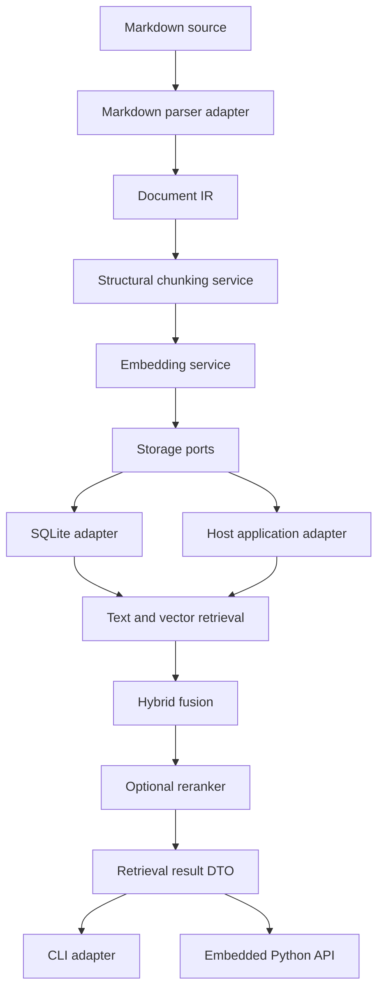
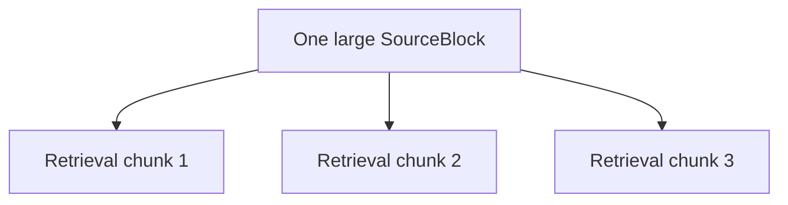
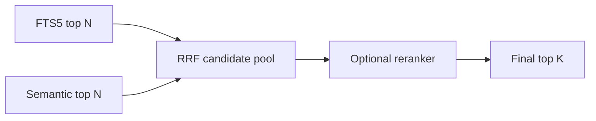

# MDRack v0.2 — Retrieval Modernization Plan

## 1. Цель 🧭

Этот документ фиксирует поэтапный план модернизации MDRack как локального Markdown retrieval-движка для Obsidian-хранилищ и как переиспользуемого Python-модуля для встраивания в другие приложения.

Главная цель версии 0.2:

```text
повысить качество разбора Markdown, чанкинга, поиска и переранжирования,
не потеряв локальность, переносимость SQLite-хранилища,
стабильные JSON-контракты и возможность использовать ядро без CLI
```

## 2. Зафиксированные решения ✅

1. Основной runtime моделей — LM Studio.
2. OpenRouter и другие облачные поставщики в этот этап не входят.
3. LM Studio должен быть запущен пользователем именно через графический интерфейс.
4. После запуска GUI агент обязан самостоятельно запросить список доступных моделей через LM Studio API и определить их реальные ключи, типы, состояния загрузки и instance IDs.
5. Каталог моделей не должен быть жёстко зашит как единственный источник истины.
6. Известные Qwen-модели используются как стартовая тестовая матрица, но перед запуском тестов всегда выполняется runtime discovery.
7. GitHub Actions не добавляются. Проверка выполняется локальными командами и сохраняемыми отчётами.
8. Python не загружает модели напрямую. Запрещены `torch`, `transformers`, `sentence-transformers` и аналогичные runtime-зависимости.
9. SQLite остаётся единственным постоянным хранилищем.
10. Исходные Markdown-файлы никогда не изменяются индексатором.

## 3. Стартовая локальная модельная матрица 🧠

На тестовой машине уже скачаны GGUF Q4-варианты:

| Роль | Модели |
|---|---|
| Embedding | Qwen3-Embedding-0.6B, Qwen3-Embedding-4B, Qwen3-Embedding-8B |
| Reranking | Qwen3-Reranker-0.6B |

Перед каждым live-прогоном агент должен:

1. убедиться, что GUI LM Studio запущен;
2. запросить список моделей;
3. разрешить человекочитаемые имена в реальные LM Studio model keys;
4. определить, какая модель уже загружена;
5. загрузить нужную модель только при необходимости;
6. проверить реальный embedding dimension пробным запросом;
7. проверить наличие и фактический контракт rerank endpoint;
8. не считать наличие GGUF-файла доказательством поддержки reranking API.

> [!IMPORTANT]
> Для reranker сначала выполняется capability probe. Если текущая версия LM Studio не предоставляет подходящий endpoint, реализация должна вернуть структурированный результат `unsupported_by_runtime`, а не имитировать reranking через chat completion.

## 4. MRL и сокращаемая размерность векторов 📐

Семейство Qwen3 Embedding поддерживает Matryoshka Representation Learning (MRL), то есть выходные векторы могут использовать меньшую размерность, чем максимальная размерность модели.

Максимальные размерности:

| Модель | Максимальная размерность |
|---|---:|
| Qwen3-Embedding-0.6B | 1024 |
| Qwen3-Embedding-4B | 2560 |
| Qwen3-Embedding-8B | 4096 |

Для 8B не обязательно всегда хранить 4096 чисел на чанк. MDRack должен поддерживать экспериментальные профили, например:

```text
8B / 4096
8B / 2048
8B / 1024
8B / 512
```

При этом уменьшение размерности нельзя объявлять бесплатным. Каждая конфигурация должна отдельно измеряться на реальном Obsidian-корпусе.

Идентичность embedding-профиля должна включать как минимум:

```text
provider
runtime
model_key
model_family
quantization
output_dimensions
query_instruction
normalization_mode
endpoint_family
```

Для профиля рассчитывается стабильный `profile_fingerprint`. Векторы с разными fingerprints нельзя смешивать в одном активном индексе.

## 5. Целевая архитектура слоёв 🧱

MDRack должен состоять из переиспользуемого ядра и тонких внешних оболочек.



### 5.1. Ядро не должно зависеть от CLI

Команды Click не должны содержать бизнес-логику. CLI только:

1. разбирает параметры;
2. вызывает application service;
3. преобразует DTO в стабильный JSON-envelope;
4. выставляет exit code.

### 5.2. Ядро не должно зависеть напрямую от SQLite

Нужны интерфейсы хранилища:

```python
class DocumentRepository(Protocol): ...
class ChunkRepository(Protocol): ...
class EmbeddingRepository(Protocol): ...
class SearchIndex(Protocol): ...
class IndexRunRepository(Protocol): ...
```

SQLite остаётся основной реализацией, но другое приложение сможет подключить собственную БД без переписывания парсера, чанкинга и retrieval pipeline.

### 5.3. Рекомендуемая структура пакета

```text
src/mdrack/
  domain/
    documents.py
    blocks.py
    chunks.py
    assets.py
    profiles.py
    retrieval.py
  application/
    indexing.py
    chunking.py
    search.py
    reranking.py
    diagnostics.py
  ports/
    parser.py
    storage.py
    embeddings.py
    reranker.py
    model_catalog.py
    model_lifecycle.py
  adapters/
    markdown_it/
    lmstudio/
    sqlite/
    cli/
  public_api/
    engine.py
    models.py
```

Имена могут быть адаптированы под текущий проект, но направление зависимостей должно сохраняться:

```text
CLI -> application -> domain/ports
SQLite/LM Studio/markdown-it -> ports
```

## 6. Модернизация Markdown-парсинга 📝

### 6.1. Парсер и чанкер — разные ответственности

Парсер отвечает на вопрос:

```text
какие структурные элементы находятся в документе и где они расположены
```

Чанкер отвечает на вопрос:

```text
как собрать из этих элементов retrieval-единицы подходящего размера
```

Поиск и reranker работают уже после чанкинга и не должны влиять на разбор Markdown.

### 6.2. Базовая библиотека

Основной рекомендуемый parser backend — `markdown-it-py` с MIT-лицензией.

Он должен использоваться для:

- CommonMark-разбора;
- заголовков H1-H6;
- fenced code на backticks и tildes;
- списков;
- blockquotes;
- таблиц GFM;
- ссылок;
- изображений;
- inline code;
- source line maps;
- расширений frontmatter и других согласованных синтаксисов.

Текущий самописный parser сохраняется временно как baseline до прохождения сравнительных тестов.

### 6.3. Внутренний Document IR

Нельзя отдавать токены сторонней библиотеки напрямую остальному приложению. Нужен собственный стабильный IR:

```python
@dataclass(frozen=True)
class SourceSpan:
    start_line: int
    end_line: int
    start_offset: int | None
    end_offset: int | None

@dataclass(frozen=True)
class SourceBlock:
    block_id: str
    document_id: str
    block_type: BlockType
    raw_markdown: str
    plain_text: str | None
    language: str | None
    heading_level: int | None
    heading_path: tuple[str, ...]
    source_span: SourceSpan
    attributes: Mapping[str, JSONValue]
```

IR должен поддерживать:

- paragraph;
- heading;
- list;
- blockquote;
- callout;
- code;
- mermaid/diagram;
- table;
- image reference;
- thematic break;
- mixed/unknown fallback.

## 7. Новая стратегия чанкинга ✂️

### 7.1. Исходный блок и retrieval-чанк не одно и то же

Большой code fence, таблица или диаграмма должны сохраняться как единый `SourceBlock`, но могут иметь несколько retrieval-представлений.



Это решает конфликт между сохранением оригинальной структуры и ограничениями embedding/reranking моделей.

### 7.2. Правила для прозы

Для длинной прозы допускается подключение `semantic-text-splitter` с MIT-лицензией, но только после структурного разбора документа.

`semantic-text-splitter` не должен получать весь Markdown-файл как единую строку, потому что при превышении лимита он может делить крупные code fences на более мелких уровнях.

Он используется только внутри текстовых блоков и секций для:

- границ предложений;
- Unicode word boundaries;
- token/character capacity;
- управляемого overlap;
- разбиения длинных абзацев.

### 7.3. Правила для кода

1. Небольшой code block остаётся целым.
2. Пояснение перед кодом может быть объединено с небольшим блоком.
3. Крупный блок сохраняется целиком как `SourceBlock`.
4. Retrieval-представление крупного Python-кода сначала делится по классам и функциям.
5. Для неизвестного языка используется безопасное окно по строкам.
6. Каждый retrieval-чанк хранит `parent_block_id` и source span.
7. Fence никогда не должен превращаться в отдельный бессмысленный чанк.

### 7.4. Правила для таблиц

1. Маленькая таблица остаётся целой.
2. Большая таблица делится по строкам.
3. Заголовок таблицы повторяется в каждой части.
4. Сохраняется ссылка на единый исходный table block.
5. Должны быть отдельные `display_content` и `embedding_text`.

### 7.5. Правила для Mermaid и диаграмм

1. Mermaid source сохраняется целиком.
2. Небольшая диаграмма может идти вместе с поясняющим текстом.
3. Для большой диаграммы создаётся компактное retrieval-представление: heading path, тип диаграммы, идентификаторы узлов и окружающий текст.
4. Разрыв внутри синтаксически значимой строки диаграммы запрещён.

### 7.6. Правила для заголовков

1. Заголовок не создаёт самостоятельный retrieval-чанк без содержимого.
2. Heading path хранится отдельно как метаданные.
3. Heading path добавляется в embedding text.
4. Overlap не переносится через границу логического раздела.
5. H1-H6 поддерживаются полностью.

### 7.7. Размеры чанков

Текущие значения в символах сохраняются только как baseline. Новая система должна уметь считать:

- characters;
- UTF-8 bytes;
- estimated tokens;
- block count;
- code line count;
- overlap size.

Параметры выбираются через retrieval evaluation, а не по интуиции.

## 8. Стабильные идентификаторы и provenance 🪪

### 8.1. Проблема текущих UUID

При переиндексации секции и чанки получают новые случайные UUID. Это ломает сохранённые ссылки агентов и затрудняет сравнение результатов между запусками.

### 8.2. Два вида идентификаторов

Нужно разделить:

```text
record_id   — внутренний UUID строки БД
logical_id  — детерминированный стабильный идентификатор источника
```

Пример основы для `logical_id`:

```text
root_id
relative_path
normalized_heading_path
parent_block_type
source_start_line
content_fingerprint
chunk_strategy_version
```

При существенном изменении содержимого logical ID может измениться, но неизменённые секции не должны получать новые идентификаторы только из-за повторного scan.

### 8.3. Обязательный source locator

Каждый результат поиска должен возвращать:

```json
{
  "root_id": "default",
  "relative_path": "notes/python/asyncio.md",
  "start_line": 120,
  "end_line": 168,
  "heading_path": ["Python", "Asyncio", "Semaphore"],
  "block_id": "...",
  "chunk_id": "..."
}
```

Абсолютный путь не хранится как переносимая истина. Он вычисляется во время выполнения:

```text
resolved_path = configured_root / relative_path
```

## 9. Надёжность индексирования 🛡️

### 9.1. Атомарность на уровне файла

Текущую схему `удалить старое -> попытаться записать новое` необходимо заменить.

Для каждого файла:

```text
parse
build sections
build source blocks
build retrieval chunks
create embeddings
update FTS
validate counts
commit
```

При любой ошибке выполняется rollback, и предыдущая рабочая версия файла остаётся доступной.

### 9.2. Частичный успех

`scan` должен явно различать:

```text
success
partial_success
failed
```

Ответ должен включать:

```json
{
  "files_seen": 1200,
  "files_changed": 18,
  "files_indexed": 17,
  "files_failed": 1,
  "errors_count": 1,
  "status": "partial_success"
}
```

Ошибки отдельных файлов нельзя скрывать за общим `ok: true` без статуса partial success.

### 9.3. Версионирование стратегий

В БД сохраняются:

- parser backend name/version;
- chunk strategy name/version;
- embedding profile fingerprint;
- schema version;
- index run ID.

Изменение parser/chunk strategy должно позволять осознанную полную переиндексацию.

## 10. Модельные абстракции LM Studio 🔌

Нужно окончательно разделить роли:

```python
class EmbeddingProvider(Protocol): ...
class RerankerProvider(Protocol): ...
class ModelCatalogProvider(Protocol): ...
class ModelLifecycleProvider(Protocol): ...
```

LM Studio adapter может реализовывать несколько ролей, но они не должны быть склеены в одном интерфейсе.

### 10.1. Dynamic model discovery

Агент не должен полагаться на статический список имён.

Алгоритм:

1. проверить доступность LM Studio API;
2. вызвать list models;
3. нормализовать model key, display name, type, state, variants и instance IDs;
4. сопоставить модель с ролью;
5. разрешить неоднозначности;
6. выполнить capability probe;
7. сохранить фактически использованный key в отчёте и профиле.

### 10.2. GUI prerequisite

Перед live-разработкой и проверкой оператор должен:

1. запустить графический интерфейс LM Studio;
2. дождаться полной загрузки приложения;
3. включить локальный сервер через GUI, если он не включён;
4. оставить GUI запущенным на протяжении live-тестов.

Агент не должен пытаться заменить этот шаг Python-загрузкой моделей.

## 11. Переранжирование гибридного поиска 🎯

### 11.1. Pipeline



Начальные значения для эксперимента:

```text
text candidates: 60
semantic candidates: 60
RRF pool: 30-50
reranker top_n: 10
```

Они не являются финальными и должны подбираться eval-тестами.

### 11.2. Результат должен сохранять историю рангов

```json
{
  "text_rank": 12,
  "semantic_rank": 3,
  "rrf_rank": 4,
  "rrf_score": 0.0318,
  "rerank_rank": 1,
  "rerank_score": 0.947
}
```

### 11.3. Fail-open

Если reranker недоступен, hybrid search возвращает результаты RRF:

```json
{
  "reranking": {
    "requested": true,
    "applied": false,
    "degraded": true,
    "reason": "unsupported_by_runtime"
  }
}
```

### 11.4. Capability spike для Qwen3-Reranker-0.6B

До production-кода необходимо отдельно проверить:

1. модель видна через GUI и model list;
2. модель загружается без конфликта с embedding runtime;
3. доступен подходящий HTTP endpoint;
4. известен request schema;
5. известен response schema;
6. score стабилен на повторяемом наборе;
7. модель различает релевантные и нерелевантные пары;
8. latency приемлема для candidate pool 30-50;
9. отсутствие endpoint корректно классифицируется как unsupported.

## 12. Privacy-safe логирование 🧼

Логи должны быть подробными, но не содержать пользовательский текст.

### 12.1. Никогда не логировать

- содержимое Markdown;
- поисковый запрос;
- embedding text;
- reranker documents;
- raw prompts/instructions;
- абсолютные пути;
- имена приватных файлов, если они раскрывают содержание;
- сырые ответы провайдера;
- credentials;
- raw endpoint URL.

### 12.2. Разрешённые поля

```text
run_id
file_ref
chunk_id
block_id
profile_fingerprint
model_key_ref
provider
operation
status
reason
file_count
chunk_count
block_count
chunk_length
chunk_tokens
embedding_dimensions
batch_size
candidate_count
result_count
elapsed_ms
retry_attempt
status_code_class
```

`file_ref` должен быть обезличенным идентификатором или hash-based reference, а не абсолютным путём.

### 12.3. События

```text
index.run.started
index.file.started
index.file.finished
index.file.failed
markdown.parse.finished
chunk.build.finished
embedding.batch.started
embedding.batch.finished
embedding.batch.failed
search.text.finished
search.semantic.finished
search.hybrid.finished
rerank.request.started
rerank.request.finished
rerank.request.degraded
model.discovery.finished
model.capability.probed
```

Каждая операция должна иметь started/finished/failed или degraded lifecycle.

## 13. Изображения и Obsidian assets 🖼️

Поддержка изображений входит после стабилизации parser IR и provenance.

### 13.1. Синтаксисы

Парсер должен распознавать:

```markdown

![[schema.png]]

```

### 13.2. Модель данных

```text
assets
asset_references
asset_descriptions
```

Минимально сохраняются:

- relative path;
- hash;
- mime type;
- размер файла;
- ширина/высота, если доступны без тяжёлой зависимости;
- document/block/chunk reference;
- source line;
- alt text;
- raw reference отдельно от resolved asset ID.

На первом этапе изображение ищется по alt text и окружающему тексту. Vision/OCR и visual embeddings добавляются только после отдельного eval.

## 14. Тестовая стратегия для Obsidian-корпуса 🧪

### 14.1. Уровни тестов

| Уровень | Назначение |
|---|---|
| Unit | Parser tokens, IR, chunk rules, IDs, fingerprints, scoring |
| Contract | LM Studio request/response adapters через mock transport |
| Integration | Parser -> chunker -> SQLite -> search |
| Regression | Фиксация известных Markdown edge cases |
| Retrieval eval | Recall@K, MRR, Precision@K, nDCG@K |
| Live local | Реальные Qwen GGUF через запущенный GUI LM Studio |
| Corpus audit | Статистика большого Obsidian vault без логирования контента |

### 14.2. Безопасное использование личного vault

Личный Obsidian vault используется для локального тестирования, но не коммитится в Git.

В репозиторий попадают только:

1. искусственные fixture-документы;
2. небольшие обезличенные примеры;
3. generated corpus с теми же структурными паттернами;
4. агрегированные отчёты без текста и имён файлов.

### 14.3. Обязательные Markdown fixtures

- H1-H6;
- пропуски уровней заголовков;
- preamble до первого заголовка;
- backtick и tilde fences;
- вложенные списки;
- task lists;
- blockquotes;
- Obsidian callouts;
- большие таблицы;
- Mermaid;
- изображения Markdown;
- Obsidian embeds;
- frontmatter;
- русско-английский текст;
- длинные лекционные заметки;
- большие кодовые блоки;
- документы без заголовков;
- пустые и почти пустые документы.

### 14.4. Chunk quality audit

Команда или скрипт должен формировать отчёт:

```text
files_count
blocks_count
chunks_count
chunk_length_p50/p90/p99
chunk_tokens_p50/p90/p99
small_chunk_ratio
oversize_chunk_ratio
overlap_ratio
code/table/diagram/image counts
orphan_block_count
duplicate_block_count
source_span_missing_count
```

Контент в отчёт не включается.

### 14.5. Retrieval benchmark matrix

Сравниваются:

```text
current parser + current chunker
markdown-it parser + current chunker
markdown-it parser + new structural chunker
0.6B embedding full dimensions
4B embedding full dimensions
8B embedding full dimensions
8B embedding reduced MRL dimensions
hybrid without reranker
hybrid with Qwen3-Reranker-0.6B
```

Основные метрики:

- Recall@50 — качество candidate retrieval;
- MRR@10 — положение первого релевантного результата;
- nDCG@10 — качество итогового порядка;
- Precision@10;
- индексируемое время;
- search latency;
- rerank latency;
- размер SQLite БД;
- bytes per vector;
- memory use при поиске.

## 15. Локальная проверка без GitHub Actions 🧰

Добавить или обновить:

```text
scripts/verify.sh
scripts/verify.ps1
scripts/live_lmstudio_eval.py
scripts/chunk_audit.py
scripts/retrieval_benchmark.py
```

Базовая проверка:

```bash
uv sync --all-extras
uv run pytest
uv run ruff check src/ tests/
uv run python scripts/check_no_forbidden_deps.py
```

Live-проверка запускается отдельно и требует GUI LM Studio:

```bash
uv run python scripts/live_lmstudio_eval.py
```

Каждый live-run создаёт обезличенный JSON-отчёт в ignored-директории, например:

```text
.local-reports/
```

## 16. Порядок реализации 🚦

### Phase 0 — Baseline и защитная сетка

1. Зафиксировать текущие retrieval-метрики.
2. Добавить nDCG@K.
3. Добавить chunk audit.
4. Добавить privacy scan для логов и отчётов.
5. Зафиксировать текущие JSON-контракты.

**Выход:** можно измерить эффект следующих изменений.

### Phase 1 — Архитектурное разделение

1. Выделить domain/application/ports/adapters.
2. Создать embedded Python API.
3. Перенести бизнес-логику из Click-команд.
4. Ввести storage ports.
5. Сохранить обратную совместимость CLI.

**Выход:** ядро можно подключить в другое приложение с собственной БД.

### Phase 2 — Stable provenance и надёжная индексация

1. Source spans.
2. Stable logical IDs.
3. Parser/chunk strategy versions.
4. Atomic file transactions.
5. Partial success status.
6. Safe source locator.

**Выход:** результаты можно надёжно связать с оригиналом.

### Phase 3 — Новый Markdown parser backend

1. Подключить `markdown-it-py`.
2. Создать adapter в Document IR.
3. Добавить GFM, H1-H6, tilde fences, images и Obsidian extensions.
4. Сохранить старый backend для A/B.
5. Прогнать corpus audit.

**Выход:** зрелый и расширяемый Markdown-разбор.

### Phase 4 — Новый structural chunker

1. Разделить SourceBlock и RetrievalChunk.
2. Подключить `semantic-text-splitter` только для прозы.
3. Реализовать code/table/diagram chunk policies.
4. Добавить token-aware limits.
5. Сравнить стратегии retrieval-eval.

**Выход:** подтверждённое качество чанкинга на реальных заметках.

### Phase 5 — Embedding profiles и MRL

1. Runtime model discovery через LM Studio.
2. Profile fingerprint.
3. Поддержка output dimensions.
4. Матрица 0.6B/4B/8B.
5. Эксперименты 8B с сокращёнными dimensions.
6. Выбор профилей quality/balanced/compact.

**Выход:** управляемый компромисс качества и размера БД.

### Phase 6 — Reranker

1. Capability spike Qwen3-Reranker-0.6B.
2. Reranker port и LM Studio adapter при наличии endpoint.
3. Fake deterministic reranker для тестов.
4. Candidate pool и fail-open.
5. nDCG/MRR сравнение.
6. Privacy-safe telemetry.

**Выход:** доказанное улучшение порядка результатов либо обоснованный отказ от текущего runtime.

### Phase 7 — Images foundation

1. Asset registry.
2. Image references.
3. Obsidian embeds.
4. Поиск по alt/surrounding text.
5. Source resolving.

**Выход:** изображения становятся частью индексируемого графа без vision-зависимостей.

### Phase 8 — Финальная стабилизация

1. Полный regression suite.
2. Live Qwen matrix.
3. Windows EXE smoke tests.
4. Обновление README, architecture и CLI contracts.
5. Migration/recovery documentation.
6. Финальный privacy audit.

## 17. Критерии готовности версии 0.2 🏁

Версия считается готовой, если:

1. старые CLI-команды продолжают работать;
2. ядро вызывается как Python-модуль без Click;
3. можно подключить альтернативный storage adapter;
4. parser основан на зрелой библиотеке;
5. code/table/Mermaid не теряются и имеют source spans;
6. стабильные logical IDs переживают повторный scan неизменённых файлов;
7. ошибка одного файла не уничтожает предыдущий индекс;
8. partial success явно виден пользователю;
9. логи не содержат Markdown-текстов, запросов и абсолютных путей;
10. model discovery работает через запущенный GUI LM Studio;
11. embedding profile fingerprint предотвращает смешивание несовместимых векторов;
12. MRL-профили измерены, а не выбраны наугад;
13. reranker либо успешно улучшает nDCG/MRR, либо корректно отключается как unsupported;
14. большой Obsidian-корпус проходит chunk audit без orphan и duplicate blocks;
15. все unit/integration/regression тесты проходят локально;
16. Windows EXE проходит smoke test;
17. документация описывает восстановление, переиндексацию и смену моделей.

## 18. Явные non-goals 🚫

В этот план не входят:

- OpenRouter;
- облачные embeddings и reranking;
- GitHub Actions;
- web server;
- GUI MDRack;
- MCP server;
- Qdrant, Chroma, LanceDB;
- загрузка моделей Python-кодом;
- автоматическое изменение Markdown-файлов;
- vision/OCR до завершения assets foundation;
- plugin marketplace.

## 19. Первый практический шаг ▶️

Первая реализационная задача после утверждения плана:

```text
Phase 0: baseline retrieval evaluation, chunk audit and privacy-safe reports
```

Она должна создать измеримую точку отсчёта до замены parser/chunker и до подключения reranker. Без baseline любые дальнейшие улучшения будут субъективными.
