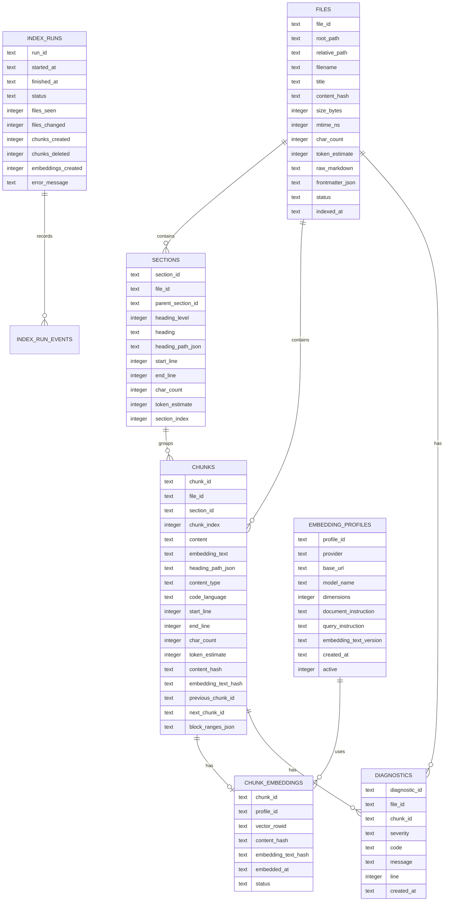
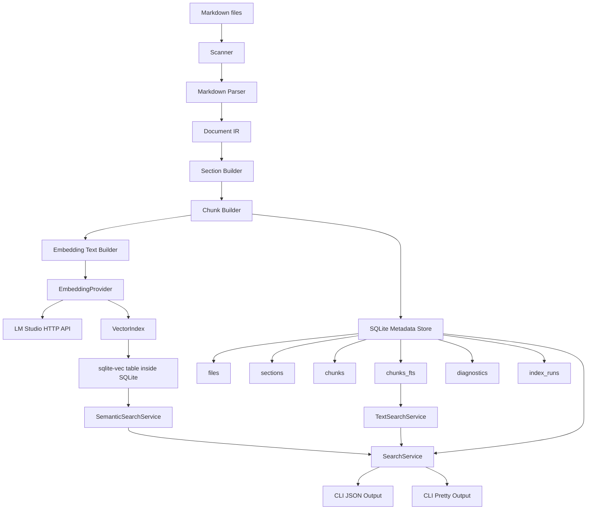
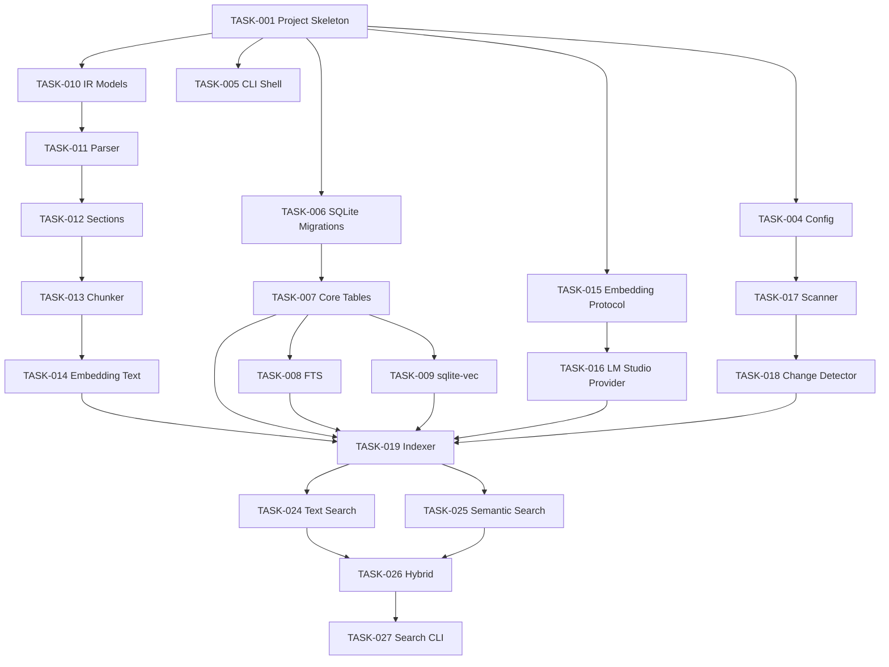

# Technical Specification: MDRack — Local Markdown Knowledge Rack for AI Agents

## Understanding 🧭

MDRack is a local command-line tool for AI coding agents. It indexes Markdown documents, splits them into meaningful structural chunks, stores document metadata and search indexes in SQLite, creates embeddings through LM Studio only, and allows agents to search, inspect, and retrieve document context through stable JSON commands.

The project must be implemented as a long-term reusable local tool, not as a throwaway script. It should be simple enough to build in stages, but structured enough that future AI coding agents can safely extend it.

> [!IMPORTANT]
> Strict project constraints:
>
> - No GUI.
> - No web server.
> - No MCP server in MVP.
> - No Qdrant.
> - No LanceDB.
> - No Chroma.
> - No external specialized vector database.
> - No local model loading from Python.
> - No `torch`, `transformers`, `sentence-transformers`, or direct embedding model execution inside Python.
> - All model calls must go through LM Studio HTTP API.
> - The tool must be command-line first.
> - The default machine-readable output must be JSON.

Selected project mode: **Mode C — Long-Term / Production-Like Local Tool**.

Reason: the project is a reusable evolving CLI product for AI agents, with persistent storage, indexing, search quality requirements, test fixtures, agent instruction files, and future expansion needs.

MVP definition:

```text
A Python CLI tool that can initialize a local Markdown knowledge store, index Markdown files, parse headings/code/Mermaid/tables, create chunks, call LM Studio for embeddings, store metadata + FTS + vectors in SQLite, run text search, semantic search, optional hybrid search, and return JSON results with provenance and fetch commands.
```

Future expansion notes:

```text
Future versions may add watch mode, reranking, MCP wrapper, safe write mode, multi-root repositories, and more advanced diagnostics. These are not part of MVP unless explicitly marked as required.
```

Explicit non-goals:

```text
The MVP will not include GUI, web API, MCP server, background daemon, authentication, cloud sync, multi-user support, plugin system, auto-editing Markdown, specialized vector databases, or Python-side model execution.
```

Assumptions:

```text
- Python 3.12 is the target runtime.
- uv is the package manager.
- SQLite is the only persistent database.
- sqlite-vec is allowed because it is an SQLite extension, not a separate specialized vector database.
- LM Studio is already installed by the user.
- The user will run LM Studio server manually before indexing or semantic search.
- The user may manage embedding model download/load/unload/switch through `mdrack model ...` commands.
- Qwen3-Embedding-0.6B is available in LM Studio.
- LM Studio may expose a different internal model key than the human-facing model name; MDRack must resolve and persist the effective key safely.
- Embedding dimension defaults to 1024.
- Markdown files may contain Russian and English text, code fences, Mermaid diagrams, tables, Obsidian-style callouts, and long lecture transcripts.
```

Unresolved non-critical questions:

```text
- Final CLI name may be `mdrack` or `mdkb`. This specification uses `mdrack`.
- Final package name may be `mdrack`.
- Exact embedding model identifier in LM Studio may differ from `qwen3-embedding-0.6b`; it must be configurable.
```

------

## 1. Project Summary 📌

MDRack is a local Markdown knowledge storage and retrieval CLI for AI agents.

It solves the problem of giving AI agents reliable access to a local Markdown knowledge base without forcing them to read entire folders manually.

The tool should allow an agent to:

1. list indexed Markdown files;
2. search by exact text;
3. search by semantic meaning;
4. run hybrid search;
5. retrieve a chunk;
6. retrieve neighboring chunks;
7. retrieve a section;
8. retrieve a full Markdown document;
9. understand where each result came from;
10. inspect document structure through headings.

The tool is not a chatbot. It is not a GUI. It is not a server. It is a command-line retrieval layer for agents.

------

## 2. Project Mode and Complexity Policy 🧱

Selected mode: **Mode C — Long-Term / Production-Like Local Tool**.

| Area                 | Decision                                           | Reason                                                       |
| -------------------- | -------------------------------------------------- | ------------------------------------------------------------ |
| Project horizon      | Long-term local product                            | The tool is expected to evolve and be maintained by AI agents. |
| Architecture depth   | Layered but modest                                 | Search, parsing, storage, embeddings, and CLI must not be mixed together. |
| Persistence          | SQLite only                                        | The project needs durable indexing, metadata, FTS, and vector storage in one local database. |
| Vector storage       | sqlite-vec only in MVP                             | It keeps vectors inside SQLite and avoids a second database. |
| Embedding execution  | LM Studio only                                     | Python must never load embedding models directly.            |
| Testing              | Required                                           | Parser, chunking, storage, embeddings adapter, search, and CLI contracts must be tested. |
| Documentation        | Required                                           | Future coding agents need stable guidance.                   |
| Agent instructions   | Required                                           | AI coding agents are expected to continue implementation.    |
| Complexity forbidden | GUI, server, MCP, plugin system, background daemon | These are unnecessary for MVP and would increase implementation risk. |

Upgrade triggers:

| Trigger                                        | Future upgrade                                             |
| ---------------------------------------------- | ---------------------------------------------------------- |
| Multiple agents need concurrent access         | Consider a daemon or server architecture later.            |
| Vector search becomes too slow on real corpora | Benchmark alternatives, but do not add them blindly.       |
| Users need editor integration                  | Add a thin wrapper or MCP after CLI contracts are stable.  |
| Agents need safe Markdown edits                | Add safe write mode with diff, backup, dry-run, and tests. |
| Need continuous indexing                       | Add watch mode after scan/index is reliable.               |

------

## 3. Goals and Non-Goals 🎯

| Category                 | Description                                                  |
| ------------------------ | ------------------------------------------------------------ |
| Product Goals            | Provide a reliable local CLI retrieval tool for Markdown knowledge bases used by AI agents. |
| Engineering Goals        | Keep one SQLite storage, stable JSON contracts, clear module boundaries, testable parser/chunker/search logic, and LM Studio-only model integration. |
| Non-Goals / Out of Scope | No GUI, no web API, no MCP server, no Qdrant, no LanceDB, no Chroma, no external vector database, no Python-side model execution, no direct `transformers`, no `sentence-transformers`, no authentication, no cloud sync, no plugin system, no auto-editing Markdown in MVP. |

------

## 4. Users and Roles 👤

### Role: Human Maintainer

| Field        | Description                                                  |
| ------------ | ------------------------------------------------------------ |
| Role         | Human developer or course creator maintaining Markdown documents. |
| Goal         | Build and maintain a searchable local Markdown knowledge base. |
| Main actions | Initialize store, scan folders, check status, inspect diagnostics, run manual search. |
| Permissions  | Can run all CLI commands.                                    |
| Restrictions | Must manually run LM Studio server before semantic indexing/search. |

### Role: AI Coding Agent

| Field        | Description                                                  |
| ------------ | ------------------------------------------------------------ |
| Role         | AI agent using CLI commands to retrieve knowledge.           |
| Goal         | Find relevant project notes, instructions, lecture fragments, code examples, and neighboring context. |
| Main actions | Run search, fetch chunks, fetch sections, fetch documents, inspect file list and metadata. |
| Permissions  | Read-only retrieval by default.                              |
| Restrictions | Must not modify Markdown documents through MDRack MVP.       |

### Role: Implementation Agent

| Field        | Description                                                  |
| ------------ | ------------------------------------------------------------ |
| Role         | AI coding agent implementing MDRack itself.                  |
| Goal         | Build tasks from this specification without inventing features. |
| Main actions | Implement tasks, run tests, update docs, report results.     |
| Permissions  | Can modify project files only during implementation mode.    |
| Restrictions | Must follow `AGENTS.md`, task order, and verification commands. |

------

## 5. MVP Scope ✅

| Priority          | Included Items                                               |
| ----------------- | ------------------------------------------------------------ |
| Must Have         | Python package with uv, CLI entrypoint, config file, SQLite schema, simple SQL migrations, Markdown scanning, Markdown parsing, Document IR, structural chunking, LM Studio embedding provider, sqlite-vec vector index, SQLite FTS5 text index, semantic search, text search, stable JSON output, retrieve chunk, retrieve neighbors, retrieve section, retrieve file, list files, list sections, status command, basic diagnostics, test fixtures, retrieval evaluation. |
| Should Have       | Hybrid search, pretty human output, Markdown asset import command for test fixtures, search result explanation fields, rebuild FTS command, rebuild embeddings command, doctor command. |
| Could Have        | Watch mode, reranker, multi-root support, richer diagnostics, Obsidian wikilink graph, tag extraction, task extraction. |
| Won’t Have in MVP | GUI, HTTP server, MCP server, Qdrant, LanceDB, Chroma, cloud sync, authentication, user accounts, plugin system, safe write mode, background daemon, direct Python model loading. |

------

## 6. Future Expansion Roadmap 🚀

| Future Feature             | Needed Now? | Architectural Impact Now                             | Defer Until                              |
| -------------------------- | ----------- | ---------------------------------------------------- | ---------------------------------------- |
| Watch mode                 | No          | Keep scanning logic idempotent and reusable.         | After stable `scan --changed`.           |
| MCP wrapper                | No          | Keep CLI JSON contracts stable.                      | After CLI v1 is reliable.                |
| Safe write mode            | No          | Store provenance and original line ranges now.       | After read-only retrieval is stable.     |
| Reranker                   | No          | Keep search service modular.                         | After retrieval eval shows need.         |
| Multi-root stores          | No          | Do not hard-code root globally; pass through config. | After single-root works.                 |
| Alternative vector backend | No          | Use `VectorIndex` interface.                         | Only if sqlite-vec becomes insufficient. |
| Web UI                     | No          | None. Do not prepare now.                            | Not planned for MVP.                     |
| Agent task automation      | No          | Keep `AGENTS.md` and docs clean.                     | Later if development grows.              |
| Search quality dashboard   | No          | Store eval queries in YAML.                          | After core eval exists.                  |

------

## 7. User Scenarios 🧭

### UC-001: Initialize a Knowledge Store

| Field            | Description                                                  |
| ---------------- | ------------------------------------------------------------ |
| Actor            | Human Maintainer                                             |
| Preconditions    | A project folder exists.                                     |
| Main Flow        | 1. User runs `mdrack init --root .`. 2. Tool creates `.mdrack/`. 3. Tool creates `config.toml`. 4. Tool creates SQLite database and initial schema. 5. Tool prints JSON success result. |
| Alternative Flow | If `.mdrack/` already exists, tool returns a clear message and does not destroy data. |
| Error States     | Root path missing, permission denied, database cannot be created. |
| Success Criteria | `.mdrack/config.toml` and `.mdrack/index.sqlite` exist.      |

### UC-002: Scan Markdown Files

| Field            | Description                                                  |
| ---------------- | ------------------------------------------------------------ |
| Actor            | Human Maintainer or AI Agent                                 |
| Preconditions    | Store initialized. Markdown files exist.                     |
| Main Flow        | 1. User runs `mdrack scan`. 2. Tool finds files matching include/exclude rules. 3. Tool hashes file content. 4. Tool parses changed files. 5. Tool creates sections and chunks. 6. Tool creates embedding texts. 7. Tool calls LM Studio for embeddings. 8. Tool stores metadata, FTS rows, and vectors. 9. Tool returns JSON summary. |
| Alternative Flow | `mdrack scan --changed` only processes changed files.        |
| Error States     | LM Studio not running, invalid Markdown, SQLite error, embedding dimension mismatch. |
| Success Criteria | Indexed files appear in `mdrack files list`; chunks are searchable. |

### UC-003: Text Search

| Field            | Description                                                  |
| ---------------- | ------------------------------------------------------------ |
| Actor            | AI Agent                                                     |
| Preconditions    | Store has indexed chunks.                                    |
| Main Flow        | 1. Agent runs `mdrack search "OperationalError no such table" --mode text --json`. 2. Tool searches FTS5. 3. Tool returns ranked chunks with provenance. |
| Alternative Flow | If no results, return empty `results` list with no crash.    |
| Error States     | Invalid query syntax, database missing.                      |
| Success Criteria | Exact technical terms can be found.                          |

### UC-004: Semantic Search

| Field            | Description                                                  |
| ---------------- | ------------------------------------------------------------ |
| Actor            | AI Agent                                                     |
| Preconditions    | Store has embeddings. LM Studio is running.                  |
| Main Flow        | 1. Agent runs `mdrack search "how does the silence filter handle long recordings" --mode semantic --json`. 2. Tool embeds query through LM Studio. 3. Tool searches sqlite-vec. 4. Tool returns ranked chunks with provenance. |
| Alternative Flow | If LM Studio is unavailable, return a structured error suggesting text search. |
| Error States     | LM Studio network failure, model unavailable, dimension mismatch. |
| Success Criteria | Relevant chunks are returned even when query words differ from document words. |

### UC-005: Hybrid Search

| Field            | Description                                                  |
| ---------------- | ------------------------------------------------------------ |
| Actor            | AI Agent                                                     |
| Preconditions    | Text and semantic indexes exist.                             |
| Main Flow        | 1. Agent runs `mdrack search "read_file_chunks соседние части" --mode hybrid --json`. 2. Tool gets semantic candidates. 3. Tool gets FTS candidates. 4. Tool merges results using stable rank fusion. 5. Tool returns unified ranked results. |
| Alternative Flow | If LM Studio is down, hybrid returns text-only fallback only if `--allow-fallback` is provided. |
| Error States     | One search channel fails.                                    |
| Success Criteria | Hybrid results include exact matches and semantic matches.   |

### UC-006: Read Neighboring Chunks

| Field            | Description                                                  |
| ---------------- | ------------------------------------------------------------ |
| Actor            | AI Agent                                                     |
| Preconditions    | Search result contains `chunk_id`.                           |
| Main Flow        | 1. Agent runs `mdrack read chunk <chunk_id> --context neighbors --json`. 2. Tool returns previous, current, and next chunks from the same document. |
| Alternative Flow | If current chunk is first or last, missing neighbor is omitted and listed in metadata. |
| Error States     | Unknown chunk ID.                                            |
| Success Criteria | Agent receives enough context to understand the found fragment. |

### UC-007: Read Section

| Field            | Description                                                  |
| ---------------- | ------------------------------------------------------------ |
| Actor            | AI Agent                                                     |
| Preconditions    | Search result contains `section_id`.                         |
| Main Flow        | 1. Agent runs `mdrack read section <section_id> --json`. 2. Tool returns section heading, line range, chunks, and text. |
| Alternative Flow | If section is too large and no limit provided, tool returns warning with suggested command. |
| Error States     | Unknown section ID.                                          |
| Success Criteria | Agent can read a complete logical section.                   |

### UC-008: Read Full Document

| Field            | Description                                                  |
| ---------------- | ------------------------------------------------------------ |
| Actor            | AI Agent                                                     |
| Preconditions    | Agent knows `file_id`.                                       |
| Main Flow        | 1. Agent runs `mdrack read file <file_id> --json`. 2. Tool returns full Markdown snapshot and metadata. |
| Alternative Flow | If document is very large, tool supports `--max-chars`.      |
| Error States     | Unknown file ID.                                             |
| Success Criteria | Agent can retrieve the whole indexed document.               |

------

## 8. Functional Requirements 📋

| ID     | Requirement                                                 | Priority | Acceptance Criteria                                          |
| ------ | ----------------------------------------------------------- | -------- | ------------------------------------------------------------ |
| FR-001 | The tool must provide a CLI executable named `mdrack`.      | Must     | `uv run mdrack --help` prints help and exits with code 0.    |
| FR-002 | The tool must initialize a local store.                     | Must     | `mdrack init --root <path>` creates `.mdrack/config.toml` and `.mdrack/index.sqlite`. |
| FR-003 | The tool must use SQLite as the only persistent database.   | Must     | No Qdrant, LanceDB, Chroma, PostgreSQL, or external vector database is installed or required. |
| FR-004 | The tool must store vector embeddings through sqlite-vec.   | Must     | A vector search table exists inside SQLite and semantic search uses it. |
| FR-005 | The tool must not load embedding models directly in Python. | Must     | Project dependencies must not include `torch`, `transformers`, or `sentence-transformers`. |
| FR-006 | The tool must call LM Studio for embeddings.                | Must     | Embedding provider sends HTTP requests to configured LM Studio OpenAI-compatible endpoint. |
| FR-007 | The tool must scan Markdown files.                          | Must     | Files matching include patterns are indexed; excluded folders are ignored. |
| FR-008 | The tool must parse Markdown structurally.                  | Must     | Parser extracts headings, code fences, Mermaid blocks, tables, lists, blockquotes, and line ranges where possible. |
| FR-009 | The tool must build Document IR before chunking.            | Must     | Parser output is converted into internal entities, not passed as raw parser tokens across the app. |
| FR-010 | The tool must build sections from headings.                 | Must     | `mdrack sections <file_id>` returns heading tree with line ranges. |
| FR-011 | The tool must build stable chunks.                          | Must     | Each chunk has `chunk_id`, `file_id`, `section_id`, `chunk_index`, line range, content hash, and text. |
| FR-012 | The chunker must preserve code fences.                      | Must     | Tests prove code blocks are not split unless they exceed the hard limit. |
| FR-013 | The chunker must preserve Mermaid fences.                   | Must     | Tests prove Mermaid blocks are detected as `content_type = "mermaid"`. |
| FR-014 | The tool must support FTS text search.                      | Must     | `mdrack search "query" --mode text --json` returns FTS results. |
| FR-015 | The tool must support semantic search.                      | Must     | `mdrack search "query" --mode semantic --json` returns vector results. |
| FR-016 | The tool should support hybrid search.                      | Should   | `mdrack search "query" --mode hybrid --json` returns merged FTS + vector results. |
| FR-017 | Search results must include provenance.                     | Must     | Each result includes `file_id`, `chunk_id`, `section_id`, `path`, `heading_path`, `start_line`, `end_line`, and fetch commands. |
| FR-018 | The tool must read a chunk by ID.                           | Must     | `mdrack read chunk <chunk_id> --json` returns exact chunk content. |
| FR-019 | The tool must read neighboring chunks.                      | Must     | `mdrack read chunk <chunk_id> --context neighbors --json` returns previous/current/next chunks. |
| FR-020 | The tool must read a section by ID.                         | Must     | `mdrack read section <section_id> --json` returns section text and metadata. |
| FR-021 | The tool must read a file by ID.                            | Must     | `mdrack read file <file_id> --json` returns full indexed Markdown snapshot. |
| FR-022 | The tool must list indexed files.                           | Must     | `mdrack files list --json` returns paginated file records.   |
| FR-023 | The tool must return JSON by default for agent commands.    | Must     | CLI output is valid JSON unless `--pretty` is explicitly used. |
| FR-024 | The tool must support human-readable output.                | Should   | `--pretty` displays Rich tables for selected commands.       |
| FR-025 | The tool must support idempotent changed scans.             | Must     | Running `mdrack scan --changed` twice without edits does not duplicate files/chunks/vectors. |
| FR-026 | The tool must provide diagnostics.                          | Should   | `mdrack doctor --json` reports missing vectors, missing FTS rows, stale embeddings, and schema version. |
| FR-027 | The tool must support retrieval evaluation.                 | Must     | `mdrack eval retrieval --queries tests/retrieval_eval/queries.yaml` returns measurable results. |
| FR-028 | The tool must handle LM Studio failure gracefully.          | Must     | Semantic search returns structured error when LM Studio is unavailable. |
| FR-029 | The tool must include agent instruction files.              | Must     | `AGENTS.md` and docs under `docs/agent-instructions/` exist. |
| FR-030 | The tool must include tests for real Markdown assets.       | Must     | User-provided Markdown assets can be placed into fixture folders and used by tests/eval. |

------

## 9. Non-Functional Requirements 🧪

| ID      | Requirement                      | Target / Constraint                                          |
| ------- | -------------------------------- | ------------------------------------------------------------ |
| NFR-001 | Simplicity                       | One persistent database: SQLite. No separate vector database. |
| NFR-002 | Local-first                      | The tool runs locally and does not require cloud services.   |
| NFR-003 | LM Studio-only models            | All embeddings are generated through LM Studio HTTP API.     |
| NFR-004 | Machine-readable output          | JSON must be stable and valid for AI agents.                 |
| NFR-005 | Maintainability                  | Parser, chunker, storage, embeddings, search, and CLI must live in separate modules. |
| NFR-006 | Testability                      | Core logic must be testable without LM Studio where possible by using fake embedding provider. |
| NFR-007 | Search quality                   | Retrieval eval must exist before search tuning is considered complete. |
| NFR-008 | Privacy                          | Markdown content must not be sent anywhere except configured local LM Studio endpoint. |
| NFR-009 | Error handling                   | Expected failures must return structured JSON errors.        |
| NFR-010 | Rebuildability                   | FTS and vector indexes must be rebuildable from SQLite metadata and Markdown snapshots. |
| NFR-011 | Performance MVP target           | Search on 10,000 chunks should complete in a reasonable interactive time on a normal desktop. Exact benchmark target must be measured after real assets are added. |
| NFR-012 | Cross-platform target            | Windows, macOS, and Linux should be supported if dependencies install correctly. |
| NFR-013 | No hidden destructive operations | `scan` may update index data but must not modify source Markdown files. |
| NFR-014 | Stable contracts                 | JSON schemas must be covered by snapshot tests.              |

------

## 10. Data Model 🗄️

### Mermaid ER Diagram



### Entity: File

| Field              | Type    | Required | Default       | Validation         | Notes                                  |
| ------------------ | ------- | -------- | ------------- | ------------------ | -------------------------------------- |
| `file_id`          | text    | yes      | generated     | stable ID          | Prefer hash-based or UUID-like string. |
| `root_path`        | text    | yes      | none          | existing root      | Root folder at scan time.              |
| `relative_path`    | text    | yes      | none          | unique             | Path relative to root.                 |
| `filename`         | text    | yes      | none          | not empty          | Display filename.                      |
| `title`            | text    | no       | filename stem | string             | H1 or filename.                        |
| `content_hash`     | text    | yes      | none          | SHA-256            | Used for change detection.             |
| `size_bytes`       | integer | yes      | 0             | >= 0               | File size.                             |
| `mtime_ns`         | integer | yes      | 0             | >= 0               | Modified time.                         |
| `char_count`       | integer | yes      | 0             | >= 0               | Raw content length.                    |
| `token_estimate`   | integer | no       | null          | >= 0               | Approximate tokens.                    |
| `raw_markdown`     | text    | yes      | none          | string             | Indexed snapshot.                      |
| `frontmatter_json` | text    | no       | null          | valid JSON or null | Parsed frontmatter.                    |
| `status`           | text    | yes      | `indexed`     | enum               | `indexed`, `deleted`, `error`.         |
| `indexed_at`       | text    | yes      | now           | ISO datetime       | Last successful indexing.              |

Unique constraints:

```text
files.relative_path must be unique per store.
```

### Entity: Section

| Field               | Type    | Required | Default   | Validation       | Notes                   |
| ------------------- | ------- | -------- | --------- | ---------------- | ----------------------- |
| `section_id`        | text    | yes      | generated | stable ID        | Section identity.       |
| `file_id`           | text    | yes      | none      | FK               | Parent file.            |
| `parent_section_id` | text    | no       | null      | FK or null       | Heading tree parent.    |
| `heading_level`     | integer | yes      | 1         | 1..6             | Markdown heading level. |
| `heading`           | text    | yes      | none      | not empty        | Heading text.           |
| `heading_path_json` | text    | yes      | `[]`      | valid JSON array | Breadcrumb.             |
| `start_line`        | integer | yes      | 1         | >= 1             | Source line.            |
| `end_line`          | integer | yes      | start     | >= start         | Source line.            |
| `char_count`        | integer | yes      | 0         | >= 0             | Section text length.    |
| `token_estimate`    | integer | no       | null      | >= 0             | Approximate tokens.     |
| `section_index`     | integer | yes      | 0         | >= 0             | Order in document.      |

### Entity: Chunk

| Field                 | Type    | Required | Default   | Validation       | Notes                                                 |
| --------------------- | ------- | -------- | --------- | ---------------- | ----------------------------------------------------- |
| `chunk_id`            | text    | yes      | generated | stable ID        | Primary chunk ID.                                     |
| `file_id`             | text    | yes      | none      | FK               | Parent file.                                          |
| `section_id`          | text    | no       | null      | FK               | Parent section.                                       |
| `chunk_index`         | integer | yes      | 0         | >= 0             | Order in file.                                        |
| `content`             | text    | yes      | none      | not empty        | Display text.                                         |
| `embedding_text`      | text    | yes      | none      | not empty        | Text sent to LM Studio.                               |
| `heading_path_json`   | text    | yes      | `[]`      | valid JSON array | Breadcrumb.                                           |
| `content_type`        | text    | yes      | `text`    | enum             | `text`, `code`, `mermaid`, `table`, `mixed`, `quote`. |
| `code_language`       | text    | no       | null      | string           | For fenced code.                                      |
| `start_line`          | integer | yes      | 1         | >= 1             | Source line.                                          |
| `end_line`            | integer | yes      | start     | >= start         | Source line.                                          |
| `char_count`          | integer | yes      | 0         | >= 0             | Length.                                               |
| `token_estimate`      | integer | no       | null      | >= 0             | Approximate tokens.                                   |
| `content_hash`        | text    | yes      | none      | SHA-256          | Chunk content hash.                                   |
| `embedding_text_hash` | text    | yes      | none      | SHA-256          | Embedding input hash.                                 |
| `previous_chunk_id`   | text    | no       | null      | FK or null       | Previous chunk in same file.                          |
| `next_chunk_id`       | text    | no       | null      | FK or null       | Next chunk in same file.                              |
| `block_ranges_json`   | text    | no       | null      | valid JSON       | Debug metadata from Document IR.                      |

### Entity: EmbeddingProfile

| Field                    | Type    | Required | Default                    | Validation   | Notes                                 |
| ------------------------ | ------- | -------- | -------------------------- | ------------ | ------------------------------------- |
| `profile_id`             | text    | yes      | generated                  | stable ID    | Profile identity.                     |
| `provider`               | text    | yes      | `lmstudio`                 | exact enum   | MVP supports only `lmstudio`.         |
| `base_url`               | text    | yes      | `http://localhost:1234/v1` | URL          | LM Studio OpenAI-compatible base URL. |
| `model_name`             | text    | yes      | config value               | not empty    | LM Studio model ID.                   |
| `dimensions`             | integer | yes      | 1024                       | > 0          | Vector dimension.                     |
| `document_instruction`   | text    | no       | null                       | string       | Optional document instruction.        |
| `query_instruction`      | text    | no       | default                    | string       | Query-side instruction.               |
| `embedding_text_version` | text    | yes      | `v1`                       | not empty    | Changes require re-embedding.         |
| `created_at`             | text    | yes      | now                        | ISO datetime | Creation time.                        |
| `active`                 | integer | yes      | 1                          | 0 or 1       | Active profile flag.                  |

### Entity: ChunkEmbedding

| Field                 | Type | Required | Default | Validation   | Notes                       |
| --------------------- | ---- | -------- | ------- | ------------ | --------------------------- |
| `chunk_id`            | text | yes      | none    | FK           | Chunk.                      |
| `profile_id`          | text | yes      | none    | FK           | Embedding profile.          |
| `vector_rowid`        | text | yes      | none    | not empty    | Row ID in sqlite-vec table. |
| `content_hash`        | text | yes      | none    | SHA-256      | Source hash at embed time.  |
| `embedding_text_hash` | text | yes      | none    | SHA-256      | Input hash at embed time.   |
| `embedded_at`         | text | yes      | now     | ISO datetime | Embedding time.             |
| `status`              | text | yes      | `ready` | enum         | `ready`, `stale`, `error`.  |

### Entity: Diagnostic

| Field           | Type    | Required | Default   | Validation   | Notes                       |
| --------------- | ------- | -------- | --------- | ------------ | --------------------------- |
| `diagnostic_id` | text    | yes      | generated | stable ID    | Diagnostic ID.              |
| `file_id`       | text    | no       | null      | FK or null   | Related file.               |
| `chunk_id`      | text    | no       | null      | FK or null   | Related chunk.              |
| `severity`      | text    | yes      | `info`    | enum         | `info`, `warning`, `error`. |
| `code`          | text    | yes      | none      | not empty    | Machine-readable code.      |
| `message`       | text    | yes      | none      | not empty    | Human-readable message.     |
| `line`          | integer | no       | null      | >= 1         | Related line.               |
| `created_at`    | text    | yes      | now       | ISO datetime | Time.                       |

### FTS Table

The FTS table stores searchable chunk text.

Conceptual schema:

```sql
CREATE VIRTUAL TABLE chunks_fts USING fts5(
  chunk_id UNINDEXED,
  file_id UNINDEXED,
  section_id UNINDEXED,
  title,
  heading_path,
  content,
  tokenize = 'unicode61'
);
```

Rules:

```text
- FTS table duplicates searchable text.
- Do not use external-content FTS in MVP.
- Rebuild command must be able to recreate FTS from `chunks`.
```

### Vector Table

The vector table stores embeddings through sqlite-vec.

Conceptual schema:

```sql
CREATE VIRTUAL TABLE vec_chunks USING vec0(
  embedding float[1024]
);
```

Rules:

```text
- Vector dimension must match active embedding profile.
- If dimension changes, vectors must be rebuilt.
- sqlite-vec access must be isolated behind `VectorIndex`.
```

------

## 11. API / Backend Contracts 🚫

Backend API is not required for MVP because MDRack is a local CLI tool.

There must be no HTTP API, no web server, no MCP server, and no background daemon in MVP.

Instead, MDRack exposes command-line contracts.

------

## 12. UI / Frontend Specification 🚫

No graphical UI is required.

The interface is CLI-only.

Output modes:

| Mode   | Purpose                              |
| ------ | ------------------------------------ |
| JSON   | Default for agents.                  |
| Pretty | Optional human-readable Rich output. |

Rules:

```text
- Agent-facing commands must return JSON by default.
- Pretty output must never replace JSON contracts.
- Pretty output may be added only after JSON output works.
```

------

## 13. Architecture 🏗️

### Architecture Principles

```text
- CLI is only an interface layer.
- Domain logic must not import Typer.
- Parser must not write to SQLite.
- Chunker must not call LM Studio.
- Embedding provider must not know about Markdown parsing.
- Search service must not know CLI formatting.
- sqlite-vec must be hidden behind `VectorIndex`.
- LM Studio HTTP details must be hidden behind `EmbeddingProvider`.
- JSON output schemas must be stable and tested.
```

### Mermaid Architecture Diagram



### Layer Responsibilities

| Layer       | Modules           | Responsibility                                               |
| ----------- | ----------------- | ------------------------------------------------------------ |
| CLI         | `cli/`            | Parse arguments, call services, print JSON/pretty output.    |
| Config      | `config/`         | Load config file and environment overrides.                  |
| Domain      | `domain/`         | Shared entities, protocols, result types, errors.            |
| Markdown    | `markdown/`       | Parse Markdown, build Document IR, sections, chunks, embedding text. |
| Embeddings  | `embeddings/`     | Call LM Studio only. Provide fake provider for tests.        |
| Storage     | `storage/sqlite/` | SQLite connection, migrations, repositories, FTS, vector adapter. |
| Indexing    | `indexing/`       | Scan files, detect changes, orchestrate parse/chunk/embed/store. |
| Search      | `search/`         | Text search, semantic search, hybrid search, ranking.        |
| Output      | `output/`         | JSON schemas, error envelopes, pretty formatting.            |
| Diagnostics | `diagnostics/`    | Doctor checks, stale index detection, schema health.         |
| Evaluation  | `eval/`           | Retrieval quality checks using real Markdown assets.         |

------

## 14. File Structure 📁

```text
mdrack/
  README.md
  AGENTS.md
  pyproject.toml
  uv.lock

  docs/
    architecture.md
    cli-contracts.md
    retrieval-design.md
    storage-design.md
    markdown-chunking.md
    lmstudio-setup.md
    development-plan.md
    agent-instructions/
      coding-rules.md
      testing-rules.md
      task-workflow.md
      planning-workflow.md

  src/
    mdrack/
      __init__.py
      __main__.py

      cli/
        __init__.py
        app.py
        commands/
          init.py
          scan.py
          search.py
          read.py
          files.py
          sections.py
          status.py
          doctor.py
          rebuild.py
          eval.py

      config/
        __init__.py
        settings.py
        defaults.py
        discovery.py

      domain/
        __init__.py
        ids.py
        models.py
        ports.py
        errors.py
        result.py

      markdown/
        __init__.py
        parser.py
        ir.py
        frontmatter.py
        section_builder.py
        chunk_builder.py
        embedding_text.py
        token_estimator.py

      embeddings/
        __init__.py
        provider.py
        lmstudio.py
        fake.py
        instructions.py
        hashing.py

      storage/
        __init__.py
        sqlite/
          __init__.py
          connection.py
          migrations.py
          schema.py
          repositories.py
          fts.py
          vector.py
          transactions.py
          migrations/
            0001_initial.sql
            0002_fts.sql
            0003_vec.sql

      indexing/
        __init__.py
        scanner.py
        change_detector.py
        indexer.py
        run_log.py

      search/
        __init__.py
        service.py
        text.py
        semantic.py
        hybrid.py
        scoring.py
        filters.py

      diagnostics/
        __init__.py
        doctor.py
        stale.py
        integrity.py

      output/
        __init__.py
        json.py
        pretty.py
        schemas.py
        errors.py

      eval/
        __init__.py
        retrieval.py
        metrics.py
        queries.py

  tests/
    fixtures/
      markdown_basic/
        simple.md
        no_headings.md
        nested_headings.md
      markdown_rich/
        code_blocks.md
        mermaid.md
        tables.md
        callouts.md
      markdown_long/
        long_section.md
        transcript_like.md
      markdown_real/
        README.md
        user_assets_here.md

    retrieval_eval/
      queries.yaml

    unit/
      test_config.py
      test_ids.py
      test_markdown_parser.py
      test_section_builder.py
      test_chunk_builder.py
      test_embedding_text.py
      test_token_estimator.py
      test_hashing.py
      test_hybrid_scoring.py

    integration/
      test_sqlite_migrations.py
      test_repositories.py
      test_fts_index.py
      test_vector_index_fake.py
      test_indexer_fake_embeddings.py
      test_text_search.py
      test_semantic_search_fake.py
      test_read_context.py

    cli/
      test_cli_init.py
      test_cli_scan.py
      test_cli_search_text.py
      test_cli_search_semantic_fake.py
      test_cli_read.py
      test_cli_status.py
      test_cli_doctor.py
      test_cli_json_contracts.py

    e2e/
      test_smoke_fake_embeddings.py

  scripts/
    check_no_forbidden_deps.py
    inspect_db.py
```

### Important Files and Purposes

| Path                                  | Purpose                                                      |
| ------------------------------------- | ------------------------------------------------------------ |
| `AGENTS.md`                           | Root rules for implementation agents.                        |
| `docs/architecture.md`                | Explains architecture and module boundaries.                 |
| `docs/cli-contracts.md`               | Defines stable CLI JSON contracts.                           |
| `docs/retrieval-design.md`            | Explains text, semantic, and hybrid search.                  |
| `docs/storage-design.md`              | Explains SQLite schema, FTS, and sqlite-vec.                 |
| `docs/markdown-chunking.md`           | Explains Markdown parsing and chunking rules.                |
| `docs/lmstudio-setup.md`              | Explains how to run LM Studio server and configure model.    |
| `src/mdrack/domain/ports.py`          | Protocols for parser, embedding provider, vector index, repositories. |
| `src/mdrack/markdown/ir.py`           | Internal document representation.                            |
| `src/mdrack/embeddings/lmstudio.py`   | Only allowed real embedding provider.                        |
| `src/mdrack/storage/sqlite/vector.py` | sqlite-vec adapter.                                          |
| `src/mdrack/search/service.py`        | Main search service.                                         |
| `tests/fixtures/markdown_real/`       | User-provided real Markdown assets.                          |
| `tests/retrieval_eval/queries.yaml`   | Expected retrieval queries and targets.                      |
| `scripts/check_no_forbidden_deps.py`  | Verifies forbidden ML dependencies are absent.               |

------

## 15. Agent Instruction Files 🤖

### AGENTS.md

Purpose:

```text
Root instruction file for AI coding agents implementing or modifying MDRack.
```

Recommended content:

```text
# AGENTS.md

## Project Overview

MDRack is a local command-line Markdown knowledge rack for AI agents.

It indexes Markdown files, stores metadata, FTS, and vectors in SQLite, creates embeddings through LM Studio only, and exposes JSON-first CLI commands for search and retrieval.

## Required Reading

Before making changes, read:

- docs/architecture.md
- docs/cli-contracts.md
- docs/retrieval-design.md
- docs/storage-design.md
- docs/markdown-chunking.md
- docs/lmstudio-setup.md
- docs/agent-instructions/coding-rules.md
- docs/agent-instructions/testing-rules.md
- docs/agent-instructions/task-workflow.md

## Strict Rules

- Do not add GUI.
- Do not add web server.
- Do not add MCP server.
- Do not add Qdrant, LanceDB, Chroma, or any specialized vector database.
- Do not add `torch`, `transformers`, or `sentence-transformers`.
- Do not run embedding models from Python.
- Use LM Studio HTTP API for embeddings.
- Keep SQLite as the only persistent database.
- Keep changes small and task-focused.
- Do not modify source Markdown files during indexing.
- Do not delete files unless explicitly required by the task.
- Run verification commands after each task.
- Update documentation when behavior or architecture changes.

## Verification

Minimum verification before final report:

- uv run ruff check .
- uv run mypy src
- uv run pytest
- uv run python scripts/check_no_forbidden_deps.py

## Final Report Format

At the end of each implementation task, report:

1. Completed task ID
2. Changed files
3. Commands run
4. Test results
5. Known limitations
6. Any spec item not implemented
```

### docs/agent-instructions/coding-rules.md

Must define:

```text
- Use Python 3.12.
- Use type hints.
- Prefer dataclasses or Pydantic models for structured data.
- Do not mix CLI and business logic.
- Do not put SQL queries outside storage modules.
- Do not call LM Studio outside embeddings modules.
- Do not access sqlite-vec outside storage/sqlite/vector.py.
- Do not use global mutable state.
- Return structured domain errors and convert them to JSON at CLI boundary.
- Keep functions small and deterministic where possible.
```

### docs/agent-instructions/testing-rules.md

Must define:

```text
- Unit tests are required for parser, chunker, embedding text builder, hashing, scoring.
- Integration tests are required for SQLite migrations, repositories, FTS, vector adapter.
- CLI tests are required for JSON contracts.
- Fake embedding provider must be used for most tests.
- Real LM Studio tests must be opt-in and marked separately.
- User real Markdown assets must be used in retrieval evaluation when available.
- Every bug fix must include a regression test.
```

### docs/agent-instructions/task-workflow.md

Must define:

```text
- Read task before coding.
- Identify files to change.
- Do not expand scope.
- Implement smallest working change.
- Run task verification.
- If verification fails, fix or report blocker.
- Update docs only when behavior changes.
- Stop and ask if task conflicts with strict constraints.
```

------

## 16. Command-Line Contracts 🧰

### Global Options

| Option          | Description                                                  |
| --------------- | ------------------------------------------------------------ |
| `--root PATH`   | Root folder of Markdown knowledge base. Defaults to current directory or discovered config. |
| `--config PATH` | Explicit config path.                                        |
| `--db PATH`     | Explicit SQLite database path. Mostly for tests.             |
| `--json`        | Force JSON output.                                           |
| `--pretty`      | Human-readable output.                                       |
| `--verbose`     | Extra diagnostic details.                                    |
| `--no-color`    | Disable terminal colors.                                     |

### Command: init

```bash
mdrack init --root .
```

JSON success:

```json
{
  "ok": true,
  "command": "init",
  "store": {
    "root": ".",
    "index_dir": ".mdrack",
    "config_path": ".mdrack/config.toml",
    "db_path": ".mdrack/index.sqlite"
  },
  "schema": {
    "version": "0003"
  }
}
```

### Command: scan

```bash
mdrack scan --root .
mdrack scan --changed --root .
```

JSON success:

```json
{
  "ok": true,
  "command": "scan",
  "run_id": "run_...",
  "summary": {
    "files_seen": 25,
    "files_changed": 3,
    "files_skipped": 22,
    "files_failed": 0,
    "sections_created": 34,
    "chunks_created": 91,
    "chunks_deleted": 12,
    "embeddings_created": 91,
    "fts_rows_updated": 91
  },
  "lmstudio": {
    "base_url": "http://localhost:1234/v1",
    "model": "qwen3-embedding-0.6b",
    "dimensions": 1024
  }
}
```

### Command: search

```bash
mdrack search "how to get neighboring chunks" --mode semantic --limit 8 --json
mdrack search "OperationalError no such table" --mode text --limit 8 --json
mdrack search "read_file_chunks neighboring context" --mode hybrid --limit 8 --json
```

JSON success:

```json
{
  "ok": true,
  "command": "search",
  "query": "how to get neighboring chunks",
  "mode": "semantic",
  "limit": 8,
  "results": [
    {
      "rank": 1,
      "score": 0.8421,
      "score_parts": {
        "semantic": 0.8421,
        "text": null,
        "hybrid": null
      },
      "file_id": "file_...",
      "section_id": "sec_...",
      "chunk_id": "chk_...",
      "path": "docs/retrieval-design.md",
      "title": "Retrieval Design",
      "heading_path": ["Retrieval", "Neighbor Chunks"],
      "start_line": 80,
      "end_line": 124,
      "content_type": "text",
      "snippet": "The agent can request neighboring chunks...",
      "fetch": {
        "chunk": "mdrack read chunk chk_... --json",
        "neighbors": "mdrack read chunk chk_... --context neighbors --json",
        "section": "mdrack read section sec_... --json",
        "file": "mdrack read file file_... --json"
      }
    }
  ],
  "warnings": []
}
```

JSON error:

```json
{
  "ok": false,
  "command": "search",
  "error": {
    "code": "LMSTUDIO_UNAVAILABLE",
    "message": "Cannot connect to LM Studio at http://localhost:1234/v1.",
    "hint": "Start LM Studio server or use --mode text."
  }
}
```

### Command: read chunk

```bash
mdrack read chunk chk_123 --json
mdrack read chunk chk_123 --context neighbors --json
```

JSON success:

```json
{
  "ok": true,
  "command": "read chunk",
  "context": "neighbors",
  "file": {
    "file_id": "file_...",
    "path": "docs/example.md",
    "title": "Example"
  },
  "chunks": [
    {
      "role": "previous",
      "chunk_id": "chk_122",
      "chunk_index": 4,
      "start_line": 40,
      "end_line": 60,
      "content": "..."
    },
    {
      "role": "current",
      "chunk_id": "chk_123",
      "chunk_index": 5,
      "start_line": 61,
      "end_line": 90,
      "content": "..."
    },
    {
      "role": "next",
      "chunk_id": "chk_124",
      "chunk_index": 6,
      "start_line": 91,
      "end_line": 120,
      "content": "..."
    }
  ]
}
```

### Command: read section

```bash
mdrack read section sec_123 --json
```

JSON success:

```json
{
  "ok": true,
  "command": "read section",
  "section": {
    "section_id": "sec_123",
    "file_id": "file_...",
    "heading": "Retrieval",
    "heading_path": ["Architecture", "Retrieval"],
    "start_line": 40,
    "end_line": 140
  },
  "chunks": [
    {
      "chunk_id": "chk_...",
      "chunk_index": 1,
      "start_line": 42,
      "end_line": 80,
      "content": "..."
    }
  ],
  "content": "..."
}
```

### Command: read file

```bash
mdrack read file file_123 --json
```

JSON success:

```json
{
  "ok": true,
  "command": "read file",
  "file": {
    "file_id": "file_123",
    "path": "docs/example.md",
    "title": "Example",
    "content_hash": "sha256:...",
    "char_count": 12000
  },
  "content": "# Example\n\n..."
}
```

### Command: files list

```bash
mdrack files list --page 0 --page-size 20 --json
```

JSON success:

```json
{
  "ok": true,
  "command": "files list",
  "page": 0,
  "page_size": 20,
  "total": 42,
  "files": [
    {
      "file_id": "file_...",
      "path": "docs/example.md",
      "title": "Example",
      "total_sections": 8,
      "total_chunks": 23,
      "char_count": 12000,
      "indexed_at": "2026-06-16T12:00:00"
    }
  ]
}
```

### Command: sections

```bash
mdrack sections file_123 --json
```

JSON success:

```json
{
  "ok": true,
  "command": "sections",
  "file_id": "file_123",
  "sections": [
    {
      "section_id": "sec_1",
      "heading_level": 1,
      "heading": "Architecture",
      "heading_path": ["Architecture"],
      "start_line": 1,
      "end_line": 220,
      "children": []
    }
  ]
}
```

### Command: status

```bash
mdrack status --json
```

### Command: doctor

```bash
mdrack doctor --json
```

### Command: rebuild

```bash
mdrack rebuild fts --json
mdrack rebuild embeddings --json
```

### Command: eval retrieval

```bash
mdrack eval retrieval --queries tests/retrieval_eval/queries.yaml --json
```

------

## 17. Configuration ⚙️

Default config path:

```text
.mdrack/config.toml
```

Example:

```toml
[root]
path = "."

[markdown]
include = ["**/*.md"]
exclude = [".git/**", ".mdrack/**", ".venv/**", "node_modules/**"]
encoding = "utf-8"

[chunking]
heading_levels = [2, 3, 4]
soft_min_chars = 900
target_chars = 3200
soft_max_chars = 5000
hard_max_chars = 8000
overlap_chars = 250
preserve_code_blocks = true
preserve_mermaid_blocks = true
preserve_tables = true

[embedding]
provider = "lmstudio"
base_url = "http://localhost:1234/v1"
model = "qwen3-embedding-0.6b"
dimensions = 1024
batch_size = 16
timeout_seconds = 120
embedding_text_version = "v1"
query_instruction = "Given a question from an AI coding agent, retrieve relevant Markdown passages, project instructions, architecture notes, workflow rules, implementation details, and verification criteria."

[search]
default_mode = "hybrid"
default_limit = 8
semantic_candidates = 30
text_candidates = 30
rrf_k = 60
semantic_weight = 0.70
text_weight = 0.30

[output]
default_format = "json"
```

Environment overrides:

```text
MDRACK_ROOT
MDRACK_DB_PATH
MDRACK_LMSTUDIO_BASE_URL
MDRACK_LMSTUDIO_MODEL
MDRACK_EMBEDDING_DIMENSIONS
```

Rules:

```text
- Config file values are defaults.
- Environment variables override config.
- CLI flags override environment variables.
```

------

## 18. Markdown Parsing and Chunking 📖

### Parsing Requirements

The parser must detect:

| Markdown element  | Required handling                                   |
| ----------------- | --------------------------------------------------- |
| H1-H6 headings    | Extract heading text, level, line range.            |
| Paragraphs        | Keep as text blocks.                                |
| Lists             | Preserve list structure where possible.             |
| Tables            | Keep as atomic blocks when possible.                |
| Fenced code       | Preserve fence and language.                        |
| Mermaid           | Detect fenced code with language `mermaid`.         |
| Blockquotes       | Preserve as quote blocks.                           |
| Obsidian callouts | Preserve as quote/callout block.                    |
| Frontmatter       | Parse YAML-like frontmatter into JSON if present.   |
| Markdown links    | Optional extraction in MVP; do not build graph yet. |

### Document IR

The parser must convert Markdown into internal structures.

Conceptual model:

```python
@dataclass(frozen=True)
class ParsedDocument:
    path: str
    title: str
    raw_markdown: str
    frontmatter: dict[str, Any]
    blocks: list[MarkdownBlock]
    line_count: int
    content_hash: str
@dataclass(frozen=True)
class MarkdownBlock:
    block_id: str
    kind: Literal["heading", "paragraph", "list", "table", "code", "mermaid", "quote", "html", "unknown"]
    text: str
    start_line: int
    end_line: int
    heading_level: int | None
    code_language: str | None
@dataclass(frozen=True)
class SectionNode:
    section_id: str
    heading: str
    heading_level: int
    heading_path: list[str]
    start_line: int
    end_line: int
    blocks: list[MarkdownBlock]
    children: list["SectionNode"]
```

### Chunking Rules

| Rule            | Behavior                                                     |
| --------------- | ------------------------------------------------------------ |
| H1              | Prefer as document title.                                    |
| H2-H4           | Main section boundaries.                                     |
| H5-H6           | Keep inside current section unless no higher heading exists. |
| No headings     | Create synthetic section from filename.                      |
| Small section   | Keep as one chunk if below `soft_max_chars`.                 |
| Large section   | Split by block boundaries.                                   |
| Code block      | Do not split unless above `hard_max_chars`.                  |
| Mermaid block   | Do not split unless above `hard_max_chars`.                  |
| Table           | Do not split unless above `hard_max_chars`.                  |
| Overlap         | Apply only between text chunks, not inside code/Mermaid/table fences. |
| Heading context | Add heading path to embedding text.                          |

### Embedding Text Format

Display content:

```text
The original chunk content.
```

Embedding text:

```text
Document title: <title>
Path: <relative_path>
Heading path: <H1 > H2 > H3>
Content type: <content_type>

<chunk content>
```

Rules:

```text
- `content` is returned to users and agents.
- `embedding_text` is sent to LM Studio.
- `embedding_text_hash` controls stale embeddings.
- Changing embedding text format requires `embedding_text_version` bump.
```

------

## 19. Search Design 🔎

### Text Search

Text search uses SQLite FTS5.

Good for:

```text
- exact errors;
- commands;
- function names;
- file names;
- task IDs;
- code identifiers;
- quoted terms.
```

### Semantic Search

Semantic search uses:

```text
query -> LM Studio embedding -> sqlite-vec search -> chunk IDs -> SQLite metadata -> JSON result
```

Good for:

```text
- paraphrased questions;
- conceptual search;
- Russian/English mixed queries;
- searching lecture meaning;
- finding related architecture notes.
```

### Hybrid Search

Hybrid search combines text and semantic results.

Recommended MVP algorithm:

```text
1. Run semantic search and get top N semantic candidates.
2. Run FTS search and get top N text candidates.
3. Assign each result a semantic rank if present.
4. Assign each result a text rank if present.
5. Compute weighted reciprocal rank fusion.
6. Sort by final score.
7. Return top limit.
```

Conceptual scoring:

```python
def rrf(rank: int, k: int = 60) -> float:
    return 1.0 / (k + rank)

hybrid_score = semantic_weight * rrf(semantic_rank) + text_weight * rrf(text_rank)
```

Rules:

```text
- Default hybrid must be semantic-dominant.
- Default semantic weight: 0.70.
- Default text weight: 0.30.
- Exact FTS matches may boost result but must not hide semantic results completely.
```

------

## 20. LM Studio Integration 🧬

Strict rules:

```text
- Only LM Studio may generate embeddings.
- Python must never load embedding models directly.
- Do not add torch.
- Do not add transformers.
- Do not add sentence-transformers.
- Do not add llama-cpp-python for embeddings.
- Do not call cloud APIs unless explicitly configured later.
```

Embedding provider interface:

```python
class EmbeddingProvider(Protocol):
    def embed_documents(self, texts: list[str]) -> list[list[float]]:
        ...

    def embed_query(self, text: str) -> list[float]:
        ...

    def healthcheck(self) -> EmbeddingProviderHealth:
        ...
```

LM Studio provider behavior:

```text
- Reads base URL from config.
- Uses OpenAI-compatible `/v1/embeddings`.
- Sends batch document embedding requests.
- Sends query embedding requests with query instruction.
- Validates vector dimensions.
- Retries transient network errors.
- Returns structured errors.
```

Fake embedding provider:

```text
- Used only for tests.
- Produces deterministic vectors.
- Must not be used in production CLI unless explicitly passed in test code.
```

------

## 21. Storage and Migration Strategy 🗃️

### Storage Rules

```text
- SQLite is the only persistent storage.
- Source Markdown files are the source of truth.
- SQLite `raw_markdown` is an indexed snapshot.
- FTS rows are rebuildable from `chunks`.
- Vector rows are rebuildable from `chunks.embedding_text`.
- Migrations are plain SQL files.
- SQL statements must be isolated in storage modules.
```

### Migration Runner

Required behavior:

```text
1. Open SQLite database.
2. Create `schema_migrations` if missing.
3. Read migration files in sorted order.
4. Apply unapplied migrations inside transactions.
5. Record applied migration version.
6. Stop on failure and return structured error.
```

### Migration Files

```text
0001_initial.sql
- schema_migrations
- files
- sections
- chunks
- embedding_profiles
- chunk_embeddings
- index_runs
- index_run_events
- diagnostics

0002_fts.sql
- chunks_fts

0003_vec.sql
- vec_chunks
```

------

## 22. Implementation Skeleton Examples 🧩

> [!NOTE]
> These are implementation skeletons, not final production code. They exist to remove ambiguity for coding agents.

### Domain Ports

```python
from typing import Protocol

class VectorIndex(Protocol):
    def upsert(self, items: list["VectorItem"]) -> None:
        ...

    def search(self, vector: list[float], limit: int) -> list["VectorHit"]:
        ...

    def delete(self, chunk_ids: list[str]) -> None:
        ...

    def healthcheck(self) -> "VectorHealth":
        ...

class TextIndex(Protocol):
    def upsert_chunks(self, chunks: list["ChunkRecord"]) -> None:
        ...

    def search(self, query: str, limit: int) -> list["TextHit"]:
        ...

    def rebuild(self) -> None:
        ...
```

### Search Service Shape

```python
class SearchService:
    def __init__(
        self,
        text_search: TextSearchService,
        semantic_search: SemanticSearchService,
        chunk_repository: ChunkRepository,
    ) -> None:
        ...

    def search(self, request: SearchRequest) -> SearchResponse:
        if request.mode == "text":
            return self._text(request)
        if request.mode == "semantic":
            return self._semantic(request)
        if request.mode == "hybrid":
            return self._hybrid(request)
        raise InvalidSearchModeError(request.mode)
```

### Indexing Flow

```python
class Indexer:
    def scan(self, request: ScanRequest) -> ScanResult:
        files = self.scanner.find_markdown_files(request.root)
        changed = self.change_detector.filter_changed(files)

        for file in changed:
            parsed = self.parser.parse(file)
            sections = self.section_builder.build(parsed)
            chunks = self.chunk_builder.build(parsed, sections)
            embedding_texts = self.embedding_text_builder.build(chunks)
            embeddings = self.embedding_provider.embed_documents(embedding_texts)
            self.storage.upsert_indexed_file(parsed, sections, chunks, embeddings)

        return ScanResult(...)
```

------

## 23. Implementation Plan for Coding Agents 🛠️

### Phase 0: Planning and Guardrails

#### TASK-000: Confirm Strict Constraints

| Field                  | Description                                                  |
| ---------------------- | ------------------------------------------------------------ |
| Goal                   | Create visible project guardrails before implementation.     |
| Files to create/modify | `README.md`, `AGENTS.md`, `docs/architecture.md`             |
| Dependencies           | None                                                         |
| Steps                  | 1. Document strict non-goals. 2. State SQLite-only storage. 3. State LM Studio-only embeddings. 4. State forbidden dependencies. |
| Constraints            | Do not install dependencies yet.                             |
| Verification           | Manual read of docs.                                         |
| Done When              | A coding agent can see what must not be built.               |

------

### Phase 1: Project Skeleton

#### TASK-001: Initialize Python Project

| Field                  | Description                                                  |
| ---------------------- | ------------------------------------------------------------ |
| Goal                   | Create Python package skeleton using uv.                     |
| Files to create/modify | `pyproject.toml`, `src/mdrack/__init__.py`, `src/mdrack/__main__.py`, `README.md` |
| Dependencies           | None                                                         |
| Steps                  | 1. Initialize project. 2. Add package metadata. 3. Configure CLI entrypoint. 4. Add minimal README. |
| Constraints            | Do not add forbidden ML dependencies.                        |
| Verification           | `uv run python -m mdrack --help`                             |
| Done When              | Package imports and CLI help runs.                           |

#### TASK-002: Add Development Tooling

| Field                  | Description                                                  |
| ---------------------- | ------------------------------------------------------------ |
| Goal                   | Add linting, typing, and testing tools.                      |
| Files to create/modify | `pyproject.toml`, `tests/`                                   |
| Dependencies           | TASK-001                                                     |
| Steps                  | 1. Add `pytest`. 2. Add `ruff`. 3. Add `mypy`. 4. Configure strict enough settings. |
| Constraints            | Keep config practical.                                       |
| Verification           | `uv run pytest`, `uv run ruff check .`, `uv run mypy src`    |
| Done When              | Commands run successfully on empty/minimal project.          |

#### TASK-003: Add Forbidden Dependency Check

| Field                  | Description                                                  |
| ---------------------- | ------------------------------------------------------------ |
| Goal                   | Prevent accidental model-loading dependencies.               |
| Files to create/modify | `scripts/check_no_forbidden_deps.py`, `tests/unit/test_forbidden_deps.py` |
| Dependencies           | TASK-001                                                     |
| Steps                  | 1. Define forbidden packages list. 2. Inspect project dependencies. 3. Fail if forbidden package appears. |
| Constraints            | Must include `torch`, `transformers`, `sentence-transformers`, `qdrant-client`, `chromadb`, `lancedb`. |
| Verification           | `uv run python scripts/check_no_forbidden_deps.py`           |
| Done When              | Script passes with allowed dependencies only.                |

------

### Phase 2: Config and CLI Foundation

#### TASK-004: Implement Settings Loader

| Field                  | Description                                                  |
| ---------------------- | ------------------------------------------------------------ |
| Goal                   | Load default config, config file, environment overrides, and CLI overrides. |
| Files to create/modify | `src/mdrack/config/settings.py`, `src/mdrack/config/defaults.py`, `tests/unit/test_config.py` |
| Dependencies           | TASK-001                                                     |
| Steps                  | 1. Define settings model. 2. Add default values. 3. Add config loading. 4. Add environment overrides. 5. Test precedence. |
| Constraints            | Config identifiers must be English.                          |
| Verification           | `uv run pytest tests/unit/test_config.py`                    |
| Done When              | Settings load deterministically.                             |

#### TASK-005: Implement CLI App Shell

| Field                  | Description                                                  |
| ---------------------- | ------------------------------------------------------------ |
| Goal                   | Add Typer app with command groups and JSON error envelope.   |
| Files to create/modify | `src/mdrack/cli/app.py`, command files, `src/mdrack/output/errors.py`, `tests/cli/test_cli_help.py` |
| Dependencies           | TASK-001, TASK-004                                           |
| Steps                  | 1. Create root app. 2. Add empty command groups. 3. Add global options. 4. Add JSON error output. |
| Constraints            | No business logic in CLI functions.                          |
| Verification           | `uv run mdrack --help`, `uv run pytest tests/cli/test_cli_help.py` |
| Done When              | Help works and command groups exist.                         |

------

### Phase 3: SQLite Storage

#### TASK-006: Implement SQLite Connection and Migration Runner

| Field                  | Description                                                  |
| ---------------------- | ------------------------------------------------------------ |
| Goal                   | Create SQLite connection handling and SQL migration runner.  |
| Files to create/modify | `storage/sqlite/connection.py`, `storage/sqlite/migrations.py`, migration files, tests |
| Dependencies           | TASK-004                                                     |
| Steps                  | 1. Implement connection factory. 2. Implement `schema_migrations`. 3. Apply migrations in order. 4. Add tests with temp DB. |
| Constraints            | No Alembic in MVP.                                           |
| Verification           | `uv run pytest tests/integration/test_sqlite_migrations.py`  |
| Done When              | New DB receives all migrations once.                         |

#### TASK-007: Implement Initial Tables

| Field                  | Description                                                  |
| ---------------------- | ------------------------------------------------------------ |
| Goal                   | Add core tables for files, sections, chunks, profiles, embeddings, runs, diagnostics. |
| Files to create/modify | `0001_initial.sql`, `schema.py`, repository tests            |
| Dependencies           | TASK-006                                                     |
| Steps                  | 1. Write SQL schema. 2. Add indexes. 3. Add repository methods. 4. Test insert/read/update/delete. |
| Constraints            | SQL must stay in storage layer.                              |
| Verification           | `uv run pytest tests/integration/test_repositories.py`       |
| Done When              | Repositories work with temp SQLite DB.                       |

#### TASK-008: Implement FTS5 Table

| Field                  | Description                                                  |
| ---------------------- | ------------------------------------------------------------ |
| Goal                   | Add FTS5 index for chunks.                                   |
| Files to create/modify | `0002_fts.sql`, `storage/sqlite/fts.py`, tests               |
| Dependencies           | TASK-007                                                     |
| Steps                  | 1. Create FTS virtual table. 2. Add upsert/delete/rebuild methods. 3. Test exact search. |
| Constraints            | Do not use external-content FTS in MVP.                      |
| Verification           | `uv run pytest tests/integration/test_fts_index.py`          |
| Done When              | FTS search returns expected chunk IDs.                       |

#### TASK-009: Implement sqlite-vec Vector Table

| Field                  | Description                                                  |
| ---------------------- | ------------------------------------------------------------ |
| Goal                   | Add sqlite-vec vector storage behind `VectorIndex`.          |
| Files to create/modify | `0003_vec.sql`, `storage/sqlite/vector.py`, tests            |
| Dependencies           | TASK-007                                                     |
| Steps                  | 1. Load sqlite-vec extension/package. 2. Create vector table. 3. Implement upsert/search/delete. 4. Test with small deterministic vectors. |
| Constraints            | sqlite-vec access must not leak outside this module.         |
| Verification           | `uv run pytest tests/integration/test_vector_index_fake.py`  |
| Done When              | Vector search returns nearest test vectors.                  |

------

### Phase 4: Markdown Parser and Document IR

#### TASK-010: Implement Document IR Models

| Field                  | Description                                                  |
| ---------------------- | ------------------------------------------------------------ |
| Goal                   | Define internal Markdown representation.                     |
| Files to create/modify | `markdown/ir.py`, `domain/models.py`, tests                  |
| Dependencies           | TASK-001                                                     |
| Steps                  | 1. Define ParsedDocument. 2. Define MarkdownBlock. 3. Define SectionNode. 4. Define FinalChunk. |
| Constraints            | Models must be parser-agnostic.                              |
| Verification           | `uv run pytest tests/unit/test_markdown_ir.py`               |
| Done When              | IR models are importable and validated.                      |

#### TASK-011: Implement Markdown Parser

| Field                  | Description                                                  |
| ---------------------- | ------------------------------------------------------------ |
| Goal                   | Parse Markdown into Document IR blocks.                      |
| Files to create/modify | `markdown/parser.py`, `markdown/frontmatter.py`, tests, fixtures |
| Dependencies           | TASK-010                                                     |
| Steps                  | 1. Parse frontmatter. 2. Parse headings. 3. Parse paragraphs/lists/tables. 4. Parse code fences. 5. Detect Mermaid. 6. Preserve line ranges. |
| Constraints            | No regex-only parser for full document structure.            |
| Verification           | `uv run pytest tests/unit/test_markdown_parser.py`           |
| Done When              | Fixtures produce expected blocks.                            |

#### TASK-012: Implement Section Builder

| Field                  | Description                                                  |
| ---------------------- | ------------------------------------------------------------ |
| Goal                   | Build heading tree and sections from IR blocks.              |
| Files to create/modify | `markdown/section_builder.py`, tests                         |
| Dependencies           | TASK-011                                                     |
| Steps                  | 1. Detect H1 title. 2. Build H2-H4 sections. 3. Create synthetic section for no-heading files. 4. Compute heading paths. |
| Constraints            | Section ordering must be stable.                             |
| Verification           | `uv run pytest tests/unit/test_section_builder.py`           |
| Done When              | Nested heading fixtures produce stable tree.                 |

#### TASK-013: Implement Chunk Builder

| Field                  | Description                                                  |
| ---------------------- | ------------------------------------------------------------ |
| Goal                   | Split sections into meaningful chunks.                       |
| Files to create/modify | `markdown/chunk_builder.py`, tests                           |
| Dependencies           | TASK-012                                                     |
| Steps                  | 1. Implement size rules. 2. Preserve code. 3. Preserve Mermaid. 4. Preserve tables. 5. Add overlap for text chunks. 6. Link previous/next chunks. |
| Constraints            | Never split fences accidentally.                             |
| Verification           | `uv run pytest tests/unit/test_chunk_builder.py`             |
| Done When              | Long and rich Markdown fixtures chunk correctly.             |

#### TASK-014: Implement Embedding Text Builder

| Field                  | Description                                                  |
| ---------------------- | ------------------------------------------------------------ |
| Goal                   | Build contextual text for embeddings.                        |
| Files to create/modify | `markdown/embedding_text.py`, `embeddings/hashing.py`, tests |
| Dependencies           | TASK-013                                                     |
| Steps                  | 1. Add document title. 2. Add path. 3. Add heading path. 4. Add content type. 5. Add content. 6. Hash embedding text. |
| Constraints            | Display content and embedding text must remain separate.     |
| Verification           | `uv run pytest tests/unit/test_embedding_text.py`            |
| Done When              | Snapshot tests prove stable embedding text.                  |

------

### Phase 5: Embeddings

#### TASK-015: Implement Embedding Provider Protocol and Fake Provider

| Field                  | Description                                                  |
| ---------------------- | ------------------------------------------------------------ |
| Goal                   | Create embedding abstraction and deterministic fake provider for tests. |
| Files to create/modify | `embeddings/provider.py`, `embeddings/fake.py`, tests        |
| Dependencies           | TASK-004                                                     |
| Steps                  | 1. Define protocol. 2. Define health result. 3. Implement fake provider. 4. Test deterministic output. |
| Constraints            | Fake provider must not be used by normal CLI unless in tests. |
| Verification           | `uv run pytest tests/unit/test_fake_embeddings.py`           |
| Done When              | Tests can use embeddings without LM Studio.                  |

#### TASK-016: Implement LM Studio Embedding Provider

| Field                  | Description                                                  |
| ---------------------- | ------------------------------------------------------------ |
| Goal                   | Call LM Studio OpenAI-compatible embeddings endpoint.        |
| Files to create/modify | `embeddings/lmstudio.py`, `docs/lmstudio-setup.md`, tests    |
| Dependencies           | TASK-015                                                     |
| Steps                  | 1. Implement HTTP client wrapper. 2. Add batch embedding. 3. Add query embedding with instruction. 4. Validate dimensions. 5. Add structured errors. |
| Constraints            | Do not import or run local models.                           |
| Verification           | Unit tests with mocked HTTP responses. Optional real test marker for LM Studio. |
| Done When              | Mocked provider returns vectors and handles failures.        |

------

### Phase 6: Indexing

#### TASK-017: Implement Markdown Scanner

| Field                  | Description                                                  |
| ---------------------- | ------------------------------------------------------------ |
| Goal                   | Find Markdown files according to config.                     |
| Files to create/modify | `indexing/scanner.py`, tests                                 |
| Dependencies           | TASK-004                                                     |
| Steps                  | 1. Walk root. 2. Apply include patterns. 3. Apply exclude patterns. 4. Return file candidates. |
| Constraints            | Must ignore `.mdrack/`, `.git/`, `.venv/`, `node_modules/`.  |
| Verification           | `uv run pytest tests/unit/test_scanner.py`                   |
| Done When              | Scanner returns expected files.                              |

#### TASK-018: Implement Change Detector

| Field                  | Description                                                  |
| ---------------------- | ------------------------------------------------------------ |
| Goal                   | Detect changed, unchanged, deleted files.                    |
| Files to create/modify | `indexing/change_detector.py`, tests                         |
| Dependencies           | TASK-007, TASK-017                                           |
| Steps                  | 1. Compute SHA-256. 2. Compare to DB. 3. Detect missing files. 4. Return plan. |
| Constraints            | mtime alone is not enough.                                   |
| Verification           | `uv run pytest tests/unit/test_change_detector.py`           |
| Done When              | Repeated scan without changes is idempotent.                 |

#### TASK-019: Implement Indexer Pipeline

| Field                  | Description                                                  |
| ---------------------- | ------------------------------------------------------------ |
| Goal                   | Orchestrate scan, parse, chunk, embed, and store.            |
| Files to create/modify | `indexing/indexer.py`, `storage/sqlite/transactions.py`, tests |
| Dependencies           | TASK-008, TASK-009, TASK-014, TASK-016, TASK-018             |
| Steps                  | 1. Start index run. 2. Process changed files. 3. Parse and chunk. 4. Embed chunks. 5. Store metadata. 6. Upsert FTS. 7. Upsert vectors. 8. Mark run complete. |
| Constraints            | Must not modify source Markdown files.                       |
| Verification           | `uv run pytest tests/integration/test_indexer_fake_embeddings.py` |
| Done When              | Fake indexing pipeline works end-to-end.                     |

#### TASK-020: Implement CLI scan Command

| Field                  | Description                                                  |
| ---------------------- | ------------------------------------------------------------ |
| Goal                   | Expose indexing through CLI.                                 |
| Files to create/modify | `cli/commands/scan.py`, CLI tests                            |
| Dependencies           | TASK-019                                                     |
| Steps                  | 1. Add `scan`. 2. Add `--changed`. 3. Add JSON summary. 4. Add error output. |
| Constraints            | Default output JSON.                                         |
| Verification           | `uv run pytest tests/cli/test_cli_scan.py`                   |
| Done When              | CLI scan works against fixture vault.                        |

------

### Phase 7: Retrieval Commands

#### TASK-021: Implement File and Section Repositories

| Field                  | Description                                                  |
| ---------------------- | ------------------------------------------------------------ |
| Goal                   | Provide retrieval methods for files, sections, and chunks.   |
| Files to create/modify | `storage/sqlite/repositories.py`, tests                      |
| Dependencies           | TASK-007                                                     |
| Steps                  | 1. Add list files. 2. Add get file. 3. Add list sections. 4. Add get section. 5. Add get chunk. 6. Add get neighbors. |
| Constraints            | Must preserve document order.                                |
| Verification           | `uv run pytest tests/integration/test_read_context.py`       |
| Done When              | Context retrieval methods work.                              |

#### TASK-022: Implement read Commands

| Field                  | Description                                                  |
| ---------------------- | ------------------------------------------------------------ |
| Goal                   | Add CLI read commands.                                       |
| Files to create/modify | `cli/commands/read.py`, tests                                |
| Dependencies           | TASK-021                                                     |
| Steps                  | 1. Add `read chunk`. 2. Add `read section`. 3. Add `read file`. 4. Add `--context neighbors`. 5. Add JSON schemas. |
| Constraints            | No search logic here.                                        |
| Verification           | `uv run pytest tests/cli/test_cli_read.py`                   |
| Done When              | Agents can fetch context by IDs.                             |

#### TASK-023: Implement files and sections Commands

| Field                  | Description                                                  |
| ---------------------- | ------------------------------------------------------------ |
| Goal                   | Add navigation commands.                                     |
| Files to create/modify | `cli/commands/files.py`, `cli/commands/sections.py`, tests   |
| Dependencies           | TASK-021                                                     |
| Steps                  | 1. Add paginated files list. 2. Add file metadata. 3. Add sections tree. |
| Constraints            | JSON contract must be stable.                                |
| Verification           | `uv run pytest tests/cli/test_cli_files.py tests/cli/test_cli_sections.py` |
| Done When              | Agents can inspect corpus structure.                         |

------

### Phase 8: Search

#### TASK-024: Implement Text Search

| Field                  | Description                                                  |
| ---------------------- | ------------------------------------------------------------ |
| Goal                   | Search chunks through FTS5.                                  |
| Files to create/modify | `search/text.py`, `storage/sqlite/fts.py`, tests             |
| Dependencies           | TASK-008, TASK-021                                           |
| Steps                  | 1. Implement FTS query. 2. Rank results. 3. Build snippets. 4. Attach metadata. |
| Constraints            | Invalid FTS queries must be handled.                         |
| Verification           | `uv run pytest tests/integration/test_text_search.py`        |
| Done When              | Exact search works on fixtures.                              |

#### TASK-025: Implement Semantic Search

| Field                  | Description                                                  |
| ---------------------- | ------------------------------------------------------------ |
| Goal                   | Search chunks through LM Studio query embedding and sqlite-vec. |
| Files to create/modify | `search/semantic.py`, tests                                  |
| Dependencies           | TASK-009, TASK-016, TASK-021                                 |
| Steps                  | 1. Embed query. 2. Search vector table. 3. Fetch chunk metadata. 4. Return ranked results. |
| Constraints            | LM Studio failures must return structured errors.            |
| Verification           | `uv run pytest tests/integration/test_semantic_search_fake.py` |
| Done When              | Fake semantic search works and errors are structured.        |

#### TASK-026: Implement Hybrid Search

| Field                  | Description                                                  |
| ---------------------- | ------------------------------------------------------------ |
| Goal                   | Merge text and semantic results.                             |
| Files to create/modify | `search/hybrid.py`, `search/scoring.py`, tests               |
| Dependencies           | TASK-024, TASK-025                                           |
| Steps                  | 1. Implement RRF. 2. Add semantic/text weights. 3. Deduplicate chunks. 4. Return score parts. |
| Constraints            | Hybrid must not require LM Studio if `--allow-fallback` is false and semantic fails. |
| Verification           | `uv run pytest tests/unit/test_hybrid_scoring.py`            |
| Done When              | Hybrid ranking is deterministic.                             |

#### TASK-027: Implement Search CLI

| Field                  | Description                                                  |
| ---------------------- | ------------------------------------------------------------ |
| Goal                   | Expose search modes through CLI.                             |
| Files to create/modify | `cli/commands/search.py`, CLI tests                          |
| Dependencies           | TASK-024, TASK-025, TASK-026                                 |
| Steps                  | 1. Add `--mode text                                          |
| Constraints            | Output must be valid JSON.                                   |
| Verification           | `uv run pytest tests/cli/test_cli_search_text.py tests/cli/test_cli_search_semantic_fake.py` |
| Done When              | CLI search works in all modes with fake embeddings.          |

------

### Phase 9: Diagnostics and Rebuild

#### TASK-028: Implement status Command

| Field                  | Description                                                  |
| ---------------------- | ------------------------------------------------------------ |
| Goal                   | Show store status.                                           |
| Files to create/modify | `cli/commands/status.py`, `diagnostics/integrity.py`, tests  |
| Dependencies           | TASK-021                                                     |
| Steps                  | 1. Count files. 2. Count chunks. 3. Count embeddings. 4. Count FTS rows. 5. Report active profile. |
| Constraints            | No destructive operations.                                   |
| Verification           | `uv run pytest tests/cli/test_cli_status.py`                 |
| Done When              | Status JSON is useful.                                       |

#### TASK-029: Implement doctor Command

| Field                  | Description                                                  |
| ---------------------- | ------------------------------------------------------------ |
| Goal                   | Detect index inconsistencies.                                |
| Files to create/modify | `diagnostics/doctor.py`, `cli/commands/doctor.py`, tests     |
| Dependencies           | TASK-008, TASK-009, TASK-021                                 |
| Steps                  | 1. Check missing FTS rows. 2. Check missing vectors. 3. Check stale embeddings. 4. Check schema version. 5. Return findings. |
| Constraints            | Doctor must not modify DB unless `--fix` is later added. No `--fix` in MVP. |
| Verification           | `uv run pytest tests/cli/test_cli_doctor.py`                 |
| Done When              | Doctor reports seeded inconsistencies.                       |

#### TASK-030: Implement rebuild fts

| Field                  | Description                                                  |
| ---------------------- | ------------------------------------------------------------ |
| Goal                   | Rebuild FTS index from chunks.                               |
| Files to create/modify | `cli/commands/rebuild.py`, `storage/sqlite/fts.py`, tests    |
| Dependencies           | TASK-008, TASK-021                                           |
| Steps                  | 1. Clear FTS table. 2. Reinsert all chunks. 3. Report count. |
| Constraints            | Must not alter chunks.                                       |
| Verification           | `uv run pytest tests/integration/test_rebuild_fts.py`        |
| Done When              | FTS can be recreated.                                        |

#### TASK-031: Implement rebuild embeddings

| Field                  | Description                                                  |
| ---------------------- | ------------------------------------------------------------ |
| Goal                   | Recreate embeddings for current active profile.              |
| Files to create/modify | `cli/commands/rebuild.py`, tests                             |
| Dependencies           | TASK-016, TASK-019                                           |
| Steps                  | 1. Select chunks. 2. Re-embed embedding_text. 3. Replace vector rows. 4. Update chunk_embeddings. |
| Constraints            | Must use LM Studio only.                                     |
| Verification           | Fake provider integration test.                              |
| Done When              | Embeddings can be rebuilt in tests.                          |

------

### Phase 10: Retrieval Evaluation and Real Assets

#### TASK-032: Add Real Markdown Asset Workflow

| Field                  | Description                                                  |
| ---------------------- | ------------------------------------------------------------ |
| Goal                   | Define how user-provided Markdown assets are added and tested. |
| Files to create/modify | `tests/fixtures/markdown_real/README.md`, docs               |
| Dependencies           | TASK-011                                                     |
| Steps                  | 1. Create fixture folder. 2. Document naming rules. 3. Add privacy warning. 4. Add sample placeholder. |
| Constraints            | Do not commit private assets unless user agrees.             |
| Verification           | Manual review.                                               |
| Done When              | User can add real Markdown files safely.                     |

#### TASK-033: Add Retrieval Eval Query Format

| Field                  | Description                                                  |
| ---------------------- | ------------------------------------------------------------ |
| Goal                   | Define YAML format for retrieval evaluation.                 |
| Files to create/modify | `tests/retrieval_eval/queries.yaml`, `eval/queries.py`, tests |
| Dependencies           | TASK-027                                                     |
| Steps                  | 1. Define query fields. 2. Define expected file/section/chunk targets. 3. Load YAML. 4. Validate format. |
| Constraints            | Eval must work with fake or real embeddings depending on mode. |
| Verification           | `uv run pytest tests/unit/test_eval_queries.py`              |
| Done When              | Query file validates.                                        |

Example eval YAML:

```yaml
queries:
  - id: Q001
    query: "how can an agent read neighboring chunks"
    mode: "hybrid"
    expected:
      file_path_contains: "retrieval"
      heading_contains: "Neighbor"
    metrics:
      recall_at: 5

  - id: Q002
    query: "OperationalError no such table"
    mode: "text"
    expected:
      content_contains: "OperationalError"
    metrics:
      recall_at: 5
```

#### TASK-034: Implement Retrieval Eval

| Field                  | Description                                                  |
| ---------------------- | ------------------------------------------------------------ |
| Goal                   | Measure retrieval quality on fixture and real assets.        |
| Files to create/modify | `eval/retrieval.py`, `eval/metrics.py`, `cli/commands/eval.py`, tests |
| Dependencies           | TASK-033                                                     |
| Steps                  | 1. Run queries. 2. Check expected targets. 3. Calculate Recall@K. 4. Calculate MRR. 5. Return JSON. |
| Constraints            | Do not tune search without eval.                             |
| Verification           | `uv run pytest tests/e2e/test_smoke_fake_embeddings.py`      |
| Done When              | Eval reports metrics.                                        |

------

### Phase 11: Documentation and Final Polish

#### TASK-035: Write Architecture Documentation

| Field                  | Description                                                  |
| ---------------------- | ------------------------------------------------------------ |
| Goal                   | Document architecture for future agents.                     |
| Files to create/modify | `docs/architecture.md`, `docs/storage-design.md`, `docs/retrieval-design.md` |
| Dependencies           | Core implementation tasks                                    |
| Steps                  | 1. Explain layers. 2. Explain storage. 3. Explain search. 4. Explain constraints. |
| Constraints            | Keep docs aligned with implementation.                       |
| Verification           | Manual review.                                               |
| Done When              | Agent can understand project without guessing.               |

#### TASK-036: Write CLI Contracts Documentation

| Field                  | Description                                                  |
| ---------------------- | ------------------------------------------------------------ |
| Goal                   | Document all commands and JSON shapes.                       |
| Files to create/modify | `docs/cli-contracts.md`                                      |
| Dependencies           | TASK-027                                                     |
| Steps                  | 1. Document init. 2. Document scan. 3. Document search. 4. Document read. 5. Document status/doctor/eval. |
| Constraints            | Must match tests.                                            |
| Verification           | Compare docs to CLI snapshot tests.                          |
| Done When              | CLI contracts are documented.                                |

#### TASK-037: Final Verification Pass

| Field                  | Description                                                  |
| ---------------------- | ------------------------------------------------------------ |
| Goal                   | Run full project verification.                               |
| Files to create/modify | None unless fixes needed                                     |
| Dependencies           | All Must Have tasks                                          |
| Steps                  | 1. Run lint. 2. Run type checks. 3. Run tests. 4. Run forbidden dependency check. 5. Run smoke commands. |
| Constraints            | No new features.                                             |
| Verification           | Full command list in Commands section.                       |
| Done When              | All checks pass and final report is written.                 |

------

## 24. Parallel Development Plan 🧑‍🤝‍🧑

### Dependency Overview



### Parallel Work Streams

| Stream | Subagent            | Can Start After               | Owns                                                 | Must Not Touch                   |
| ------ | ------------------- | ----------------------------- | ---------------------------------------------------- | -------------------------------- |
| A      | Project Setup Agent | Immediately                   | `pyproject.toml`, package skeleton, tooling          | Parser/search/storage internals  |
| B      | Config + CLI Agent  | TASK-001                      | `config/`, `cli/` shell, output envelopes            | SQLite schema internals          |
| C      | Markdown Agent      | TASK-010                      | `markdown/`, parser/chunker tests                    | Storage, LM Studio               |
| D      | Storage Agent       | TASK-006                      | SQLite migrations, repositories, FTS, vector adapter | Markdown parser                  |
| E      | Embeddings Agent    | TASK-015                      | LM Studio provider, fake provider, embedding errors  | Search ranking                   |
| F      | Search Agent        | TASK-024 prerequisites        | text/semantic/hybrid services                        | Parser internals                 |
| G      | Testing Agent       | After skeleton                | fixtures, test helpers, snapshot tests               | Production behavior without task |
| H      | Documentation Agent | After architecture stabilizes | docs, AGENTS, CLI contracts                          | Code behavior                    |

### Safe Parallel Batches

#### Batch 1

Can run in parallel:

```text
- TASK-001 Project Skeleton
- TASK-000 Guardrails
```

#### Batch 2

Can run in parallel after TASK-001:

```text
- TASK-002 Tooling
- TASK-004 Settings Loader
- TASK-010 Document IR Models
- TASK-015 Embedding Protocol + Fake Provider
- TASK-006 SQLite Migration Runner
```

#### Batch 3

Can run in parallel after Batch 2:

```text
- TASK-011 Markdown Parser
- TASK-007 Initial SQLite Tables
- TASK-016 LM Studio Provider
- TASK-005 CLI App Shell
- TASK-003 Forbidden Dependency Check
```

#### Batch 4

Can run in parallel after Batch 3:

```text
- TASK-012 Section Builder
- TASK-008 FTS5 Table
- TASK-009 sqlite-vec Vector Table
- TASK-017 Markdown Scanner
```

#### Batch 5

Can run in parallel after Batch 4:

```text
- TASK-013 Chunk Builder
- TASK-018 Change Detector
- TASK-021 File and Section Repositories
```

#### Batch 6

Mostly sequential integration:

```text
- TASK-014 Embedding Text Builder
- TASK-019 Indexer Pipeline
- TASK-020 CLI scan
```

#### Batch 7

Can run in parallel after indexing works:

```text
- TASK-022 read Commands
- TASK-023 files/sections Commands
- TASK-024 Text Search
- TASK-025 Semantic Search
```

#### Batch 8

After text and semantic search:

```text
- TASK-026 Hybrid Search
- TASK-027 Search CLI
- TASK-028 Status
- TASK-029 Doctor
```

#### Batch 9

Final quality:

```text
- TASK-030 Rebuild FTS
- TASK-031 Rebuild Embeddings
- TASK-032 Real Asset Workflow
- TASK-033 Eval Query Format
- TASK-034 Retrieval Eval
- TASK-035 Documentation
- TASK-036 CLI Contracts Documentation
- TASK-037 Final Verification
```

### Subagent Prompt Templates

#### Markdown Subagent Prompt

```text
You are the Markdown Implementation Agent.

Goal:
Implement MDRack Markdown parsing, Document IR, section building, chunking, and embedding text generation.

Scope:
- src/mdrack/markdown/
- tests/unit/test_markdown_parser.py
- tests/unit/test_section_builder.py
- tests/unit/test_chunk_builder.py
- tests/unit/test_embedding_text.py
- tests/fixtures/markdown_*/

Rules:
- Do not modify storage modules.
- Do not call LM Studio.
- Do not add forbidden dependencies.
- Preserve code fences, Mermaid fences, and tables.
- Return line ranges when possible.

Verification:
- uv run pytest tests/unit/test_markdown_parser.py
- uv run pytest tests/unit/test_section_builder.py
- uv run pytest tests/unit/test_chunk_builder.py
- uv run pytest tests/unit/test_embedding_text.py
```

#### Storage Subagent Prompt

```text
You are the Storage Implementation Agent.

Goal:
Implement SQLite schema, migrations, repositories, FTS5, and sqlite-vec adapter.

Scope:
- src/mdrack/storage/sqlite/
- tests/integration/test_sqlite_migrations.py
- tests/integration/test_repositories.py
- tests/integration/test_fts_index.py
- tests/integration/test_vector_index_fake.py

Rules:
- SQLite is the only persistent database.
- Do not add Qdrant, LanceDB, Chroma, or any separate vector database.
- Keep SQL inside storage modules and migration files.
- sqlite-vec must be hidden behind VectorIndex.

Verification:
- uv run pytest tests/integration/test_sqlite_migrations.py
- uv run pytest tests/integration/test_repositories.py
- uv run pytest tests/integration/test_fts_index.py
- uv run pytest tests/integration/test_vector_index_fake.py
```

#### Embeddings Subagent Prompt

```text
You are the Embeddings Implementation Agent.

Goal:
Implement LM Studio-only embedding provider and fake provider for tests.

Scope:
- src/mdrack/embeddings/
- docs/lmstudio-setup.md
- tests/unit/test_fake_embeddings.py
- tests/unit/test_lmstudio_provider.py

Rules:
- Do not add torch.
- Do not add transformers.
- Do not add sentence-transformers.
- Do not load models from Python.
- Only call LM Studio OpenAI-compatible HTTP API.

Verification:
- uv run pytest tests/unit/test_fake_embeddings.py
- uv run pytest tests/unit/test_lmstudio_provider.py
- uv run python scripts/check_no_forbidden_deps.py
```

#### Search Subagent Prompt

```text
You are the Search Implementation Agent.

Goal:
Implement text search, semantic search, hybrid search, and search CLI.

Scope:
- src/mdrack/search/
- src/mdrack/cli/commands/search.py
- tests/integration/test_text_search.py
- tests/integration/test_semantic_search_fake.py
- tests/unit/test_hybrid_scoring.py
- tests/cli/test_cli_search_text.py
- tests/cli/test_cli_search_semantic_fake.py

Rules:
- Use existing TextIndex and VectorIndex interfaces.
- Do not access sqlite-vec directly.
- Do not call LM Studio directly except through EmbeddingProvider.
- Keep JSON output stable.

Verification:
- uv run pytest tests/integration/test_text_search.py
- uv run pytest tests/integration/test_semantic_search_fake.py
- uv run pytest tests/unit/test_hybrid_scoring.py
- uv run pytest tests/cli/test_cli_search_text.py
- uv run pytest tests/cli/test_cli_search_semantic_fake.py
```

------

## 25. Testing and Verification 🧪

| Test ID  | Type          | What It Checks               | How to Run                                                   | Expected Result                                 |
| -------- | ------------- | ---------------------------- | ------------------------------------------------------------ | ----------------------------------------------- |
| TEST-001 | Unit          | Config loading precedence    | `uv run pytest tests/unit/test_config.py`                    | Defaults, env, and CLI overrides work.          |
| TEST-002 | Unit          | Forbidden dependencies       | `uv run python scripts/check_no_forbidden_deps.py`           | No forbidden packages found.                    |
| TEST-003 | Unit          | Markdown parser headings     | `uv run pytest tests/unit/test_markdown_parser.py`           | Headings and line ranges extracted.             |
| TEST-004 | Unit          | Code fence preservation      | `uv run pytest tests/unit/test_chunk_builder.py`             | Code blocks are not split incorrectly.          |
| TEST-005 | Unit          | Mermaid detection            | `uv run pytest tests/unit/test_markdown_parser.py`           | Mermaid blocks detected.                        |
| TEST-006 | Unit          | Section tree                 | `uv run pytest tests/unit/test_section_builder.py`           | Heading hierarchy is stable.                    |
| TEST-007 | Unit          | Embedding text stability     | `uv run pytest tests/unit/test_embedding_text.py`            | Snapshot output stable.                         |
| TEST-008 | Integration   | SQLite migrations            | `uv run pytest tests/integration/test_sqlite_migrations.py`  | Migrations apply once.                          |
| TEST-009 | Integration   | Repositories                 | `uv run pytest tests/integration/test_repositories.py`       | CRUD operations work.                           |
| TEST-010 | Integration   | FTS search                   | `uv run pytest tests/integration/test_fts_index.py`          | Exact text search returns expected chunks.      |
| TEST-011 | Integration   | sqlite-vec adapter           | `uv run pytest tests/integration/test_vector_index_fake.py`  | Vector search returns nearest vectors.          |
| TEST-012 | Integration   | Indexer with fake embeddings | `uv run pytest tests/integration/test_indexer_fake_embeddings.py` | Scan indexes fixtures.                          |
| TEST-013 | CLI           | init command                 | `uv run pytest tests/cli/test_cli_init.py`                   | Store created.                                  |
| TEST-014 | CLI           | scan command                 | `uv run pytest tests/cli/test_cli_scan.py`                   | JSON scan summary valid.                        |
| TEST-015 | CLI           | text search                  | `uv run pytest tests/cli/test_cli_search_text.py`            | Text search JSON valid.                         |
| TEST-016 | CLI           | semantic search fake         | `uv run pytest tests/cli/test_cli_search_semantic_fake.py`   | Semantic search JSON valid.                     |
| TEST-017 | CLI           | read commands                | `uv run pytest tests/cli/test_cli_read.py`                   | Chunk/section/file retrieval works.             |
| TEST-018 | CLI           | JSON contracts               | `uv run pytest tests/cli/test_cli_json_contracts.py`         | Snapshots match.                                |
| TEST-019 | E2E           | smoke flow                   | `uv run pytest tests/e2e/test_smoke_fake_embeddings.py`      | init -> scan -> search -> read works.           |
| TEST-020 | Eval          | retrieval metrics            | `uv run mdrack eval retrieval --queries tests/retrieval_eval/queries.yaml --json` | Metrics returned.                               |
| TEST-021 | Optional real | LM Studio integration        | `uv run pytest -m lmstudio`                                  | Real embeddings work when LM Studio is running. |

------

## 26. Edge Cases ⚠️

| Case ID  | Situation                                    | Expected Behavior                                            |
| -------- | -------------------------------------------- | ------------------------------------------------------------ |
| EDGE-001 | Empty Markdown folder                        | Scan succeeds with `files_seen = 0`.                         |
| EDGE-002 | Markdown file without headings               | Synthetic section based on filename is created.              |
| EDGE-003 | File with only code block                    | Code block becomes chunk with `content_type = code`.         |
| EDGE-004 | Huge code block                              | Keep block intact if possible; if above hard limit, create diagnostic. |
| EDGE-005 | Broken Markdown                              | Parser should not crash; index best effort or diagnostic.    |
| EDGE-006 | Mermaid fence                                | Detected as `content_type = mermaid`.                        |
| EDGE-007 | Duplicate filenames in different folders     | Both are indexed by relative path.                           |
| EDGE-008 | File renamed                                 | Old file marked deleted, new file indexed.                   |
| EDGE-009 | File deleted                                 | File status updated; chunks/vectors removed or marked stale. |
| EDGE-010 | LM Studio unavailable during scan            | Scan returns structured error; no partial success hidden.    |
| EDGE-011 | LM Studio unavailable during text search     | Text search still works.                                     |
| EDGE-012 | LM Studio unavailable during semantic search | Structured error suggests text search.                       |
| EDGE-013 | Embedding dimension mismatch                 | Operation fails with clear error and rebuild hint.           |
| EDGE-014 | sqlite-vec extension unavailable             | Doctor reports vector backend unavailable.                   |
| EDGE-015 | Invalid FTS query                            | Return structured validation error.                          |
| EDGE-016 | Very large file                              | Scan should process without loading unrelated files; diagnostics if chunking fails. |
| EDGE-017 | Non-UTF-8 file                               | Return diagnostic or configurable decode error.              |
| EDGE-018 | Obsidian callout                             | Preserve as quote/callout-like text.                         |
| EDGE-019 | Repeated scan with no changes                | No duplicate rows.                                           |
| EDGE-020 | Interrupted scan                             | Index run marked failed; previous successful data remains readable. |

------

## 27. Security and Privacy Checklist 🔐

| Area                | Rule                                                         |
| ------------------- | ------------------------------------------------------------ |
| Secrets             | Do not store API keys in MVP. LM Studio local endpoint does not require real secret. |
| Logs                | Do not log full Markdown content by default.                 |
| User data           | Markdown content stays local and is sent only to configured LM Studio endpoint. |
| Validation          | Validate root paths, config values, dimensions, and command arguments. |
| Destructive actions | MVP must not modify source Markdown files.                   |
| External services   | No cloud APIs in MVP.                                        |
| Model execution     | Python must not load models directly.                        |
| Dependencies        | Forbidden ML/vector DB dependencies must be checked.         |
| Database            | SQLite file lives under `.mdrack/`; user controls backup/deletion. |
| Error output        | Do not include huge document text in error messages.         |

------

## 28. Commands 🖥️

### Install dependencies

```bash
uv sync
```

### Run CLI help

```bash
uv run mdrack --help
```

### Run tests

```bash
uv run pytest
```

### Run lint

```bash
uv run ruff check .
```

### Run type checking

```bash
uv run mypy src
```

### Check forbidden dependencies

```bash
uv run python scripts/check_no_forbidden_deps.py
```

### Initialize store

```bash
uv run mdrack init --root .
```

### Scan Markdown

```bash
uv run mdrack scan --root .
```

### Scan changed files

```bash
uv run mdrack scan --changed --root .
```

### Text search

```bash
uv run mdrack search "OperationalError no such table" --mode text --json
```

### Semantic search

```bash
uv run mdrack search "how to retrieve neighboring chunks" --mode semantic --json
```

### Hybrid search

```bash
uv run mdrack search "read_file_chunks neighboring context" --mode hybrid --json
```

### Read chunk

```bash
uv run mdrack read chunk chk_123 --json
```

### Read neighbors

```bash
uv run mdrack read chunk chk_123 --context neighbors --json
```

### Read section

```bash
uv run mdrack read section sec_123 --json
```

### Read file

```bash
uv run mdrack read file file_123 --json
```

### List files

```bash
uv run mdrack files list --page 0 --page-size 20 --json
```

### List sections

```bash
uv run mdrack sections file_123 --json
```

### Status

```bash
uv run mdrack status --json
```

### Doctor

```bash
uv run mdrack doctor --json
```

### Rebuild FTS

```bash
uv run mdrack rebuild fts --json
```

### Rebuild embeddings

```bash
uv run mdrack rebuild embeddings --json
```

### Retrieval evaluation

```bash
uv run mdrack eval retrieval --queries tests/retrieval_eval/queries.yaml --json
```

### Optional real LM Studio tests

```bash
uv run pytest -m lmstudio
```

------

## 29. Definition of Done ✅

```text
- All Must Have requirements are implemented.
- No forbidden dependencies are present.
- No specialized vector database is used.
- SQLite is the only persistent database.
- sqlite-vec is used only behind VectorIndex.
- LM Studio is the only real embedding provider.
- Python does not load models directly.
- Text search works.
- Semantic search works.
- Hybrid search works if included in the final MVP batch.
- Search results include provenance and fetch commands.
- Chunk, neighbors, section, and file retrieval work.
- Real Markdown asset workflow exists.
- Retrieval eval exists.
- All required verification commands pass.
- CLI JSON contracts are covered by tests.
- Documentation is updated.
- AGENTS.md exists and matches project rules.
- Final report lists completed tasks, changed files, commands run, test results, known limitations, and unimplemented items.
```

------

## 30. Implementation Prompt for Coding Agent 🤖

```text
You are an implementation coding agent.

Read the entire MDRack technical specification before making changes.

Implement the project strictly according to the specification.

Project summary:
MDRack is a local Python CLI tool for AI agents. It indexes Markdown files, stores metadata, FTS, and vectors in SQLite, creates embeddings only through LM Studio HTTP API, and exposes JSON-first commands for text search, semantic search, hybrid search, and context retrieval.

Strict rules:
- Do not add GUI.
- Do not add web server.
- Do not add MCP server.
- Do not add Qdrant.
- Do not add LanceDB.
- Do not add Chroma.
- Do not add any specialized vector database.
- Do not add torch.
- Do not add transformers.
- Do not add sentence-transformers.
- Do not load or run embedding models from Python.
- Use LM Studio HTTP API as the only real embedding provider.
- Use SQLite as the only persistent database.
- Use sqlite-vec only behind the VectorIndex adapter.
- Keep JSON output stable.
- Do not modify source Markdown files during indexing.
- Do not add features outside the current task.

Workflow:
1. Read AGENTS.md if it exists.
2. Read relevant docs under docs/.
3. Start with the lowest unfinished TASK.
4. Before each task, state which TASK you are starting.
5. Implement only that task.
6. Run the verification command for that task.
7. If verification fails, fix the failure or report a blocker.
8. Do not continue to unrelated tasks unless explicitly instructed.
9. Keep changes minimal and focused.
10. Update docs only when behavior or architecture changes.

Required verification after major milestones:
- uv run ruff check .
- uv run mypy src
- uv run pytest
- uv run python scripts/check_no_forbidden_deps.py

If you find ambiguity:
- Stop and ask a focused question.
- Do not invent architecture.
- Do not add dependencies to solve uncertainty.
- Prefer the simpler implementation that satisfies the current task.

At the end of your work, report:
1. Completed tasks
2. Changed files
3. Commands run
4. Test results
5. Known limitations
6. Any specification item not implemented
7. Any risks or follow-up tasks
```
