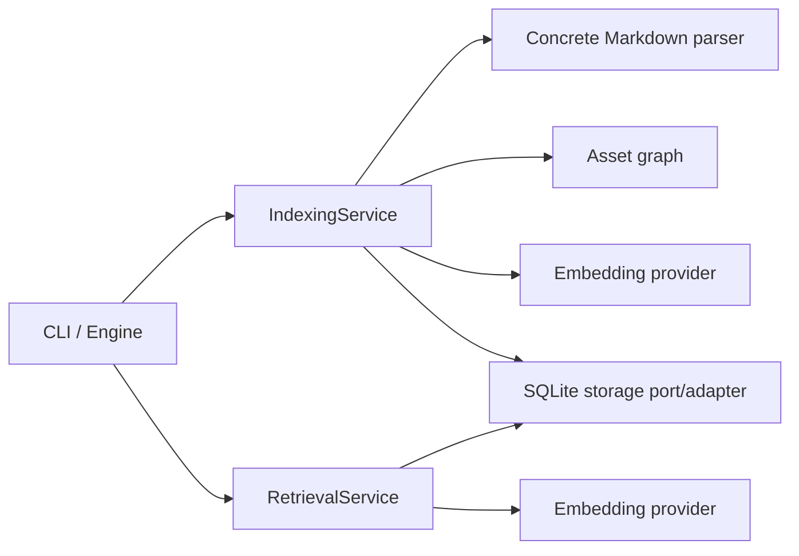
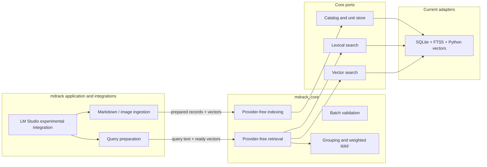
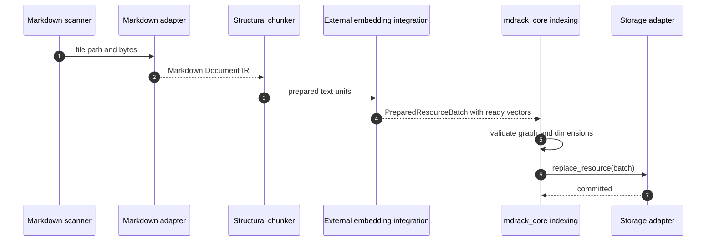
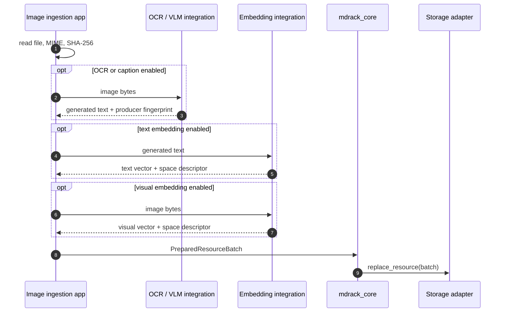
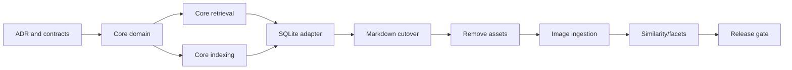
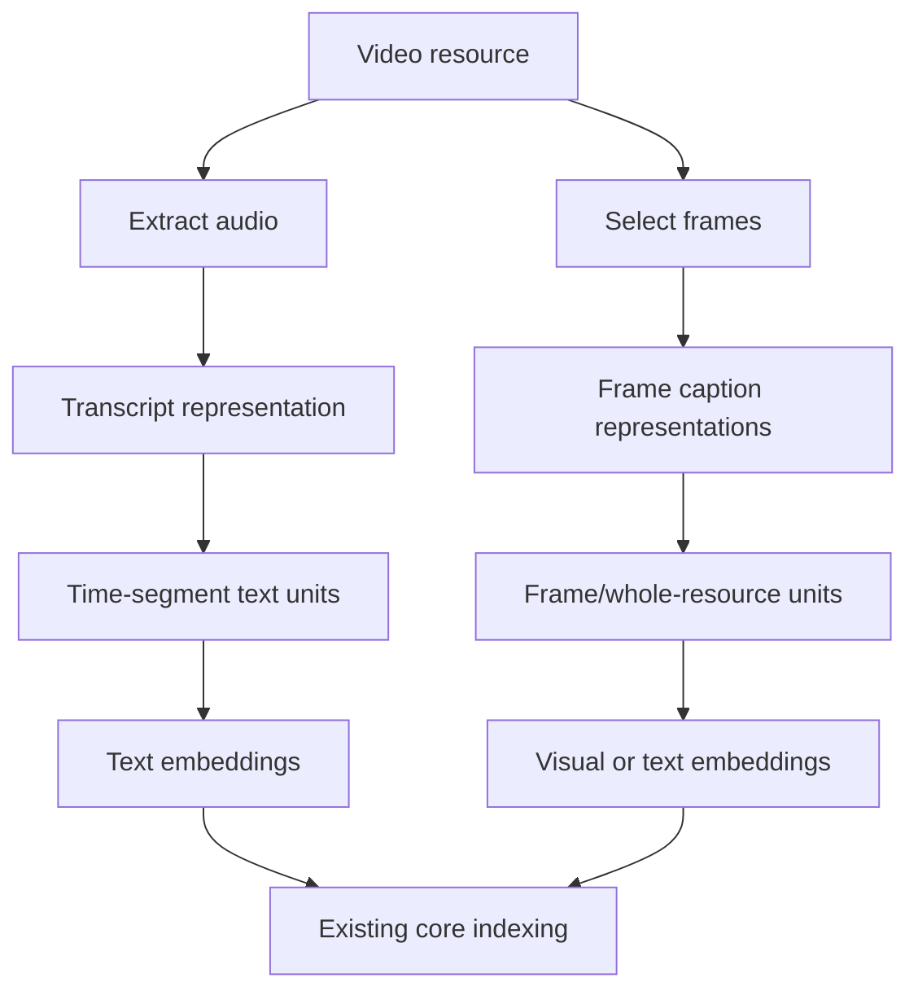

# MDRack v0.3 — план выделения чистого retrieval-ядра и прямого индексирования изображений

> **Статус:** активный audited contract plan; Gates A–D одобрены, production-код не изменён
> **Дата аудита:** 17 июля 2026 года
> **Репозиторий:** `VladimirMonin/MDRack`
> **Проверенная ветка:** `master`
> **Аудированный baseline:** `e7eeb3cda2d10836f4dffe03c0ec134d448026d5`
> **Целевой этап:** условная версия `0.3`
> **Режим документа:** обязательный контракт для stage-wise implementation; каждый slice требует exact-revision review
> **Главный принцип:** ядро получает готовые ресурсы, поисковые единицы, текстовые запросы и векторы, но никогда само не вызывает LLM/VLM/OCR/embedding-provider.

> [!IMPORTANT]
> Раздел 29 — нормативная audited amendment к исходному предложению. Он фиксирует
> принятые Gates A–D, полную ownership-модель, executable rollback, corrected phase
> graph, commit boundaries, evidence vocabulary и stop conditions. При конфликте
> раздел 29 и [ADR-0002](../decisions/0002-provider-storage-neutral-core.md)
> имеют приоритет над ранними эскизами этого документа. Текущее поведение v0.2
> остаётся источником истины до принятого и закоммиченного implementation slice.

---

## 1. Резюме решения 🧭

MDRack следует перестроить из локального Markdown-индексатора с встроенной интеграцией LM Studio в **чистое, физически изолированное retrieval-ядро**, которое можно перенести в другой проект без Click, SQLite, HTTP, Markdown-парсера и провайдеров моделей.

Целевая граница выглядит так:

```text
внешний ingestion / extraction / embedding
                    ↓
      готовые типизированные ресурсы,
      поисковые единицы и векторы
                    ↓
             mdrack_core
    валидация → запись → фильтры → поиск
        → группировка → weighted RRF
                    ↓
        абстрактные storage/search ports
                    ↓
       SQLite adapter сейчас;
  PostgreSQL + pgvector adapter позднее
```

Ключевые решения этого плана:

1. Создать физически отдельный пакет `src/mdrack_core/` со стандартной библиотекой Python как единственной обязательной зависимостью.
2. Оставить в `src/mdrack/` приложение-обвязку: CLI, Markdown ingestion, SQLite adapter, LM Studio experiments и прямое image ingestion.
3. Ядро не должно импортировать и вызывать `httpx`, `sqlite3`, `click`, `markdown_it`, `yaml`, `pydantic` или какой-либо provider модели.
4. Ядро должно знать **тип ресурса и тип поискового представления**, иначе невозможны фильтры и мультимодальный поиск.
5. Основной объект ядра — не Markdown-файл и не картинка, а `Resource` с одним или несколькими `Representation` и `SearchUnit`.
6. Embeddings передаются в ядро готовыми и обязательно привязываются к `EmbeddingSpace`.
7. Семантический запрос также приходит в ядро уже с готовым query vector; получение вектора находится снаружи.
8. Markdown остаётся первым source adapter. Изображение становится вторым source adapter и индексируется напрямую, а не через ссылки из Markdown.
9. Текущий `AssetGraph`, `AssetReference`, `image_reference`-чанки и таблицы описаний ссылок выводятся из рабочего pipeline.
10. Одно изображение по умолчанию создаёт одну поисковую единицу уровня `whole_resource` для каждого представления: OCR-текст, caption и/или visual vector.
11. Аудио и видео сейчас не реализуются, но типы, locators, фильтры и embedding spaces не должны блокировать их появление.
12. PostgreSQL/pgvector сейчас не реализуется. Вместо этого вводятся ports и contract tests, по которым позднее можно написать другой adapter без изменения ядра.
13. Логи должны содержать длительности, количества, размеры, token counts, dimensions и safe fingerprints, но не пользовательские тексты, запросы, пути, metadata values или vectors.

> [!IMPORTANT]
> Цель этапа — не сделать «универсальную мультимодальную платформу». Цель — убрать неверные зависимости и получить небольшой устойчивый kernel, на котором Markdown и изображения доказывают архитектуру. Аудио и видео должны подключаться добавлением ingestion-кода и новых представлений, а не переписыванием retrieval.

---

## 2. Цели и критерии успеха 🎯

### 2.1. Основные цели

1. **Физическая переносимость ядра.** Каталог `src/mdrack_core/` можно скопировать в другой Python-проект вместе с его тестами и адаптировать через ports.
2. **Provider neutrality.** Ядро не знает, как получены OCR-текст, caption, transcript, document embedding или query embedding.
3. **Storage neutrality.** Ядро не знает имён таблиц, типов BLOB, FTS5, JSON-векторов и SQL-диалекта.
4. **Типизированный поиск.** Можно ограничить поиск ресурсами вида `document` или `image`, MIME-типом, modality, representation kind, unit kind, namespace и facets.
5. **Многоветочный hybrid search.** Ядро объединяет произвольные ranked branches: lexical, text-semantic, visual-semantic и будущие audio/video branches.
6. **Resource-level retrieval.** Ядро умеет возвращать как конкретные units, так и ресурсы, схлопывая множество чанков одного документа и сохраняя лучшие evidence units.
7. **Похожесть ресурсов.** Архитектура поддерживает точные дубликаты по content hash и семантическую похожесть через whole-resource units.
8. **Прямое индексирование изображений.** Изображение передаётся ingestion-слою непосредственно; Markdown-ссылки не создают asset registry и отдельные retrieval-чанки.
9. **Безопасная наблюдаемость.** Все важные стадии имеют privacy-safe lifecycle logs и измеримые durations/counts.
10. **Надёжная миграция.** Текущая v0.2 остаётся проверяемой базовой точкой; переход не маскирует регрессии и не переписывает существующие миграции.

### 2.2. Проверяемые критерии готовности

Этап считается завершённым, когда одновременно выполнены следующие условия:

- `mdrack_core` импортируется без установки `click`, `httpx`, `markdown-it-py`, `pyyaml`, `pydantic` и без доступного `sqlite3` adapter-кода проекта;
- AST/dependency gate запрещает обратные импорты `mdrack_core -> mdrack`;
- core search принимает готовые query vectors и не содержит `EmbeddingProvider`;
- core indexing принимает готовые unit vectors и не содержит model/provider вызовов;
- SQLite adapter проходит общий storage contract suite;
- Markdown indexing работает через новый resource-oriented контракт;
- Markdown image links не создают resources, asset rows или `image_reference` units;
- прямое изображение индексируется как `resource_kind=image`;
- text, image и mixed queries можно фильтровать до выборки top-k;
- resource-level RRF не даёт длинному документу преимуществ только из-за количества его чанков;
- exact duplicate lookup работает по `content_hash`;
- semantic similarity работает для целых ресурсов при наличии whole-resource vector;
- логи проходят redaction tests с sentinel-текстами и не содержат исходный query/content/path;
- offline E2E покрывает Markdown, image-as-text, visual fake vectors, filters, similarity и degradation;
- полный gate проекта проходит без ослабления существующих проверок.

---

## 3. Явные нецели текущего этапа 🚫

На этом этапе не следует реализовывать:

- production PostgreSQL adapter;
- production pgvector/HNSW/IVFFlat tuning;
- аудио extraction и speech-to-text;
- извлечение кадров и сцен из видео;
- image region detection, bounding boxes и layout understanding;
- perceptual hash и near-duplicate image detection;
- универсальный metadata query language;
- OpenSearch/Elasticsearch/Qdrant/Chroma adapters;
- облачные providers;
- прямую загрузку model weights через Python;
- production reranker;
- web server, GUI или MCP server;
- хранение бинарных файлов внутри SQLite;
- автоматическое скачивание remote assets;
- автоматическое индексирование каждой картинки, упомянутой в Markdown;
- separate repositories и публикацию нескольких PyPI-пакетов до доказанного второго потребителя.

> [!NOTE]
> Эти пункты не объявляются плохими идеями. Они просто не являются условием выделения чистого ядра. Особенно важно не смешивать «сделать границу для будущего Postgres» и «прямо сейчас реализовать Postgres».

---

## 4. Проверенное текущее состояние 🔎

Аудит выполнялся по текущему `master`, где архитектурная документация объявляет код и миграции источником истины. Ниже перечислены факты, которые непосредственно влияют на план.

### 4.1. Claim ledger

| Проверенный факт | Текущий source anchor | Последствие для плана | Уверенность |
|---|---|---|---:|
| `Document` является Markdown IR и содержит `frontmatter`, `SourceBlock`, parser name/version | `src/mdrack/domain/documents.py` | Эту модель нельзя выдавать за универсальный core resource | Высокая |
| `BlockType` и `RetrievalContentType` включают Markdown-специфичные виды и `IMAGE_REFERENCE` | `src/mdrack/domain/blocks.py`, `src/mdrack/domain/chunks.py` | Markdown IR остаётся в adapter/application package, а core получает формат-независимые units | Высокая |
| `IndexingService` сам создаёт `MarkdownItParser` | `src/mdrack/application/indexing.py:51-85` | Parser composition необходимо вынести из core boundary | Высокая |
| `IndexingService` вызывает `build_asset_graph` | `src/mdrack/application/indexing.py:387-424` | Текущий image-reference pipeline встроен в основную индексацию и требует явного удаления | Высокая |
| `IndexingService` вызывает provider для chunk embeddings | `src/mdrack/application/indexing.py:521-545` | Core indexing сейчас не provider-neutral | Высокая |
| `RetrievalService` вызывает `embedding_provider.embed_query` | `src/mdrack/application/retrieval.py:150-176` | Core search сейчас не provider-neutral | Высокая |
| RRF уже реализован как детерминированная application-функция | `src/mdrack/application/retrieval.py:29-62` | Эту часть можно извлечь в ядро и обобщить на N branches | Высокая |
| Fusion выполняется по chunk logical ID | `src/mdrack/application/retrieval.py:37-61` | Для resource search нужна отдельная стадия branch-local grouping | Высокая |
| Storage ports принимают только text query или один query vector, без filters | `src/mdrack/ports/storage.py` | Нужен новый `SearchScope`, передаваемый backend до top-k | Высокая |
| `SourceLocator` жёстко требует line/offset/heading/block/chunk | `src/mdrack/domain/indexing.py` | Нужны generic resource/evidence locators, пригодные для whole image и будущих time spans | Высокая |
| SQLite хранит chunks, FTS и JSON vectors и выполняет Python cosine scan | `src/mdrack/storage/sqlite/vector.py`, `docs/current-architecture/sqlite-persistence.md` | SQLite остаётся первым adapter, но детали не должны течь в core DTO | Высокая |
| Схема имеет миграции `0000`–`0006`; `0005` создаёт assets/references/descriptions | `src/mdrack/storage/sqlite/migrations/` | Существующие миграции нельзя переписывать; новая модель требует `0007+` | Высокая |
| Markdown parser выделяет inline images в отдельные blocks и добавляет соседний текст | `src/mdrack/adapters/markdown_it/parser.py:246-258`, методы `_with_surrounding_text`, `_split_reference_paragraph` | Для удаления image-reference indexing недостаточно удалить таблицы; нужно упростить parser projection | Высокая |
| StructuralChunker создаёт image-reference chunk из alt + surrounding text | `src/mdrack/application/chunking.py:133-157` | Этот branch должен быть удалён, иначе старая семантика останется | Высокая |
| Тесты намеренно фиксируют asset graph, resolution и image-reference search | `tests/unit/test_assets.py`, `tests/integration/test_asset_storage.py`, `tests/integration/test_asset_indexing_pipeline.py` | Эти тесты не следует «подправлять»; их нужно заменить тестами нового product contract | Высокая |
| `MDRackEngine` принимает provider и создаёт search/index services | `src/mdrack/public_api/engine.py` | Engine остаётся app façade; pure core получает другой API | Высокая |
| CLI search создаёт provider и передаёт его в `RetrievalService` | `src/mdrack/cli/commands/search.py` | Query-vector preparation перемещается в application composition до вызова core | Высокая |
| Config жёстко фиксирует `provider: Literal["lmstudio"]` | `src/mdrack/config/models.py` | Эта config относится только к `mdrack` app, не к core | Высокая |
| Проект имеет privacy-safe reporting и release gates | `src/mdrack/eval/reporting.py`, `scripts/verify.sh` | Их следует расширить, а не заменять новым параллельным механизмом | Высокая |
| Зафиксированный v0.2 release packet сообщает 622 offline passed tests | `docs/evidence/v0.2-release-gate.json` | Это историческая evidence claim, а не результат текущего запуска в этой сессии | Высокая |

### 4.2. Главные архитектурные противоречия

Текущий проект уже использует слова `domain`, `ports`, `application`, `adapters`, но фактическая граница остаётся неполной:



Наличие Protocol само по себе не делает ядро чистым, если use case внутри ядра инициирует внешний model call. Требуемая граница:



---

## 5. Целевая ответственность слоёв 🧱

### 5.1. `mdrack_core`

Ядро отвечает за:

- provider-neutral domain records;
- валидацию связей `Resource -> Representation -> SearchUnit -> VectorRecord`;
- стабильные logical IDs или правила проверки переданных IDs;
- atomic replace contract на уровне ресурса;
- search scope и typed filters;
- orchestration lexical/vector branches;
- deterministic weighted RRF;
- branch-local grouping units до resources;
- result DTO и evidence aggregation;
- exact duplicate query contract;
- semantic similarity contract;
- stable error/degradation categories;
- privacy-safe lifecycle logging без содержимого.

Ядро не отвечает за:

- чтение файлов;
- MIME sniffing;
- Markdown parsing;
- OCR/caption/transcription;
- tokenization конкретной модели;
- получение embeddings;
- управление моделями;
- SQL и migrations;
- JSON CLI envelopes;
- разрешение абсолютных путей;
- network calls.

### 5.2. `mdrack` application package

Текущий пакет отвечает за:

- filesystem scanning;
- Markdown parser и structural chunker;
- direct image ingestion;
- сохранение generated full text representations;
- подготовку ready vectors через выбранную integration;
- query vector preparation;
- SQLite composition;
- CLI и `MDRackEngine`;
- config;
- diagnostics, doctor, model lifecycle и experimental scripts.

### 5.3. Storage adapters

Adapter обязан:

- реализовать core ports;
- применить filters **до** ограничивающего top-k;
- вернуть нормализованные candidates с ранжированием;
- обеспечить adapter-specific транзакции и migrations;
- не заставлять core понимать SQL columns или vector serialization;
- пройти общий contract suite.

---

## 6. Рекомендуемая физическая структура пакетов 📦

На первом этапе не нужен новый репозиторий и отдельная публикация. Достаточно двух import roots в одном distribution:

```text
src/
  mdrack_core/
    domain/       # stdlib-only records, locators, errors and requests/results
    application/  # indexing, retrieval and owner-specific event schemas
    ports/        # split catalog.py and search.py contracts
  mdrack/
    adapters/     # Markdown and SQLite implementations
    ingestion/    # source-specific producers and deterministic IDs
    integrations/ # LM Studio remains app-side
    cli/
    public_api/
    config/
    eval/
```

This tree is an ownership map, not an actionable create-file list. The only
canonical implementation paths and acceptance criteria are the stage table in
§18.3 and the frozen contracts in §§29.2–29.13. In particular there is no shared
`ports/storage.py`, and S2.5—not S3—owns shared exports, errors, split ports, and
the common observability primitive.

### 6.1. Dependency rule

```text
mdrack -> mdrack_core
mdrack_core -X-> mdrack
```

Для `mdrack_core` запрещаются imports:

```text
click
httpx
markdown_it
pydantic
yaml
sqlite3
mdrack.*
```

`sqlite3` является частью стандартной библиотеки, но запрещается именно как архитектурный сигнал: core не должен иметь persistence implementation.

### 6.2. Почему не `mdrack/core/`

Отдельный import root `mdrack_core` предпочтительнее вложенного `mdrack.core`, потому что:

- каталог можно физически скопировать;
- невозможно случайно импортировать соседние `mdrack.adapters` относительным импортом;
- dependency checker становится простым;
- позднее package можно выделить в отдельный distribution без массового перемещения модулей;
- installed-package smoke может отдельно доказать импорт ядра.

### 6.3. Почему пока один distribution

Отдельные distributions `mdrack-core`, `mdrack-sqlite`, `mdrack-lmstudio` сейчас добавят version choreography, release automation и dependency management без второго подтверждённого потребителя. Сначала требуется доказать границу в monorepo; физическое выделение package — отдельный будущий этап.

---

## 7. Доменная модель ядра 🧩

### 7.1. Открытые строковые типы вместо закрытого зоопарка

Не следует делать `Literal["document", "image"]` главным расширяемым контрактом. Аудио и видео тогда потребуют breaking changes. Рекомендуется хранить непустые строки и предоставить стандартные constants:

```python
RESOURCE_DOCUMENT = "document"
RESOURCE_IMAGE = "image"
RESOURCE_AUDIO = "audio"
RESOURCE_VIDEO = "video"

MODALITY_TEXT = "text"
MODALITY_IMAGE = "image"
MODALITY_AUDIO = "audio"
MODALITY_VIDEO = "video"
```

Adapter может использовать дополнительные значения, не изменяя core schema, если они проходят базовую валидацию.

### 7.2. `ResourceRecord`

Ресурс — реальный исходный объект, по которому пользователь хочет фильтровать и получать итоговый result.

```python
@dataclass(frozen=True)
class ResourceRecord:
    resource_id: str
    resource_kind: str
    media_type: str
    source_namespace: str
    locator: Locator
    content_hash: str | None
    title: str | None
    metadata: Mapping[str, JSONValue]
```

Примеры:

```text
Markdown file:
  resource_kind = document
  media_type = text/markdown

PNG image:
  resource_kind = image
  media_type = image/png

Future video:
  resource_kind = video
  media_type = video/mp4
```

`content_hash` означает hash исходных bytes, если они доступны. Он не должен зависеть от OCR/caption или parser version.

### 7.3. `RepresentationRecord`

Один resource может иметь несколько представлений:

```python
@dataclass(frozen=True)
class RepresentationRecord:
    representation_id: str
    resource_id: str
    representation_kind: str
    modality: str
    text: str | None
    language: str | None
    producer_fingerprint: str | None
    token_count: int | None
    token_count_kind: str | None  # exact | estimated
    metadata: Mapping[str, JSONValue]
```

Рекомендуемые `representation_kind`:

| Resource | Representation | Содержимое |
|---|---|---|
| Markdown | `markdown_structure` | структурные blocks, adapter-local |
| Markdown | `retrieval_text` | текстовые units |
| Image | `ocr_text` | полный OCR-текст |
| Image | `caption_text` | полное описание VLM |
| Image | `visual` | текст отсутствует; vectors принадлежат visual units |
| Future audio | `transcript_text` | transcript |
| Future video | `audio_transcript` | transcript audio track |
| Future video | `frame_caption` | caption выбранного frame |

Generated text (`ocr_text`, `caption_text`, transcript) следует хранить полностью, потому что его повторное получение дорого, недетерминированно и может стать невозможным. Для исходного Markdown полное хранение остаётся policy adapter-а и не является обязательным core invariant.

### 7.4. `SearchUnitRecord`

Search unit — объект, который реально ранжируется.

```python
@dataclass(frozen=True)
class SearchUnitRecord:
    unit_id: str
    resource_id: str
    representation_id: str
    unit_kind: str
    modality: str
    text: str | None
    evidence_locator: Locator
    ordinal: int
    token_count: int | None
    token_count_kind: str | None
    metadata: Mapping[str, JSONValue]
```

Стандартные значения:

```text
text_chunk
whole_resource
page
region
frame
time_segment
```

На текущем этапе реально используются только:

```text
text_chunk
whole_resource
```

Остальные не требуют таблиц или сервисов сами по себе; это будущая vocabulary.

### 7.5. Locators

Вместо обязательного line-based `SourceLocator` вводится generic tagged locator:

```python
@dataclass(frozen=True)
class Locator:
    kind: str
    payload: Mapping[str, JSONValue]
```

Текущие формы:

```python
Locator(
    kind="file",
    payload={"root_id": "vault", "relative_path": "notes/a.md"},
)

Locator(
    kind="text_span",
    payload={
        "start_line": 10,
        "end_line": 14,
        "start_offset": 120,
        "end_offset": 270,
        "heading_path": ["Architecture"],
    },
)

Locator(kind="whole_resource", payload={})
```

Будущие adapters смогут добавить `time_span`, `page_region` и `frame` без изменения retrieval algorithms.

На один compatibility release app façade может преобразовывать `text_span` обратно в текущий `SourceLocator` для старых `read`/search consumers. Новый core DTO не должен наследовать обязательные `block_id` и `chunk_id` старой модели.

> [!IMPORTANT]
> Core валидирует, что locator имеет непустой `kind` и JSON-safe payload. Проверка filesystem traversal относится к file adapter/resolver, потому что только он знает semantics конкретного locator.

### 7.6. `EmbeddingSpaceRecord`

Embedding space описывает совместимость vectors, а не способ вызова provider:

```python
@dataclass(frozen=True)
class EmbeddingSpaceRecord:
    space_id: str
    dimensions: int
    metric: str  # cosine | dot | l2
    fingerprint: str
    metadata: Mapping[str, JSONValue]
```

Core не должен иметь обязательные поля `provider`, `endpoint`, `runtime`, `model_key`. Интеграция может сохранить их в app metadata, но совместимость определяется `space_id`, `dimensions`, `metric` и `fingerprint`.

Примеры:

```text
qwen3-text-1024-retrieval-v1
image-text-shared-768-v1
future-audio-semantic-v1
```

Текущий provider-specific `EmbeddingProfile` остаётся типом app/integration слоя. При cutover его fingerprint отображается в `EmbeddingSpaceRecord`; существующие chunk vectors не переносятся механически из-за изменения unit IDs, а перестраиваются при rebuild.

### 7.7. `VectorRecord`

```python
@dataclass(frozen=True)
class VectorRecord:
    unit_id: str
    space_id: str
    vector: tuple[float, ...]
```

Один unit может иметь несколько vectors в разных spaces. Один resource может иметь разные units для OCR, caption и visual representation.

### 7.8. Facets

Хештеги и категории следует представить одной универсальной моделью:

```python
@dataclass(frozen=True)
class Facet:
    namespace: str
    value: str

@dataclass(frozen=True)
class ResourceFacet:
    resource_id: str
    facet: Facet
    origin: str  # user | source | extractor | classifier
    producer_fingerprint: str | None
    confidence: float | None
```

Примеры:

```text
tag=python
category=programming/backend
project=mdrack
language=ru
```

На первом этапе facets участвуют только в фильтрации и группировке. Не следует добавлять score boost за tags без отдельной retrieval evaluation.

---

## 8. Provider-free indexing contract 📥

### 8.1. Вход ядра

Ядро получает полностью подготовленный batch:

```python
@dataclass(frozen=True)
class PreparedResourceBatch:
    resource: ResourceRecord
    representations: tuple[RepresentationRecord, ...]
    units: tuple[SearchUnitRecord, ...]
    spaces: tuple[EmbeddingSpaceRecord, ...]
    vectors: tuple[VectorRecord, ...]
    facets: tuple[ResourceFacet, ...]
```

`CoreIndexingService` выполняет только:

1. validation IDs и relationships;
2. uniqueness checks;
3. vector dimension checks;
4. text/vector presence rules;
5. counts и privacy-safe metrics;
6. один вызов `ResourceWritePort.replace_resource(batch)`;
7. стабильную классификацию ошибок.

Он не:

- читает файл;
- парсит Markdown;
- делит исходник на format-specific blocks;
- вызывает embeddings;
- вычисляет OCR;
- открывает SQLite connection.

### 8.2. Chunking boundary

На этапе v0.3 format-specific chunking остаётся producer-side:

```text
Markdown adapter -> StructuralChunker -> SearchUnitRecord
Image ingestion -> whole_resource unit
Future transcript adapter -> time-aware text units
```

Не следует преждевременно переносить существующий `StructuralChunker` в core: он знает `BlockType`, Python AST, tables, Mermaid и Markdown source spans. Общий text chunker стоит выделять после появления второго реального text source, которому нужны те же правила.

Core при этом валидирует уже созданные units и их token/size limits.

### 8.3. Atomic replace

Port:

```python
class ResourceWritePort(Protocol):
    def replace_resource(self, batch: PreparedResourceBatch) -> None: ...
    def delete_resource(self, resource_id: str) -> None: ...
```

Atomicity является контрактом adapter-а:

```text
либо новый resource graph записан полностью,
либо предыдущая версия остаётся доступной полностью.
```

Для SQLite это одна transaction/savepoint. Для будущего PostgreSQL — обычная database transaction. Core не вводит собственный UnitOfWork framework.

---

## 9. Provider-free search contract 🔍

### 9.1. Search scope

```python
@dataclass(frozen=True)
class SearchScope:
    resource_kinds: tuple[str, ...] = ()
    media_types: tuple[str, ...] = ()
    source_namespaces: tuple[str, ...] = ()
    representation_kinds: tuple[str, ...] = ()
    modalities: tuple[str, ...] = ()
    unit_kinds: tuple[str, ...] = ()
    facets_any: tuple[Facet, ...] = ()
    facets_all: tuple[Facet, ...] = ()
    facets_none: tuple[Facet, ...] = ()
```

Фильтр передаётся каждому backend. Post-filter после top-k запрещён как основная реализация, потому что он теряет подходящие candidates.

### 9.2. Query branches

```python
@dataclass(frozen=True)
class LexicalBranch:
    branch_id: str
    query: str
    weight: float = 1.0
    candidate_limit: int = 100

@dataclass(frozen=True)
class VectorBranch:
    branch_id: str
    space_id: str
    vector: tuple[float, ...]
    weight: float = 1.0
    candidate_limit: int = 100
```

Query text допустим внутри core search request: он нужен lexical backend. Запрещено только самостоятельное получение semantic vector и логирование query.

### 9.3. Search request

```python
@dataclass(frozen=True)
class SearchRequest:
    lexical_branches: tuple[LexicalBranch, ...]
    vector_branches: tuple[VectorBranch, ...]
    scope: SearchScope
    target: str  # unit | resource
    limit: int
    rrf_k: int = 60
    evidence_limit_per_resource: int = 3
    allow_partial: bool = True
    request_id: str | None = None
```

### 9.4. Backend ports

```python
class LexicalSearchPort(Protocol):
    def search_lexical(
        self,
        branch: LexicalBranch,
        *,
        scope: SearchScope,
    ) -> list[RankedCandidate]: ...

class VectorSearchPort(Protocol):
    def search_vector(
        self,
        branch: VectorBranch,
        *,
        scope: SearchScope,
    ) -> list[RankedCandidate]: ...
```

`RankedCandidate` содержит:

```text
unit_id
resource_id
representation_id
rank
raw_score
branch_id
evidence_locator
safe metadata keys/values intended for result DTO
```

### 9.5. Weighted RRF

Для N branches:

```text
score(candidate) = Σ branch_weight / (rrf_k + branch_rank)
```

Требования:

- first occurrence per branch wins;
- duplicate candidate внутри branch не добавляет второй вклад;
- sorting: fused score desc, first seen asc, stable logical ID asc;
- `weight` обязан быть положительным; выключенная branch просто не включается в request;
- raw scores сохраняются для diagnostics/result, но не нормализуются между разными spaces;
- `text_weight` и `semantic_weight` из текущего config либо реально используются через branches, либо удаляются из public config.

### 9.6. Unit-level и resource-level search

#### `target="unit"`

Fusion выполняется по `unit_id`. Возвращаются конкретные chunks/whole-resource units.

#### `target="resource"`

Перед fusion каждая branch схлопывает candidates по `resource_id`:

1. лучший rank ресурса в branch становится rank ресурса;
2. raw score лучшего unit сохраняется;
3. top evidence units сохраняются отдельно;
4. один ресурс в одной branch учитывается один раз.

После этого weighted RRF выполняется по `resource_id`.

Это защищает выдачу от ситуации, когда длинный PDF или transcript получает преимущество только потому, что имеет сотни chunks.

### 9.7. Degradation

| Сценарий | `allow_partial=True` | `allow_partial=False` |
|---|---|---|
| Одна branch недоступна | вернуть остальные branches + degradation | вернуть error |
| Все branches пусты | успешный empty result | успешный empty result |
| Все branches завершились ошибкой | error | error |
| Incompatible vector space | branch error, не silent skip | error |
| Invalid scope | validation error до backend calls | validation error |
| Adapter timeout/error | stable category без raw exception text | stable category |

Core не должен знать `EmbeddingError`, LM Studio status или HTTP code. Для него это `BranchExecutionError` с safe category от adapter/application boundary.

---

## 10. Похожесть документов и изображений 🔁

### 10.1. Три разных понятия похожести

| Вид | Механизм | Вопрос |
|---|---|---|
| Exact duplicate | `ResourceRecord.content_hash` | Это тот же файл по bytes? |
| Semantic | whole-resource vector в выбранном space | Эти ресурсы об одном и том же? |
| Near duplicate | perceptual/normalized fingerprints | Это слегка изменённая копия? |

Near-duplicate detection остаётся вне v0.3, но схема не должна мешать добавить fingerprint representation позднее.

### 10.2. Exact duplicates

Port:

```python
class ResourceReadPort(Protocol):
    def find_by_content_hash(
        self,
        content_hash: str,
        *,
        scope: SearchScope,
    ) -> list[ResourceRecord]: ...
```

Для Markdown hash считается по исходным bytes. Для изображения — по bytes image file.

### 10.3. Semantic similarity

Ресурс должен иметь unit:

```text
unit_kind = whole_resource
```

и vector в подходящем space.

API:

```python
@dataclass(frozen=True)
class SimilarityRequest:
    query_unit_id: str
    space_id: str
    scope: SearchScope
    limit: int
    exclude_same_resource: bool = True
```

Storage adapter читает vector исходного unit и выполняет vector search. Core оформляет результат и evidence. Provider не вызывается.

### 10.4. Document-level vector

Для Markdown/document возможны два внешних producer strategy:

1. embed полного canonical text, если он укладывается в лимит;
2. агрегировать chunk vectors снаружи и записать отдельный whole-resource vector.

Core хранит `producer_fingerprint`, но не определяет алгоритм. В текущем app harness предпочтительно сначала использовать полный canonical retrieval text с явным максимальным лимитом и fallback `document_vector_unavailable`, а не придумывать непроверенное pooling.

### 10.5. Image similarity

Для image resource можно хранить одновременно:

```text
whole_resource / modality=image / visual space
whole_resource / modality=text / OCR-text space
whole_resource / modality=text / caption-text space
```

Поиск «похожие внешне» использует visual space. Поиск «содержат похожий текст» использует OCR text space. Поиск «изображают похожую идею» может использовать caption text или shared image-text space.

---

## 11. Markdown ingestion после разделения 📝

### 11.1. Новый pipeline



### 11.2. Mapping

```text
Markdown file
  -> ResourceRecord(resource_kind=document, media_type=text/markdown)
  -> RepresentationRecord(representation_kind=retrieval_text, modality=text)
  -> SearchUnitRecord(unit_kind=text_chunk) × N
  -> optional SearchUnitRecord(unit_kind=whole_resource)
```

### 11.3. Что делать с Markdown image syntax

Требуемая product policy:

- путь картинки не создаёт `ResourceRecord`;
- путь не хэшируется и не проверяется;
- отсутствующий файл картинки не создаёт diagnostic;
- не создаются `Asset`, `AssetReference`, asset descriptions;
- не создаётся `image_reference` unit;
- Markdown source не изменяется.

Рекомендуемая text projection:

```markdown
Before  after
```

становится обычным paragraph text:

```text
Before Architecture diagram after
```

То есть author-provided alt text можно сохранить как часть текста, но reference path и title отбрасываются. Для Obsidian embed без alias:

```markdown
![[screenshot.png]]
```

text contribution равен пустой строке. Для alias:

```markdown
![[screenshot.png|Architecture diagram]]
```

adapter может сохранить `Architecture diagram` как текст, не создавая link entity.

Эта policy должна быть одной чистой parser projection, а не feature flag с сохранением старого asset subsystem.

### 11.4. Удаляемый код

После cutover удалить:

```text
src/mdrack/domain/assets.py
src/mdrack/application/assets.py
Asset / AssetReference fields из PreparedFile
list_assets_for_file / list_asset_references из ports
asset write/delete/read methods из SQLite adapter
IMAGE_REFERENCE branch из StructuralChunker
surrounding-text enrichment для image blocks
asset-specific tests
asset docs как current capability
```

`BlockType.IMAGE_REFERENCE` можно сначала оставить adapter-internal на один промежуточный commit, но final target — удалить, если он больше не нужен точной projection. Не следует оставлять мёртвую публичную enum value «на будущее».

---

## 12. Прямое image ingestion 🖼️

### 12.1. Pipeline находится вне core



### 12.2. Default unit policy

Для каждого image representation создаётся **один** unit:

```text
unit_kind = whole_resource
```

Рекомендуемый app limit для OCR/caption representation — 8 000 tokens. Значение относится к конкретному experimental profile, а не к core invariant.

Если output превышает лимит:

1. сначала записать полный `RepresentationRecord.text`;
2. producer может создать несколько text units;
3. whole-resource unit создаётся только при наличии отдельного whole-resource vector или bounded summary;
4. core не выполняет скрытое truncation.

### 12.3. Минимальный image scope v0.3

Обязательный path:

```text
image file
-> caption or OCR text from fake/LM Studio script
-> one text unit
-> text embedding
-> SQLite
-> lexical/semantic/hybrid search filtered by resource_kind=image
```

Опциональный path:

```text
image file
-> visual embedding
-> visual vector search
```

Недоступность live visual embedding endpoint не блокирует core release. Она блокирует только live evidence соответствующей integration. Fake vectors должны доказать contracts, но не выдаются за live model evidence.

### 12.4. Хранение изображения

Core/SQLite не хранит bytes изображения. Хранятся:

```text
resource locator
content hash
media type
byte size в metadata при необходимости
полные generated text representations
search units
vectors
```

Файл остаётся во внешнем source store.

---

## 13. LM Studio как экспериментальная integration 🔌

### 13.1. Что переносится

Текущий `src/mdrack/embeddings/lmstudio.py` смешивает embeddings и model lifecycle. Его следует разделить:

```text
src/mdrack/integrations/lmstudio/client.py
src/mdrack/integrations/lmstudio/embeddings.py
src/mdrack/integrations/lmstudio/image_text.py
src/mdrack/integrations/lmstudio/model_lifecycle.py
```

### 13.2. Capability interfaces остаются вне core

```python
class TextEmbeddingProvider(Protocol): ...
class ImageTextExtractor(Protocol): ...
class VisualEmbeddingProvider(Protocol): ...
```

Эти protocols могут жить в `mdrack.integrations` или `mdrack.ingestion.ports`, но не в `mdrack_core`.

Core видит только готовые `VectorRecord` и `EmbeddingSpaceRecord`.

### 13.3. Query preparation

Текущий flow:

```text
RetrievalService -> provider.embed_query -> storage
```

Новый flow:

```text
CLI / host app
-> query vector preparer
-> SearchRequest(vector branch)
-> CoreRetrievalService
```

### 13.4. Index preparation

Текущий flow:

```text
IndexingService -> provider.embed -> PreparedFile
```

Новый flow:

```text
ingestion application
-> provider.embed
-> PreparedResourceBatch
-> CoreIndexingService
```

### 13.5. Скрипты для экспериментов

Рекомендуемые scripts:

```text
scripts/lmstudio_probe.py
scripts/lmstudio_embed_text.py
scripts/lmstudio_extract_image_text.py
scripts/lmstudio_ingest_image.py
scripts/lmstudio_search.py
```

Скрипты должны:

- иметь `--dry-run` или probe mode;
- не скачивать модели без явного флага;
- не логировать source text/image bytes/query;
- выдавать structured JSON summary;
- помечать результат `live_external` только при реальном вызове;
- сохранять producer/space fingerprints;
- находиться вне default offline gate, кроме unit tests с mocked transport.

---

## 14. Storage abstraction и готовность к PostgreSQL 🗄️

### 14.1. Прагматичные ports

Не нужен универсальный ORM, SQL AST или generic repository framework. Достаточно use-case ports:

```python
class ResourceWritePort(Protocol): ...
class ResourceReadPort(Protocol): ...
class LexicalSearchPort(Protocol): ...
class VectorSearchPort(Protocol): ...
class VectorReadPort(Protocol): ...
```

Один `SQLiteStore` может реализовать все ports. Будущий PostgreSQL adapter также может реализовать их одним объектом.

### 14.2. Что запрещено в core contracts

Core DTO не должны содержать:

```text
sqlite row id
sqlite connection
SQL fragments
FTS5 MATCH syntax
BLOB payload
JSON vector serialization
Postgres operator
pgvector type
HNSW/IVFFlat option
```

### 14.3. Почему Postgres adapter реалистичен позднее

Port boundary естественно отображается на PostgreSQL:

- catalog, representations, units и facets — обычные relational tables;
- lexical branch — PostgreSQL Full Text Search;
- vector branch — exact или approximate pgvector search;
- typed scope — `WHERE`/JOIN filters;
- replace resource — transaction;
- weighted RRF остаётся в Python core и не зависит от SQL score scale.

Официальный pgvector поддерживает exact nearest-neighbor search, HNSW/IVFFlat indexes и filtered queries. Но детали filtered ANN, recall и iterative scans должны решаться внутри будущего adapter-а и benchmark-а, а не в текущем core API.

### 14.4. Что сделать сейчас для будущего Postgres

- создать reusable adapter contract tests;
- запретить SQLite types в core;
- хранить metric/space ID в contracts;
- передавать filters до search;
- не требовать JSON-encoded vector от port;
- не встраивать Python cosine scan в core service;
- добавить `adapter_name` только в safe diagnostics, не в domain semantics.

### 14.5. Что отложить

- SQLAlchemy;
- async database abstraction;
- distributed transactions;
- repository-per-table pattern;
- generic migration API для разных СУБД;
- Postgres CI/container;
- ANN tuning.

---

## 15. SQLite schema evolution 🧬

### 15.1. Миграции `0000`–`0006` неизменяемы

Новый schema slice начинается с `0007_resource_core.sql`.

### 15.2. Предлагаемая новая схема

```text
resources
  resource_id PK
  resource_kind
  media_type
  source_namespace
  locator_kind
  locator_json
  content_hash
  title
  metadata_json
  indexed_at
  status

representations
  representation_id PK
  resource_id FK
  representation_kind
  modality
  text_content NULL
  language NULL
  producer_fingerprint NULL
  token_count NULL
  token_count_kind NULL
  metadata_json

search_units
  unit_id PK
  resource_id FK
  representation_id FK
  unit_kind
  modality
  text_content NULL
  evidence_locator_kind
  evidence_locator_json
  ordinal
  token_count NULL
  token_count_kind NULL
  metadata_json

embedding_spaces
  space_id PK
  dimensions
  metric
  fingerprint
  metadata_json

unit_embeddings
  unit_id PK,FK
  space_id PK,FK
  embedding BLOB
  embedded_at

facets
  facet_id PK
  namespace
  value
  UNIQUE(namespace, value)

resource_facets
  resource_facet_id PK
  resource_id FK
  facet_id FK
  origin
  producer_fingerprint NULL
  confidence NULL
  UNIQUE(resource_id, facet_id, origin, producer_fingerprint)

search_units_fts
  unit_id
  text_content
```

### 15.3. FTS projection

FTS table должна индексировать только units с непустым `text_content`. Resource/filter columns могут находиться в обычных tables и применяться через JOIN; не следует дублировать всю metadata в FTS без измеренной необходимости.

### 15.4. Migration strategy

This subsection is a conceptual schema sketch only and must not be converted into
SQL or implementation cards. The canonical executable sequence is S5a design
review, S5b migration identity and candidate-generation readiness, S5c create-only
`0007` plus adapter contracts, then S5d rebuild/cutover/recovery. §§29.7–29.8 own
the exact rules: no SQL before R5a PASS, no write to the active v0.2 generation,
and no v0.3 serving before candidate readiness and atomic pointer switch.

Because the index is derived and sources remain external, v0.3 rebuilds into a
separate candidate generation. Legacy tables in the untouched v0.2 generation
remain available for rollback; they are not treated as in-place inert tables in a
database that v0.2 might later open.

### 15.5. Удаление asset tables

Do not rewrite `0005`. S7 removes production asset behavior but owns no schema
drop. Physical cleanup of retained v0.2 generations or legacy tables is a separate
authorized destructive action after the retention gate; no earlier phase may add
`0008`, drop asset tables, or weaken rollback.

---

## 16. Наблюдаемость и privacy-safe logging 📊

### 16.1. Общие требования

- module logger, без `print` в production;
- stable event names;
- lifecycle: started/completed/skipped/degraded/failed;
- durations через monotonic clock;
- no content/query/path/URL/vector/metadata values;
- raw exception text не попадает в logs;
- stdout CLI остаётся чистым JSON;
- per-unit logs в hot loops запрещены по умолчанию.

### 16.2. Safe fields core indexing

```text
request_id / run_id
operation
status
reason
resource_kind
media_type
representation_count
unit_count
text_unit_count
vector_unit_count
vector_count
space_count
facet_count
input_bytes
representation_token_count_total
representation_token_count_max
unit_token_count_total
unit_token_count_max
token_count_kind_counts
elapsed_ms
validation_ms
storage_ms
adapter_name
```

### 16.3. Safe fields core search

```text
request_id
branch_count
lexical_branch_count
vector_branch_count
scope_filter_count
target
requested_limit
candidate_limit_total
per-branch candidate_count
per-branch elapsed_ms
fusion_input_count
unique_unit_count
unique_resource_count
result_count
rrf_k
degraded_branch_count
degradation_reason categories
elapsed_ms
```

### 16.4. Safe fields integration

```text
provider name
operation
model/profile safe alias or hashed fingerprint
input count
input byte count
input token count, если известно
dimensions
batch size
attempt
status class
elapsed_ms
```

Запрещаются:

```text
query text
Markdown/OCR/caption/transcript text
relative and absolute path
vault/root name
raw model endpoint/host/port/path
HTTP body
provider response body
vector values
frontmatter values
facet values, если они пользовательские
```

### 16.5. Event vocabulary

```text
core.index.started
core.index.validated
core.index.completed
core.index.failed

core.search.started
core.search.branch.completed
core.search.branch.degraded
core.search.fusion.completed
core.search.completed
core.search.failed

core.similarity.started
core.similarity.completed

adapter.sqlite.replace.started
adapter.sqlite.replace.completed
adapter.sqlite.search.completed

integration.lmstudio.request.started
integration.lmstudio.request.completed
integration.lmstudio.request.failed
```

### 16.6. Logging tests

Каждый privacy test создаёт sentinel values:

```text
PRIVATE_QUERY_SENTINEL
PRIVATE_MARKDOWN_SENTINEL
/private/home/sentinel
https://secret-host.invalid:1234/path
[0.123456, 0.654321]
```

После success/degradation/failure проверяется, что ни одна строка не попала в captured logs, diagnostics или CLI stderr/stdout вне ожидаемого result payload.

---

## 17. Стратегия тестирования 🧪

### 17.1. Core unit tests

Новый каталог:

```text
tests/core/unit/
```

Обязательные suites:

1. domain validation;
2. graph relationship validation;
3. vector dimension/fingerprint validation;
4. scope validation;
5. N-branch weighted RRF;
6. deterministic tie-breaking;
7. duplicate suppression inside branch;
8. unit-level fusion;
9. resource-level grouping;
10. evidence selection;
11. empty branches;
12. partial degradation;
13. all-branch failure;
14. exact duplicate contract;
15. semantic similarity contract;
16. log redaction;
17. no provider/storage imports.

### 17.2. Port contract tests

```text
tests/core/contracts/
  resource_store_contract.py
  lexical_search_contract.py
  vector_search_contract.py
```

Contract suite должна запускаться для:

- deterministic in-memory fake;
- SQLite adapter.

Будущий PostgreSQL adapter подключается к тем же tests.

Проверки:

- replace/delete round trip;
- atomic rollback;
- filters before limit;
- multiple embedding spaces;
- incompatible dimension rejection;
- empty vectors;
- resource grouping inputs;
- facets any/all/none;
- exact hash lookup;
- stable ordering;
- orphan cleanup.

### 17.3. Markdown adapter tests

Заменить asset tests следующими assertions:

- Markdown image path не создаёт resource;
- path не попадает в FTS или embedding text;
- alt text сохраняется согласно policy;
- Obsidian embed без alias не создаёт searchable text;
- surrounding prose не дублируется;
- source spans обычных prose units остаются корректными;
- LF/CRLF и inline image syntax;
- source bytes не изменяются;
- repeated indexing даёт stable logical units.

### 17.4. Image ingestion tests

Offline fake pipeline:

- PNG/JPEG resource type и media type;
- content hash;
- OCR representation хранит полный text;
- caption representation хранит полный text;
- one whole-resource unit по default;
- text vector и visual vector не смешиваются;
- filter `resource_kind=image` применяется до top-k;
- text → image hybrid search;
- image vector → image similarity;
- delete/reindex removes stale representations/vectors;
- extractor failure не оставляет half-written resource;
- no source mutation;
- no user content in logs.

### 17.5. SQLite migration tests

Расширить `tests/integration/test_sqlite_migrations.py`:

- fresh `0000 -> 0007`;
- upgrade `0000..0006 -> 0007`;
- unknown version fail-closed;
- missing `0007` fail-closed;
- legacy rows не читаются как new resources без rebuild;
- rebuild-required diagnostic;
- transaction rollback;
- FTS/manual projection consistency;
- orphan unit/vector/facet cleanup.

### 17.6. E2E matrix

```text
tests/e2e/test_core_markdown_sqlite.py
tests/e2e/test_core_image_sqlite.py
tests/e2e/test_filtered_hybrid_resources.py
tests/e2e/test_similarity_resources.py
tests/e2e/test_cli_core_parity.py
tests/e2e/test_privacy_observability.py
```

Matrix:

| Corpus | Query branch | Scope | Target | Expected |
|---|---|---|---|---|
| Markdown | lexical | document | unit | relevant chunk |
| Markdown | text vector fake | document | resource | relevant document + evidence |
| Image OCR | lexical | image | resource | relevant image |
| Image caption | text vector fake | image | resource | relevant image |
| Image visual | visual vector fake | image | resource | visually similar image |
| Mixed | lexical + text vector | all | resource | deterministic RRF |
| Mixed | lexical + visual | image | resource | documents excluded before top-k |
| Mixed | failed vector + lexical | all | resource | degraded text results |

### 17.7. Evaluation

Расширить public synthetic corpus:

```text
tests/fixtures/core_multimodal/
  markdown/
  images/
  generated_text/
  vector_fixtures/
  expected.yaml
```

Metrics:

```text
Recall@k
MRR
nDCG@k
resource diversity@k
duplicate resource rate@k
branch contribution counts
```

Evaluation report не содержит raw query, generated text, file path или vector.

### 17.8. Installed-package checks

- build wheel/sdist;
- установить в чистый venv;
- `import mdrack_core`;
- `import mdrack`;
- выполнить in-memory core smoke;
- выполнить SQLite fresh migration smoke;
- убедиться, что package metadata согласовано.

---

## 18. Этапы реализации и зависимости 🛠️

> [!WARNING]
> The Phase 0–2 prose immediately below is retained only as design history. It is
> not an implementation-card source. The single actionable stage/path/acceptance
> index is §18.3, with dependency and commit order owned by §§29.9–29.10.

### Phase 0 — Decision record и baseline freeze

**Цель:** зафиксировать новую границу до кода.

**Создать:**

```text
docs/decisions/0002-provider-storage-neutral-core.md
docs/compatibility/v0.3-compatibility-registry.md
docs/plans/2026-07-17-v0.3-clean-core.md
```

**Изменить:**

```text
instructions/ARCH.system.instructions.md
instructions/DATA.sqlite.instructions.md
instructions/TEST.quality-gates.instructions.md
instructions/OBS.logging.instructions.md
```

**Решения ADR:**

- `mdrack_core` — отдельный import root;
- core принимает ready vectors;
- storage через use-case ports;
- Markdown asset graph удаляется;
- image direct ingestion;
- SQLite current adapter;
- Postgres adapter deferred;
- audio/video deferred, domain-compatible.

**Проверки:** docs links, Mermaid, `git diff --check`.

**Stop condition:** без утверждённого ADR не начинать schema migration и public API rewrite.

---

### Phase 1 — Baseline и dependency guard

**Цель:** получить тестовую страховку и автоматический запрет загрязнения ядра.

**Создать:**

```text
scripts/check_core_boundaries.py
tests/unit/test_core_boundaries.py
tests/fixtures/core_multimodal/
```

**Изменить:**

```text
scripts/verify.sh
scripts/verify.ps1
scripts/check_no_forbidden_deps.py
```

**Проверки guard:**

- `mdrack_core` не импортирует `mdrack`;
- запрещённые libraries отсутствуют;
- core files не содержат provider/model/endpoint-specific identifiers;
- app может импортировать core.

**Baseline:** сохранить current v0.2 Markdown retrieval metrics до cutover.

**Acceptance:** новый guard сначала проходит на пустом/skeleton core и далее становится mandatory.

---

### Phase 2 — Core domain contracts

**Цель:** добавить stdlib-only records без retrieval implementation.

**Создать:**

```text
src/mdrack_core/__init__.py
src/mdrack_core/domain/common.py
src/mdrack_core/domain/resources.py
src/mdrack_core/domain/vectors.py
src/mdrack_core/domain/search.py
src/mdrack_core/domain/errors.py
```

**Изменить:**

```text
pyproject.toml
```

Hatch build должен включать оба import roots: `src/mdrack` и `src/mdrack_core`.

**Тесты:** validation, JSON-safe metadata, IDs, locators, dimensions, facets.

**Не делать:** SQLite schema и LM Studio moves.

**Acceptance:** core domain package импортируется самостоятельно.

---

### 18.3. Canonical executable stage paths and acceptance

The former Phase 3–11 prose was an early sketch and is removed as an execution
source. This table is the single actionable path/acceptance index; §§29.2–29.13
provide the detailed frozen contracts. Every committing stage is followed by its
exact-revision review and semantic commit before the next row starts in this shared
checkout; S5a ends at R5a PASS and authorizes S5b without a C5a commit.

| Stage | Owned paths/artifact | Acceptance before review |
|---|---|---|
| S0 | ADR-0002, this active plan, compatibility registry, routed ARCH/DATA/TEST/OBS instructions | owner Gates A–D are explicit, links/routing/Mermaid pass, and exact aggregate revision receives R0 PASS before C0 |
| S1 | `scripts/check_core_boundaries.py`, boundary/baseline fixtures and tests, existing verify/dependency scripts | current v0.2 compatibility/privacy/retrieval baselines captured; empty/skeleton-core boundary guard passes without implementation claims |
| S2 | `src/mdrack_core/domain/**`, package root/build inclusion, domain-only tests | standalone stdlib-only records/validation/JSON grammar/locators/IDs pass; no ports, services, SQLite, provider, Markdown, or LM Studio behavior |
| S2.5 | `src/mdrack_core/{domain,ports}/**`, package exports/errors, one shared observability primitive | IDs, locators, errors, `ports/catalog.py`, `ports/search.py`, exports and redaction primitive frozen; no provider/SQLite/Markdown dependency |
| S3 | `src/mdrack_core/application/{retrieval,fusion}.py` and retrieval-only tests/event schemas | filtered N-branch weighted RRF, grouping, ties, degradation and ready-vector search pass without SQLite/providers; no shared-contract edit |
| S4 | `src/mdrack_core/application/indexing.py`, `tests/core/fakes/memory_store.py`, indexing contract tests/event schema | provider-free graph validation and atomic replace/delete/hash/vector-space contracts pass in memory; no shared-contract edit |
| S5a | reviewed data/schema design packet only; **no production code or SQL** | every §29.8 field maps to DDL/FK/CHECK/UNIQUE/index/transaction/test and candidate-generation rollback design; R5a PASS required |
| S5b | `src/mdrack/storage/sqlite/migrations.py`, generation/readiness manager path frozen by S5a, focused tests | exact ordered manifest/digest, expected version, states, retention and fail-closed active-pointer contract pass; no `0007` yet |
| S5c | `src/mdrack/storage/sqlite/migrations/0007_resource_core.sql`, `src/mdrack/adapters/sqlite/resource_store.py`, adapter-local FTS/vector helpers and contract tests | create-only `0007`, unchanged `0000`–`0006`, fresh/populated migration and full generic SQLite contract suite pass |
| S5d | generation manager, rebuild/cutover/recovery, `doctor`/`status`, pointer and recovery tests | candidate verify/checkpoint/fsync/switch/interruption/rollback/readiness matrix passes; active v0.2 remains untouched |
| S6 | serialized app-integration paths in §29.6 plus Markdown/query producers | CLI/engine and installed-import parity through one compatibility mapper; vectors prepared app-side; asset behavior is preserved until S7 |
| S7 | parser/chunker/assets/domain/indexing/storage paths named in §29.11 and replacement tests | complete §29.12 symbol/storage/filesystem/source-byte oracle passes; no schema drop and no direct-image feature |
| S8 | app embedding protocol/runtime/re-exports, `integrations/lmstudio/**`, model/eval/status/doctor/support surfaces and privacy tests | importer cutover plus exact registry schemas; success/failure/cleanup sentinel matrix; no endpoint/query/path/body/exception leakage |
| S9 | `src/mdrack/ingestion/images.py`, explicit image CLI/API, deterministic fake and SQLite E2E tests | direct local image lifecycle/search passes with fakes, source unchanged, and Markdown scan never invokes it; live runtime remains opt-in |
| S10 | core/app facets, duplicate and similarity request paths plus CLI/API filters and tests | exact duplicate, any/all/none facets, pre-limit filtering and document/image fake-vector similarity pass without score boosting |
| S11 | `public_api`, CLI contracts, current architecture, recovery, README, package/evidence gates | full quality, installed-package, compatibility, privacy and release evidence passes with explicit evidence labels/non-claims |

The owner-approved S5a contract return narrowly adds UTF-8 encodability for every
catalog-persisted string/JSON key/value and preserves signed zero exactly. The exact
repair revision must receive fresh independent S2/S2.5 and S4 PASS reviews before the
S5a packet is repaired or reviewed again; SQL and `0007` remain blocked meanwhile.

---

## 19. Безопасная параллельная работа 🧵

### 19.1. Что должно идти последовательно

> [!WARNING]
> Исходная диаграмма ниже сохранена как исторический эскиз. Исполняемая зависимость
> заменена corrected graph в §29.9: обязательны S2.5 contract freeze, S5a schema
> review и отдельные S5b/S5c/S5d; прямой переход из S3/S4 в старую Phase 5 запрещён.



This historical diagram is non-actionable. The shared-checkout plan below has no
parallel implementation branches; contract names, IDs, and schema ownership are
still frozen before the serial S3 and S4 chains.

### 19.2. Shared-checkout execution after Phase 2

This repository uses one shared checkout, Git index, branch, and `HEAD`; disjoint
source paths do not isolate review revisions or commits. Therefore implementation,
review, and commit chains are serial:

| Order | Chain | Checkout/Git ownership |
|---|---|---|
| 1 | S2.5 → R2.5 → C2.5 | contract owner exclusively |
| 2 | S3 → R3 → C3 | retrieval writer/reviewer/commit owner; no S4 dirty state |
| 3 | S4 → R4 → C4 | indexing writer/reviewer/commit owner; starts after clean C3 read-back |
| 4 | S5a → R5a, then S5b onward | storage design begins only after clean C4 read-back; no SQL before R5a PASS |

Privacy fixture/schema research may be read-only, but it cannot mutate the shared
checkout concurrently with these chains. Production eval/LM Studio changes remain
S8-owned. Parallel writers require a separately reviewed isolated-worktree and
integration protocol; none is authorized by this plan.

### 19.3. Конфликтные hotspots

Следующие файлы должны иметь одного writer-а на интеграционном этапе:

```text
src/mdrack/application/indexing.py
src/mdrack/public_api/engine.py
src/mdrack/cli/commands/search.py
src/mdrack/adapters/sqlite/index_storage.py
src/mdrack/config/models.py
pyproject.toml
README.md
AGENTS.md
```

### 19.4. Review gates

- Core API review до SQLite implementation.
- Data/schema review до migration commit.
- Privacy review до LM Studio/image integration merge.
- Retrieval evaluation review до удаления compatibility path.
- Final full diff review перед release evidence.

---

## 20. Предлагаемые границы коммитов 🧾

> [!WARNING]
> Исходный список ниже superseded списком C0–C11 в §29.10. Коммит разрешён только
> после semantic PASS exact revision; push остаётся отдельным owner gate.

Каждый implementation commit должен включать focused tests и проходить `git diff --check`.

1. `docs(architecture): define provider-neutral retrieval core`
2. `test(core): freeze v0.2 retrieval and privacy baselines`
3. `build(core): enforce standalone dependency boundaries`
4. `feat(core): add typed resources representations and vector spaces`
5. `feat(core): add filtered multi-branch weighted rrf retrieval`
6. `feat(core): add provider-free resource indexing contracts`
7. `feat(storage): add resource-oriented sqlite schema and adapter`
8. `refactor(markdown): route markdown ingestion through core batches`
9. `refactor(assets): remove markdown image-reference indexing`
10. `refactor(integrations): isolate lmstudio from retrieval core`
11. `feat(images): add direct image ingestion pipeline`
12. `feat(search): add facets resource filters and similarity`
13. `test(e2e): validate markdown image and mixed retrieval`
14. `docs(v0.3): publish architecture migration and release evidence`

Не следует объединять migration, Markdown cutover, asset deletion и image ingestion в один giant commit: тогда regression source станет практически неразрешимым.

---

## 21. Проверки по этапам ✅

### 21.1. Focused development checks

```bash
uv run pytest tests/core/unit -q
```

```bash
uv run pytest tests/core/contracts -q
```

```bash
uv run pytest tests/integration/test_sqlite_migrations.py -q
```

```bash
uv run pytest tests/e2e/test_core_markdown_sqlite.py -q
```

```bash
uv run pytest tests/e2e/test_core_image_sqlite.py -q
```

```bash
uv run python scripts/check_core_boundaries.py
```

### 21.2. Mandatory full gate

```bash
uv run pytest
```

```bash
uv run ruff check src/ tests/
```

```bash
uv run python scripts/check_no_forbidden_deps.py
```

```bash
uv run python scripts/check_core_boundaries.py
```

```bash
git diff --check
```

### 21.3. Package gate

```bash
uv build
```

В чистом temporary venv:

```bash
python -I -c "import mdrack_core; print(mdrack_core.__version__)"
```

```bash
python -I -c "import mdrack; print(mdrack.__version__)"
```

Отдельный copyability smoke запускается без project dependencies:

```bash
python -I -c "import sys; sys.path.insert(0, '/tmp/mdrack-core-copy'); import mdrack_core"
```

Перед командой в `/tmp/mdrack-core-copy` копируется только каталог `src/mdrack_core`.

### 21.4. Privacy gate

- capture logs всех новых E2E;
- scan на raw fixture text, query sentinels, absolute paths, URLs и vector literals;
- убедиться, что support/eval reports также безопасны;
- отдельно проверить exception branches.

### 21.5. Live external gate

Только при явном разрешении и запущенном runtime:

```bash
uv run python scripts/lmstudio_probe.py
```

```bash
uv run python scripts/lmstudio_ingest_image.py --input <fixture> --dry-run=false
```

Live result должен быть помечен как `live_external`; отсутствие runtime не превращается в failed core release.

---

## 22. Acceptance matrix 📋

| Requirement | Proof |
|---|---|
| Core можно скопировать | standalone import + boundary checker + in-memory tests |
| Core не вызывает embeddings | no provider imports; search accepts vectors |
| Core не получает OCR/caption | image extractor только app-side |
| Core storage-neutral | generic contracts + memory/SQLite adapter suite |
| Можно фильтровать images/docs | pre-top-k scope tests |
| Hybrid работает по разным modalities | N-branch fake-vector E2E |
| Длинные документы не доминируют | resource grouping regression |
| Изображение — один unit по default | image ingestion unit test |
| Похожесть картинок возможна | visual whole-resource vector similarity test |
| Похожесть документов возможна | document whole-resource vector test |
| Markdown image links удалены | no asset rows/types/branches + parser regressions |
| Generated image text сохраняется | representation round-trip test |
| Logs безопасны | sentinel privacy test |
| SQLite остаётся рабочим | migration + adapter contract + E2E |
| Postgres не заблокирован | no SQLite types in core + contract documentation |
| Audio/video следующий шаг | open resource/modality/unit vocabulary; no implementation claim |

---

## 23. Риски и способы снижения ⚠️

### 23.1. Слишком большой одномоментный rewrite

**Риск:** сломать стабильную v0.2 retrieval path и потерять источник регрессии.

**Снижение:** side-by-side core, compatibility façade, small commits, baseline before cutover.

### 23.2. Чрезмерная абстракция storage

**Риск:** generic repositories и query DSL усложнят SQLite без реального Postgres.

**Снижение:** use-case ports, только фиксированный `SearchScope`, adapter contract tests; никакого универсального ORM.

### 23.3. Смешивание embedding spaces

**Риск:** visual и text vectors одинаковой dimension ошибочно сравниваются.

**Снижение:** обязательный `space_id`, fingerprint, metric и dimension validation; composite key `(unit_id, space_id)`.

### 23.4. Post-filtering после top-k

**Риск:** поиск по images возвращает мало или ноль результатов из mixed store.

**Снижение:** scope является обязательным параметром backend ports и проверяется contract tests.

### 23.5. Resource dominance

**Риск:** длинный документ или будущий transcript занимает выдачу многими units.

**Снижение:** отдельный resource target и grouping per branch до RRF.

### 23.6. Privacy leaks через observability

**Риск:** raw query, OCR text, URL или path попадают в exception/log.

**Снижение:** safe event schema, no raw exceptions, sentinel tests, report scan.

### 23.7. Migration complexity

**Риск:** попытка преобразовать старые chunks/assets в новый domain создаёт скрытые некорректные данные.

**Снижение:** derived-index rebuild и side-by-side schema вместо lossy migration.

### 23.8. Live image capabilities отсутствуют в runtime

**Риск:** core release связывается с неподтверждённым LM Studio endpoint.

**Снижение:** fake-backed core tests; live integration — отдельная evidence boundary и non-blocking capability.

---

## 24. Rollback и recovery 🔙

1. V0.3 rebuild создаёт отдельную candidate DB/store generation и никогда не пишет
   новую schema в активный v0.2 store.
2. Candidate проходит migrations, полный source rebuild, FK/integrity/FTS/vector/
   count/contract verification, затем закрывается, checkpoint-ится и fsync-ится.
3. Под one-writer quiescence приложение атомарно меняет app-owned pointer на
   проверенную candidate generation; readers видят только старую или новую generation.
4. Rollback атомарно возвращает pointer на нетронутую v0.2 generation. V0.2 никогда
   не открывает DB с `0007`.
5. Полная v0.2 generation хранится read-only минимум один compatibility release;
   cleanup — отдельное явное destructive действие.
6. Source Markdown и image files никогда не изменяются.
7. Schema version и generation readiness различаются; non-ready generation не
   допускает production search/write.
8. Interruption до switch оставляет candidate неактивной; interruption после switch
   восстанавливается по durable pointer/state contract. WAL/SHM, open readers/writers,
   lock, recovery и supported-platform semantics должны быть проверены до cutover.

---

## 25. Owner decision gates — accepted baseline 🧑‍⚖️

Владелец одобрил четыре решения ниже. Детали и обязательные следствия зафиксированы
в [ADR-0002](../decisions/0002-provider-storage-neutral-core.md) и §29.

### Gate A — имя и физическая граница

**Рекомендация:** `src/mdrack_core/` в том же distribution.

**Решение:** принято; caller-supplied IDs, one-way dependency и отсутствие отдельного
distribution входят в gate.

### Gate B — migration policy

**Решение:** отдельная candidate generation + atomic active-pointer cutover + rollback
на нетронутую v0.2 generation; expected migration manifest/version до `0007`; legacy
generation хранится read-only минимум один release.

### Gate C — Markdown image text policy

**Рекомендация:** сохранить alt/alias как обычный текст, полностью удалить file reference semantics.

**Решение:** принято с точной policy §29.12.

### Gate D — image v0.3 capability

**Рекомендация:** обязательны OCR/caption-to-text path и text embeddings; visual vector path поддерживается core и fakes, но live integration не является release blocker.

**Решение:** принято; fake/local SQLite evidence не повышается до live evidence.

После этих gates implementation всё равно обязана пройти S2.5 contract freeze, S5a
schema review и exact-revision semantic reviews; gate не разрешает обход этих стадий.

---

## 26. Следующий этап: аудио и видео 🎬

После стабилизации Markdown + image архитектура расширяется без изменения core algorithms:



Будущие additions:

```text
resource_kind=audio/video
representation_kind=transcript_text/frame_caption
unit_kind=time_segment/frame
locator kind=time_span/frame
```

Search scope, vector spaces, weighted RRF, resource grouping и evidence уже остаются теми же. Именно это является главным архитектурным acceptance test текущего плана.

---

## 27. Рекомендуемый итоговый контракт v0.3 🧭

После выполнения плана MDRack состоит из двух честных частей:

### `mdrack_core`

```text
Typed resources
Prepared units and vectors
Storage/search ports
Filtered lexical/vector retrieval
Weighted RRF
Resource grouping
Similarity contracts
Privacy-safe metrics
```

### `mdrack`

```text
Markdown ingestion
Direct image ingestion
SQLite adapter
LM Studio experiments
CLI and embedded façade
Evaluation and recovery tools
```

Итоговая формула:

```text
Core знает ЧТО индексируется и КАК искать.
Core не знает, КТО получил текст или vector,
КАКАЯ модель была вызвана и В КАКОЙ базе лежат rows.
```

Это минимальная архитектура, которая решает текущую задачу и не блокирует следующий этап с аудио и видео.

---

## 28. Проверенные source anchors 📚

При подготовке плана были повторно проверены:

```text
AGENTS.md
instructions/WORKFLOW.plan-orchestration.instructions.md
instructions/WORKFLOW.requirements-to-spec.instructions.md
instructions/ARCH.system.instructions.md
instructions/DATA.sqlite.instructions.md
instructions/TEST.quality-gates.instructions.md
instructions/OBS.logging.instructions.md

docs/current-architecture/README.md
docs/current-architecture/system-overview.md
docs/current-architecture/indexing-and-chunking.md
docs/current-architecture/sqlite-persistence.md
docs/current-architecture/retrieval.md
docs/current-architecture/assets.md
docs/current-architecture/public-interfaces.md
docs/current-architecture/limitations.md

src/mdrack/domain/documents.py
src/mdrack/domain/blocks.py
src/mdrack/domain/chunks.py
src/mdrack/domain/indexing.py
src/mdrack/domain/assets.py
src/mdrack/domain/profiles.py
src/mdrack/domain/retrieval.py
src/mdrack/application/indexing.py
src/mdrack/application/chunking.py
src/mdrack/application/assets.py
src/mdrack/application/retrieval.py
src/mdrack/ports/storage.py
src/mdrack/ports/embeddings.py
src/mdrack/adapters/markdown_it/parser.py
src/mdrack/adapters/sqlite/index_storage.py
src/mdrack/storage/sqlite/vector.py
src/mdrack/storage/sqlite/migrations.py
src/mdrack/storage/sqlite/migrations/0005_assets.sql
src/mdrack/public_api/engine.py
src/mdrack/cli/commands/search.py
src/mdrack/embeddings/lmstudio.py
src/mdrack/config/models.py

scripts/check_no_forbidden_deps.py
scripts/verify.sh
src/mdrack/eval/reporting.py

tests/unit/test_assets.py
tests/unit/test_hybrid_retrieval.py
tests/integration/test_asset_storage.py
tests/integration/test_asset_indexing_pipeline.py
tests/integration/test_sqlite_migrations.py
tests/e2e/test_cli_embedded_retrieval_parity.py

docs/evidence/v0.2-release-gate.json
```

Внешняя техническая проверка совместимости будущего adapter-а выполнялась по официальной документации PostgreSQL Full Text Search и официальному репозиторию pgvector. Реализация PostgreSQL/pgvector в scope этого плана не входит.

Внешние первичные источники:

- PostgreSQL Full Text Search: `https://www.postgresql.org/docs/current/textsearch.html`
- pgvector: `https://github.com/pgvector/pgvector`

---

## 29. Audited executable amendment

### 29.1. Provenance and traceability

This amendment reconciles the accepted owner decisions with the exact audited
artifacts:

| Input | SHA-256 |
|---|---|
| Architecture/ownership audit | `8989b19f65cfaa635ad99356495d3e7f6a448f8e47ec658dc120d2cd03834f57` |
| SQLite/storage audit | `b8cb03c0161655383d72ba590929dc813155dc50719d94a6277d82842bf083d1` |
| Compatibility/image/privacy audit | `f1f2bdc1962cda94751a38a4a3b04af81898a906078d94e3bcdcdcc7996bcec2` |
| Execution synthesis | `c7fd97cc636c24e891d7624102e80b902236ae0743c2b105ad253ee6e6cfbb74` |

Accepted synthesis amendments are mapped below; the referenced subsections are the
normative execution contract.

| Synthesis amendment | Resolution |
|---|---|
| Baseline/status correction | Header and §29.1 |
| Phase 2.5 contract freeze | §§29.2–29.5 and graph §29.9 |
| Complete records/locators/JSON/IDs/errors/ports/exports/observability | §§29.2–29.5 |
| Split port ownership | §29.4 |
| Compatibility registry | [registry](../compatibility/v0.3-compatibility-registry.md) and §29.6 |
| Executable Gate B and rollback | §24, [ADR-0002](../decisions/0002-provider-storage-neutral-core.md), §29.7 |
| Expected migration identity and readiness | §29.7 |
| Transaction ownership and failure atomicity | §29.7 |
| DDL/schema-freeze checklist | §29.8 |
| Complete serial hotspots/app integration owner | §§29.6 and 29.11 |
| LM Studio relocation sequencing | §§29.6 and 29.9 |
| Complete Markdown asset-removal oracle | §29.12 |
| Eval/provider privacy repair and sentinel matrix | §29.13 |
| Exactly one owner per production concern | §29.5 |
| Evidence labels and non-claims | §29.14 |
| Corrected graph and semantic commits | §§29.9–29.10 |

No item in this table claims implementation. It makes later implementation cards
executable and reviewable.

### 29.2. Frozen physical and domain boundary

- `src/mdrack_core/` is a separate import root in the existing distribution.
- `mdrack_core -X-> mdrack`; core has no Click, HTTP, SQLite, Markdown, provider,
  filesystem, or network behavior.
- Existing `Document`, `SourceBlock`, `RetrievalChunk`, `PreparedFile`,
  `SourceLocator`, `EmbeddingProfile`, and legacy retrieval DTOs remain in `mdrack`
  during v0.3 and are never aliased as core records.
- Core records are stdlib-only immutable values for resources, representations,
  search units, embedding spaces, vectors, facets, requests, candidates, results,
  degradations, and stable errors.
- Audio/video names may be valid open vocabulary, but no audio/video implementation
  or release claim is included.

### 29.3. IDs, locators, and canonical data

- App/source producers generate caller-supplied deterministic IDs. Core validates
  non-empty values, uniqueness, batch ownership, and graph relationships only.
- One source resource is identified by a frozen canonical source key composed from
  namespace, locator kind, and canonical locator fingerprint; `content_hash` is
  duplicate evidence, not source identity.
- Rename/upsert rules must preserve or deliberately replace that identity and must be
  specified before SQLite DDL.
- Locator/metadata payloads admit only the frozen JSON-safe scalar/list/map grammar.
  Object keys are strings, canonical serialization is deterministic, non-finite
  numbers and booleans masquerading as numbers are rejected, and maximum payload
  sizes are specified in S2/S2.5.
- Every catalog-persisted string and nested JSON key/value is UTF-8 encodable. Valid
  Unicode is preserved exactly; unpaired surrogates fail before catalog invocation.
- Finite vector values round-trip exactly across memory and persistent catalogs,
  including the observable sign of `-0.0`; adapter-only signed-zero normalization is
  forbidden.
- Generic locators never require legacy block/chunk fields. App compatibility mapping
  projects document locators back to `SourceLocator` only when representable.
- Error/degradation categories are stable safe enums. Raw adapter/provider exception
  text never becomes a core error message or evidence field.

### 29.4. Complete ports and observability freeze

The S2.5 contract owner freezes all shared files before S3/S4 may diverge:

```text
mdrack_core/ports/catalog.py
  replace_resource, delete_resource
  read resource/unit/vector
  find_by_content_hash

mdrack_core/ports/search.py
  search_lexical
  search_vector

mdrack_core/ports/__init__.py
  exports only
```

All methods use core DTOs and logical IDs only. Search scope is supplied to each
backend and applied before branch candidate limits. The vector-read contract needed
by similarity is included now; no later lane may expand shared ports silently.

One shared core observability primitive owns event emission/redaction mechanics.
Service-specific indexing/retrieval event schemas live with their service or in
owner-specific modules. After R2.5, S3 and S4 cannot edit shared domain, ports,
exports, errors, or observability primitives without returning to the contract owner
and repeating downstream review.

### 29.5. Single production owners

| Concern | Sole production owner |
|---|---|
| Prepared resource graph validation | `mdrack_core` indexing service |
| Weighted RRF and deterministic ties | `mdrack_core` fusion |
| Branch-local unit-to-resource grouping | `mdrack_core` retrieval |
| Source-specific logical ID generation | `mdrack` ingestion producers |
| Query-vector preparation | `mdrack` query preparation/integration |
| Legacy DTO/envelope mapping | `mdrack` app/public compatibility mapper |
| Migration expected version/manifest | SQLite migration runner |
| Active generation pointer/switch/recovery | app-owned store-generation manager |

Wrappers may delegate and project results but may not retain competing algorithms.
A search for a second owner is an acceptance oracle at every integration review.

### 29.6. Compatibility and app-integration ownership

The full importer/delegate/removal contract is frozen in
[`docs/compatibility/v0.3-compatibility-registry.md`](../compatibility/v0.3-compatibility-registry.md).
One serialized app-integration owner controls:

```text
src/mdrack/application/indexing.py
src/mdrack/application/query.py
src/mdrack/application/retrieval.py
src/mdrack/domain/indexing.py
src/mdrack/ports/storage.py
src/mdrack/public_api/{__init__,engine,models}.py
src/mdrack/indexing/indexer.py
src/mdrack/search/{text,semantic,hybrid}.py
src/mdrack/cli/commands/{scan,search,rebuild,eval}.py
```

The v0.2 CLI envelope, legacy search DTO keys, score/rank/nullability, degradation,
heading arrays, locators, scan result fields, engine methods, and documented imports
survive one compatibility release where the registry says `SURVIVE`. New resource
DTOs are discriminated and never expose SQLite IDs or redefine `chunk_id`.

LM Studio file relocation may precede S6 only with old import re-exports and no
semantic importer change. Query/index importer cutover waits for app preparation and
is serialized with S6/S8. Installed-wheel imports are mandatory compatibility
evidence.

### 29.7. Store generations, readiness, transactions, and rollback

Gate B is frozen as follows:

1. Build v0.3 in a separate candidate DB/store generation, never the active v0.2 file.
2. Enforce a compiled expected schema version plus exact ordered migration
   manifest/digest before `0007` is added or pending SQL runs.
3. Persist generation identity, resource-contract version, relevant producer
   fingerprints, and readiness independently of schema version.
4. Fail closed for `legacy_only`, `rebuild_required`, `building`, and `failed`; only
   `ready` may serve production search/write.
5. Fully verify the candidate, close/checkpoint/fsync it, and atomically switch an
   app-owned pointer under one-writer quiescence.
6. Readers observe old or new generation only. Interrupted candidates never become
   active; post-switch recovery follows durable pointer/state semantics.
7. Rollback switches to the untouched v0.2 generation. A v0.2 build never opens a
   DB containing `0007`.
8. Retain v0.2 read-only for at least one release. Cleanup is a separate authorized
   destructive action.

`replace_resource()` initially owns a synchronous serialized transaction and rejects
an already-active caller transaction. Validation, provider calls, and filesystem I/O
finish before it opens. Resource rows, children, manual FTS, vectors, facets, graph
counts, and FK/FTS invariants commit together. Any validation/SQL/FTS/vector failure
leaves the prior complete graph visible. `delete_resource()` is atomic and
idempotent. Connection/writer lock, busy behavior, savepoint policy, reader lifecycle,
WAL/SHM handling, checkpoint/fsync, and supported-platform switch semantics are
explicitly tested before active cutover.

### 29.8. Data/schema review preconditions

S5a is a no-SQL review packet. R5a must map each frozen field/invariant to exact DDL,
FK action, CHECK, UNIQUE/index, transaction, and contract test. It must settle:

- cascade/restrict actions for every relationship;
- same-resource enforcement between unit and representation;
- canonical source-key uniqueness and rename/upsert behavior;
- ordinal scope and non-empty/range checks for dimensions, counts, confidence,
  metric, token-count kind, and type fields;
- NULL-safe facet deduplication and shared facet/space orphan policy;
- deterministic adapter-local vector codec; finite values; exact dimensions;
  metric dispatch; `(unit_id, space_id)` uniqueness; fingerprint/space mismatch and
  empty-vector behavior; exact signed-zero preservation;
- indexes for kind/media/namespace/hash, representation/unit modality and ownership,
  embedding spaces, and facet joins so filters precede limits;
- fresh and populated `0006 -> 0007` behavior with all legacy rows unchanged;
- candidate-generation, verification, switch, interruption, rollback, retention,
  and cleanup behavior.

Migration SQL is forbidden before R5a semantic PASS. Migrations `0000`–`0006` remain
immutable; `0007` is create-only, performs no legacy backfill, and drops nothing.

### 29.9. Corrected executable phase graph

`R` is independent exact-revision semantic review/decision; `C` is the separately
authorized semantic commit after PASS. Push is absent and remains unauthorized.

```text
Gates A-D accepted
  -> S0 ADR/plan/instructions/compatibility registry
  -> R0 -> C0
  -> S1 v0.2 baseline oracles + boundary/package guard
  -> R1 -> C1
  -> S2 stdlib-only core domain records
  -> R2 -> C2
  -> S2.5 IDs/errors/complete ports/exports/observability freeze
  -> R2.5 -> C2.5
  -> S3 pure retrieval/fusion/grouping -> R3 -> C3
  -> S4 indexing + memory adapter/contracts -> R4 -> C4
  -> S5a data/schema design packet (no SQL) -> R5a
  -> S5b migration manifest + generation/readiness -> R5b -> C5b
  -> S5c create-only 0007 + SQLite adapter/contracts -> R5c -> C5c
  -> S5d candidate rebuild/cutover/recovery/doctor -> R5d -> C5d
  -> S6 Markdown/query preparation + compatibility mapping -> R6 -> C6
  -> S7 Markdown projection + complete asset behavior removal -> R7 -> C7
  -> S8 LM Studio importer cutover + eval/provider privacy repair -> R8 -> C8
  -> S9 direct image ingestion with deterministic fakes + SQLite -> R9 -> C9
  -> S10 facets/exact duplicate/resource similarity -> R10 -> C10
  -> S11 public docs/contracts/release evidence/package gates -> R11 -> C11
  -> separate OWNER PUSH GATE
```

In the declared shared checkout, S3/R3/C3 and S4/R4/C4 are serialized; neither
chain may inspect, stage, review, or commit with the other's dirty state present.
S5a starts only after clean C4 read-back, and no SQL starts before R5a PASS.
Read-only privacy research may proceed separately, but production eval/LM Studio
edits remain S8-owned and no concurrent Git/index/HEAD owner is permitted.

The approved UTF-8/signed-zero correction is a bounded return from S5a to the frozen
S2/S2.5 and S4 owners. Both lanes independently re-review one exact repair revision
before a joint decision may authorize a scoped repair commit and a fresh no-SQL S5a
packet repair/review. It does not authorize SQL, migration `0007`, or database work.

### 29.10. Coherent commit boundaries

Each slice follows implementation -> exact-revision review/decision PASS -> commit by
the designated stage writer:

1. C0 `docs(architecture): approve audited v0.3 core contracts and gates`
2. C1 `test(core): freeze v0.2 compatibility privacy and boundary baselines`
3. C2 `feat(core): add standalone resource and vector domain records`
4. C2.5 `feat(core): freeze provider-neutral ports ids errors and observability`
5. C3 `feat(core): add filtered multi-branch resource retrieval`
6. C4 `feat(core): add provider-free indexing and memory contracts`
7. C5b `feat(storage): enforce migration identity and store readiness generations`
8. C5c `feat(storage): add resource schema and sqlite contract adapter`
9. C5d `feat(storage): add candidate rebuild cutover and rollback recovery`
10. C6 `refactor(app): route markdown and queries through core compatibility facades`
11. C7 `refactor(markdown): remove image-reference indexing semantics`
12. C8 `refactor(integrations): isolate lmstudio and sanitize eval reporting`
13. C9 `feat(images): add explicit direct image ingestion`
14. C10 `feat(search): add facets duplicates and resource similarity`
15. C11 `docs(v0.3): publish verified contracts recovery and release evidence`

Migration, rebuild/cutover, public app cutover, asset removal, and image ingestion are
never combined or retrospectively split from one aggregate dirty checkout.

### 29.11. Serial hotspots

Never permit concurrent writers for package manifests/exports; core domain/search
DTOs, ports, errors, and shared observability; legacy indexing/storage/query/public
surfaces listed in §29.6; parser/chunker/assets and asset storage removal; migration
runner/`0007`/generation/rebuild/doctor/pointer; LM Studio protocols/runtime/re-exports
and importers; or final verify scripts, evidence, README, current architecture, CLI
contracts, and recovery docs. Parent completion alone does not authorize a writer;
each handoff uses a clean exact-revision read-back.

### 29.12. Markdown and direct-image product oracle

Final Markdown behavior preserves Markdown/HTML alt or a textual Obsidian alias once
as ordinary prose. Bare/empty/numeric alias, path, target, title, dimensions, and
`src` contribute nothing. Referenced files are never resolved, stat-ed, opened,
hashed, MIME-probed, or diagnosed. Surrounding prose is not duplicated; LF/CRLF,
Unicode, source spans, stable IDs, and source bytes remain correct.

S7 removes all production `Asset`, `AssetReference`, `AssetGraph`, `IMAGE_REFERENCE`,
`image_reference`, graph construction, asset storage/listing, and Markdown-created
image resources. The replacement oracle covers parser, chunker, indexing, storage,
filesystem-spy, source-hash, repeated-ID, and production-symbol scans; deleting old
asset tests alone is not acceptance.

S9 is an explicit local-file command/API. It keeps bytes outside SQLite, retains full
generated text, defaults to one whole-resource unit per bounded representation,
separates text/visual spaces, atomically replaces/deletes stale graphs, applies image
scope before top-k, never mutates the source, and never runs from Markdown scan.

### 29.13. Privacy and observability oracle

Before S8 acceptance, LM Studio endpoint logging and eval/report raw query/path/error
output are repaired. Success, empty, degradation, validation/storage/provider failure,
and cleanup failure capture and scan logs, stdout, stderr, diagnostics, and generated
eval/support/release JSON.

Distinct sentinels cover query; Markdown/OCR/caption text; relative/absolute path;
root/vault name; URL and host/port/path fragments; vector literal; metadata/facet and
frontmatter value; provider body; and private-derived exception text. Sentinels are
forbidden outside intentionally tested public result payloads. CLI stdout remains one
parseable JSON object. Stable event/category/count/size/dimension/fingerprint/duration
fields are allowed; raw content, paths, endpoints, vectors, bodies, and exceptions are
not.

### 29.14. Evidence vocabulary and non-claims

| Label | Proves | Does not prove |
|---|---|---|
| `unit/offline` | isolated code with fakes/fixtures | SQLite, package, provider, real source |
| `local components` | explicitly named real local SQLite/filesystem/provider process | installed artifact, Windows, external runtime |
| `installed package` | built/installed artifact outside source import path | live provider or real-source quality |
| `real source` | separately authorized corpus, before/after and sanitized evidence | other corpora or Windows |
| `live external` | real request/response and cleanup for exact runtime/model/profile/space | broader quality without evaluation |
| `Windows` | commands executed on Windows | Linux-only evidence promoted to Windows |

Default offline release acceptance may use deterministic fake extraction/vectors and
real local SQLite/filesystem fixtures. It does not claim production PostgreSQL or
pgvector, live OCR/caption quality, live visual vectors, audio/video ingestion,
real-vault safety, Windows support, model load/inference/download, or network calls
unless each boundary is separately authorized and executed.

### 29.15. Global stop conditions

Stop the current stage if it needs an overlapping path; changes a frozen DTO, port,
ID, transaction, or generation contract; introduces a core dependency on `mdrack`,
provider, SQLite, Click, Markdown, filesystem, or network code; creates a second
production owner; starts SQL before R5a; targets the active v0.2 file; accepts a
non-ready generation; changes public compatibility without exact parity; touches a
referenced image during Markdown scan; leaks a privacy sentinel; promotes evidence;
crosses semantic commit slices; lacks exact-revision PASS; or attempts push without a
separate owner authorization.
