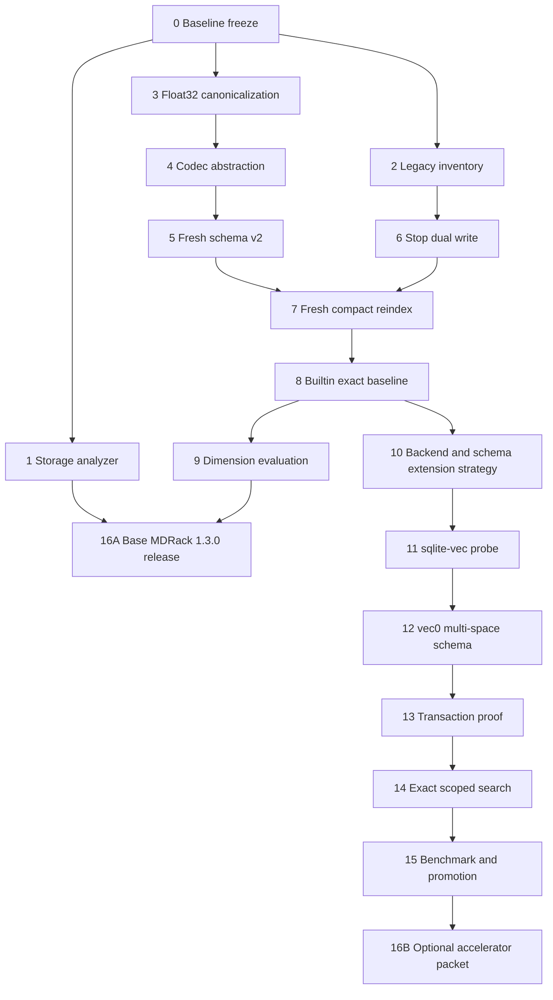

# MDRack 1.3 — Compact Storage, Exact Retrieval и опциональный `sqlite-vec`

**Статус документа:** активный план реализации и acceptance contract
**Целевая версия приложения:** `MDRack 1.3.0`
**Экспериментальная линия:** `MDRack 1.3.x` + `mdrack-sqlite-vec`
**Исходная продуктовая база:** `MDRack 1.2.0`
**Дата плана:** 2026-07-24
**Основной принцип:** ядро остаётся provider-, codec- и storage-neutral; физическое хранение и ускорение принадлежат адаптерам.

---

## 1. Краткое решение

Версия 1.3 должна решить две уже измеренные проблемы существующей реализации:

1. Векторы хранятся в тяжёлом JSON-представлении.
2. Переходный compatibility-контур хранит часть embeddings одновременно в legacy- и resource-core таблицах.

Обязательный production scope версии 1.3:

```text
один канонический resource-core vector contour
+
канонические IEEE-754 float32 vectors
+
stdlib exact search как гарантированный fallback
+
полный fresh reindex из исходников в новую clean generation
+
безопасный односторонний cutover после verification
```

`sqlite-vec` не входит в обязательный путь 1.3.0. Он реализуется отдельным опциональным модулем после появления компактного и корректного baseline:

```text
mdrack-core
    ↑
mdrack-sqlite
    ↑
mdrack-sqlite-vec
```

Первый `sqlite-vec` backend должен быть:

- exact, а не ANN;
- float32, а не int8;
- derived и перестраиваемым;
- явно внедряемым при composition;
- fail-closed на writes;
- способным откатиться к builtin exact search только при доказанной консистентности canonical vectors;
- ограниченным честно поддерживаемыми metrics и scopes.

`pgvector` в 1.3 не реализуется. План формирует такую границу, чтобы будущий пакет `mdrack-pgvector` реализовал те же core ports без изменения retrieval-ядра.

---

## 2. Текущая исходная точка

### 2.1. Уже существующие возможности

На входе в этот план предполагается, что версия 1.2 уже предоставляет:

- типизированные `document`, `image`, `audio`, `video` resources;
- Markdown chunks;
- timed transcript units;
- video transcript units;
- frame-caption units;
- image caption/OCR text;
- metadata и facets;
- text, semantic и hybrid retrieval;
- resource-level grouping;
- whole-resource textual similarity;
- unified scopes `all`, `notes`, `audio`, `video`, `frames`, `images`;
- несколько embedding spaces;
- fingerprint validation;
- provider-neutral core;
- standalone `mdrack-core`, `mdrack-media` и `mdrack-sqlite` packages;
- candidate store generations и atomic active-pointer switching.

Storage-работа не должна добавлять новый тип ресурса, новую modality или новый способ извлечения контента. Она обязана одинаково обслуживать все уже существующие types и locators.

### 2.2. Измеренная проблема хранения

Для текущего Obsidian-корпуса ориентировочно имеются:

```text
Markdown resources:           1 397
chunk units:                 46 606
whole-resource units:        ≈1 397
expected core vector units:  ≈48 003
embedding dimensions:        1 024
```

Текущий JSON payload одного 1024-мерного embedding заметно больше бинарного массива:

```text
JSON numeric array:  около 21–22 KiB
float64 binary:       8 192 bytes
float32 binary:       4 096 bytes
float16 binary:       2 048 bytes
int8 payload:         около 1 024 bytes + параметры
```

Главная цель 1.3 — не получить теоретические `4×` только на vector payload, а уменьшить **полный active catalog**, ускорить exact search и сохранить retrieval correctness.

### 2.3. Текущая поисковая проблема

Builtin SQLite semantic search выполняет примерно такой путь:

```text
SQL scope filtering
→ загрузка всех подходящих vector BLOBs
→ JSON decode каждого vector
→ Python scoring loop
→ полная сортировка
→ candidate_limit
```

Даже после перехода на float32 поиск останется `O(n)`, но исчезнет дорогой JSON parse и значительно уменьшится объём чтения. Это и есть обязательный baseline, относительно которого оценивается `sqlite-vec`.

---

## 2.4. Проверенные внешние ограничения на дату плана

План опирается на следующие внешние факты, но не превращает их в непроверенные предпосылки реализации:

- `sqlite-vec` остаётся pre-v1 проектом, поэтому extension version обязана быть закреплена exact pin и записана в generation metadata.
- На дату документа последним stable release является `v0.1.9`; линия `v0.1.10-alpha.*` содержит экспериментальные ANN-возможности. План не использует alpha ANN.
- Stable `vec0` подходит для exact brute-force KNN и поддерживает metadata/partition constraints; конкретная семантика каждого MDRack scope всё равно доказывается contract tests.
- Python binding загружает extension через явное временное разрешение `enable_load_extension`; на некоторых системных macOS Python/SQLite эта возможность отсутствует.
- SQLite virtual-table API предусматривает transaction callbacks (`xBegin`, `xSync`, `xCommit`, `xRollback`), но наличие API не доказывает корректность конкретной реализации `vec0`. Поэтому транзакционность является promotion gate.
- Future `pgvector` adapter сможет реализовать exact, HNSW или IVFFlat search, однако filtered ANN имеет отдельные planner/recall нюансы и не ослабляет MDRack contract `scope before effective top-k`.

Текущий candidate version `sqlite-vec==0.1.9` не считается окончательно утверждённым до Этапа 11. Если probe обнаружит packaging, transaction или filtering blocker, версия либо backend отклоняется без изменения обязательного scope MDRack 1.3.0.

## 2.5. Точный baseline репозитория

На момент подготовки документа опубликованный `master` приложения соответствует release preparation `MDRack 1.2.0` (`4e7ac473850127245e855ef38e1cc2d92f620fce`). Перед реализацией исполнитель обязан повторно определить текущий HEAD: план не разрешает автоматически считать этот commit актуальным, если работа началась позже.

Standalone foundation packages на исходной точке имеют отдельные версии и контракты; изменение `mdrack-sqlite` API требует собственного version/compatibility review, даже если версия standalone приложения меняется на `1.3.0`.

## 2.6. Owner decision: data migration не выполняется

На 2026-07-24 единственный пользователь и тестировщик MDRack разрешил полностью
перестроить индекс из исходников. Поэтому 1.3 не переносит пользовательские rows,
vectors или active-generation database из формата 1.2.

Обязательная модель перехода:

```text
source documents/transcripts/frame captions/image text
→ новый clean compact store
→ новые f32 embeddings во fresh space identity
→ full verification
→ one-way active pointer cutover
```

Следствия:

- `0007`/JSON database не конвертируется и не backfill-ится;
- legacy vectors не читаются для построения новой generation;
- f32 canonicalization никогда не смешивается с прежними f64 values в одном space;
- предыдущие store files сохраняются как неактивные recovery artifacts до отдельной
  destructive cleanup authority, но runtime rollback на старый schema contract не обещается;
- source bytes остаются неизменными;
- schema migrations для создания **новой пустой базы** остаются обязательными;
  отменяется только data upgrade/migration существующей базы.

---

## 3. Entry Gate: что требуется до начала 1.3

Storage branch нельзя строить поверх незавершённой retrieval-логики.

### 3.1. Заморозить текущий baseline

Перед первым implementation commit необходимо:

1. Проверить `git status --short`.
2. Отдельно отreviewить и зафиксировать незакоммиченные изменения, если они существуют.
3. Подтвердить поведение:
   - объединения совместимых semantic spaces;
   - canonical raw/`sha256:` fingerprint matching;
   - video whole-resource centroid;
   - LM Studio batching;
   - evaluator и live-evidence tooling;
   - dense resource ranks;
   - multi-space search.
4. Выпустить immutable baseline commit.
5. Сохранить baseline package versions, migration manifests и schema digests.
6. Прогнать полный offline verification.
7. Создать baseline storage/evaluation packet.

### 3.2. Обязательные baseline-команды

Названия могут быть адаптированы к фактическим scripts, но evidence должен включать эквивалент:

```bash
uv run pytest
uv run ruff check src/ tests/
uv run ruff check packages/mdrack-core/src packages/mdrack-sqlite/src
uv run mypy packages/mdrack-core/src/mdrack_core packages/mdrack-sqlite/src/mdrack_sqlite
uv run python scripts/check_no_forbidden_deps.py
uv run python scripts/check_core_boundaries.py
uv run python scripts/check_sqlite_boundaries.py
git diff --check
uv build
```

### 3.3. Entry acceptance

Работа над 1.3 начинается только если:

- working tree чистый;
- baseline revision записан в план/evidence;
- все public scopes проходят;
- multi-space semantic search проходит;
- existing migrations считаются immutable;
- installed-package smoke успешен;
- source bytes на frozen corpus неизменны;
- нет privacy violations;
- не осталось неизвестного dual-write reader-а.

### 3.4. Stop conditions

Остановить 1.3 и вернуться к baseline, если:

- требуется одновременно менять retrieval semantics и storage format;
- core public DTO ещё плавает;
- не определён владелец whole-resource vectors;
- неизвестно, кто читает legacy `chunk_embeddings`;
- candidate generation lifecycle не проходит recovery tests;
- нет frozen quality corpus.

---

## 4. Цели версии 1.3

### 4.1. Функциональные цели

1. Сделать resource-core единственным каноническим vector contour.
2. Прекратить dual write в legacy vector table после parity gate.
3. Ввести codec abstraction, не меняя core search contracts.
4. Перевести production vectors на canonical little-endian float32.
5. Сохранить legacy JSON read только как diagnostic compatibility path.
6. Строить новую compact generation полным fresh reindex рядом со старым store.
7. Проверять и активировать fresh generation явными one-way операциями.
8. Добавить privacy-safe storage analyzer.
9. Добавить воспроизводимый benchmark builtin exact search.
10. Добавить SQLite-specific vector strategy boundary.
11. Реализовать отдельный экспериментальный `mdrack-sqlite-vec` package.
12. Доказать exact parity `builtin == sqlite-vec` до promotion.

### 4.2. Качественные цели

- Нулевое ухудшение public retrieval correctness для float32 baseline.
- Нулевое смешивание spaces, dimensions и fingerprints.
- Scope применяется до эффективного `top-k`.
- Result ranks остаются dense и one-based.
- Tie-breaking остаётся детерминированным.
- Portable evidence locators не меняются.
- Не логируются query text, content, metadata values, paths или vectors.

### 4.3. Цели хранения

Измеряются отдельно:

- vector payload bytes;
- total database bytes;
- WAL peak bytes;
- SHM bytes;
- freelist bytes;
- peak RSS;
- build time;
- cold/warm query latency.

Запрещено выдавать сокращение payload за такое же сокращение всей базы.

---

## 5. Явные non-goals

В 1.3 не входят:

- int8 production storage;
- float16 production storage;
- ANN;
- DiskANN;
- IVF;
- HNSW;
- NumPy как зависимость `mdrack-sqlite`;
- обязательный `sqlite-vec`;
- изменение resource types;
- visual image embeddings;
- acoustic audio embeddings;
- новый chunking algorithm;
- reranker;
- PostgreSQL implementation;
- автоматический daemon;
- in-place конвертация active database;
- тихий fallback после несогласованного write;
- динамические vec0-колонки для arbitrary facets;
- замена dot metric на cosine;
- удаление старой generation без отдельного destructive approval.

---

## 6. Архитектурные решения

## 6.1. Независимость обеспечивается направлением зависимостей

```text
mdrack-core
    ↑
mdrack-sqlite
    ↑
mdrack-sqlite-vec
```

Future:

```text
mdrack-core
    ↑
mdrack-pgvector
```

`mdrack-core` не импортирует:

- SQLite;
- `sqlite-vec`;
- PostgreSQL;
- binary codecs;
- `struct`-ориентированную persistence logic;
- NumPy;
- extension loaders.

## 6.2. Semantic identity и physical encoding различны

Semantic embedding-space identity включает:

```text
provider/runtime identity
model family/key
output dimensions
query instruction
normalization mode
semantic metric
fingerprint
```

Physical storage identity включает:

```text
codec_id
codec_version
byte order
component precision
lossless/lossy flag
quantization parameters
backend_id
backend schema version
```

Изменение codec не создаёт новое semantic space, если сохранённое каноническое vector value не меняется.

## 6.3. Float32 canonicalization выполняется до persistence boundary

Текущий core-контракт требует точного сохранения переданных значений. Поэтому SQLite adapter не должен молча округлять arbitrary Python float64.

Правильный путь:

```text
embedding provider output
→ application-side canonical_float32()
→ core получает Python floats, точно представимые как float32
→ memory catalog и SQLite получают одинаковые values
→ SQLite записывает bytes без дополнительной числовой трансформации
```

Query vector проходит ту же canonicalization.

Если caller передаёт vector, не соответствующий выбранной f32-policy, операция должна:

- либо явно канонизировать его до вызова core;
- либо fail closed;
- но не создавать скрытое расхождение memory/SQLite adapters.

`float32` является default только для app-owned compact generations, где value-policy
зафиксирована до построения batch. Generic standalone `mdrack-sqlite` не должен
молча менять codec существующего внешнего consumer-а: новая f32-policy требует
явного catalog/generation opt-in, а adapter принимает только уже канонические
значения. Compatibility review отдельно решает, какой lossless codec сохраняет
поведение существующих standalone catalogs без такого opt-in.

## 6.4. `VectorCodec` и `SQLiteVectorBackend` — разные interfaces

```python
class VectorCodec(Protocol):
    codec_id: str
    codec_version: int
    lossy: bool

    def encode(
        self,
        vector: Sequence[float],
        *,
        dimensions: int,
    ) -> bytes: ...

    def decode(
        self,
        payload: bytes,
        *,
        dimensions: int,
    ) -> tuple[float, ...]: ...
```

```python
class SQLiteVectorBackend(Protocol):
    backend_id: str

    def capabilities(self) -> SQLiteVectorCapabilities: ...

    def initialize(
        self,
        connection: sqlite3.Connection,
        *,
        generation: VectorGenerationContext,
    ) -> None: ...

    def replace_vectors(
        self,
        connection: sqlite3.Connection,
        *,
        resource_id: str,
        spaces: Sequence[EmbeddingSpaceRecord],
        vectors: Sequence[VectorRecord],
    ) -> None: ...

    def delete_vectors(
        self,
        connection: sqlite3.Connection,
        *,
        resource_id: str,
    ) -> None: ...

    def read_vector(
        self,
        connection: sqlite3.Connection,
        *,
        unit_id: str,
        space_id: str,
    ) -> VectorRecord | None: ...

    def search_vector(
        self,
        connection: sqlite3.Connection,
        branch: VectorBranch,
        *,
        scope: SearchScope,
    ) -> list[RankedCandidate]: ...

    def verify(
        self,
        connection: sqlite3.Connection,
        *,
        generation: VectorGenerationContext,
    ) -> VectorBackendVerification: ...
```

Codec отвечает за `values ↔ bytes`.

Backend отвечает за:

- write;
- delete;
- read;
- search;
- derived index lifecycle;
- capabilities;
- verification.

## 6.5. Explicit composition

Базовый пакет не выполняет скрытое plugin discovery:

```python
# Запрещённый путь
try:
    import mdrack_sqlite_vec
except ImportError:
    ...
```

Composition происходит явно:

```python
backend = create_vector_backend(config)
catalog = SQLiteCatalog.open(
    path,
    vector_backend=backend,
)
```

Import availability не является runtime configuration.

## 6.6. Canonical float32 остаётся источником истины

Для первого `sqlite-vec` релиза:

```text
core_unit_embeddings
    canonical f32 source of truth

vec0 virtual tables
    derived acceleration index
```

Преимущества:

- extension можно заменить;
- vec0 можно перестроить;
- manifest export не зависит от extension;
- builtin exact search остаётся доступным;
- `read_vector()` использует canonical table;
- pre-v1 format не становится единственным persistent contract.

## 6.7. Writes fail closed

Если generation объявлена `vector_backend=sqlite_vec` и derived index должен поддерживаться синхронно:

```text
extension unavailable
или vec0 write failed
→ rollback всей resource transaction
```

Нельзя разрешать:

```text
canonical vectors updated
vec0 stale
sqlite-vec search still enabled
```

Состояние `dirty` сознательно откладывается. Оно требует отдельного lifecycle и crash-recovery protocol.

## 6.8. Read fallback разрешён только при доказанной консистентности

При отсутствии extension built-in search может использовать canonical vectors только если:

- canonical generation verified;
- acceleration metadata не утверждает незавершённый write;
- приложение не обращается к vec0 table;
- открытие DB без module безопасно в конкретном окружении;
- fallback capability прошла installed-package test.

Если DB с неизвестным `vec0` module нельзя безопасно открыть/прочитать, активная sqlite-vec generation считается extension-required. Fallback тогда выполняется через переключение на builtin generation, а не через магию внутри той же DB.

## 6.9. Одна vec0-таблица на embedding space

Причины:

- dimensions фиксированы;
- metric фиксирована;
- fingerprint фиксирован;
- schema `vec0` не должна смешивать несовместимые spaces.

Имя таблицы:

```text
vec_space_<safe_hash>
```

Например:

```text
vec_space_a17f29c49b1e
```

Ни один пользовательский `space_id` напрямую не подставляется в SQL identifier.

## 6.10. Exact semantics обязательны

Первый sqlite-vec backend использует только stable exact KNN.

Для exact backend требуется:

```text
builtin top-k IDs == sqlite-vec top-k IDs
builtin dense ranks == sqlite-vec dense ranks
score difference находится в согласованной f32 tolerance
scope isolation == 100%
```

ANN и approximate recall не рассматриваются в этом плане.

---

## 7. Пакеты и ownership

## 7.1. `mdrack-core`

Без изменений public contracts, если не обнаружен blocker.

Владеет:

- resource graph records;
- embedding spaces и ready vectors;
- search requests;
- scopes;
- weighted RRF;
- grouping;
- discovery/similarity;
- errors/degradations;
- safe observability.

Не владеет:

- codec;
- extension loading;
- SQL tables;
- vector acceleration lifecycle.

## 7.2. `mdrack-sqlite`

Production baseline для app-owned compact generation:

- clean SQLite catalog;
- FTS5;
- canonical float32 storage;
- builtin exact vector backend;
- codec registry;
- vector backend injection protocol;
- schema migrations;
- catalog verification;
- common adapter contract suite.

Для generic standalone consumers codec выбирается явно и не ослабляет frozen core
port contract. Existing catalogs сохраняют прежнюю lossless семантику, пока caller
не создаст новую generation/catalog с объявленной f32 value-policy.

Пакет должен сохранить минимальную зависимость:

```text
mdrack-core
+
Python standard library
```

## 7.3. `mdrack-sqlite-vec`

Новый experimental distribution:

```text
dependencies:
    mdrack-sqlite == compatible pinned version
    sqlite-vec == exact probed version
```

Владеет:

- extension loading;
- version probe;
- `SQLiteVecVectorBackend`;
- plugin schema registry;
- vec0 table creation;
- vec0 write/delete/search;
- backend verification;
- platform/package probes;
- sqlite-vec-specific tests.

Не владеет:

- resources;
- representations;
- units;
- facets;
- FTS;
- application generation pointer;
- RRF;
- provider calls.

## 7.4. Standalone `mdrack`

Владеет composition:

```python
create_vector_backend(config)
SQLiteCatalog.open(..., vector_backend=backend)
```

Предоставляет CLI:

- analyzer;
- rebuild;
- verify;
- activate;
- rollback только между совместимыми clean v2 generations;
- backend probe;
- benchmark.

## 7.5. Future `mdrack-pgvector`

Не зависит от `mdrack-sqlite` и не реализует `SQLiteVectorBackend`.

Он реализует core `CatalogPort`/`SearchPort` как самостоятельный adapter и проходит общий conformance suite.

---

## 8. Codec design

## 8.1. Codec inventory версии 1.3

### `json-f64-v1`

Назначение:

- read legacy data;
- diagnostics of retained 1.2 stores;
- compatibility tests only.

Он не участвует в fresh 1.3 rebuild и не используется для новых production writes.

### `ieee754-f64-le-v1`

Lossless default для generic standalone catalogs без explicit f32 value-policy:

```text
component type: IEEE-754 binary64
byte order: little endian
payload size: dimensions × 8
lossy flag: false относительно accepted core Python float values
```

Этот codec сохраняет frozen exact-value contract `mdrack-core` для внешнего host-а.

### `ieee754-f32-le-v1`

Production default для app-owned compact generation с явной f32 value-policy:

```text
component type: IEEE-754 binary32
byte order: little endian
payload size: dimensions × 4
lossy flag: false относительно canonical f32 input
```

### Зарезервированные, но не реализованные

```text
ieee754-f16-le-v1
scalar-int8-symmetric-v1
```

Наличие codec interface не является разрешением реализовать все codecs в одном релизе.

## 8.2. Canonicalization helper

Application-level helper:

```python
def canonicalize_float32(
    vector: Sequence[float],
) -> tuple[float, ...]:
    ...
```

Требования:

- rejects bool;
- rejects NaN/Infinity;
- preserves length;
- preserves signed zero;
- converts through explicit binary32 representation;
- returns Python floats exactly representing stored binary32 values;
- deterministic across platforms;
- used for document, audio, video, frame-caption and image-text vectors;
- used for query vectors and stored vectors.

## 8.3. Codec validation

`ieee754-f32-le-v1` обязан проверять:

- `dimensions > 0`;
- exact payload length;
- finite components;
- no trailing bytes;
- no truncation;
- canonical endian/version;
- signed-zero round-trip;
- stable byte output;
- compatibility with `sqlite-vec` float BLOB serialization.

## 8.4. No per-vector type-specific codecs

Запрещены policies вида:

```text
Markdown → float32
video → float16
images → int8
```

Codec принадлежит embedding space/backend generation, а не resource kind.

---

## 9. Fresh schema contracts и две независимые migration histories

В проекте существуют две разные схемы:

1. Historical application/bridge schema `0000`–`0007`.
2. Clean standalone `mdrack-sqlite` schema, используемая fresh 1.3 generation.

Они не должны имитировать одну migration chain. Data upgrade между ними не выполняется.

## 9.1. App generation contract

App history `0000`–`0007` остаётся immutable и не получает data-upgrade migration.
MDRack 1.3 строит отдельную generation на clean standalone contract
`mdrack_sqlite_catalog_v2` и не открывает active `0007` database для переноса rows.

Generation manager получает новый точный contract kind и умеет:

- создать fresh v2 candidate без открытия старой DB;
- прочитать старый pointer только как retained-generation metadata;
- активировать verified v2 candidate one-way;
- не обещать runtime rollback на `0007` старым или новым build-ом.

## 9.2. Standalone package schema

`mdrack-sqlite` получает новый clean schema identity `mdrack_sqlite_catalog_v2`.
Новая DDL migration создаёт codec/backend metadata только в пустой v2 database.
Существующий v1 catalog `0003` не upgraded in place: пользователь создаёт новый
catalog и повторно индексирует source material. Runner различает exact v1/v2
identity и не принимает unknown drift за разрешённый predecessor.

## 9.3. Plugin-owned schema

`mdrack-sqlite-vec` имеет собственный plugin manifest, но не вмешивается в base migration ledger.
До создания plugin objects базовый verifier получает registered-extension schema
contract: base objects хешируются отдельно, а разрешённый namespace и exact plugin
manifest/digest проверяются отдельно. Неизвестный или подменённый object остаётся
fail-closed schema mismatch.

Relational registry может выглядеть так:

```sql
CREATE TABLE sqlite_vector_backends (
    generation_id TEXT PRIMARY KEY,
    backend_id TEXT NOT NULL,
    backend_schema_version INTEGER NOT NULL,
    canonical_codec_id TEXT NOT NULL,
    acceleration_state TEXT NOT NULL,
    extension_version TEXT,
    table_registry_digest TEXT,
    canonical_vector_count INTEGER NOT NULL,
    derived_vector_count INTEGER NOT NULL,
    built_at TEXT,
    verified_at TEXT
);
```

```sql
CREATE TABLE sqlite_vec_spaces (
    generation_id TEXT NOT NULL,
    space_id TEXT NOT NULL,
    table_name TEXT NOT NULL,
    dimensions INTEGER NOT NULL,
    metric TEXT NOT NULL,
    fingerprint TEXT NOT NULL,
    extension_version TEXT NOT NULL,
    schema_version INTEGER NOT NULL,
    PRIMARY KEY (generation_id, space_id),
    UNIQUE (generation_id, table_name)
);
```

Virtual tables создаёт только plugin initializer после успешного extension probe.

## 9.4. Acceleration states

Для первого релиза достаточно:

```text
absent
building
ready
failed
```

Состояние `dirty` не используется в write path 1.3.x.

Любой write failure:

```text
transaction rollback
→ прежнее ready состояние сохраняется
```

## 9.5. Migration invariants

- Старые migration files immutable.
- App и package manifests имеют отдельные digests.
- Existing v1/`0007` databases не upgraded и не являются runtime rollback targets.
- v2 создаётся только как новая пустая database с fresh reindex.
- Plugin schema version хранится отдельно.
- Builtin DB не содержит обязательного `vec0` DDL.
- Extension upgrade требует новой candidate generation или явного plugin migration plan.
- Unknown future schema fails closed.

---

## 10. Scope и metric capabilities

## 10.1. Категориальные fields, подходящие для vec0 metadata

Первая версия может проецировать:

```text
resource_kind
media_type
source_namespace
representation_kind
modality
unit_kind
```

Эти поля конечны, стабильны и часто участвуют в unified scopes.

## 10.2. Facets

`facets_any`, `facets_all`, `facets_none` остаются relational many-to-many filters.

Первый sqlite-vec backend не обязан ускорять их.

Routing:

```python
if scope_has_facets(scope):
    return builtin_backend.search_vector(...)
```

Это fallback по capability, а не ошибка.

## 10.3. Metrics

Builtin backend поддерживает core metrics:

```text
cosine
dot
l2
```

Первый sqlite-vec backend рекламирует только реально проверенные metrics, ожидаемо:

```text
cosine
l2
```

Для `dot`:

```text
use builtin backend
```

Запрещено:

- подменять dot cosine;
- неявно нормализовать vectors;
- возвращать другой metric score под старым именем.

## 10.4. Capability object

```python
@dataclass(frozen=True)
class SQLiteVectorCapabilities:
    backend_id: str
    exact: bool
    metrics: frozenset[str]
    supports_facets_any: bool
    supports_facets_all: bool
    supports_facets_none: bool
    supported_scope_fields: frozenset[str]
    supports_extensionless_open: bool
    supports_atomic_replace: bool
    supports_atomic_delete: bool
```

Routing должен быть детерминированным и логируемым без пользовательских значений.

---

## 11. Предлагаемый CLI

## 11.1. Storage analysis

```bash
mdrack storage analyze [--generation active|NAME] [--json]
```

Выводит только safe aggregates:

```json
{
  "database_bytes": 0,
  "wal_bytes": 0,
  "shm_bytes": 0,
  "page_size": 4096,
  "page_count": 0,
  "freelist_pages": 0,
  "resource_counts": {},
  "unit_counts": {},
  "vector_counts_by_space": {},
  "dimensions_by_space": {},
  "codec_by_space": {},
  "backend_id": "builtin_exact-v1",
  "legacy_vector_count": 0,
  "core_vector_count": 0,
  "average_vector_payload_bytes": 0
}
```

## 11.2. Backend probe

```bash
mdrack storage vector-backends
mdrack storage probe sqlite-vec --json
```

Probe проверяет:

- import;
- extension load;
- SQLite version;
- `vec_version()`;
- supported metrics;
- 1024 dimensions;
- insert/search/delete;
- transaction rollback;
- extension-less reopen behavior;
- no network attempts.

## 11.3. Candidate rebuild

```bash
mdrack storage rebuild-fresh \
  --vector-codec float32 \
  --vector-backend builtin \
  --candidate-name compact-f32
```

Experimental:

```bash
mdrack storage rebuild-fresh \
  --vector-codec float32 \
  --vector-backend sqlite-vec \
  --candidate-name compact-f32-sqlite-vec
```

## 11.4. Verification и cutover

```bash
mdrack storage verify compact-f32 --full
mdrack storage activate compact-f32
mdrack storage generations
```

`activate` для 1.3 является one-way cutover на clean v2 contract. Команда не удаляет
retained old store, но runtime rollback на несовместимый `0007` не предоставляет.

## 11.5. Benchmark

```bash
mdrack storage benchmark \
  --backend builtin \
  --backend sqlite-vec \
  --dataset real-current \
  --repeat 10 \
  --json
```

Synthetic:

```bash
mdrack storage benchmark \
  --backend builtin \
  --backend sqlite-vec \
  --vectors 10000,50000,100000 \
  --dimensions 384,1024 \
  --repeat 10 \
  --json
```

---

# 12. Этапы разработки

Ниже обязательный порядок. Каждый этап имеет owner, входы, выходы, тесты, acceptance и stop conditions.

---

## Этап 0. Baseline freeze и ADR

### Цель

Зафиксировать текущие retrieval/storage contracts и принять архитектурное решение до изменения SQL.

### Задачи

1. Review текущего working tree.
2. Коммит всех независимых retrieval fixes.
3. Full verification.
4. Frozen baseline revision.
5. ADR:
   - codec принадлежит SQLite adapter;
   - canonicalization до core persistence boundary;
   - core не меняется;
   - backend injection explicit;
   - canonical f32 source of truth;
   - sqlite-vec derived;
   - writes fail closed;
   - exact-only first release;
   - separate migration ledgers;
   - int8/ANN deferred.
6. Freeze public CLI/API compatibility matrix.

### Зависимости

Нет.

### Можно параллельно

- Подготовка benchmark fixtures.
- Подготовка private-corpus authorization procedure.

### Unit/contract tests

- Contract snapshots unchanged.
- Core boundary tests unchanged.
- Package dependency tests unchanged.

### Самопроверка

```bash
git status --short
git log -1 --oneline
uv run pytest
uv run python scripts/check_core_boundaries.py
uv run python scripts/check_sqlite_boundaries.py
```

### Acceptance

- Exact baseline commit записан.
- ADR accepted.
- Existing migrations immutable.
- No unreviewed retrieval diff.

### Stop conditions

- Невозможно описать active vector readers/writers.
- Public result shapes не заморожены.
- Multi-space behavior неизвестно.

### Рекомендуемый коммит

```text
docs(architecture): freeze compact-storage and exact-backend contracts
```

---

## Этап 1. Privacy-safe storage analyzer

### Цель

Получить реальную baseline-арифметику до оптимизации.

### Задачи

1. Реализовать analyzer для app generation.
2. Реализовать analyzer для standalone catalog.
3. Считать:
   - main/WAL/SHM bytes;
   - pages/freelist;
   - resources/representations/units;
   - vectors by space;
   - dimensions;
   - payload min/median/p95/max;
   - legacy/core duplication;
   - FTS bytes, если доступно безопасно;
   - codec/backend registry;
   - readiness state.
4. CLI и Python DTO.
5. JSON output contract.

### Зависимости

Этап 0.

### Можно параллельно

- Этап 2 importer inventory.
- Benchmark asset generation.

### Unit tests

- Empty DB.
- Legacy-only DB.
- Core-only DB.
- Dual-write DB.
- WAL present/absent.
- Corrupted metadata row.
- Multiple spaces/dimensions.
- No path/content leakage.

### Integration tests

- Analyzer output сверяется с direct SQL и filesystem stat.
- Installed package invocation.

### Acceptance

- Counts точны.
- Никаких source names, paths, text или vectors в output/logs.
- Baseline report committed как evidence artifact.

### Stop conditions

- Analyzer требует чтения пользовательских текстов.
- Analyzer смешивает payload reduction и total DB reduction.

### Коммит

```text
feat(storage): add privacy-safe catalog analyzer
```

---

## Этап 2. Inventory legacy vector readers/writers

### Цель

Доказать, когда можно прекратить dual write.

### Задачи

1. Найти все записи в:
   - `chunk_embeddings`;
   - `core_unit_embeddings`.
2. Найти все semantic/hybrid/similarity readers.
3. Составить compatibility registry:
   - CLI;
   - `MDRackEngine`;
   - legacy facades;
   - manifest export/import;
   - rebuild;
   - eval;
   - tests;
   - installed-package smoke.
4. Перевести legacy public surfaces на core-backed implementation с DTO mapping.
5. Сделать write counter assertions.

### Зависимости

Этап 0.

### Можно параллельно

Этап 1.

### Tests

- Frozen query corpus parity.
- CLI/engine parity.
- Old DTO key-set parity.
- Scores/ranks/nullability parity.
- No new legacy writes after cutover feature flag.

### Acceptance

- Все production readers перечислены.
- Core path даёт accepted public behavior.
- Новый scan/rebuild может работать без `chunk_embeddings` write.

### Stop conditions

- Существует reader, которому нельзя дать core equivalent.
- Legacy score semantics не определены.

### Коммиты

```text
test(storage): inventory legacy vector consumers
refactor(search): route compatibility semantics through resource core
```

---

## Этап 3. Float32 canonicalization policy

### Цель

Определить числовое значение до SQLite, не нарушая core exactness contract.

### Задачи

1. Реализовать `canonicalize_float32()`.
2. Применить к:
   - indexing vectors;
   - whole-resource vectors;
   - transcript/video/frame/image text vectors;
   - query vectors;
   - manifest import vectors при f32-policy.
3. Обязательно включить canonicalization policy в embedding profile, producer fingerprint
   и deterministic space identity fresh generation.
4. Не смешивать model quantization и storage codec.
5. Добавить explicit policy ID:

```text
vector_value_policy = ieee754-f32-canonical-v1
```

### Зависимости

Этап 0.

### Можно параллельно

Codec implementation после API freeze.

### Unit tests

- exact representable values;
- rounding edge cases;
- positive/negative zero;
- min/max finite float32;
- overflow rejection;
- NaN/Infinity rejection;
- bool rejection;
- deterministic bytes across repeats;
- query/storage same canonicalization.

### Property tests

```text
canonicalize(canonicalize(v)) == canonicalize(v)
pack(decode(pack(v))) stable
memory and SQLite see same tuple
```

### Acceptance

- Core receives canonical values.
- Memory/SQLite contract parity.
- Ни один f32 write/query не направляется в retained f64/JSON space identity.
- Этап не deployable для active 1.2 store; он включается только внутри fresh v2 build/cutover.
- Existing semantic quality baseline not degraded beyond defined tolerance.

### Stop conditions

- SQLite adapter remains owner of hidden rounding.
- Query vector and stored vectors use different policies.

### Коммит

```text
feat(embeddings): canonicalize vector values before persistence
```

---

## Этап 4. Codec abstraction в `mdrack-sqlite`

### Цель

Отделить physical bytes от search/storage orchestration.

### Задачи

1. Добавить `VectorCodec` protocol.
2. Реализовать legacy `JsonF64Codec` read.
3. Реализовать lossless `Float64LECodec` read/write.
4. Реализовать `Float32LECodec` read/write для explicit f32 policy.
5. Добавить codec registry.
6. Удалить прямые `json.dumps/json.loads` из canonical vector path.
7. Добавить codec-aware corruption errors.
8. Сохранить `read_vector()` core DTO.

### Зависимости

Этап 3.

### Unit tests

- dimensions×4 и dimensions×8 exact size;
- malformed/truncated/trailing payload;
- wrong codec ID;
- wrong endian/version;
- finite values;
- signed zero;
- deterministic bytes;
- legacy JSON decode;
- mixed codec rows внутри одного space identity fail closed.

### Contract tests

Memory vs SQLite canonical vector equality.

### Acceptance

- New f32 app-generation writes не используют JSON.
- Generic standalone write-path использует lossless binary f64 без f32 opt-in.
- Retained legacy JSON rows читаются только diagnostic compatibility path.
- Package still stdlib-only.

### Stop conditions

- В пакет добавлена NumPy dependency.
- Codec меняет vector semantics после core boundary.

### Коммит

```text
feat(sqlite): add canonical vector codec abstraction
```

---

## Этап 5. Fresh schema identities и clean-store creation

### Цель

Создать новый app/standalone compact schema contract без data migration существующих DB.

### Задачи

1. Новый `mdrack_sqlite_catalog_v2` identity для fresh clean catalogs.
2. DDL migration применяется только к новой пустой database.
3. App generation contract ссылается на clean v2 catalog, а не bridge `0007`.
4. Separate manifest/digest updates.
5. Codec/backend registry tables.
6. Generation verification updates.
7. Explicit rejection of in-place v1/`0007` upgrade.
8. Fresh-create failure injection.

### Зависимости

Этапы 0 и 4.

### Можно параллельно

App generation contract и package v2 schema могут писать разные owners после согласованного schema review.

### Tests

- Fresh v2 DB.
- Existing v1/`0007` DB rejected as upgrade source.
- Missing DDL migration.
- Unknown future schema.
- Manifest digest mismatch.
- Rollback after fresh-create SQL failure.
- App/package histories не принимают contract друг друга.

### Acceptance

- Fresh v2 catalog создаётся детерминированно.
- Никакие user rows/vectors не копируются из старой DB.
- Builtin DB не требует sqlite-vec.
- Old migrations untouched.

### Stop conditions

- Реализация пытается UPDATE/backfill существующую DB.
- Один migration directory используется как общий для разных contracts.
- Extension необходим для builtin creation.

### Коммиты

```text
feat(storage): add app vector encoding generation schema
feat(sqlite): add standalone vector encoding schema
```

---

## Этап 6. Core-only write cutover

### Цель

Прекратить новое двойное хранение embeddings.

### Задачи

1. Feature-gated stop legacy vector writes.
2. Core catalog становится source of truth.
3. Legacy DTO mapping остаётся.
4. Counters и diagnostics подтверждают zero legacy writes.
5. Не удалять physical legacy table в этом этапе.
6. Document deprecation window.

### Зависимости

Этап 2.

### Tests

- Full Markdown scan.
- Transcript/video/image ingestion.
- Unified search.
- Legacy CLI/engine APIs.
- `chunk_embeddings` row count не растёт.
- Core counts совпадают с expected units.

### Acceptance

- Production workflows не требуют новой legacy vector row.
- Retained legacy store остаётся неизменным и не является runtime dependency.
- Public behavior сохранено.

### Stop conditions

- Хотя бы один supported path читает только legacy vector.
- Manifest export теряет vectors.

### Коммит

```text
refactor(storage): stop legacy vector dual writes after parity
```

---

## Этап 7. Fresh compact candidate reindex

### Цель

Создать новую core-only float32 generation полным reindex из source inputs, не читая vectors/rows active DB.

### Задачи

1. `storage rebuild-fresh --vector-codec float32 --vector-backend builtin`.
2. Discover source documents и явно supplied transcript/frame/image-text inputs read-only.
3. Reparse/reproject все resources.
4. Повторно вычислить embeddings с pinned profile/value-policy.
5. Записать только clean resource-core graph и binary f32 vectors.
6. Verify counts, quality judgments и source hashes.
7. WAL checkpoint на открытом connection.
8. Close connection, fsync DB и directory.
9. Mark candidate ready.
10. Активировать one-way pointer switch.
11. Сохранить прежние store files без runtime rollback claim и без cleanup.

### Зависимости

Этапы 4, 5, 6.

### Tests

- Interruption before DB create.
- Interruption during source reparse.
- Interruption during embedding/reindex.
- Interruption before verification.
- Interruption before pointer switch.
- Interruption after pointer switch.
- Existing active `0007` pointer не требует открытия old DB для fresh rebuild.
- Candidate cleanup leaves old store files untouched.

### Acceptance

- Expected source/resource/representation/unit/vector/facet counts match fresh build.
- BLOB sizes exact.
- No legacy rows/vectors copied.
- `PRAGMA integrity_check` successful.
- Foreign keys successful.
- FTS parity.
- Search quality parity.
- Source hashes unchanged.
- Fresh v2 generation reopens после cutover.

### Stop conditions

- Читаются legacy vectors/rows для построения candidate.
- Выполняется in-place UPDATE active generation.
- Candidate is activated before full verification/checkpoint/close/fsync.

### Коммит

```text
feat(storage): rebuild compact float32 candidate generations
```

---

## Этап 8. Builtin exact backend baseline

### Цель

Получить корректный и измеренный stdlib exact backend после удаления JSON parsing.

### Задачи

1. Реализовать `BuiltinExactVectorBackend` за новым strategy interface.
2. Binary decode через stdlib (`struct`, `array` или `memoryview`).
3. Не добавлять NumPy.
4. Сохранить scope-before-limit.
5. Сохранить cosine/dot/L2.
6. Добавить counters:
   - candidate rows;
   - decoded vectors;
   - skipped vectors;
   - score time;
   - sort time.
7. Benchmark cold/warm path.

### Зависимости

Этапы 4 и 7.

### Unit tests

- cosine/dot/L2 matrix;
- zero vectors;
- malformed vector;
- multiple spaces;
- fingerprint mismatch;
- deterministic ties;
- dense ranks;
- candidate limit;
- all scopes/facets.

### Performance tests

```text
10k × 384
50k × 384
48k × 1024 real-shaped
100k × 1024 synthetic
```

### Acceptance

- Exact public parity.
- Значимое уменьшение decode CPU относительно JSON baseline.
- Database target published as measurement, not promise.
- Peak RSS recorded.

### Stop conditions

- Optimizer changes result order.
- Metric behavior отличается от core contract.

### Коммит

```text
perf(sqlite): add compact stdlib exact vector backend
```

---

## Этап 9. Dimension evaluation

### Цель

Проверить, не даёт ли уменьшение MRL dimensions больший выигрыш, чем lossy storage.

### Задачи

Сравнить candidate spaces:

```text
1024
768
512
384
```

На одинаковом corpus и queries.

### Зависимости

Этап 8 и live/local provider authorization.

### Можно параллельно

С sqlite-vec package skeleton, но не с изменением judgments.

### Metrics

- Recall@5/10;
- MRR@10;
- nDCG@10;
- timestamp hit/interval hit;
- top-k overlap;
- whole-resource similarity;
- database bytes;
- p50/p95 latency;
- RSS;
- indexing time.

### Acceptance

Выбирается минимальная dimension, проходящая заранее утверждённый quality budget. Если ни одна reduced dimension не проходит, остаётся 1024.

### Stop conditions

- Queries/judgments меняются после просмотра результатов.
- Разные profiles используют разные instructions без фиксации.

### Коммит

```text
test(evaluation): compare exact retrieval dimensions
```

---

## Этап 10. SQLite vector backend extension point

### Цель

Добавить explicit injection без sqlite-vec dependency.

### Задачи

1. Public/semipublic `SQLiteVectorBackend` protocol в `mdrack-sqlite`.
2. Capabilities object.
3. `SQLiteCatalog.open(..., vector_backend=...)`.
4. Builtin default.
5. No import probing.
6. Transaction owner остаётся `SQLiteResourceStore`/catalog.
7. Registered-extension schema contract для plugin-owned objects.
8. Base schema fingerprint отдельно от exact plugin manifest/digest.
9. Shared backend conformance tests.

### Зависимости

Этап 8.

### Tests

- Fake backend injection.
- Backend call ordering.
- Transaction begins before backend write.
- Backend failure rolls back relational graph.
- Delete ordering.
- Verify ordering.
- Valid registered plugin schema accepted.
- Unknown or modified plugin object rejected.
- Base schema mutation rejected.
- Builtin default unchanged.

### Acceptance

- `mdrack-sqlite` imports without optional packages.
- Existing users need no config change.
- Fake backend proves no duplicate Catalog implementation.

### Stop conditions

- Plugin должен subclass/copy entire catalog.
- Base package импортирует plugin.

### Коммит

```text
feat(sqlite): expose explicit vector backend strategy
```

---

## Этап 11. `mdrack-sqlite-vec` compatibility probe

### Цель

Проверить extension до реализации production backend.

### Задачи

1. Создать package skeleton.
2. Выбрать exact pinned version после probe.
3. Проверить Python package/install matrix.
4. Проверить extension loading.
5. Проверить SQLite version.
6. Проверить float32 384/1024.
7. Проверить cosine/L2.
8. Проверить metadata constraints.
9. Проверить DELETE.
10. Проверить transactions/rollback.
11. Проверить DB reopen без extension.
12. Проверить KNN ordering и возможность tie-safe boundary expansion.
13. Проверить exact ties/near-ties вокруг `candidate_limit`.
14. Проверить Windows/macOS constraints.
15. Проверить no-network import/construction.

### Зависимости

Этап 10.

### Probe matrix

- Linux CPython 3.11/3.12.
- Windows CPython 3.11/3.12.
- macOS supported Python distribution или documented unavailable state.
- Installed wheel.
- PyInstaller probe, если приложение выпускается как executable.

### Acceptance

Probe выдаёт machine-readable capabilities и exact extension version.

### Stop conditions

- Transaction rollback непредсказуем.
- DELETE broken в выбранной версии.
- 1024 dimensions не проходят.
- Exact tie boundary нельзя сделать детерминированной без полного scan.
- Extension cannot be packaged for target platform.

### Коммит

```text
build(sqlite-vec): add pinned compatibility probe package
```

---

## Этап 12. Vec0 derived schema и multi-space registry

### Цель

Создать derived exact index на каждый compatible space.

### Задачи

1. Safe table naming from hash.
2. Registry rows.
3. vec0 DDL generation.
4. Columns для категориального scope.
5. One table per space.
6. Table registry digest.
7. Build counts.
8. Verify dimensions/metric/fingerprint.

### Зависимости

Этап 11 PASS.

### Unit tests

- Safe hash names.
- Collision handling.
- SQL injection strings in `space_id` never become identifiers.
- Different dimensions create separate tables.
- Fingerprint mismatch fails.
- Unsupported dot not created.

### Integration tests

- 384 + 1024 spaces in same generation.
- Multiple fingerprints.
- Rebuild registry deterministic.

### Acceptance

- Registry exactly matches vec0 tables.
- Base verifier accepts only exact registered plugin objects and rejects drift.
- Derived count equals canonical count for supported spaces.
- Unsupported spaces remain builtin-only.

### Stop conditions

- One table mixes dimensions.
- User input controls table name.

### Коммит

```text
feat(sqlite-vec): add derived exact indexes per embedding space
```

---

## Этап 13. Transactional replace/delete и failure injection

### Цель

Доказать, что relational graph, canonical vectors и vec0 остаются согласованными.

### Задачи

1. Integrate backend writes в catalog transaction.
2. Fail-closed extension absence.
3. Failure hooks:
   - before vec delete;
   - during vec delete;
   - after vec delete;
   - before vec insert;
   - during vec insert;
   - after vec insert;
   - before verify;
   - after verify;
   - before commit.
4. Resource delete.
5. Repeated identical replace.
6. WAL recovery.
7. Process interruption subprocess tests.

### Зависимости

Этап 12.

### Mandatory invariants after every failure

```text
resource graph == previous complete graph
canonical vectors == previous complete vectors
vec0 vectors == previous complete derived vectors
acceleration state == previous ready state
```

### Tests

- Unit failure hooks.
- Integration transaction rollback.
- Subprocess kill.
- Reopen and verify.
- Concurrent reader during failed writer.
- DELETE regression with long metadata strings.

### Acceptance

- No mixed generation state.
- All failure tests deterministic.
- Fail-closed errors privacy-safe.

### Stop conditions

- Extension cannot guarantee rollback.
- Process crash leaves undetectable mismatch.
- Delete cannot be made atomic.

### Коммит

```text
test(sqlite-vec): prove atomic replace delete and recovery
```

---

## Этап 14. Exact sqlite-vec search и routing

### Цель

Использовать vec0 только для поддерживаемых requests, сохраняя exact contract.

### Задачи

1. Query serialization f32.
2. KNN cosine/L2.
3. Category constraints внутри vec0 query.
4. Tie-safe boundary expansion, только если probe доказал получение полной группы кандидатов на K-й дистанции.
5. Canonical f32 rescoring и финальная сортировка `(-score, unit_id)`.
6. Dense rank normalization.
7. Score mapping.
8. Builtin fallback for:
   - facets;
   - dot;
   - unsupported scope combination;
   - unsupported space;
   - extension unavailable при safe fallback.
9. No fallback on stale derived state.
10. Evidence enrichment через canonical unit/resource tables.

### Зависимости

Этап 13.

### Exact parity tests

Для каждого request:

```text
same top-k unit/resource IDs
same dense ranks
same deterministic tie order
score within f32 tolerance
same branch IDs
same portable evidence
same degradation
same scope isolation
```

### Scope matrix

- notes;
- audio;
- video transcripts;
- frames;
- images;
- all;
- source namespace;
- media type;
- representation kind;
- modality;
- unit kind;
- facets fallback.

### Acceptance

- Exact top-k parity 100% на frozen matrix и adversarial exact/near-tie property tests.
- No query uses vec0 when capabilities say unsupported.
- Scope применяется до effective limit.

### Stop conditions

- JOIN/post-filter path возвращает меньше expected results.
- Result parity требует approximate tolerance по IDs.

### Коммит

```text
feat(sqlite-vec): add scoped exact vector search with safe routing
```

---

## Этап 15. Benchmark и promotion review

### Цель

Решить, имеет ли backend практическую ценность.

### Задачи

1. Builtin vs sqlite-vec на одинаковых candidate generations.
2. Cold/warm runs.
3. Real-shaped and synthetic datasets.
4. Extension load/open/build/incremental write/delete measurements.
5. Scope-specific benchmark.
6. Facet fallback benchmark.
7. Full report with raw immutable JSON.
8. Independent review.

### Required measurements

#### Build

- extension load time;
- vec0 table creation time;
- full derived rebuild time;
- incremental replace time;
- delete time;
- verify time;
- WAL peak;
- final canonical DB bytes;
- final derived bytes.

#### Search

- cold open;
- first query;
- warm p50/p95/p99;
- peak RSS;
- candidate rows;
- decoded vectors builtin;
- scope variants;
- facet fallback;
- 384/1024 dimensions.

### Promotion gate

`mdrack-sqlite-vec` может перейти из experimental в supported optional, если:

1. Exact top-k parity = 100%.
2. Scope isolation = 100%.
3. Transaction/recovery suite PASS.
4. Multi-space suite PASS.
5. Extension absence behavior documented and tested.
6. Incremental replace/delete PASS.
7. Installed-package matrix PASS на заявленных platforms.
8. Реальное p95 improvement — целевой минимум `2×` на основном 48k×1024 corpus или другая заранее утверждённая существенная польза.
9. WAL/rebuild cost не делает обычный indexing неприемлемым.
10. No privacy regressions.

Если gate не пройден:

- package остаётся experimental;
- builtin float32 остаётся default;
- core/storage architecture не откатывается.

### Коммит

```text
test(performance): publish builtin and sqlite-vec exact benchmark
```

---

## Этап 16A. Base 1.3.0 packaging и release packet

### Цель

Выпустить compact builtin MDRack 1.3.0 независимо от sqlite-vec experiment.

### Versions

```text
mdrack                1.3.0
mdrack-core           без bump, если contract не менялся
mdrack-media          без bump, если contract не менялся
mdrack-sqlite         next reviewed RC/minor with clean v2 contract
```

### Release assets

- base wheels/sdists;
- clean v2 schema manifest/digest;
- storage analyzer and benchmark JSON;
- quality/privacy/source-hash report;
- fresh-reindex and one-way cutover guide;
- installed-package smoke.

### Acceptance

- Зависит от Этапов 1–9 и их evidence.
- Base app работает без extension.
- Fresh v2 store reindexes all supported resource kinds.
- Existing v1/`0007` data migration и runtime rollback не заявляются.
- Retained old store cleanup не выполняется.

### Коммиты

```text
docs(release): publish MDRack 1.3 compact storage evidence
chore(release): prepare MDRack 1.3.0
```

## Этап 16B. Optional accelerator packet

### Цель

После PASS Этапов 10–15 отдельно опубликовать experimental accelerator.

### Version и distribution

```text
mdrack-sqlite-vec     0.1.0 experimental
pip install "mdrack[sqlite-vec]"
```

Extra устанавливает отдельный distribution; base import не зависит от него.

### Release assets

- plugin wheel/sdist;
- exact extension pin;
- capabilities/schema manifest;
- transaction/tie/scope parity evidence;
- platform support table;
- benchmark JSON.

### Acceptance

- Experimental extra устанавливается отдельно.
- Missing extra даёт понятную validation/config error, а не import crash.
- Registered plugin schema verification PASS.
- Promotion review принимает exact artifact independently.

### Коммит

```text
build(sqlite-vec): publish experimental optional backend
```

---

# 13. Параллельные рабочие потоки

## Поток A — Baseline и contracts

Содержит:

- Этап 0;
- compatibility registry;
- ADR;
- public contract freeze.

Блокирует почти всё остальное.

## Поток B — Measurement и evaluation assets

Содержит:

- analyzer fixtures;
- benchmark corpora;
- judgments;
- real-query manifests;
- source-hash manifests.

Можно начинать после Этапа 0 параллельно с codec work.

## Поток C — Codec и canonicalization

Содержит:

- Этапы 3–5;
- unit/property tests;
- app/package migrations.

App и package migrations можно вести параллельно после единого schema review.

## Поток D — Compatibility cutover

Содержит:

- Этапы 2 и 6;
- legacy reader inventory;
- DTO facade parity.

Может идти параллельно с codec implementation, но должен завершиться до candidate rebuild.

## Поток E — Builtin backend

Содержит:

- Этапы 7–9;
- candidate generation;
- exact benchmark;
- dimension evaluation.

Зависит от codec/migrations/cutover.

## Поток F — sqlite-vec plugin

Содержит:

- Этапы 10–15.

Может начать package skeleton после strategy protocol, но production implementation запрещена до compatibility probe PASS.

## Поток G — Packaging/platform

Содержит:

- installed wheels;
- Windows/macOS probes;
- PyInstaller;
- extra installation.

Начинается после plugin probe.

## Поток H — Docs/evidence/recovery

Идёт постоянно, но final evidence создаётся только на exact revisions.

---

## 14. Dependency graph



Base `MDRack 1.3.0` release не зависит от Этапов 10–15. Experimental
`mdrack-sqlite-vec` развивается и публикуется отдельной release cell; его FAIL не
задерживает compact builtin release.

---

# 15. Test assets

## 15.1. Frozen synthetic resource corpus

Должен включать минимум:

### Documents

- 20 Markdown resources;
- headings и exact line/offset locators;
- nested metadata;
- tags/facets;
- exact duplicate pair;
- semantically similar pair;
- one large document;
- one document with repeated similar chunks.

### Audio

- 4 timed transcript resources;
- 15–30 time segments each;
- exact expected intervals;
- queries hitting beginning/middle/end;
- one near-tie semantic query.

### Video

- 4 video resources;
- transcript units;
- whole-resource centroid;
- frame-caption units;
- overlapping topics between transcript and captions;
- frame-only query;
- speech-only query.

### Images

- 10 explicit image resources;
- caption/OCR text;
- whole-resource textual vectors;
- no pixel similarity claims.

### Spaces

- at least one 384-dimensional space;
- at least one 1024-dimensional space;
- cosine space;
- dot fallback space;
- L2 space;
- fingerprint mismatch fixture.

## 15.2. Storage-shaped synthetic matrix

```text
10,000 × 384
50,000 × 384
10,000 × 1024
48,003 × 1024
100,000 × 1024
```

Fixtures должны создаваться детерминированно и не читать relevance judgments.

## 15.3. Failure fixtures

- malformed JSON vector;
- truncated f32 BLOB;
- trailing bytes;
- NaN/Infinity;
- zero cosine vector;
- unknown codec;
- unknown backend;
- missing vec0 table;
- count mismatch;
- registry digest mismatch;
- extension unavailable;
- unsupported metric;
- stale acceleration state.

## 15.4. Real-corpus optional assets

Отдельно авторизованный corpus-copy:

- копия Obsidian vault;
- source hash manifest;
- frozen queries/judgments;
- no writes to originals;
- disposable generation;
- cleanup after evidence;
- no raw texts in report.

---

# 16. Testing strategy

## 16.1. Unit tests

Покрывают:

- canonicalization;
- codecs;
- table naming;
- capability routing;
- metric mapping;
- config parsing;
- analyzer aggregation;
- error categories;
- privacy sanitizer.

## 16.2. Property tests

Полезные properties:

```text
f32 canonicalization idempotent
codec round-trip exact relative to canonical f32
same input → same bytes
invalid length always rejected
safe table name never contains user input
builtin ranks dense
plugin ranks dense
```

## 16.3. Contract tests

Один adapter conformance suite для:

```text
Memory catalog
SQLite builtin
SQLite + sqlite-vec
future PostgreSQL + pgvector
```

Проверяет:

- replace/delete;
- reads;
- exact hash lookup;
- lexical search;
- vector search;
- scope before limit;
- dense ranks;
- deterministic ties;
- multi-space;
- fingerprint;
- errors/degradation.

## 16.4. Integration tests

- actual SQLite files;
- migrations;
- WAL;
- generation manager;
- plugin loading;
- extension absence;
- installed package;
- real CLI JSON.

## 16.5. End-to-end offline tests

### E2E A — fresh compact rebuild

```text
retained legacy/dual-write store + immutable source corpus
→ storage analyze old store
→ fresh reparse/re-embed into clean v2 core-only f32 store
→ verify
→ one-way activate
→ reopen and search all scopes
→ confirm old store and source hashes unchanged
```

### E2E B — typed resource parity

Запросы по:

- notes;
- audio;
- video;
- frames;
- images;
- all.

Сравниваются baseline и compact generation.

### E2E C — sqlite-vec exact parity

```text
same canonical generation content
→ builtin search
→ sqlite-vec search
→ exact result comparison
```

### E2E D — failure and recovery

```text
replace resource
→ inject failure inside vec0
→ reopen
→ verify previous graph
→ search remains correct
```

### E2E E — extension unavailable

Проверить обе допустимые политики:

1. Safe same-generation builtin fallback, если probe доказал возможность.
2. Explicit generation/backend unavailable error, если extension required.

### E2E F — real queries

На frozen judgments:

- lexical;
- semantic;
- hybrid;
- similarity;
- temporal evidence;
- frame-caption scope;
- metadata/facet fallback.

## 16.6. Live-provider E2E

Только отдельный authorized gate:

- pinned model;
- pinned dimensions/instructions;
- no paid provider unless approved;
- immutable query/judgment corpus;
- fresh candidate generations;
- cleanup and provider unload.

---

# 17. Benchmark methodology

## 17.1. Не смешивать build и query

Отдельно измеряются:

- fixture build;
- database open;
- extension load;
- first query;
- warm queries;
- incremental replace;
- delete;
- verification.

## 17.2. Cold run

Для каждого repeat:

1. Новый process.
2. Открытие DB.
3. Backend initialization.
4. Один query.
5. Process exit.

## 17.3. Warm run

Один process:

1. Open/init.
2. Warm-up.
3. N measured queries.
4. p50/p95/p99.

## 17.4. Query families

- no scope;
- resource kind;
- modality;
- representation;
- unit kind;
- source namespace;
- all unified scopes;
- facets fallback;
- multi-space;
- cosine/L2;
- dot builtin fallback.

## 17.5. Storage metrics

```text
canonical vector payload bytes
derived vec0 bytes
total DB bytes
WAL peak
SHM
freelist
pages
bytes/vector
bytes/unit
```

## 17.6. Correctness metrics

Для exact backend:

- exact top-k ID equality;
- exact dense rank equality;
- score tolerance;
- deterministic repeats;
- evidence equality;
- degradation equality.

Для float32 cutover:

- Recall@5/10;
- MRR@10;
- nDCG@10;
- top-k overlap;
- temporal metrics;
- whole-resource similarity.

---

# 18. Logging и privacy

## 18.1. Разрешённые поля

```text
backend_id
codec_id
extension_version
schema_version
generation fingerprint
space fingerprint
counts
dimensions
payload bytes
database bytes
WAL bytes
elapsed_ms
p50/p95/p99
error category
capability booleans
```

## 18.2. Запрещённые поля

```text
query text
source text
captions/OCR/transcripts
paths
file names
root names
metadata/facet values
vectors
provider responses
raw exception text
API keys/endpoints
```

## 18.3. Event names

```text
storage.analyze.started
storage.analyze.completed
storage.rebuild.started
storage.rebuild.progress
storage.rebuild.verified
storage.rebuild.failed
storage.backend.probed
storage.backend.unavailable
storage.vector_search.completed
storage.vector_search.fallback
storage.generation.activated
storage.generation.v2_rolled_back
```

`storage.generation.v2_rolled_back` относится только к rollback между совместимыми
clean v2 generations и никогда не означает переключение на retained `0007` store.

## 18.4. Failure logging

Не использовать raw `str(exc)` в публичных logs/evidence. Map в stable categories:

```text
extension_unavailable
extension_incompatible
unsupported_metric
unsupported_scope
codec_mismatch
payload_corrupt
transaction_failed
verification_failed
registry_mismatch
adapter_timeout
```

---

# 19. Recovery model

## 19.1. Active generation immutable during fresh rebuild

Новая storage форма строится рядом; old DB не читается как migration source.

## 19.2. Candidate states

Persisted state machine остаётся существующей:

```text
legacy_only
rebuild_required
building
ready
failed
```

`verifying` допустим только как transient event/CLI phase внутри `building`, но не как
новое persisted state без отдельного state-machine migration contract.

## 19.3. Cutover

```text
candidate verified while connection is open
→ WAL checkpoint on the open connection
→ connection closed
→ fsync DB and directory
→ atomic active pointer replacement
→ reopen and verify fresh v2 generation
```

## 19.4. Previous store handling

Предыдущая v1/`0007` generation остаётся неизменным retained artifact, но 1.3 не
обещает runtime rollback на несовместимый schema contract. Восстановление означает
повторный fresh rebuild либо запуск соответствующего старого build вручную.
Cleanup retained files не входит в эту работу и требует отдельного destructive approval.

## 19.5. sqlite-vec recovery

При derived mismatch:

- sqlite-vec backend disabled;
- canonical vectors remain authoritative;
- generation не получает `ready` status;
- rebuild derived index in a new candidate или explicit repair operation;
- no silent stale search.

---

# 20. Future `pgvector` path

## 20.1. Что сохраняется общим

- `ResourceRecord`;
- `SearchUnitRecord`;
- `EmbeddingSpaceRecord`;
- `VectorRecord`;
- `SearchScope`;
- `VectorBranch`;
- `RankedCandidate`;
- retrieval/fusion/grouping;
- conformance suite.

## 20.2. Что не следует обобщать преждевременно

`SQLiteVectorBackend` — internal SQLite strategy. Он не должен становиться universal SQL vector abstraction.

Future package:

```python
class PgVectorCatalog(CatalogPort, SearchPort):
    ...
```

Он самостоятельно владеет:

- PostgreSQL transactions;
- pgvector types;
- FTS;
- exact/ANN indexes;
- server connection lifecycle;
- migration schema.

## 20.3. Filter contract

Даже future pgvector adapter обязан доказать `scope before effective top-k`. Для ANN это требует отдельного recall/filter plan; core contract не ослабляется из-за backend limitations.

## 20.4. Когда начинать PostgreSQL

Только при измеренной необходимости:

- corpus вышел за local SQLite latency/RAM target;
- нескольким процессам нужен один catalog;
- требуется server deployment;
- нужна concurrent write workload;
- ANN оправдан реальным масштабом.

---

# 21. Risk register

| Риск | Вероятность | Влияние | Митигирование |
|---|---:|---:|---|
| Float32 скрыто нарушает exact core contract | Средняя | Высокое | Canonicalization до core boundary |
| Dual-write reader пропущен | Средняя | Высокое | Inventory + parity registry |
| App/package migration ledgers смешаны | Средняя | Высокое | Separate migrations/manifests |
| vec0 rollback неполный | Неизвестна | Критическое | Failure injection и promotion gate |
| DB без extension не открывается безопасно | Неизвестна | Высокое | Capability probe; extension-required generation policy |
| Scope применяется после KNN | Средняя | Высокое | Metadata constraints + exact parity; fallback |
| Facets невозможно prefilter в vec0 | Высокая | Среднее | Builtin fallback |
| Dot metric не поддержан | Высокая | Низкое | Builtin fallback |
| Native package ломает Windows/macOS/PyInstaller | Средняя | Высокое | Separate optional package + platform matrix |
| sqlite-vec pre-v1 breaking change | Высокая | Среднее | Exact pin + generation metadata + rebuild |
| Derived index удваивает compact vectors | Высокая | Низкое | Accepted experimental cost; measure total DB |
| Benchmark оптимизируется под один query set | Средняя | Среднее | Frozen judgments + independent review |
| Int8 scope creep | Средняя | Среднее | Explicit non-goal and separate ADR |

---

# 22. Рекомендуемая последовательность коммитов

1. `docs(architecture): freeze compact-storage and exact-backend contracts`
2. `test(storage): freeze v1.2 storage and retrieval baseline`
3. `feat(storage): add privacy-safe catalog analyzer`
4. `test(storage): inventory legacy vector consumers`
5. `refactor(search): route compatibility semantics through resource core`
6. `feat(embeddings): canonicalize vector values before persistence`
7. `feat(sqlite): add canonical vector codec abstraction`
8. `feat(storage): add app vector encoding generation schema`
9. `feat(sqlite): add standalone vector encoding schema`
10. `refactor(storage): stop legacy vector dual writes after parity`
11. `feat(storage): rebuild compact float32 candidate generations`
12. `perf(sqlite): add compact stdlib exact vector backend`
13. `test(evaluation): compare exact retrieval dimensions`
14. `feat(sqlite): expose explicit vector backend strategy`
15. `build(sqlite-vec): add pinned compatibility probe package`
16. `feat(sqlite-vec): add derived exact indexes per embedding space`
17. `test(sqlite-vec): prove atomic replace delete and recovery`
18. `feat(sqlite-vec): add scoped exact vector search with safe routing`
19. `test(performance): publish builtin and sqlite-vec exact benchmark`
20. `docs(release): publish MDRack 1.3 compact storage evidence`
21. `chore(release): prepare MDRack 1.3.0`
22. `build(sqlite-vec): publish experimental optional backend`

Commits 15–18 могут жить в отдельной branch/PR и не блокировать release 1.3.0.

---

# 23. Definition of Done: MDRack 1.3.0

Версия 1.3.0 готова, если:

1. Current baseline frozen и clean.
2. Storage analyzer публикует безопасные реальные counts/bytes.
3. Resource-core является единственным новым vector write contour.
4. Legacy vector table больше не растёт.
5. Canonical f32 policy выполняется до core persistence boundary и входит в fresh space identity.
6. App-owned fresh v2 generation хранит vectors как fixed-size binary f32.
7. Generic standalone catalog сохраняет lossless binary f64 write-path без f32 opt-in.
8. Existing v1/`0007` DB не мигрируется и не используется как rebuild source.
9. Fresh clean v2 generation строится рядом с old store из исходных materials.
10. Verify/checkpoint/close/fsync выполняются до one-way cutover.
11. Retained old store не изменён и не заявлен как runtime rollback target.
12. All unified scopes проходят.
13. Documents/audio/video/frames/images проходят quality matrix.
14. Multi-space/fingerprint/value-policy tests проходят.
15. Builtin exact backend сохраняет metrics/ranks/evidence.
16. Source bytes не изменены.
17. Privacy suite PASS.
18. Installed packages PASS.
19. Performance/storage evidence опубликовано без универсальных SLA claims.
20. Int8, ANN и sqlite-vec не являются обязательными dependencies.

---

# 24. Definition of Done: experimental `mdrack-sqlite-vec`

Эксперимент готов к review, если:

1. Separate package физически существует.
2. Exact dependency version pinned после probe.
3. Import/construction не выполняют network I/O.
4. Backend внедряется явно.
5. Catalog не дублируется.
6. Canonical f32 остаётся source of truth.
7. One vec0 table per supported space.
8. Safe hashed table names.
9. Cosine/L2 capabilities точны.
10. Dot/facets route to builtin.
11. Writes fail closed.
12. Transaction failure matrix PASS.
13. WAL/process recovery PASS.
14. Extension-less reopen behavior доказано или честно запрещено.
15. Exact top-k parity 100%.
16. Scope isolation 100%.
17. Multi-space PASS.
18. Installed package/platform matrix опубликована.
19. Benchmark показывает существенную пользу.
20. Promotion decision принят независимым review, а не автором implementation alone.

---

# 25. Что делать с int8 после 1.3

Int8 остаётся архитектурно возможным codec/backend representation, но требует отдельного плана.

Перед реализацией нужны:

- реальная проблема RAM/disk/latency после float32;
- quantization identity;
- scale/zero-point policy;
- query quantization;
- top-k overlap;
- Recall/MRR/nDCG;
- hybrid effect;
- temporal effect;
- optional float32 rescoring;
- separate candidate generation;
- explicit lossy active-space approval.

Польза измеряется отдельно:

```text
vector payload reduction
total DB reduction
WAL reduction
RSS reduction
latency improvement
quality change
```

`4× vector payload` не считается `4× database`.

---

# 26. Непосредственный следующий шаг

Не начинать с установки `sqlite-vec`.

Следующий безопасный порядок:

```text
1. Freeze current retrieval baseline.
2. Implement storage analyze.
3. Inventory and stop legacy dual write.
4. Define fresh f32 value-policy and distinct space identity.
5. Add binary f64/f32 codecs and clean v2 schema contract.
6. Reindex all source materials into a fresh compact builtin generation.
7. Measure exact builtin search and dimensions.
8. Add backend plus registered plugin-schema strategy.
9. Only then build sqlite-vec compatibility/tie/transaction probe.
10. Implement plugin only after probe PASS.
```

Такой порядок гарантирует, что даже если `sqlite-vec` не пройдёт транзакционные, platform или performance gates, MDRack всё равно получит главный результат версии 1.3:

```text
компактный
точный
универсальный
storage-neutral core
с независимым stdlib SQLite backend
и готовой границей для будущих adapters
```

---

## Приложение A. Пример конфигурации

### Builtin production default

```toml
[storage]
catalog_backend = "sqlite"
vector_backend = "builtin"
vector_codec = "float32"

[storage.vector]
value_policy = "ieee754-f32-canonical-v1"
```

### Experimental sqlite-vec

```toml
[storage]
catalog_backend = "sqlite"
vector_backend = "sqlite_vec"
vector_codec = "float32"

[storage.sqlite_vec]
required = true
version_policy = "exact_pin"
fallback_backend = "builtin"
allow_facet_fallback = true
```

`fallback_backend=builtin` применяется только к поддерживаемым read requests и только при verified canonical state. Он не разрешает успешный write без обновления vec0.

---

## Приложение B. Пример routing

```python
def choose_search_backend(
    *,
    primary: SQLiteVectorBackend,
    fallback: SQLiteVectorBackend,
    branch: VectorBranch,
    scope: SearchScope,
) -> SQLiteVectorBackend:
    capabilities = primary.capabilities()

    if branch.metric not in capabilities.metrics:
        return fallback
    if scope.facets_any or scope.facets_all or scope.facets_none:
        return fallback
    if not capabilities.supports_scope(scope):
        return fallback
    if not primary.is_ready(branch.space_id):
        raise VectorBackendUnavailable("derived_index_not_ready")
    return primary
```

Реальный contract должен использовать фактические core records и safe errors, но решение остаётся таким: capability routing явно, stale state не fallback-ится молча.

---

## Приложение C. Пример verification summary

```json
{
  "generation_id": "compact-f32-sqlite-vec",
  "canonical": {
    "codec_id": "ieee754-f32-le-v1",
    "vector_count": 48003,
    "invalid_payloads": 0
  },
  "acceleration": {
    "backend_id": "sqlite-vec-exact-v1",
    "extension_version": "PINNED_AFTER_PROBE",
    "state": "ready",
    "space_count": 2,
    "vector_count": 48003,
    "registry_digest_valid": true
  },
  "integrity": {
    "sqlite": true,
    "foreign_keys": true,
    "counts_match": true,
    "exact_parity": true
  }
}
```

---

## Приложение D. Review checklist

### Архитектура

- [ ] Core не импортирует codec/backend.
- [ ] Base SQLite не импортирует plugin.
- [ ] Plugin зависит в правильную сторону.
- [ ] Catalog не продублирован.
- [ ] Composition explicit.

### Данные

- [ ] Canonicalization до core.
- [ ] f32 bytes deterministic.
- [ ] Semantic identity отдельно от codec.
- [ ] Canonical vectors source of truth.
- [ ] One table per space.

### Транзакции

- [ ] Replace atomic.
- [ ] Delete atomic.
- [ ] Rollback tested.
- [ ] WAL recovery tested.
- [ ] Process kill tested.
- [ ] No stale vec0 search.

### Retrieval

- [ ] Exact top-k parity.
- [ ] Dense ranks.
- [ ] Tie-breaking.
- [ ] Scopes before limit.
- [ ] Facet fallback.
- [ ] Dot fallback.
- [ ] Multi-space.

### Packaging

- [ ] Exact version pin.
- [ ] Linux installed smoke.
- [ ] Windows installed smoke.
- [ ] macOS capability policy.
- [ ] PyInstaller policy.
- [ ] Base install works without plugin.

### Evidence

- [ ] Storage baseline.
- [ ] Compact baseline.
- [ ] Benchmark raw JSON.
- [ ] Quality report.
- [ ] Privacy report.
- [ ] Recovery report.
- [ ] Exact revision/digests.
