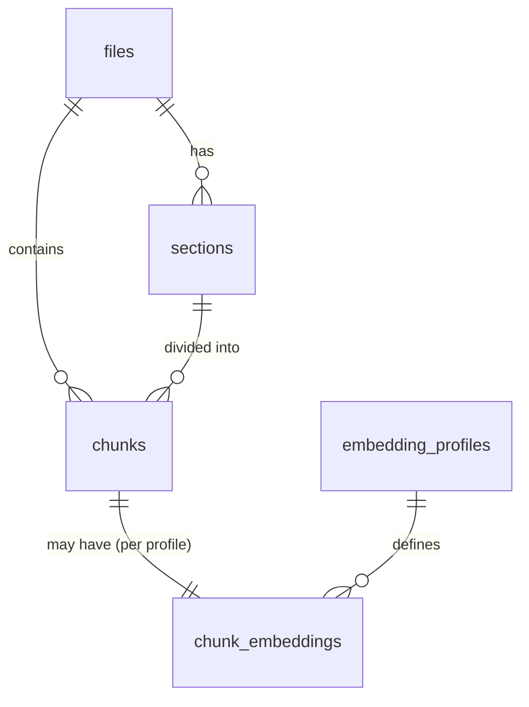

# MDRack Storage Design

## SQLite Schema Overview

MDRack uses a single SQLite database file (`.mdrack/knowledge.db`) to store all indexed content, metadata, and search indexes. The schema is versioned via migrations and includes:

**Core Tables:**
- `files` — indexed Markdown documents
- `sections` — hierarchical sections derived from headings
- `chunks` — final retrieval units (atomic search chunks)
- `chunk_embeddings` — embedding vectors (JSON blobs) per profile
- `embedding_profiles` — registered embedding configurations

**Auxiliary Tables:**
- `index_runs` — indexing run history and statistics
- `diagnostics` — logged warnings/errors
- `schema_migrations` — migration tracking
- `chunks_fts` — FTS5 virtual table for full-text search

## Table Relationships



### Foreign Keys

- `sections.file_id` → `files.id` (ON DELETE CASCADE)
- `chunks.file_id` → `files.id` (ON DELETE CASCADE)
- `chunks.section_id` → `sections.id` (ON DELETE CASCADE)
- `chunk_embeddings.chunk_id` → `chunks.id` (ON DELETE CASCADE)
- `chunk_embeddings.profile_name` → `embedding_profiles.name` (ON DELETE CASCADE)

## Main Table Schemas

### files

```sql
CREATE TABLE files (
    id TEXT PRIMARY KEY,
    relative_path TEXT NOT NULL UNIQUE,
    title TEXT,
    source_hash TEXT NOT NULL,  -- SHA-256 of file content
    indexed_at TEXT NOT NULL,
    status TEXT NOT NULL DEFAULT 'active'  -- 'active' | 'deleted'
);
```

- `relative_path`: Path relative to project root; unique to prevent duplicates
- `source_hash`: Used for change detection (compare disk vs DB)

### sections

```sql
CREATE TABLE sections (
    id TEXT PRIMARY KEY,
    file_id TEXT NOT NULL REFERENCES files(id) ON DELETE CASCADE,
    title TEXT,
    heading_path TEXT,  -- JSON array of ancestor section titles
    level INTEGER NOT NULL,  -- 1=H1, 2=H2, 3=H3, 4=H4
    start_line INTEGER,
    end_line INTEGER,
    parent_id TEXT REFERENCES sections(id)
);
```

- Sections form a tree via `parent_id`. `heading_path` denormalizes for fast retrieval.
- H1 is treated as document title; sections are H2–H4 only.

### chunks

```sql
CREATE TABLE chunks (
    id TEXT PRIMARY KEY,
    file_id TEXT NOT NULL REFERENCES files(id) ON DELETE CASCADE,
    section_id TEXT REFERENCES sections(id),
    content TEXT NOT NULL,
    content_type TEXT NOT NULL DEFAULT 'text',  -- 'text', 'code', 'mermaid', 'table'
    chunk_index INTEGER NOT NULL,
    heading_path TEXT,  -- copied from parent section
    previous_chunk_id TEXT,
    next_chunk_id TEXT,
    embedding_text TEXT,  -- text used to generate embedding (content + context)
    embedding_text_hash TEXT  -- hash for cache invalidation
);
```

- `chunk_index`: 0-based order within document (immutable)
- Doubly-linked list via `previous_chunk_id`/`next_chunk_id` for navigation
- `embedding_text` may differ from `content` (e.g., include neighboring chunks for context)

### chunk_embeddings

```sql
CREATE TABLE chunk_embeddings (
    chunk_id TEXT NOT NULL REFERENCES chunks(id) ON DELETE CASCADE,
    profile_name TEXT NOT NULL REFERENCES embedding_profiles(name),
    embedding BLOB,  -- JSON bytes of float array, e.g. [0.12, -0.34, ...]
    embedded_at TEXT,
    PRIMARY KEY (chunk_id, profile_name)
);
```

- Composite PK ensures one embedding per chunk per profile
- `embedding` stored as JSON bytes (no extension dependency)
- `profile_name` allows multiple embedding configurations simultaneously

### embedding_profiles

```sql
CREATE TABLE embedding_profiles (
    name TEXT PRIMARY KEY,
    model TEXT NOT NULL,
    dimensions INTEGER NOT NULL,
    endpoint TEXT,
    created_at TEXT NOT NULL DEFAULT (datetime('now'))
);
```

- Records the provider model and dimension size for each profile
- `endpoint` stored for reproducibility (may not be used at query time)

### chunks_fts (Virtual Table)

```sql
CREATE VIRTUAL TABLE IF NOT EXISTS chunks_fts USING fts5(
    chunk_id UNINDEXED,
    content,
    content_type UNINDEXED,
    heading_path
);
```

- `chunk_id`: maps to `chunks.id` (not full-text indexed)
- `content`: main searchable field (tokenized by unicode61)
- `heading_path`: searchable section ancestry; useful for queries like `"API Reference"`
- Manual upsert/delete from application code; no triggers

## Indexes

Non-unique indexes on foreign key columns (created in `0001_initial.sql`):

- `idx_sections_file_id` (`sections.file_id`)
- `idx_chunks_file_id` (`chunks.file_id`)
- `idx_chunks_section_id` (`chunks.section_id`)
- `idx_chunk_embeddings_profile` (`chunk_embeddings.profile_name`)
- `idx_diagnostics_run_id` (`diagnostics.run_id`)

These accelerate joins during search and diagnostics.

## FTS5 Design

### Why FTS5?

- Built into SQLite (no extension)
- Supports `MATCH` queries with boolean operators, phrases, prefixes
- `snippet()` function for highlighted previews
- Reasonable performance for up to 100k chunks

### Operations

**Insert/Update:** `upsert_fts(conn, chunk_id, content, content_type, heading_path)`
- Delete existing FTS row (if any)
- Insert new row with searchable fields

**Delete:** `delete_fts(conn, chunk_id)` — removes from FTS index

**Search:** `search_fts(conn, query, limit)` returns list with:
```python
[{'chunk_id': str, 'rank': int (lower better), 'snippet': str}, ...]
```
Uses `snippet(chunks_fts, 1, '<b>', '</b>', '...', 64)` for highlighted preview.

**Rebuild:** `rebuild_fts(conn)` — deletes all rows, bulk-inserts from `chunks`. Used after bulk updates or corruption recovery.

## Vector Storage Approach

### JSON Blobs

Vectors are stored as JSON-encoded float arrays in BLOB column:

```python
payload = json.dumps([0.12, -0.34, ...]).encode('utf-8')
conn.execute("INSERT INTO chunk_embeddings (embedding) VALUES (?)", (payload,))
```

**Rationale:**
- No external SQLite extensions required (policy prohibits)
- Human-readable for debugging
- Preserves full 32-bit float precision
- Simple CRUD operations

**Trade-offs:**
- **Memory**: Entire vector set loaded into Python during search (linear scan)
  - Acceptable up to ~10k chunks with 768 dims (~150MB memory)
  - For larger sets: pre-normalize to unit vectors, cache norms, or future ANN
- **Storage**: JSON overhead ~2× raw binary (still modest: 3KB/vector → ~60MB for 20k vectors)

### Cosine Similarity in Pure Python

`VectorIndex.search(query_vector, profile, limit)`:

```python
rows = conn.execute("SELECT chunk_id, embedding FROM chunk_embeddings WHERE profile_name = ?", (profile,)).fetchall()
scored = []
for row in rows:
    vec = json.loads(row["embedding"])
    score = cosine_similarity(query_vector, vec)
    scored.append({"chunk_id": row["chunk_id"], "score": score})
scored.sort(key=lambda d: d["score"], reverse=True)
return scored[:limit]
```

**Normalization optimization:** If all vectors are pre-normalized to unit length, cosine reduces to dot product (faster). Current implementation computes norms every search.

## Migration Strategy

### Naming Convention

Migrations are sequential 4-digit zero-padded: `0000_schema_migrations.sql`, `0001_initial.sql`, `0002_fts.sql`, `0003_add_xyz.sql`, etc.

Pattern: `^(\d{4})_(.+)\.sql$`

### Runner

`apply_migrations(conn, migrations_dir)`:

1. Ensure `schema_migrations` tracking table exists
2. Read all `.sql` files from directory
3. For each file whose version is not in `schema_migrations`:
   - Execute `conn.executescript(sql)` (transaction per migration)
   - Insert version row
   - Commit
4. On error: rollback and raise

Migrations are **not** required to be idempotent — the tracking table prevents re-application.

### Adding a Migration

1. Create new file with next version number
2. Prefer `ALTER TABLE ADD COLUMN` (safe and simple)
3. For destructive changes (column removal), create new table + copy data + rename; avoid `DROP COLUMN` unless SQLite version guarantees support
4. Avoid data migrations that could fail due to volume; use batch updates if needed

### Schema Version

Current schema version = maximum `version` from `schema_migrations`. Used in `status` output.

## Constraints & Integrity

- **ON DELETE CASCADE**: Ensures no orphan rows when parent records removed
- **Unique** (`files.relative_path`): Prevents duplicate indexing of same file
- **Chunk order**: `chunk_index` fixed at creation; preserved via doubly-linked list
- **Embedding uniqueness**: Composite PK `(chunk_id, profile_name)` — one vector per chunk per profile

## Backup & Recovery

MDRack does not perform automatic backups. Recommended:

1. Copy `.mdrack/knowledge.db` (and WAL/SHM files if present)
2. Use `sqlite3 .backup` for hot backup without stopping application
3. To restore, replace DB files and run `mdrack rebuild fts` to re-sync FTS index

## Future Extensions

- **BM25 tuning** — expose `k1` (term frequency) and `b` (length normalization) in config for better text ranking
- **Triggers** — optional automatic FTS maintenance on `chunks` modifications (currently manual)
- **Partial indexes** — e.g., `CREATE INDEX idx_chunks_text ON chunks(content_type) WHERE content_type = 'text'` for faster text-only searches
- **Covering indexes** — composite indexes for common joins to avoid table lookups
- **HNSW/ANN** — if policy permits, integrate vector index extension for sub-linear semantic search on >100k vectors
- **Embedding cache** — store computed `embedding_text_hash` to skip re-embedding unchanged chunks
