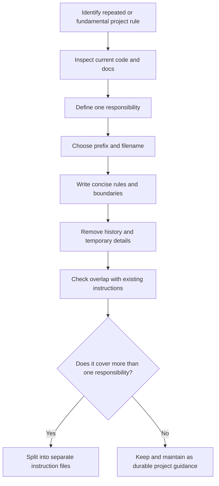

# Universal Agent Instruction Style Guide

## Purpose 🎯

This document defines how AI coding agents should create, update, split, name, and maintain instruction files inside any software project.

Instruction files are not casual notes. They are durable rules for how important parts of a codebase should be understood and changed.

A good instruction helps an agent answer one practical question:

> [!IMPORTANT]
> When working in this part of the project, what stable rules, boundaries, conventions, or workflows must be respected?

---

## What Deserves an Instruction 🧱

An instruction should be created only for something fundamental enough to affect future work in the project.

Good instruction topics usually describe stable project knowledge:

| Good topic | Why it deserves an instruction |
|---|---|
| Application architecture | It affects many future changes. |
| Domain model | It defines core business concepts and invariants. |
| API design rules | It keeps endpoints, payloads, errors, and contracts consistent. |
| Database schema and migrations | Mistakes can damage data or break compatibility. |
| Authentication and authorization | Security-sensitive logic needs stable handling. |
| Build and release workflow | Incorrect changes can break delivery. |
| Testing strategy | Agents need to know what tests to add, run, or preserve. |
| Error handling and logging | Cross-cutting conventions affect debugging and observability. |
| UI design system | A stable visual language should guide future interface work. |
| Agent workflow rules | Agents need repeatable rules for commits, branches, reviews, and safe edits. |

An instruction should not be created for a tiny one-off implementation detail.

| Weak topic | Better treatment |
|---|---|
| Change one button color | Handle directly in the task. |
| Rename one local variable | Handle directly in the task. |
| Add one temporary debug print | Do not preserve as an instruction. |
| Fix one isolated typo | Do not create a rule. |
| Explain a single deleted bug | Put it in a bug report, not an instruction. |

A visual style, design language, spacing system, component convention, or accessibility rule can deserve an instruction. A single color change usually does not.

---

## Core Rule: Stable Knowledge Only 🧭

Instructions should contain stable knowledge that will remain useful across many future tasks.

They should not contain:

- temporary implementation notes;
- personal reminders;
- task-specific TODOs;
- long historical explanations;
- release notes;
- postmortems;
- outdated class names, file paths, commands, or workflows;
- generic advice that does not constrain future work.

Bad:

```text
Try to write clean code.
```

Good:

```text
All user-facing validation errors must be returned through the shared error response format used by the API layer.
```

---

## One Responsibility Per Instruction 🧩

Each instruction file must cover one coherent responsibility.

An instruction should answer one question of this form:

```text
How should agents work with this subsystem, workflow, architectural boundary, or convention?
```

If a draft starts covering multiple independent subjects, split it.

| Mixed draft | Better split |
|---|---|
| Authentication + database migrations | `AUTH.authentication.instructions.md` and `DATA.migrations.instructions.md` |
| UI components + deployment | `UI.components.instructions.md` and `BUILD.deployment.instructions.md` |
| Logging + tests + release workflow | `OBS.logging.instructions.md`, `TEST.strategy.instructions.md`, `RELEASE.workflow.instructions.md` |

> [!NOTE]
> Related topics may reference each other, but they should not be merged unless they form one real responsibility in the codebase.

---

## File Naming Convention 🏷️

Instruction files should be named so that their responsibility is clear before opening the file.

Use this format:

```text
PREFIX.topic.instructions.md
```

Where:

| Part | Rule | Example |
|---|---|---|
| `PREFIX` | Short uppercase category | `API`, `DATA`, `UI` |
| `topic` | Lowercase kebab-case or dot-separated topic | `error-handling`, `migrations`, `visual-style` |
| `.instructions.md` | Required suffix for instruction files | `API.error-handling.instructions.md` |

Good names:

```text
ARCH.project-structure.instructions.md
API.error-handling.instructions.md
AUTH.permissions.instructions.md
DATA.migrations.instructions.md
UI.visual-style.instructions.md
TEST.integration-tests.instructions.md
WORKFLOW.git-safety.instructions.md
```

Weak names:

```text
rules.md
notes.instructions.md
misc.instructions.md
backend.instructions.md
important.instructions.md
new-stuff.instructions.md
```

A good filename should make the instruction discoverable even without reading the whole file. Tiny filesystem lighthouse. Not glamorous, very useful.

---

## Prefix Canon 📚

Projects may define their own prefix set, but the set should stay small, consistent, and predictable.

Recommended universal prefixes:

| Prefix | Use for |
|---|---|
| `ARCH` | Project architecture, module boundaries, dependency direction, layering |
| `CORE` | Central runtime behavior, application lifecycle, shared abstractions |
| `DOMAIN` | Business rules, domain entities, invariants, terminology |
| `API` | Public/internal APIs, contracts, payloads, error formats, versioning |
| `DATA` | Database schema, migrations, repositories, storage rules |
| `AUTH` | Authentication, authorization, permissions, sessions, tokens |
| `UI` | Interface structure, components, layouts, design system usage |
| `UX` | User flows, interaction rules, accessibility, user-facing behavior |
| `DESIGN` | Visual language, typography, colors, spacing, iconography, brand system |
| `INFRA` | Infrastructure, environments, services, deployment targets |
| `BUILD` | Build system, packaging, release artifacts, distribution |
| `TEST` | Testing strategy, fixtures, integration tests, quality gates |
| `SEC` | Security-sensitive rules, secrets, threat boundaries, safe handling |
| `OBS` | Logging, metrics, tracing, diagnostics, monitoring |
| `DOCS` | Documentation style, generated docs, public docs structure |
| `TOOLING` | Developer tools, code generators, formatters, linters, local scripts |
| `WORKFLOW` | Git workflow, branching, commits, reviews, agent process rules |

Prefix selection rules:

1. Choose the prefix that describes the main responsibility, not every related detail.
2. Do not create a new prefix if an existing one clearly fits.
3. Avoid broad names like `APP` unless the project has a clear convention for them.
4. Prefer stable categories over temporary project phases.
5. If two prefixes seem equally correct, the instruction probably needs a narrower topic.

---

## When to Create a New Instruction 🛠️

Create a new instruction when at least one condition is true:

1. The project has a stable convention that future agents must follow.
2. A subsystem has non-obvious boundaries or rules.
3. A mistake in this area could cause security, data, release, or architecture problems.
4. Several future tasks are likely to touch the same rule.
5. The same explanation has already been repeated across tasks, reviews, or documentation.
6. The rule affects how code should be added, changed, tested, or reviewed.

Do not create a new instruction when:

1. The topic is a one-time change.
2. The information is obvious from a single nearby file.
3. The rule is temporary and will disappear after the task.
4. The instruction would mostly describe history.
5. The topic is too small to guide future decisions.
6. The agent has not verified the current codebase.

---

## What an Instruction Should Contain 🧠

A strong instruction usually contains:

### Responsibility

What part of the project this instruction governs.

### Scope

What files, modules, workflows, or concepts it applies to.

### Rules

Concrete constraints the agent must follow.

### Invariants

Things that must remain true after changes.

### Safe Change Process

How to modify the area without breaking expected behavior.

### Verification

What should be checked after changes.

### Examples

Short examples of correct and incorrect decisions.

---

## What an Instruction Should Avoid 🚫

Avoid content that makes instructions noisy, stale, or misleading.

| Avoid | Reason |
|---|---|
| Long history | Agents need current rules, not archaeology. |
| Dead paths | They make agents chase ghosts. |
| Old names | They cause incorrect edits. |
| Broad philosophy | It rarely changes behavior. |
| Duplicated rules | Conflicts become harder to resolve. |
| Task-specific notes | They do not belong in durable instructions. |
| Huge pasted code blocks | Instructions should guide code, not duplicate it. |
| Tiny styling tweaks | They are not fundamental project knowledge. |

---

## Instruction Creation Process 🔍

Before writing or updating an instruction, the agent must inspect the real project state.

Recommended process:



The agent should not invent instructions from assumptions. The codebase is the source of truth.

---

## Updating Existing Instructions ♻️

When updating an instruction, the agent should:

1. Re-check the current code before editing the instruction.
2. Remove obsolete paths, names, classes, commands, and workflows.
3. Keep only rules that affect future implementation decisions.
4. Delete duplicated text already covered by another instruction.
5. Split the file if it has grown into several independent topics.
6. Rename the file if its responsibility has changed.
7. Keep examples short and directly useful.

> [!WARNING]
> An outdated instruction is worse than no instruction. It gives the agent confidence in the wrong direction — the most expensive kind of nonsense.

---

## Conflict Resolution Between Instructions ⚖️

If two instructions appear to conflict, the agent should resolve the conflict carefully.

Recommended priority:

1. More specific instruction beats broader instruction.
2. Newer verified code beats older written guidance.
3. Security and data safety rules beat convenience.
4. Build, release, and compatibility rules must not be bypassed casually.
5. If conflict remains, the agent should stop and report the contradiction instead of guessing.

Example:

| Conflict | Resolution |
|---|---|
| `UI.components` says use shared components, but `DESIGN.visual-style` defines spacing tokens | Use shared components while preserving the design tokens. |
| `DATA.repositories` says avoid raw SQL, but migration instruction requires SQL migration | Follow the migration-specific instruction inside migration files. |
| Old instruction references deleted service | Treat the codebase as source of truth and update the instruction. |

---

## Good vs Bad Instruction Topics ✅

| Bad instruction topic | Good instruction topic |
|---|---|
| `button-color.instructions.md` | `DESIGN.visual-style.instructions.md` |
| `fix-login-bug.instructions.md` | `AUTH.login-flow.instructions.md` |
| `new-table.instructions.md` | `DATA.schema-conventions.instructions.md` |
| `random-backend-notes.instructions.md` | `API.request-validation.instructions.md` |
| `make-tests-better.instructions.md` | `TEST.integration-strategy.instructions.md` |
| `deploy-today.instructions.md` | `BUILD.release-workflow.instructions.md` |

---

## Quality Checklist ✅

Before saving an instruction, verify:

- [ ] The file name follows `PREFIX.topic.instructions.md`.
- [ ] The prefix matches the real responsibility.
- [ ] The topic is fundamental enough to guide future work.
- [ ] The instruction covers one coherent responsibility.
- [ ] The content reflects the current codebase.
- [ ] The instruction avoids historical clutter.
- [ ] The instruction avoids tiny one-off details.
- [ ] The rules are actionable.
- [ ] The instruction helps an agent make better implementation decisions.
- [ ] No existing instruction already covers the same responsibility.
- [ ] Any examples are short, current, and useful.

---

## Final Standard 🧷

An instruction is ready when another agent can read it and immediately understand:

1. what important part of the project it governs;
2. what decisions it constrains;
3. what must not be broken;
4. how to work safely in that area;
5. when the instruction is too broad and should be split.

If the instruction does not improve future agent behavior, it should not exist.

