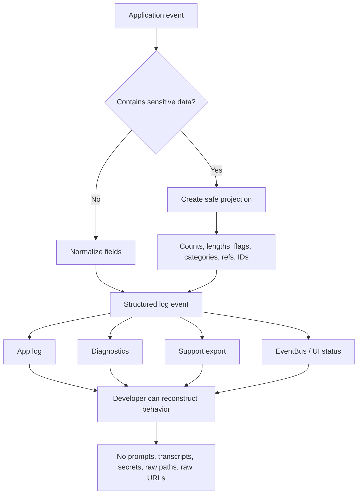

------

# OBS — Logging

## Purpose 🎯

This instruction defines how agents must add, change, sanitize, structure, and verify logging across Python and JavaScript applications.

It applies to applications with or without a graphical interface.

The goal is intentionally strict:

> [!IMPORTANT]
> The application should log every meaningful system event, user action, state transition, branch decision, fallback, skip, retry, and failure path.
> It must be possible to understand what happened without exposing secrets, user content, private file paths, raw URLs, prompts, transcripts, or other sensitive data.

Logging must be dense, structured, searchable, and privacy-safe.

The correct logging style is not silence.
The correct logging style is safe observability.

------

## Responsibility 🧭

This instruction governs:

| Area                          | Covered                                                   |
| ----------------------------- | --------------------------------------------------------- |
| Application lifecycle         | startup, shutdown, initialization, cleanup                |
| Python logging                | `logging`, module loggers, lazy formatting                |
| JavaScript/TypeScript logging | project logger abstraction, structured logging            |
| GUI logging                   | clicks, hovers, setting changes, dialogs, tabs, lifecycle |
| CLI logging                   | commands, subcommands, option presence, exit codes        |
| API/provider logging          | request lifecycle, token counts, cost estimates, retries  |
| Filesystem logging            | safe file refs, depth, size, counts, permissions category |
| Network logging               | safe endpoint metadata, URL length, status class, retries |
| Queue/job logging             | batch lifecycle, progress, counts, reasons                |
| EventBus/status payloads      | support-safe event payloads                               |
| Diagnostics/support export    | sanitized truth-layer, safe projections                   |
| Error logging                 | sanitized exceptions, safe categories, fallback paths     |

This instruction does not define business logic, UI design, database schema, or testing strategy except where logging touches those areas.

------

## File Naming 🏷️

The canonical file name for this instruction is:

```text
OBS.logging.instructions.md
```

Use the `OBS` prefix because logging, telemetry, tracing, diagnostics, metrics, and support-safe exports are observability responsibilities.

Avoid weaker names:

```text
logging.md
logs.instructions.md
CORE.logging.instructions.md
UI.gui_logging.instructions.md
debug.instructions.md
misc-logging-rules.instructions.md
```

If a future project needs additional observability instructions, they may be split only when they become independently large and stable responsibilities.

Examples:

```text
OBS.logging.instructions.md
OBS.metrics.instructions.md
OBS.tracing.instructions.md
OBS.support-diagnostics.instructions.md
```

Until then, logging policy should stay in one source of truth.

------

## Core Principle 🔒

The application must log as much behavior as possible without logging sensitive content.

The safe pattern is:

```text
raw data -> sanitizer / safe projection -> structured log field
```

The unsafe pattern is:

```text
raw data -> logger / EventBus / support export / UI status
```

Logging should answer:

1. What happened?
2. Where did it happen?
3. Which safe entity was involved?
4. What branch was taken?
5. Why was it skipped, retried, degraded, or failed?
6. How long did it take?
7. How many items/tokens/bytes were involved?
8. What safe status/category/result was produced?
9. What should support or developers inspect next?

Logging must not answer:

1. What did the user write?
2. What is inside the user's files?
3. What is the user's API key?
4. What is the exact private path?
5. What is the raw URL/query string?
6. What is the transcript or prompt text?
7. What is the account balance?
8. What is the credential-bearing endpoint?
9. What is the provider's raw response body if it may contain sensitive data?

------

## Observability Map 🗺️



------

## Core Invariants 🧱

These rules must remain true after every change.

| Invariant                                   | Required behavior                                            |
| ------------------------------------------- | ------------------------------------------------------------ |
| Every meaningful event leaves a breadcrumb  | Startup, shutdown, user actions, jobs, requests, retries, skips, fallbacks, and failures must be visible in logs. |
| Every branch decision has a reason          | Early returns, validation skips, fallback paths, disabled features, and degraded modes must log a safe `reason`. |
| Every operation has a lifecycle             | Important operations should log `started`, `progress` when useful, and `finished` / `failed` / `cancelled`. |
| Sensitive values never leave raw boundaries | Prompts, transcripts, file paths, URLs, tokens, keys, credentials, and raw user input must be sanitized before logging. |
| Logs are structured                         | Prefer stable event names, IDs, counters, booleans, enums, durations, and key/value fields. |
| Logs preserve semantics                     | Do not reuse a field name for a broader or different meaning. |
| Diagnostics use the same truth-layer        | Support exports and diagnostics must not create their own incompatible redaction shape. |
| UI/EventBus is not a privacy escape hatch   | Payloads that reach UI, tray, status, diagnostics, or support archives must follow the same privacy rules as logs. |
| High-frequency events are controlled        | Mouse move, scroll, resize, and repaint events must be throttled, sampled, or summarized. |
| Exceptions are sanitized end-to-end         | Do not sanitize only the message while leaking raw data through `args`, `cause`, `context`, stack locals, or chained exceptions. |

------

## Logging Density Standard 🧬

The application should be noisy in the right way.

Log every meaningful “sneeze”:

| Event type                 | Logging expectation                                          |
| -------------------------- | ------------------------------------------------------------ |
| App startup/shutdown       | Always log.                                                  |
| Config load/save           | Always log safe source, status, changed keys count, validation status. |
| Feature enabled/disabled   | Always log feature id and safe reason.                       |
| User click                 | Log stable control id and action.                            |
| User hover                 | Log important hover enter/leave events with throttling.      |
| Setting change             | Log setting key and safe before/after categories, not secret values. |
| Dialog/tab/page open/close | Always log lifecycle.                                        |
| API request                | Log started/finished/failed with safe provider/model/token/cost metadata. |
| File operation             | Log safe ref, type, size, depth, count, and result.          |
| Queue/job operation        | Log batch id, counts, stage, result, elapsed time.           |
| Retry/fallback             | Log attempt, reason category, delay, fallback target kind.   |
| Validation result          | Log valid/invalid, error category, field count, not raw values. |
| Error path                 | Log safe error category and sanitized exception.             |
| Early return               | Log reason and safe state.                                   |
| Ignored event              | Log reason when it helps explain behavior.                   |

Do not confuse dense logging with raw logging.

Good dense logging:

```text
llm.request.finished provider=openrouter model=qwen input_tokens=1200 output_tokens=430 estimated_input_cost=0.0012 estimated_output_cost=0.0021 currency=USD elapsed_ms=18420 status=success
```

Bad raw logging:

```text
Prompt was: "..."
Response was: "..."
Authorization: Bearer ...
File: C:\Users\Vladimir\PrivateProject\...
URL: https://api.example.com/v1/chat?key=...
```

------

## Event Naming Convention 🧾

Use stable event names.

Preferred shape:

```text
domain.entity.action.stage
```

Examples:

```text
app.startup.started
app.startup.finished
config.load.started
config.load.finished
config.save.failed
ui.button.hovered
ui.button.clicked
ui.setting.changed
ui.dialog.opened
ui.dialog.closed
cli.command.started
cli.command.finished
file.scan.started
file.scan.finished
queue.batch.started
queue.batch.progress
queue.batch.finished
llm.request.started
llm.request.finished
llm.request.failed
network.request.retrying
diagnostics.export.started
diagnostics.export.finished
```

Avoid vague events:

```text
done
failed
something happened
debug info
button event
api stuff
```

------

## Structured Fields 🧩

Prefer structured fields over freeform text.

Good field names:

| Field suffix | Meaning                                       |
| ------------ | --------------------------------------------- |
| `_id`        | Stable internal ID, UUID, record ID, batch ID |
| `_ref`       | Sanitized reference, never raw private data   |
| `_present`   | Boolean presence flag                         |
| `_valid`     | Boolean validation result                     |
| `_status`    | Stable enum                                   |
| `_reason`    | Stable reason enum or short safe reason       |
| `_category`  | Safe category, not raw text                   |
| `_kind`      | Safe kind classification                      |
| `_count`     | Count of items                                |
| `_length`    | Character length                              |
| `_tokens`    | Token count                                   |
| `_bytes`     | Byte count                                    |
| `_depth`     | Nesting/path/tree depth                       |
| `_ms`        | Duration in milliseconds                      |
| `_seconds`   | Duration in seconds                           |
| `_attempt`   | Current attempt number                        |
| `_total`     | Total planned count                           |
| `_currency`  | Currency code                                 |
| `_source`    | Safe source category                          |
| `_mode`      | Safe execution mode                           |
| `_enabled`   | Boolean enabled flag                          |

Avoid ambiguous fields:

```text
data
payload
info
message
error
text
content
path
url
file
query
body
response
```

If such fields are required for compatibility, they must contain sanitized values only and should be renamed when possible.

------

## Privacy-Safe Field Rules 🧼

### General Rule

If a field may contain user-derived text, private data, secrets, paths, URLs, provider bodies, prompts, transcripts, clipboard content, or credentials, it must not be logged raw.

Instead, log safe metadata.

| Raw thing               | Safe replacement                                             |
| ----------------------- | ------------------------------------------------------------ |
| Prompt text             | `prompt_length`, `prompt_tokens`, `prompt_template_id`, `prompt_present` |
| LLM response text       | `output_tokens`, `response_length`, `finish_reason`, `response_present` |
| Transcript text         | `segment_count`, `word_count`, `duration_seconds`, `language`, `confidence_category` |
| Clipboard content       | `clipboard_text_present`, `clipboard_length`, `clipboard_kind` |
| API key                 | `credential_present`, `credential_source`, `credential_valid`, `validation_status` |
| Token                   | `token_present`, `token_valid`, `token_source`, `expires_in_bucket` |
| File path               | `safe_file_ref`, `path_depth`, `extension`, `size_bytes`     |
| Folder path             | `safe_folder_ref`, `path_depth`, `child_count`               |
| URL                     | `endpoint_kind`, `scheme`, `url_length`, `query_param_count`, `path_depth` |
| Host/IP/port            | `host_kind`, `network_target_kind`, `route_kind`             |
| Raw provider error body | `provider_error_category`, `status_code`, `status_code_class`, `retry_after_ms` |
| Account balance         | `billing_status_known`, `estimated_request_cost`, never balance |
| Search query            | `query_length`, `query_tokens`, `query_empty`, `query_kind`  |
| User note/input         | `input_length`, `input_empty`, `input_kind`, never content   |

------

## Never Log 🚫

Never log these values directly:

| Category           | Forbidden values                                             |
| ------------------ | ------------------------------------------------------------ |
| User content       | prompts, LLM responses, transcripts, notes, comments, clipboard content, search queries, typed text |
| Secrets            | API keys, tokens, passwords, credentials, cookies, session IDs, private keys |
| Filesystem         | raw absolute paths, raw folder paths, raw basenames if they reveal user scenarios |
| Network            | raw URLs, raw query strings, raw proxy URLs, host/IP/port values, credential-bearing fragments |
| Provider/API       | raw provider response bodies, raw cloud base URLs, raw headers containing secrets |
| Finance            | account balance, remaining credits, payment details          |
| Diagnostics        | raw recent error excerpts if they may contain sensitive data |
| Freeform summaries | top prompts, top user files, top raw errors, top queries     |
| GUI state          | raw widget dumps if they contain user input                  |
| CLI                | raw args when args may contain paths, tokens, secrets, URLs, prompts, or text |

------

## Allowed Logging Data ✅

The following data is generally safe when used correctly.

| Data type             | Examples                                                     |
| --------------------- | ------------------------------------------------------------ |
| Stable IDs            | task ID, batch ID, UUID, record ID, job ID, owner ID         |
| Counts                | item count, file count, retry count, segment count, token count |
| Lengths               | input length, URL length, prompt length, path depth          |
| Durations             | elapsed time, latency, queue wait time                       |
| Sizes                 | payload bytes, file size, response bytes                     |
| Statuses              | success, failed, skipped, cancelled, retrying                |
| Reasons               | disabled, invalid_config, timeout, rate_limited, user_cancelled |
| Categories            | auth_error, network_error, provider_error, validation_error  |
| Flags                 | enabled, configured, present, valid, cached, dry_run         |
| Safe model metadata   | provider label, model ID, backend, device, mode              |
| Safe file metadata    | extension, size, path depth, modified-age bucket             |
| Safe network metadata | scheme, endpoint kind, host kind, status code class          |
| Safe cost metadata    | estimated cost, currency, pricing source, input/output split |

------

## Credentials and API Keys 🔑

Credentials must be observable without being exposed.

Log:

| Field                       | Meaning                                                      |
| --------------------------- | ------------------------------------------------------------ |
| `credential_present`        | Whether a credential exists                                  |
| `credential_source`         | `env`, `settings`, `keychain`, `file`, `runtime`, `unknown`  |
| `credential_valid`          | Result of validation if known                                |
| `credential_status`         | `missing`, `present`, `valid`, `invalid`, `expired`, `revoked`, `unknown` |
| `validation_attempted`      | Whether validation was attempted                             |
| `validation_error_category` | Safe category such as `auth_failed`, `network_error`, `timeout`, `provider_unavailable` |
| `credential_scope_count`    | Number of detected scopes if safe                            |
| `expires_in_bucket`         | `expired`, `<1h`, `<1d`, `<7d`, `>=7d`, `unknown`            |

Do not log:

```text
api_key
token
secret
password
authorization header
cookie
session id
key prefix
key suffix
raw hash of secret
credential-bearing URL
```

If correlation between credentials is support-critical, use only a project-approved irreversible `secret_ref` generated by the credential manager or sanitizer.

Do not invent secret fingerprinting inside random caller code.

------

## LLM, STT, Cloud API and Provider Logging 🤖

### Request Started

Log when a provider request starts.

Allowed fields:

| Field                | Meaning                                                      |
| -------------------- | ------------------------------------------------------------ |
| `provider_label`     | Safe provider name                                           |
| `model_id`           | Model ID                                                     |
| `operation`          | `chat`, `completion`, `embedding`, `transcription`, `translation`, `rerank`, etc. |
| `credential_present` | Whether credential exists                                    |
| `credential_valid`   | If already known                                             |
| `input_length`       | Character length                                             |
| `input_tokens`       | Token count when available                                   |
| `attachment_count`   | Number of attachments/files                                  |
| `payload_bytes`      | Request payload size                                         |
| `timeout_ms`         | Timeout                                                      |
| `attempt`            | Current attempt                                              |
| `max_attempts`       | Max attempts                                                 |
| `request_id`         | Internal safe request ID                                     |
| `batch_id`           | Internal safe batch ID                                       |

Do not log prompt text, transcript text, user message text, file names, raw request body, raw headers, or raw URL.

### Request Finished

Log when a provider request finishes.

Allowed fields:

| Field                   | Meaning                                                     |
| ----------------------- | ----------------------------------------------------------- |
| `status`                | `success`, `failed`, `cancelled`, `timeout`, `rate_limited` |
| `elapsed_ms`            | Duration                                                    |
| `latency_ms`            | Provider latency if known                                   |
| `status_code`           | Numeric status code if useful                               |
| `status_code_class`     | `2xx`, `4xx`, `5xx`, `unknown`                              |
| `input_tokens`          | Input token count                                           |
| `output_tokens`         | Output token count                                          |
| `cached_input_tokens`   | Cached input tokens if available                            |
| `reasoning_tokens`      | Reasoning tokens if provider exposes them                   |
| `total_tokens`          | Total tokens                                                |
| `response_length`       | Character length                                            |
| `response_bytes`        | Response size                                               |
| `finish_reason`         | Safe finish reason                                          |
| `retry_count`           | Number of retries                                           |
| `estimated_input_cost`  | Estimated input cost                                        |
| `estimated_output_cost` | Estimated output cost                                       |
| `estimated_total_cost`  | Estimated total request cost                                |
| `cost_currency`         | Currency code                                               |
| `pricing_source`        | `static_config`, `provider_pricing`, `manual`, `unknown`    |
| `pricing_version`       | Date/version if known                                       |

Do not log account balance.

### Cost Semantics

Cost fields must preserve currency semantics.

Good:

```text
estimated_input_cost=0.0012 estimated_output_cost=0.0028 estimated_total_cost=0.004 cost_currency=USD
```

Bad:

```text
cost_usd=0.004
```

unless the value is definitely normalized to USD.

If a projection may contain mixed currencies, do not merge it into a single `*_usd` total.

Use separate fields:

```text
estimated_input_cost
estimated_output_cost
estimated_total_cost
cost_currency
pricing_source
pricing_version
```

------

## File and Folder Logging 📁

Never log raw file paths, folder paths, or basenames that may expose private user data.

Use sanitizer helpers.

Preferred fields:

| Field                 | Meaning                                         |
| --------------------- | ----------------------------------------------- |
| `file_ref`            | Sanitized file reference                        |
| `folder_ref`          | Sanitized folder reference                      |
| `extension`           | File extension                                  |
| `mime_kind`           | Safe MIME category                              |
| `size_bytes`          | File size                                       |
| `path_depth`          | Number of path segments                         |
| `parent_depth`        | Folder nesting depth                            |
| `exists`              | Boolean                                         |
| `is_symlink`          | Boolean                                         |
| `permission_category` | `readable`, `writable`, `denied`, `unknown`     |
| `modified_age_bucket` | `<1h`, `<1d`, `<7d`, `<30d`, `older`, `unknown` |
| `child_count`         | Number of children                              |
| `scan_total`          | Number of scanned items                         |
| `scan_skipped`        | Number of skipped items                         |
| `scan_failed`         | Number of failed items                          |

Good:

```text
file.scan.finished folder_ref=folder:8fa2 path_depth=5 scan_total=240 scan_skipped=3 scan_failed=0 elapsed_ms=914
```

Bad:

```text
Scanned C:\Users\Vladimir\PrivateClient\Audio\meeting-with-client.wav
```

------

## URL and Network Logging 🌐

Never log raw URLs, raw query strings, hostnames, IP addresses, ports, proxy URLs, or credential-bearing endpoint fragments.

Allowed fields:

| Field                    | Meaning                                                      |
| ------------------------ | ------------------------------------------------------------ |
| `endpoint_kind`          | `public_api`, `local_service`, `proxy`, `cdn`, `model_download`, `unknown` |
| `scheme`                 | `http`, `https`, `ws`, `wss`, `unknown`                      |
| `url_length`             | URL character length                                         |
| `path_depth`             | URL path depth                                               |
| `query_param_count`      | Number of query params                                       |
| `has_query`              | Boolean                                                      |
| `has_credentials`        | Boolean                                                      |
| `host_kind`              | `public_dns`, `localhost`, `private_ip`, `public_ip`, `unknown` |
| `transport`              | `http`, `websocket`, `grpc`, `ipc`, `unknown`                |
| `status_code`            | Numeric status if useful                                     |
| `status_code_class`      | `2xx`, `3xx`, `4xx`, `5xx`, `unknown`                        |
| `request_bytes`          | Request size                                                 |
| `response_bytes`         | Response size                                                |
| `timeout_ms`             | Timeout                                                      |
| `elapsed_ms`             | Duration                                                     |
| `retry_after_ms`         | Retry-after duration                                         |
| `network_error_category` | Safe error category                                          |

Good:

```text
network.request.failed endpoint_kind=public_api scheme=https host_kind=public_dns url_length=184 query_param_count=2 status_code_class=5xx retry_after_ms=30000 elapsed_ms=1204
```

Bad:

```text
GET https://api.example.com/v1/files?token=secret&user=...
```

------

## Proxy Logging 🛰️

Proxy configuration should be observable without revealing the proxy itself.

Allowed fields:

| Field                 | Meaning                                                      |
| --------------------- | ------------------------------------------------------------ |
| `proxy_enabled`       | Boolean                                                      |
| `proxy_configured`    | Boolean                                                      |
| `proxy_purpose`       | `api`, `download`, `browser`, `unknown`                      |
| `transport`           | `http`, `https`, `socks`, `unknown`                          |
| `scheme`              | Safe scheme                                                  |
| `auth_present`        | Boolean                                                      |
| `host_kind`           | `localhost`, `private_ip`, `public_dns`, `public_ip`, `unknown` |
| `route_kind`          | `direct`, `proxy`, `bypass`, `fallback`                      |
| `bypass_reason`       | Safe reason                                                  |
| `direct_fallback`     | Boolean                                                      |
| `safe_error_category` | Safe category                                                |

Never log:

```text
raw proxy URL
proxy username
proxy password
proxy host
proxy IP
proxy port
credential-bearing endpoint fragment
```

------

## GUI Logging 🖥️

GUI applications must produce a dense audit trail of meaningful user interaction and UI lifecycle events.

### Required Logger in UI Modules

Every UI module with logic or lifecycle behavior must define a module logger.

Python:

```python
import logging

logger = logging.getLogger(__name__)
```

JavaScript/TypeScript:

```ts
const logger = getLogger(import.meta.url);
// or use the project-approved logger factory
```

Do not introduce a new logging abstraction unless the project already has one.

### GUI Lifecycle Events

Log:

| Event                              | Level                               |
| ---------------------------------- | ----------------------------------- |
| window created                     | `DEBUG`                             |
| window shown/hidden                | `DEBUG`                             |
| dialog opened/closed               | `DEBUG` or `INFO` for major dialogs |
| tab switched                       | `DEBUG`                             |
| page mounted/unmounted             | `DEBUG`                             |
| widget initialized                 | `DEBUG`                             |
| worker connected/disconnected      | `DEBUG`                             |
| signal subscription/unsubscription | `DEBUG`                             |
| cleanup started/finished           | `DEBUG`                             |
| resource load failed               | `ERROR`                             |
| geometry restore skipped           | `WARNING`                           |
| fallback theme/font/layout used    | `WARNING`                           |

Example:

```python
logger.debug(
    "ui.dialog.opened dialog_id=%s source=%s",
    dialog_id,
    source,
)
```

### GUI User Actions

Log:

| Action                | Required fields                                              |
| --------------------- | ------------------------------------------------------------ |
| button click          | `control_id`, `action`, `screen_id`, `enabled`, `source`     |
| button hover          | `control_id`, `hover_state`, `screen_id`, throttled          |
| menu item click       | `menu_id`, `item_id`, `action`                               |
| tab switch            | `from_tab_id`, `to_tab_id`, `source`                         |
| setting change        | `setting_key`, `old_value_category`, `new_value_category`, `changed` |
| checkbox/radio toggle | `control_id`, `checked`, `source`                            |
| slider change         | `control_id`, `value_bucket`, `source`                       |
| input change          | `control_id`, `input_length`, `input_empty`, never raw text  |
| search submitted      | `query_length`, `query_tokens`, `query_empty`, never raw query |
| file selected         | `file_ref`, `extension`, `size_bytes`, `path_depth`          |
| folder selected       | `folder_ref`, `path_depth`, `child_count` if known           |
| drag/drop started     | `item_count`, `mime_kind`, `source`                          |
| drag/drop finished    | `item_count`, `accepted_count`, `rejected_count`, `reason`   |
| keyboard shortcut     | `shortcut_id`, `action`, `screen_id`                         |
| context menu opened   | `screen_id`, `target_kind`, `item_count`                     |

### Hover Logging

Hover events are useful when they explain user behavior or UI discovery.

Log:

```text
ui.button.hovered control_id=start_transcription hover_state=enter screen_id=dashboard
ui.button.hovered control_id=start_transcription hover_state=leave screen_id=dashboard hover_duration_ms=842
```

Do not log raw mouse coordinates on every movement.

For high-frequency hover/move events:

1. log `enter` and `leave`, not every pixel movement;
2. throttle repeated events from the same control;
3. aggregate noisy movement into counts when needed;
4. never log raw user input inside widget state.

### High-Frequency GUI Events

Do not write one log line for every repaint, mouse move, resize tick, scroll tick, animation frame, or layout recalculation.

Instead, use one of these patterns:

```text
ui.scroll.summary screen_id=history event_count=42 duration_ms=3000 max_scroll_depth_percent=78
ui.resize.summary window_id=main event_count=18 duration_ms=1200 final_width_bucket=large final_height_bucket=medium
ui.repaint.summary widget_id=waveform event_count=91 duration_ms=5000
```

Dense observability must not turn into a self-inflicted performance incident.

------

## CLI Logging ⌨️

CLI applications must log command lifecycle without leaking raw arguments.

Log:

| Event                  | Fields                                                       |
| ---------------------- | ------------------------------------------------------------ |
| command started        | `command`, `subcommand`, `option_count`, `flags_present`, `input_kind` |
| validation finished    | `valid`, `error_count`, `error_category`                     |
| file argument detected | `file_ref`, `extension`, `path_depth`, `exists`, `size_bytes` |
| URL argument detected  | `url_length`, `scheme`, `endpoint_kind`, `query_param_count` |
| command finished       | `exit_code`, `status`, `elapsed_ms`                          |
| command failed         | `exit_code`, `error_category`, `elapsed_ms`                  |

Do not log raw argv if it may include paths, URLs, tokens, prompts, or user text.

Good:

```text
cli.command.started command=transcribe subcommand=batch option_count=6 input_kind=folder dry_run=false
```

Bad:

```text
python app.py transcribe C:\Users\...\private.wav --api-key sk-...
```

------

## Application Lifecycle Logging 🚦

Log application lifecycle events.

Required events:

```text
app.startup.started
app.config.load.started
app.config.load.finished
app.dependencies.checked
app.runtime.ready
app.shutdown.started
app.shutdown.finished
```

Useful fields:

| Field                      | Meaning                                      |
| -------------------------- | -------------------------------------------- |
| `app_version`              | Version if safe                              |
| `build_channel`            | `dev`, `beta`, `stable`, `unknown`           |
| `platform`                 | OS/platform                                  |
| `python_version`           | Python version                               |
| `node_version`             | Node version                                 |
| `runtime_mode`             | `dev`, `prod`, `test`, `portable`, `unknown` |
| `config_source`            | `default`, `user`, `env`, `file`, `unknown`  |
| `config_valid`             | Boolean                                      |
| `feature_count`            | Number of enabled features                   |
| `dependency_count`         | Number of checked dependencies               |
| `missing_dependency_count` | Number of missing dependencies               |
| `elapsed_ms`               | Duration                                     |

Do not log raw environment variables.

------

## Configuration and Settings Logging ⚙️

Settings changes must be visible.

Log:

| Event                     | Safe fields                                                  |
| ------------------------- | ------------------------------------------------------------ |
| setting loaded            | `setting_key`, `source`, `value_present`, `value_category`   |
| setting changed           | `setting_key`, `old_value_category`, `new_value_category`, `changed` |
| setting validation failed | `setting_key`, `error_category`, `fallback_used`             |
| config saved              | `changed_key_count`, `target_kind`, `elapsed_ms`             |
| config migration          | `from_version`, `to_version`, `status`, `reason`             |

Never log raw setting values if they may contain secrets, paths, URLs, prompts, user text, or credentials.

For safe enum settings, logging the value is allowed.

Example:

```text
settings.changed setting_key=theme old_value_category=light new_value_category=dark changed=true
settings.changed setting_key=api_key credential_present=true credential_valid=unknown changed=true
settings.changed setting_key=output_folder folder_ref=folder:91ac path_depth=5 changed=true
```

------

## Queue, Job and Batch Logging 🧺

Every queue, job, batch, background worker, or scheduled process must have lifecycle logs.

Required stages:

```text
queue.batch.started
queue.batch.progress
queue.batch.finished
queue.batch.failed
queue.batch.cancelled
queue.job.started
queue.job.finished
queue.job.failed
queue.job.skipped
```

Allowed fields:

| Field               | Meaning                                 |
| ------------------- | --------------------------------------- |
| `batch_id`          | Batch ID                                |
| `job_id`            | Job ID                                  |
| `owner_id`          | Owner/source ID                         |
| `source`            | Safe source                             |
| `source_counts`     | Counts by source                        |
| `mixed`             | Boolean mixed-source flag               |
| `total`             | Total jobs/items                        |
| `completed`         | Completed count                         |
| `failed`            | Failed count                            |
| `cancelled`         | Cancelled count                         |
| `skipped`           | Skipped count                           |
| `remaining_pending` | Pending count                           |
| `elapsed_ms`        | Duration                                |
| `stage`             | `started`, `progress`, `finished`, etc. |
| `reason`            | Safe reason                             |

If a queue has phases, log the phase-specific total clearly.

Example:

```text
queue.llm.started batch_id=7ab1 owner_source=history total=12 source_counts.audio=8 source_counts.video=4 mixed=true
```

The field `total` must describe the current phase total, not a different broader batch total.

------

## Error Logging and Exceptions 🧯

Errors must be logged, but not raw.

Required fields:

| Field            | Meaning                                     |
| ---------------- | ------------------------------------------- |
| `error_category` | Safe category                               |
| `error_type`     | Exception class name when safe              |
| `operation`      | Operation being performed                   |
| `status`         | `failed`, `retrying`, `fallback`, `skipped` |
| `reason`         | Safe reason                                 |
| `recoverable`    | Boolean                                     |
| `fallback_used`  | Boolean                                     |
| `attempt`        | Attempt number                              |
| `max_attempts`   | Max attempts                                |
| `elapsed_ms`     | Duration                                    |

Use `exc_info=True` only when the traceback is privacy-safe.

Do not log exception args if they contain raw paths, URLs, prompts, transcripts, provider bodies, user input, or secrets.

If an exception must be re-raised, sanitize the final exception object and its chain.

Bad:

```python
raise RuntimeError(f"Failed to process {raw_path}: {error}") from error
```

Good:

```python
safe_error = sanitize_exception(error)
logger.error(
    "file.process.failed file_ref=%s error_category=%s",
    file_ref,
    safe_error.category,
    exc_info=safe_error.exc_info_safe,
)
raise ProcessingError(
    "File processing failed",
    safe_details=safe_error.public_details,
) from safe_error.safe_cause
```

------

## EventBus, Status and Support Payloads 📡

EventBus payloads must follow the same privacy rules as logs.

This applies to:

| Destination        | Rule                      |
| ------------------ | ------------------------- |
| UI status          | support-safe payload only |
| tray notifications | support-safe payload only |
| diagnostics bundle | support-safe payload only |
| support archive    | support-safe payload only |
| crash report       | support-safe payload only |
| progress event     | support-safe payload only |
| telemetry event    | support-safe payload only |

Do not treat EventBus as an internal privacy bypass.

Bad payload:

```json
{
  "event": "transcription_error",
  "audio_path": "C:/Users/Private/meeting.wav",
  "error": "Provider returned raw body ..."
}
```

Good payload:

```json
{
  "event": "transcription_error",
  "owner_id": "job-8a2",
  "file_ref": "file:91ac",
  "extension": ".wav",
  "duration_seconds": 184,
  "error_category": "provider_error",
  "recoverable": true
}
```

------

## Diagnostics and Support Export 🧰

Diagnostics and support exports must read a shared sanitized truth-layer.

Do not let each caller invent its own redaction shape.

Preferred flow:

```text
raw runtime state
    -> safe diagnostics projection
        -> logs
        -> support archive
        -> diagnostics summary
        -> UI diagnostics panel
```

Diagnostics may include:

| Data                         | Allowed           |
| ---------------------------- | ----------------- |
| app version                  | yes               |
| platform/runtime versions    | yes               |
| feature flags                | yes               |
| dependency status            | yes               |
| provider labels              | yes               |
| credential presence/validity | yes               |
| model IDs                    | yes               |
| safe device/backend info     | yes               |
| queue counts                 | yes               |
| safe error categories        | yes               |
| recent log excerpts          | only if sanitized |
| account balance              | no                |
| raw paths                    | no                |
| raw URLs                     | no                |
| raw prompts/transcripts      | no                |
| raw API response bodies      | no                |

Support export must not include raw excerpts from recent logs unless the excerpt sanitizer is shared and tested.

------

## Python Logging Rules 🐍

Every Python module with logic should use a module logger:

```python
import logging

logger = logging.getLogger(__name__)
```

Use lazy formatting:

```python
logger.info("queue.batch.started batch_id=%s total=%d", batch_id, total)
```

Do not use f-strings in logger calls:

```python
logger.info(f"queue.batch.started batch_id={batch_id} total={total}")
```

Avoid `print()` in application code.

`print()` is allowed only for intentional CLI output, tests, tiny one-off scripts, or explicitly user-facing terminal output. It must not replace logs.

### Python Examples

Good:

```python
logger.debug(
    "llm.request.started provider=%s model=%s input_tokens=%d credential_present=%s",
    provider_label,
    model_id,
    input_tokens,
    credential_present,
)
```

Good:

```python
logger.warning(
    "config.validation.fallback setting_key=%s error_category=%s fallback_value_category=%s",
    setting_key,
    error_category,
    fallback_value_category,
)
```

Bad:

```python
logger.debug("Prompt: %s", prompt)
logger.error("Failed for file %s", raw_path)
logger.info(f"API key is {api_key}")
```

------

## JavaScript and TypeScript Logging Rules 🟨

Use the project-approved logger abstraction.

Do not introduce random `console.log()` debugging into production paths.

Good structured style:

```ts
logger.info(
  {
    event: "llm.request.finished",
    providerLabel,
    modelId,
    inputTokens,
    outputTokens,
    estimatedInputCost,
    estimatedOutputCost,
    estimatedTotalCost,
    costCurrency,
    elapsedMs,
  },
  "llm.request.finished",
);
```

Good browser/GUI style:

```ts
logger.debug(
  {
    event: "ui.button.clicked",
    controlId: "start_transcription",
    screenId: "dashboard",
    enabled: true,
  },
  "ui.button.clicked",
);
```

Bad:

```ts
console.log("Prompt:", prompt);
console.log("API key:", apiKey);
console.log("File path:", filePath);
console.log("Request URL:", url);
```

If `console.*` is used temporarily during development, it must be removed before the change is complete unless the project explicitly treats it as user-facing CLI output.

------

## Log Levels 📊

Use levels consistently.

| Level                          | Use for                                                      |
| ------------------------------ | ------------------------------------------------------------ |
| `TRACE` / very verbose `DEBUG` | Extremely detailed breadcrumbs if the project supports trace-level logging |
| `DEBUG`                        | Dense internal flow, lifecycle, UI actions, settings changes, branch decisions, safe metadata |
| `INFO`                         | Major user-visible or system-level state transitions         |
| `WARNING`                      | Recoverable failure, fallback, degraded mode, skipped operation with important reason |
| `ERROR`                        | Operation failed and did not complete as intended            |
| `CRITICAL`                     | Application cannot continue safely                           |

If the logging framework does not support `TRACE`, use `DEBUG`.

Do not hide important failure reasons behind `DEBUG` if the operation is degraded or failed. Use `WARNING` or `ERROR`.

------

## Safe Logging Patterns ✅

### Operation Lifecycle

```text
operation.started
operation.progress
operation.finished
operation.failed
operation.cancelled
operation.skipped
```

### Retry

```text
network.request.retrying attempt=2 max_attempts=5 reason=rate_limited retry_after_ms=30000
```

### Fallback

```text
audio.backend.fallback from_backend=mlx to_backend=whisper_cpp reason=native_error recoverable=true
```

### Validation

```text
settings.validation.finished valid=false error_count=2 error_category=missing_required fallback_used=true
```

### User Input

```text
ui.input.changed control_id=search_box input_length=42 input_empty=false input_kind=text
```

### File Input

```text
file.selected file_ref=file:a8d1 extension=.mp3 size_bytes=9182736 path_depth=6
```

### URL Input

```text
url.detected endpoint_kind=public_api scheme=https url_length=148 query_param_count=3 has_credentials=false
```

------

## Unsafe Logging Patterns ❌

Do not write:

```text
logger.info("User prompt: %s", prompt)
logger.debug("Transcript: %s", transcript)
logger.error("Failed path: %s", raw_path)
logger.warning("Provider response: %s", raw_response_body)
logger.info("API key present: %s", api_key)
logger.debug("URL: %s", raw_url)
logger.info("Search query: %s", query)
logger.debug("Clipboard: %s", clipboard_text)
```

Replace with safe metadata:

```text
prompt_length
prompt_tokens
transcript_word_count
file_ref
path_depth
provider_error_category
credential_present
credential_valid
url_length
query_param_count
query_length
clipboard_length
```

------

## Field Name Semantics 🧠

Field names must be honest.

Do not use a user-facing label for a broader internal metric.

Bad:

```text
visible_total=42
```

when the value means all records, not visible records.

Good:

```text
total_records=42
visible_records=18
filtered_records=24
```

Do not use `*_usd` unless the value is definitely USD.

Bad:

```text
total_cost_usd=0.07
```

when some requests may be billed in another currency.

Good:

```text
estimated_total_cost=0.07
cost_currency=USD
```

Do not reuse `file_name` for sanitized file refs.

Bad:

```text
file_name=file:a81c
```

Good:

```text
file_ref=file:a81c
```

------

## Verification Checklist ✅

Before completing any change that affects logging, verify:

-  Every new operation has `started` and `finished` or `failed` logs when useful.
-  Every early return logs a safe reason if it changes behavior.
-  Every fallback logs source, target, and reason.
-  Every retry logs attempt, max attempts, reason, and delay.
-  Every user action in GUI/CLI has a safe audit breadcrumb.
-  High-frequency GUI events are throttled, sampled, or summarized.
-  No prompts, transcripts, raw user input, clipboard content, API keys, tokens, passwords, cookies, raw paths, raw URLs, raw provider bodies, or account balances are logged.
-  File and folder references use sanitizer helpers.
-  URL/network logs use safe endpoint metadata.
-  Cost logs preserve input/output/total and currency semantics.
-  Diagnostics/support export uses shared safe projections.
-  EventBus/status payloads follow the same privacy rules as logs.
-  Exceptions are sanitized end-to-end.
-  Python logger calls use lazy formatting.
-  JavaScript/TypeScript code uses the project-approved logger abstraction.
-  `print()` or `console.log()` is not used as production logging.
-  Field names accurately describe their values.
-  Logs are useful for reconstructing behavior without exposing private content.

------

## Suggested Search Checks 🔍

Use small checks when reviewing logging changes.

Python logger f-string check:

```bash
grep -R "logger\.[a-z]*(f\"" src scripts --include="*.py"
```

Python print check:

```bash
grep -R "print(" src scripts --include="*.py"
```

JavaScript console check:

```bash
grep -R "console\." src --include="*.js" --include="*.jsx" --include="*.ts" --include="*.tsx"
```

Potential raw path field check:

```bash
grep -R "path\|file_name\|folder\|url\|query\|prompt\|transcript\|api_key\|token" src scripts
```

These commands are only rough review helpers.
They do not replace reading the code and verifying sanitizer boundaries.

------

## When to Split This Instruction ✂️

Keep this as one instruction while it remains the single source of truth for logging policy.

Split only if one part becomes a large independent responsibility.

Possible future splits:

| New file                                  | Split only if                                                |
| ----------------------------------------- | ------------------------------------------------------------ |
| `OBS.metrics.instructions.md`             | Metrics become a separate system with counters, histograms, dashboards, and naming rules. |
| `OBS.tracing.instructions.md`             | Distributed tracing gets its own span model and propagation rules. |
| `OBS.support-diagnostics.instructions.md` | Support bundle generation becomes large enough to need a separate workflow. |
| `UI.gui-logging.instructions.md`          | GUI logging becomes large enough to need a dedicated UI-only policy. |

If split happens, `OBS.logging.instructions.md` must remain the main privacy and logging source of truth.
Specialized files may extend it, but they must not duplicate or contradict it.

------

## Final Standard 🧷

A logging change is ready when another agent can inspect the logs and understand what happened in the application without seeing anything the user would not want exposed.

The target is:

```text
maximum behavioral visibility
minimum private data exposure
stable structured fields
clear lifecycle breadcrumbs
no silent branches
no raw secrets
no raw user content
no raw private paths
no raw URLs
```

Dense logs are good.

Leaky logs are not.

Silent code is suspicious.

Safe observability is the standard.
