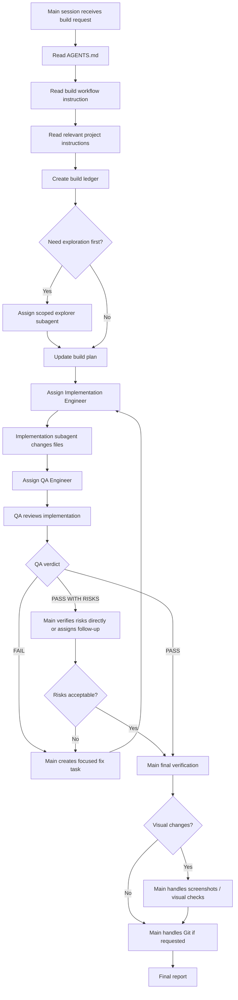

# WORKFLOW.build-orchestration.instructions.md

## Purpose 🎯

This instruction defines how the main OpenCode agent session must work in **build mode**.

Build mode is used when the user asks the agent to modify code, implement a feature, fix a bug, refactor, update tests, adjust UI behavior, or change project files.

The goal of build mode is to keep the main session focused on orchestration while implementation and review work is delegated to scoped subagents.

The main session remains responsible for scope control, task sequencing, final verification, screenshots, Git operations, and the final report.

------

## Responsibility 🧭

This instruction governs:

- how the main session prepares implementation work;
- how coding tasks are assigned to implementation subagents;
- how QA review tasks are assigned;
- how the implementation and review loop repeats;
- how the main session keeps context clean;
- how visual checks and screenshots are handled;
- how Git responsibility remains with the main session;
- how final results are reported.

This instruction does not replace Git rules.

All commits, merges, branch switches, conflict resolution, and history-related actions must follow `WORKFLOW.git_rules.md`.

------

## When to Use This Instruction 🛠️

Use build mode when the user asks for:

| User request type                 | Use build mode? |
| --------------------------------- | --------------- |
| Implement a feature               | yes             |
| Fix a bug                         | yes             |
| Change UI behavior                | yes             |
| Refactor code                     | yes             |
| Add tests                         | yes             |
| Update project documentation      | yes             |
| Update agent instructions         | yes             |
| Run QA after code changes         | yes             |
| Only analyze the project          | no              |
| Only create a specification       | no              |
| Only inspect current architecture | no              |

If the implementation task is broad, vague, risky, or architecture-sensitive, run planning mode first.

------

## Core Principle: Main Session as Build Orchestrator 🧠

In build mode, the main session should not behave like a solo developer reading and editing everything manually.

Instead, it should:

1. read `AGENTS.md`;
2. read this build workflow instruction;
3. read relevant project instruction files;
4. create a short build ledger;
5. assign narrow implementation tasks to subagents;
6. assign QA review tasks after implementation;
7. repeat the implementation-review loop when needed;
8. directly inspect only diffs, critical snippets, test failures, screenshots, or high-risk areas;
9. keep Git operations under main-session control;
10. deliver a final report.

The main session should delegate work aggressively, but it must keep responsibility.

Good model:

```text
Subagents do focused work.
The main session manages scope, verification, screenshots, Git, and final decisions.
```

Bad model:

```text
Subagents do whatever they want and the main session rubber-stamps the result.
```

Also bad:

```text
The main session manually reads and edits the whole project until its context becomes soup.
```

Soup is for lunch, not for agent context.

------

## Main Session Responsibilities 🧑‍✈️

The main session must own:

- task interpretation;
- scope boundaries;
- relevant instruction selection;
- build ledger;
- subagent task assignment;
- subagent output evaluation;
- final diff review;
- test and verification strategy;
- visual validation and screenshots when relevant;
- Git operations;
- final user-facing report.

The main session must not delegate these responsibilities completely.

It may ask subagents for help, but final control remains with the main session.

------

## Subagent Responsibilities 👷

Subagents may be assigned to:

- implement a narrow code change;
- add or update tests;
- inspect a diff;
- review code quality;
- check edge cases;
- investigate a test failure;
- review UI behavior;
- summarize risks.

Subagents must not:

- commit changes;
- switch branches;
- perform merges;
- resolve Git conflicts without explicit assignment and review;
- run destructive commands;
- modify files outside their task scope;
- make broad architecture changes unless explicitly assigned;
- silently add unrelated features;
- hide failed tests.

------

## Build Workflow 🔁



------

## Build Ledger Template 📋

The main session should keep a concise build ledger.

```text
Build Ledger

Objective:
- [One-sentence implementation objective]

Mode:
- Build mode

Relevant instructions:
- AGENTS.md
- WORKFLOW.build-orchestration.instructions.md
- [Other relevant instruction files]

Constraints:
- [Constraint 1]
- [Constraint 2]
- [Non-goal 1]

Tasks:
- [ ] TASK-001: [Short task name]
  - Owner: Implementation Engineer
  - Files allowed: [files/directories]
  - Goal: [specific change]
  - Verification: [command or manual check]

- [ ] TASK-002: QA review
  - Owner: QA Engineer
  - Focus: [correctness / regressions / tests / UI / edge cases]

- [ ] TASK-003: Main-session verification
  - Owner: Main session
  - Check: diff, test output, screenshots if needed

- [ ] TASK-004: Git operation
  - Owner: Main session
  - Requires: WORKFLOW.git_rules.md
```

The ledger is not a replacement for Git history or documentation.

It is a short control panel for the current agent session.

------

## Role: Implementation Engineer 🧑‍💻

The Implementation Engineer writes or modifies code for a narrow task.

Use this role when a file change is needed.

### Standard Implementation Task Prompt

```text
You are an Implementation Engineer subagent.

Task:
Implement [specific task] only.

Context:
- User goal: [user goal]
- Current build task: [task id and name]
- Relevant instructions: [instruction files]
- Relevant findings: [brief summary from planning or exploration]
- Allowed files/directories: [specific scope]
- Non-goals: [what must not be changed]

Rules:
- Modify only files required for this task.
- Keep the change minimal and focused.
- Preserve existing architecture and conventions.
- Do not commit.
- Do not switch branches.
- Do not run destructive Git commands.
- Do not add unrelated features.
- Do not perform broad refactors unless explicitly required.
- If you discover a blocker or contradiction, stop and report it.

Verification:
- Run [specific command] if available.
- If the command cannot be run, explain why and suggest the safest alternative.

Return:
1. Summary of changes.
2. Files changed.
3. Why each file was changed.
4. Verification run and result.
5. Known risks or assumptions.
6. Suggested QA focus.
```

### Good Implementation Assignment

```text
Implement TASK-003 only.

Goal:
Add a disabled loading state to the Save button while settings are being persisted.

Allowed files:
- src/ui/settings_pages/data_page.py
- tests/test_settings_page.py

Constraints:
- Do not change settings storage format.
- Do not refactor unrelated settings widgets.
- Do not touch Git.

Verification:
- uv run pytest tests/test_settings_page.py
```

### Bad Implementation Assignment

```text
Improve settings.
```

Why it is bad:

- no scope;
- no files;
- no verification;
- no non-goals;
- invites random changes.

------

## Role: QA Engineer 🧑‍🔬

The QA Engineer reviews the implementation after code changes.

By default, QA is read-only.

QA may modify files only if the main session explicitly assigns a separate fix task.

### Standard QA Task Prompt

```text
You are a QA Engineer subagent.

Task:
Review the implementation for correctness, regressions, scope control, and verification quality.

Context:
- User goal: [user goal]
- Implemented task: [task id and name]
- Claimed changed files: [files]
- Relevant instructions: [instruction files]
- Expected behavior: [behavior]

Scope:
- Inspect the changed files.
- Inspect surrounding code only when needed.
- Check whether the implementation satisfies the task.
- Check whether unrelated behavior changed.
- Check tests, edge cases, error handling, and UX behavior if applicable.
- Do not commit.
- Do not switch branches.
- Do not rewrite the implementation unless explicitly asked.

Return:
1. Verdict: PASS / PASS WITH RISKS / FAIL.
2. Findings grouped by severity:
   - blocker
   - major
   - minor
   - note
3. Evidence: file paths, functions, behavior, or test output.
4. Missing verification, if any.
5. Recommended fix tasks for the Implementation Engineer.
6. Confidence: high / medium / low
```

### QA Verdict Rules

| Verdict           | Meaning                                                      | Main session action                                 |
| ----------------- | ------------------------------------------------------------ | --------------------------------------------------- |
| `PASS`            | Implementation satisfies the task and no important risks remain. | Proceed to main verification.                       |
| `PASS WITH RISKS` | Implementation likely works, but there are known gaps or unverified areas. | Verify risks directly or assign follow-up.          |
| `FAIL`            | Implementation has blockers or major issues.                 | Create a focused fix task and rerun implementation. |

### Good QA Assignment

```text
Review TASK-003.

Focus:
- Save button loading state.
- Whether duplicate clicks are prevented.
- Whether existing validation behavior still works.
- Whether tests cover the new state.
- Whether unrelated settings behavior changed.

Do not modify files.

Return PASS / PASS WITH RISKS / FAIL with evidence.
```

### Bad QA Assignment

```text
Check if it is good.
```

Why it is bad:

- vague;
- no focus;
- no verdict standard;
- no evidence requirement;
- does not protect scope.

------

## Role: Regression Test Engineer 🧪

Use this role when tests must be added or repaired.

This role may modify test files if explicitly allowed.

### Standard Regression Test Task Prompt

```text
You are a Regression Test Engineer subagent.

Task:
Add or update tests for [specific behavior].

Allowed files:
- [test files/directories]

Rules:
- Modify only tests unless explicitly allowed.
- Do not change production code.
- Do not commit.
- Do not switch branches.
- Follow existing test style.
- Keep tests focused on the behavior from the task.
- Do not add brittle tests that depend on unrelated implementation details.

Verification:
- Run [test command].

Return:
1. Tests added or changed.
2. Behavior covered.
3. Command run and result.
4. Remaining coverage gaps.
5. Confidence level.
```

------

## Role: UI Visual QA 🖼️

Use this role when the implementation affects visible UI.

The main session owns final screenshots and visual acceptance.

A UI Visual QA subagent may help define what should be checked.

### Standard UI Visual QA Task Prompt

```text
You are a UI Visual QA subagent.

Task:
Review the visual and interaction impact of [specific UI change].

Scope:
- Inspect relevant UI files.
- Inspect existing layout, state, and styling conventions.
- Do not commit.
- Do not switch branches.
- Do not modify files unless explicitly assigned.

Check:
1. Default state.
2. Loading state.
3. Error state.
4. Empty state.
5. Success state.
6. Small screen or constrained layout if relevant.
7. Visual consistency with existing UI.

Return:
1. Visual QA checklist.
2. Expected screenshots or manual checks.
3. Risks.
4. PASS / PASS WITH RISKS / FAIL if screenshots or rendered UI are available.
5. Confidence level.
```

Final screenshot capture, comparison, and user-facing visual report remain the main session's responsibility.

------

## One Writer Per Area Rule 🚦

The main session must not assign multiple implementation subagents to overlapping files or the same subsystem at the same time.

Allowed parallel work:

```text
Explorer A reads UI files.
Explorer B reads test files.
Explorer C reads storage files.
```

Risky parallel work:

```text
Engineer A edits settings UI.
Engineer B edits the same settings UI.
```

Forbidden without explicit coordination:

```text
Two implementation subagents edit overlapping files independently.
```

If parallel implementation is needed, the main session must divide work into non-overlapping areas and define integration order.

------

## Implementation-Review Loop 🔄

The main session should use this loop:

```text
1. Assign narrow implementation task.
2. Receive implementation report.
3. Assign QA review.
4. If QA fails, create a focused fix task.
5. Reassign implementation.
6. Reassign QA.
7. Repeat until PASS or until a repeated blocker requires escalation.
8. Run final main-session verification.
```

If the same issue fails twice, the main session must stop and reassess.

It should:

- summarize the repeated blocker;
- split the task into a smaller task;
- assign a targeted investigation;
- ask the user only if a real product or safety decision is needed.

Do not keep looping blindly.

------

## Main Session Direct Inspection Policy 🔍

The main session should avoid broad file inspection.

It may directly inspect:

- `AGENTS.md`;
- relevant instruction files;
- task/spec files;
- project tree summaries;
- subagent reports;
- `git diff`;
- `git diff --staged`;
- test output;
- error output;
- screenshots or visual artifacts;
- exact code snippets related to QA findings;
- exact code snippets related to critical risks.

The main session should not directly inspect large unrelated files just because they exist.

------

## Git Ownership 🔐

Git operations stay with the main session.

Subagents must not:

- commit;
- stage files;
- switch branches;
- merge;
- rebase;
- reset;
- clean;
- resolve conflicts independently;
- rewrite history.

Before any Git operation, the main session must read and follow `WORKFLOW.git_rules.md`.

The main session must preserve local Git history, avoid detached HEAD commits, avoid unrelated user changes, inspect diffs, and use structured commit messages according to the Git workflow instruction.

------

## Screenshot and Visual Test Ownership 🖼️

If the task changes visible UI behavior, screenshots and visual acceptance remain the main session's responsibility.

The main session may ask subagents to:

- identify which screens need screenshots;
- define visual states to check;
- inspect UI code;
- review screenshots if available.

But the main session must own:

- deciding whether screenshots are required;
- capturing or requesting visual artifacts;
- comparing expected vs actual UI;
- summarizing visual acceptance;
- deciding whether the UI is acceptable.

------

## Verification Policy ✅

Every implementation task should have verification.

Verification may include:

- unit tests;
- integration tests;
- type checks;
- linting;
- build commands;
- smoke tests;
- manual UI checks;
- screenshot review;
- targeted reproduction steps.

If verification cannot be run, the responsible subagent or main session must explain why.

Bad:

```text
Tests not run.
```

Good:

```text
Tests not run because the project has no test command in package.json and no test directory was found. Manual verification steps are listed instead.
```

------

## Good Build Behavior ✅

Good behavior:

```text
The main session creates a narrow task, assigns an Implementation Engineer, then asks QA Engineer to review changed files and edge cases before final verification.
```

Good behavior:

```text
The Implementation Engineer changes only the allowed files and reports tests run.
```

Good behavior:

```text
QA returns FAIL with a blocker and evidence. The main session creates a small fix task instead of asking for a broad rewrite.
```

Good behavior:

```text
The main session reviews git diff and handles the commit itself using Git workflow rules.
```

Good behavior:

```text
For UI changes, the main session checks screenshots before saying the work is complete.
```

------

## Bad Build Behavior 🚫

Bad behavior:

```text
The main session asks a subagent to "fix everything".
```

Bad behavior:

```text
An Implementation Engineer edits files outside the assigned scope.
```

Bad behavior:

```text
QA rewrites the implementation without being assigned a fix task.
```

Bad behavior:

```text
A subagent commits changes.
```

Bad behavior:

```text
The main session accepts a PASS verdict without evidence, tests, or diff review.
```

Bad behavior:

```text
The main session skips screenshots after a visible UI change.
```

Bad behavior:

```text
The main session commits with git add . without reviewing unrelated changes.
```

------

## Final Build Report Format 🧾

At the end of build mode, the main session should report:

```text
Build completed.

Objective:
- [User goal]

Tasks completed:
- [TASK-001]
- [TASK-002]
- [TASK-003]

Subagents used:
- [Role]&#58; [purpose]
- [Role]&#58; [purpose]

Files changed:
- [file 1]&#58; [summary]
- [file 2]&#58; [summary]

Verification:
- [command/check]&#58; [passed/failed/not run + reason]

Visual checks:
- [screenshots/manual checks or not applicable]

Git:
- [commit hash if created / not requested / not performed]
- [branch info if relevant]

Known risks:
- [none or list]

Follow-up:
- [none or list]
```

------

## Build Mode Final Checklist ✅

Before saying the build work is complete, the main session must verify:

```text
- Did I read AGENTS.md?
- Did I apply this build workflow?
- Did I read relevant instruction files?
- Did I keep a focused build ledger?
- Did I assign narrow implementation tasks?
- Did QA review the implementation?
- Did I address blocker and major QA findings?
- Did I inspect the final diff or relevant changed files?
- Did I run or account for verification?
- Did I handle screenshots or visual checks if UI changed?
- Did I keep Git operations under main-session control?
- Did I avoid committing unrelated user changes?
- Did I report known risks honestly?
```

If any answer is no, fix the process or report the limitation clearly.

------

## Final Standard 🧷

Build mode is successful when the requested change is implemented through narrow tasks, reviewed independently, verified appropriately, and reported clearly.

The main session should remain clean, focused, and responsible.

Subagents may do the hands-on work, but the main session owns the outcome.
