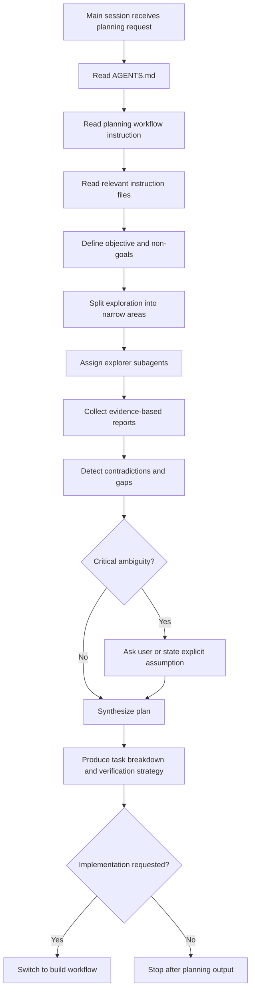

# WORKFLOW.plan-orchestration.instructions.md

## Purpose 🎯

This instruction defines how the main OpenCode agent session must work in **planning mode**.

Planning mode is used when the user asks the agent to investigate, analyze, design, review, estimate, decompose, or prepare a plan before implementation.

The goal of planning mode is to preserve the main session's context, avoid unnecessary broad file reading, delegate project exploration to read-only subagents, and produce an implementation-ready plan based on evidence.

The main session acts as an **orchestrator**, not as a file crawler.

------

## Responsibility 🧭

This instruction governs:

- how the main session decides what needs to be explored;
- how it delegates read-only research to explorer subagents;
- how it collects and validates findings;
- how it turns findings into a plan, specification, task breakdown, or implementation prompt;
- how it avoids polluting the main session context with excessive source code;
- how it decides when to switch from planning mode to build mode.

This instruction does not govern:

- actual code changes;
- Git commits;
- merge conflict resolution;
- final implementation verification;
- screenshots after UI changes.

Those belong to build mode and Git workflow instructions.

------

## When to Use This Instruction 🔎

Use planning mode when the user asks for:

| User request type                   | Use planning mode? |
| ----------------------------------- | ------------------ |
| Architecture review                 | yes                |
| Project investigation               | yes                |
| Feature planning                    | yes                |
| Bug investigation before fixing     | yes                |
| Technical specification             | yes                |
| Task decomposition                  | yes                |
| Risk analysis                       | yes                |
| Refactor strategy                   | yes                |
| UI/UX planning before code          | yes                |
| Direct code implementation          | no                 |
| Git commit or merge                 | no                 |
| Screenshot validation after changes | no                 |

If the user asks for implementation immediately but the task is vague, risky, broad, or architecture-sensitive, the main session should first run a short planning pass before entering build mode.

------

## Core Principle: Delegate Exploration, Keep Control 🧠

The main session should avoid broad manual reading of project files.

Instead, it should:

1. read `AGENTS.md`;
2. read this planning workflow instruction;
3. read only the instruction files relevant to the current planning task;
4. split exploration into narrow research areas;
5. assign read-only explorer subagents;
6. collect evidence-based summaries;
7. synthesize a plan from those summaries;
8. inspect critical snippets only when needed to resolve contradictions or validate high-risk claims.

The main session should trust subagents as the default source of broad exploration, but it must not accept unsupported claims blindly.

Good trust model:

```text
Trust subagents for broad exploration.
Require evidence for important claims.
Verify only critical or contradictory details directly.
```

Bad trust model:

```text
The subagent said it is fine, so it must be fine.
```

Also bad:

```text
The main session reads the whole codebase itself and fills the context with unrelated files.
```

Tiny context goblin avoided. Very good.

------

## Planning Mode Is Read-Only 🚫

Planning mode must not modify files.

The main session and explorer subagents must not:

- edit source files;
- edit documentation files;
- create new files;
- delete files;
- run formatters that change files;
- run migrations;
- run destructive commands;
- commit changes;
- switch branches;
- perform merges;
- resolve conflicts.

Allowed actions:

- inspect files;
- inspect project structure;
- inspect documentation;
- inspect tests;
- inspect package metadata;
- inspect existing commands;
- inspect Git history if needed for understanding;
- run safe read-only commands;
- produce plans, task lists, risks, assumptions, and prompts.

If the user explicitly asks to continue into implementation, switch to `WORKFLOW.build-orchestration.instructions.md`.

------

## Main Session Responsibilities 🧑‍✈️

The main session owns the planning process.

It must:

1. identify the planning objective;
2. define non-goals;
3. decide which parts of the project need exploration;
4. assign explorer subagents with narrow scopes;
5. prevent duplicate or overlapping exploration unless useful;
6. collect evidence-based reports;
7. detect contradictions between reports;
8. decide whether critical details need direct verification;
9. synthesize the final plan;
10. produce a task breakdown suitable for build mode;
11. clearly mark assumptions and open questions.

The main session should not:

- read every relevant file itself;
- use vague subagent prompts;
- let subagents decide the product direction;
- let subagents expand scope;
- treat planning as implementation;
- bury the user in raw exploration notes.

------

## Explorer Subagent Responsibilities 🕵️

Explorer subagents are read-only specialists.

They must:

- inspect only their assigned scope;
- avoid unrelated files;
- return concise findings;
- cite concrete files, functions, modules, tests, commands, or configuration entries;
- separate facts from assumptions;
- report confidence level;
- report risks and unknowns;
- recommend possible implementation tasks;
- avoid making code changes.

Explorer subagents must not:

- implement code;
- modify files;
- commit;
- switch branches;
- run destructive commands;
- make final architecture decisions alone;
- hide uncertainty.

------

## Recommended Explorer Roles 🧩

Use only the roles that fit the task.

| Role                    | Purpose                                                      |
| ----------------------- | ------------------------------------------------------------ |
| `Architecture Explorer` | Maps project structure, module boundaries, dependency direction, and architectural constraints. |
| `Feature Explorer`      | Finds files and logic directly related to a requested feature or behavior. |
| `Bug Explorer`          | Investigates where a bug likely comes from and what evidence supports the diagnosis. |
| `Testing Explorer`      | Finds test structure, available commands, coverage gaps, fixtures, and verification strategy. |
| `UI Explorer`           | Maps relevant screens, components, state flows, and visual behavior. |
| `Data Explorer`         | Investigates data models, persistence, migrations, repositories, schemas, and storage rules. |
| `Integration Explorer`  | Checks external APIs, services, adapters, SDKs, configuration, and failure modes. |
| `Risk Explorer`         | Looks for security, data-loss, compatibility, performance, release, or migration risks. |
| `Instruction Explorer`  | Checks existing project instructions and identifies which rules apply to the task. |
| `History Explorer`      | Uses Git history to understand why important code or architecture exists. |

Do not spawn every role by default.

Use the smallest set of explorers that can answer the planning question safely.

------

## Planning Workflow 🔁



------

## Planning Ledger Template 📋

The main session should keep a short planning ledger.

```text
Planning Ledger

Objective:
- [One-sentence planning objective]

Non-goals:
- [What must not be planned or changed]
- [What is explicitly out of scope]

Relevant instructions:
- [Instruction file 1]
- [Instruction file 2]

Exploration tasks:
- [ ] EXPLORE-001: [Area]
  - Owner: [Explorer role]
  - Scope: [Files, directories, subsystem, or behavior]
  - Expected output: [What the report must answer]

- [ ] EXPLORE-002: [Area]
  - Owner: [Explorer role]
  - Scope: [Files, directories, subsystem, or behavior]
  - Expected output: [What the report must answer]

Synthesis:
- [ ] Compare findings
- [ ] Resolve contradictions
- [ ] Identify risks
- [ ] Define implementation tasks
- [ ] Define verification strategy
```

The ledger should stay short. It is not a project diary.

------

## Standard Explorer Task Prompt 🧾

Use this template when assigning read-only exploration.

```text
You are a read-only Explorer subagent.

Goal:
Investigate [specific area] for the planning task: [main objective].

Scope:
- Inspect only files, directories, tests, docs, or configuration relevant to [specific area].
- Do not modify files.
- Do not implement code.
- Do not commit.
- Do not switch branches.
- Do not run destructive commands.
- Do not expand the task beyond the assigned scope.

Questions to answer:
1. Which files, modules, commands, or tests are relevant?
2. What is the current behavior or structure?
3. What constraints, conventions, or invariants must be preserved?
4. What risks or unknowns exist?
5. What implementation tasks would be needed later?
6. What verification should be used after implementation?

Return format:
1. Summary
2. Evidence
3. Relevant files
4. Constraints and invariants
5. Risks and unknowns
6. Suggested implementation tasks
7. Suggested verification
8. Confidence: high / medium / low
```

------

## Architecture Explorer Prompt Example 🏛️

Good:

```text
You are an Architecture Explorer subagent.

Goal:
Map the project structure relevant to adding a new transcription history filter.

Scope:
- Inspect the UI tab structure.
- Inspect history-related services and data models.
- Inspect existing filtering or search logic.
- Do not inspect unrelated audio recording internals unless directly referenced.
- Do not modify files.

Return:
1. Relevant files and responsibilities.
2. Current data flow from stored transcription to UI display.
3. Existing filter/search conventions.
4. Architectural constraints.
5. Risks for adding a new filter.
6. Suggested implementation tasks.
7. Suggested verification commands.
8. Confidence level.
```

Bad:

```text
Look around the project and tell me what you find.
```

Why it is bad:

- scope is too broad;
- no target behavior;
- no output contract;
- invites context pollution;
- makes the subagent wander through the codebase like a raccoon in a server room.

------

## Testing Explorer Prompt Example 🧪

Good:

```text
You are a Testing Explorer subagent.

Goal:
Find the safest verification strategy for changing the settings UI.

Scope:
- Inspect test folders.
- Inspect package scripts.
- Inspect existing UI or smoke test documentation.
- Inspect only settings-related tests if they exist.
- Do not modify files.

Return:
1. Existing test commands.
2. Which commands are relevant to the settings UI.
3. Existing coverage for settings behavior.
4. Missing tests or manual checks.
5. Recommended verification after implementation.
6. Confidence level.
```

Bad:

```text
Check tests.
```

Why it is bad:

- does not say which tests;
- does not say what decision the main session needs;
- produces vague output.

------

## Risk Explorer Prompt Example ⚠️

Good:

```text
You are a Risk Explorer subagent.

Goal:
Identify high-risk areas before implementing persistent user preferences.

Scope:
- Inspect storage-related code.
- Inspect configuration loading.
- Inspect existing settings persistence.
- Inspect privacy or logging rules if documented.
- Do not modify files.

Focus:
- data loss risks;
- migration risks;
- backward compatibility;
- invalid configuration states;
- user data privacy;
- test gaps.

Return:
1. High-risk areas.
2. Evidence for each risk.
3. Risk severity: blocker / major / minor.
4. Recommended mitigations.
5. Implementation constraints.
6. Verification requirements.
7. Confidence level.
```

Bad:

```text
Find all possible problems.
```

Why it is bad:

- impossible scope;
- encourages speculation;
- wastes context.

------

## Main Session Synthesis Output 🧠

After explorer reports, the main session should produce a concise synthesis.

Use this structure:

```text
Planning Result

Objective:
- [What is being planned]

Current understanding:
- [Short project-specific summary]

Relevant findings:
- [Finding 1 with evidence]
- [Finding 2 with evidence]
- [Finding 3 with evidence]

Constraints:
- [Constraint 1]
- [Constraint 2]

Risks:
- [Risk 1 and mitigation]
- [Risk 2 and mitigation]

Implementation plan:
- TASK-001: [Name]
  - Goal:
  - Files likely affected:
  - Constraints:
  - Verification:

- TASK-002: [Name]
  - Goal:
  - Files likely affected:
  - Constraints:
  - Verification:

Suggested build mode:
- [Whether to proceed to build mode]
- [Which instruction files to read next]

Open questions:
- [Only questions that materially affect implementation]
```

If the planning request is specifically about creating a technical specification, use `META.requirements_to_spec.md`.

------

## Good Planning Behavior ✅

Good behavior:

```text
The main session reads AGENTS.md, identifies that this is a planning task, assigns Architecture Explorer and Testing Explorer, receives evidence-based summaries, then produces a build-ready task plan.
```

Good behavior:

```text
The main session does not read every UI file. It asks UI Explorer to map the relevant screens and only directly checks a small snippet after two reports contradict each other.
```

Good behavior:

```text
The main session says that the plan is based on medium-confidence findings because no tests exist for the target behavior.
```

Good behavior:

```text
The main session stops after planning because the user did not request implementation.
```

------

## Bad Planning Behavior 🚫

Bad behavior:

```text
The main session opens many large source files and fills its context before deciding what needs to be explored.
```

Bad behavior:

```text
The main session asks one subagent to inspect the entire project.
```

Bad behavior:

```text
An explorer subagent modifies code while planning.
```

Bad behavior:

```text
The main session writes a plan without evidence from the actual project.
```

Bad behavior:

```text
The main session accepts "everything looks good" without files, commands, constraints, or confidence level.
```

Bad behavior:

```text
The main session starts implementing while still in planning mode.
```

------

## Handling Contradictions ⚖️

If explorer reports contradict each other, the main session must not guess silently.

It should:

1. identify the contradiction;
2. ask a focused follow-up explorer task if needed;
3. directly inspect the smallest relevant snippet if the contradiction is critical;
4. mark remaining uncertainty explicitly;
5. avoid implementation until critical uncertainty is resolved.

Example:

```text
Architecture Explorer says settings are stored in JSON.
Data Explorer says settings are stored in SQLite.

Resolution:
- Assign a narrow follow-up task to inspect the settings persistence boundary.
- If still unclear, the main session may directly inspect the exact files mentioned by both explorers.
```

------

## When to Ask the User 🧑‍💬

Ask the user only when a decision materially affects the plan and cannot be safely inferred.

Ask when:

- product behavior is ambiguous;
- implementation direction has multiple valid options with trade-offs;
- user preference matters;
- risk is high;
- the task scope is unclear;
- destructive or irreversible action would be required later.

Do not ask when:

- the answer can be found in the project;
- a safe assumption can be stated;
- the question is minor and does not affect implementation;
- the task can be split into a reversible first step.

------

## Switching to Build Mode 🛠️

Switch from planning mode to build mode when:

- the user explicitly asks to implement;
- the plan is complete enough to begin;
- tasks are narrow and verifiable;
- relevant risks are known;
- verification strategy is defined;
- implementation will require file changes.

Before switching, the main session should state:

```text
Planning is complete enough to enter build mode.

Next workflow:
- WORKFLOW.build-orchestration.instructions.md

Initial build tasks:
- TASK-001: ...
- TASK-002: ...
```

------

## Planning Mode Final Checklist ✅

Before finalizing planning mode, the main session must verify:

```text
- Did I read AGENTS.md?
- Did I apply this planning workflow?
- Did I avoid broad source-code reading?
- Did I delegate exploration to scoped subagents where useful?
- Did every important claim come with evidence?
- Did I separate facts from assumptions?
- Did I identify constraints and risks?
- Did I avoid implementation?
- Did I define implementation tasks if needed?
- Did I define verification strategy?
- Did I state open questions only when they matter?
- Did I clearly say whether build mode should start next?
```

If any answer is no, fix the planning output before presenting it.

------

## Final Standard 🧷

Planning mode is successful when the main session can hand build mode a clear, scoped, evidence-based task plan without dragging the entire codebase into the main conversation context.

The result should make implementation safer, narrower, and easier to verify.

A good planning session reduces uncertainty.

A bad planning session merely generates confident fog.
