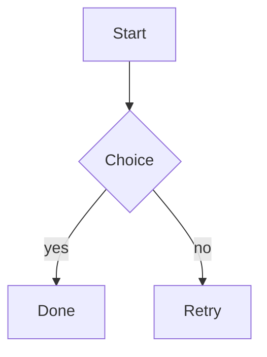

# Structures

Tiny intro.

Another tiny paragraph.

| key | value |
| --- | --- |
| alpha | one |
| beta | two |
| gamma | three |

```mermaid
flowchart TD
    A[Start] --> B{Choice}
    B -->|yes| C[Done]
    B -->|no| D[Retry]
```

---

> A compact quote.

- first item
- second item
